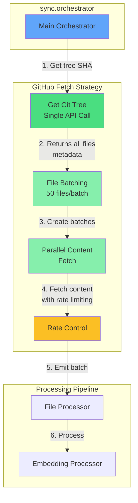
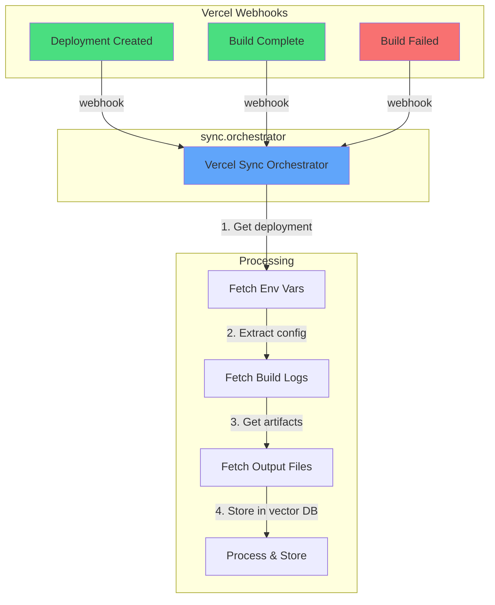

# Data Source Integration Patterns for Inngest Architecture

Last Updated: 2025-11-26

## Table of Contents
1. [GitHub File Download Optimization](#github-file-download-optimization)
2. [Vercel Deployment Integration](#vercel-deployment-integration)
3. [GitHub Issues & Pull Requests](#github-issues--pull-requests)
4. [Other Data Sources](#other-data-sources)
5. [Implementation Patterns](#implementation-patterns)

---

## GitHub File Download Optimization

### Current Problem: Inefficient File Fetching

Based on the current architecture issues identified:
- Fire-and-forget pattern causes race conditions
- No batching strategy for file downloads
- Rate limit issues with naive REST API usage
- Processing files before they're actually downloaded

### Proposed Solution: Intelligent GitHub Fetching



### Strategy 1: Git Trees API (Most Efficient)

**For Full Repository Sync:**

```typescript
export const fetchGitHubFilesOptimized = async ({
  owner,
  repo,
  branch = "main",
  patterns = ["**/*.ts", "**/*.tsx", "**/*.md"],
}: GitHubFetchOptions) => {
  // 1. Get the latest commit SHA
  const { data: ref } = await octokit.rest.git.getRef({
    owner,
    repo,
    ref: `heads/${branch}`,
  });

  const commitSha = ref.object.sha;

  // 2. Get the tree SHA from commit
  const { data: commit } = await octokit.rest.git.getCommit({
    owner,
    repo,
    commit_sha: commitSha,
  });

  const treeSha = commit.tree.sha;

  // 3. Fetch entire tree recursively (1 API call for up to 100k files!)
  const { data: tree } = await octokit.rest.git.getTree({
    owner,
    repo,
    tree_sha: treeSha,
    recursive: "true", // Magic parameter - gets ALL files in 1 call
  });

  // 4. Filter files based on patterns
  const files = tree.tree
    .filter(item =>
      item.type === "blob" &&
      matchesPatterns(item.path, patterns)
    )
    .map(item => ({
      path: item.path!,
      sha: item.sha!,
      size: item.size!,
      url: item.url!,
    }));

  return {
    files,
    truncated: tree.truncated, // If true, repo has >100k files
    totalFiles: files.length,
  };
};
```

**Advantages:**
- **1 API call** for entire repository structure (vs 1000s with Contents API)
- Handles up to **100,000 files** per request
- Returns SHAs for efficient content fetching
- **7MB response size limit** (rarely hit in practice)

### Strategy 2: GraphQL for Complex Queries

**For Incremental Sync with Metadata:**

```typescript
const GITHUB_FILES_QUERY = `
  query GetFilesChanged($owner: String!, $repo: String!, $since: GitTimestamp!) {
    repository(owner: $owner, name: $repo) {
      defaultBranchRef {
        target {
          ... on Commit {
            history(first: 100, since: $since) {
              nodes {
                oid
                committedDate
                author {
                  user {
                    login
                  }
                }
                additions
                deletions
                changedFiles
                tree {
                  entries {
                    name
                    type
                    object {
                      ... on Blob {
                        oid
                        byteSize
                      }
                    }
                  }
                }
              }
            }
          }
        }
      }
    }
  }
`;

export const fetchIncrementalChanges = async ({
  owner,
  repo,
  since,
}: IncrementalFetchOptions) => {
  const result = await graphqlClient.request(GITHUB_FILES_QUERY, {
    owner,
    repo,
    since: since.toISOString(),
  });

  // Process commits to find changed files
  const changedFiles = new Map<string, FileChange>();

  result.repository.defaultBranchRef.target.history.nodes.forEach(commit => {
    // Track file changes across commits
    commit.tree.entries.forEach(entry => {
      if (entry.type === 'blob') {
        changedFiles.set(entry.name, {
          path: entry.name,
          sha: entry.object.oid,
          size: entry.object.byteSize,
          lastModified: commit.committedDate,
          author: commit.author?.user?.login,
        });
      }
    });
  });

  return Array.from(changedFiles.values());
};
```

**Advantages:**
- **Single request** for multiple data points
- Gets commit history + file changes together
- **5x more efficient** than REST for related data
- Better rate limits (2000 points/min vs 900 for REST)

### Strategy 3: Parallel Content Fetching with Rate Control

```typescript
export const fetchFileContentsOptimized = inngest.createFunction(
  {
    id: "github.files.fetch",
    name: "Fetch GitHub File Contents",
    concurrency: {
      limit: 10, // Max 10 parallel executions
    },
    throttle: {
      limit: 50,
      period: "1m",
      key: "event.data.owner", // Per-repo throttling
    },
  },
  { event: "github.files.fetch" },
  async ({ event, step }) => {
    const { files, owner, repo, batchId } = event.data;

    // Use Inngest's built-in rate limiting
    const contents = await step.run("fetch-contents", async () => {
      return await Promise.all(
        files.map(async (file) => {
          try {
            // Option 1: Use raw.githubusercontent.com (no rate limits!)
            const rawUrl = `https://raw.githubusercontent.com/${owner}/${repo}/main/${file.path}`;
            const response = await fetch(rawUrl);

            if (!response.ok) {
              // Fallback to API
              const { data } = await octokit.rest.repos.getContent({
                owner,
                repo,
                path: file.path,
              });

              return {
                path: file.path,
                content: Buffer.from(data.content, 'base64').toString(),
                size: data.size,
              };
            }

            return {
              path: file.path,
              content: await response.text(),
              size: file.size,
            };
          } catch (error) {
            if (error.status === 403 && error.response?.headers['x-ratelimit-remaining'] === '0') {
              // Rate limited - use Inngest's retry mechanism
              throw new RetryAfterError("GitHub rate limit", "5m");
            }
            throw error;
          }
        })
      );
    });

    // Emit completion
    await step.sendEvent("files-fetched", {
      name: "github.files.fetched",
      data: {
        batchId,
        contents,
        count: contents.length,
      },
    });

    return { processed: contents.length };
  }
);
```

### Rate Limit Management

```typescript
class GitHubRateLimiter {
  private primaryLimit = {
    rest: { remaining: 5000, reset: 0 },
    graphql: { remaining: 5000, reset: 0 },
  };

  private secondaryLimits = {
    requestsPerMinute: 0,
    cpuSecondsUsed: 0,
  };

  async checkAndWait() {
    // Check primary limits
    if (this.primaryLimit.rest.remaining < 100) {
      const waitTime = this.primaryLimit.rest.reset - Date.now();
      if (waitTime > 0) {
        await sleep(waitTime);
      }
    }

    // Check secondary limits (900 points/min for REST)
    if (this.secondaryLimits.requestsPerMinute >= 850) {
      await sleep(60000); // Wait 1 minute
      this.secondaryLimits.requestsPerMinute = 0;
    }
  }

  updateFromHeaders(headers: Headers) {
    this.primaryLimit.rest.remaining = parseInt(headers.get('x-ratelimit-remaining') || '5000');
    this.primaryLimit.rest.reset = parseInt(headers.get('x-ratelimit-reset') || '0') * 1000;
  }
}
```

---

## Vercel Deployment Integration

### Architecture for Vercel Sync



### Webhook Handler

```typescript
export const vercelWebhookHandler = inngest.createFunction(
  {
    id: "vercel.webhook.handler",
    name: "Handle Vercel Deployments",
  },
  { event: "vercel/deployment.created" },
  async ({ event, step }) => {
    const { deploymentId, projectId, team } = event.data;

    // 1. Fetch deployment details
    const deployment = await step.run("fetch-deployment", async () => {
      const response = await fetch(
        `https://api.vercel.com/v13/deployments/${deploymentId}`,
        {
          headers: {
            Authorization: `Bearer ${process.env.VERCEL_TOKEN}`,
          },
        }
      );
      return response.json();
    });

    // 2. Store deployment metadata
    await step.run("store-deployment", async () => {
      return await storeDeploymentInfo({
        id: deploymentId,
        url: deployment.url,
        environment: deployment.target,
        gitBranch: deployment.meta.githubCommitRef,
        gitCommit: deployment.meta.githubCommitSha,
        createdAt: deployment.created,
      });
    });

    // 3. Wait for build completion
    const buildResult = await step.waitForEvent("build-complete", {
      event: "vercel/deployment.ready",
      match: "data.deploymentId",
      timeout: "30m",
    });

    if (!buildResult) {
      throw new Error("Build timeout");
    }

    // 4. Fetch and store build artifacts
    await step.run("fetch-artifacts", async () => {
      // Get build logs
      const logs = await fetchVercelLogs(deploymentId);

      // Get environment variables (for search context)
      const envVars = await fetchVercelEnvVars(projectId);

      // Store for semantic search
      return await storeVercelArtifacts({
        deploymentId,
        logs,
        envVars: Object.keys(envVars), // Store keys only for security
        buildTime: buildResult.data.buildTime,
      });
    });

    // 5. Trigger downstream processes
    await step.sendEvent("deployment-indexed", {
      name: "vercel.deployment.indexed",
      data: {
        deploymentId,
        url: deployment.url,
        projectId,
      },
    });
  }
);
```

### Vercel Deploy Hook Integration

```typescript
export const triggerVercelDeploy = async ({
  hookUrl,
  branch = "main",
}: DeployOptions) => {
  const response = await fetch(hookUrl, {
    method: "POST",
    headers: {
      "Content-Type": "application/json",
    },
    body: JSON.stringify({
      branch,
      // Optional: Pass build env overrides
      buildEnv: {
        FORCE_REBUILD: "true",
      },
    }),
  });

  const deployment = await response.json();

  // Track deployment
  await inngest.send({
    name: "vercel/deployment.triggered",
    data: {
      deploymentId: deployment.id,
      triggeredBy: "api",
      branch,
    },
  });

  return deployment;
};
```

---

## GitHub Issues & Pull Requests

### Efficient PR/Issue Sync Strategy

```typescript
const GITHUB_PR_ISSUES_QUERY = `
  query GetPRsAndIssues($owner: String!, $repo: String!, $since: DateTime!) {
    repository(owner: $owner, name: $repo) {
      pullRequests(first: 100, orderBy: {field: UPDATED_AT, direction: DESC}) {
        nodes {
          id
          number
          title
          body
          state
          merged
          createdAt
          updatedAt
          author {
            login
          }
          files(first: 100) {
            nodes {
              path
              additions
              deletions
            }
          }
          reviews(first: 10) {
            nodes {
              body
              state
              author {
                login
              }
            }
          }
          comments(first: 50) {
            nodes {
              body
              author {
                login
              }
            }
          }
        }
      }
      issues(first: 100, filterBy: {since: $since}, orderBy: {field: UPDATED_AT, direction: DESC}) {
        nodes {
          id
          number
          title
          body
          state
          createdAt
          updatedAt
          author {
            login
          }
          labels(first: 10) {
            nodes {
              name
              color
            }
          }
          comments(first: 50) {
            nodes {
              body
              author {
                login
              }
            }
          }
        }
      }
    }
  }
`;

export const syncGitHubDiscussions = inngest.createFunction(
  {
    id: "github.discussions.sync",
    name: "Sync GitHub PRs and Issues",
    concurrency: {
      limit: 1,
      key: "event.data.repoId",
    },
  },
  { event: "github.discussions.sync" },
  async ({ event, step }) => {
    const { owner, repo, since } = event.data;

    // 1. Fetch all PRs and Issues in one GraphQL call
    const discussions = await step.run("fetch-discussions", async () => {
      const result = await graphqlClient.request(GITHUB_PR_ISSUES_QUERY, {
        owner,
        repo,
        since: since || new Date(Date.now() - 7 * 24 * 60 * 60 * 1000), // Last 7 days
      });

      return {
        prs: result.repository.pullRequests.nodes,
        issues: result.repository.issues.nodes,
      };
    });

    // 2. Process PRs with code context
    const processedPRs = await step.run("process-prs", async () => {
      return await Promise.all(
        discussions.prs.map(async (pr) => {
          // Combine PR description, reviews, and comments
          const content = [
            `PR #${pr.number}: ${pr.title}`,
            pr.body,
            ...pr.reviews.nodes.map(r => `Review (${r.state}): ${r.body}`),
            ...pr.comments.nodes.map(c => `Comment: ${c.body}`),
          ].join('\n\n');

          // Get file context
          const fileContext = pr.files.nodes
            .map(f => `${f.path}: +${f.additions} -${f.deletions}`)
            .join('\n');

          return {
            type: 'pull_request',
            id: pr.id,
            number: pr.number,
            title: pr.title,
            state: pr.state,
            merged: pr.merged,
            content,
            fileContext,
            metadata: {
              author: pr.author?.login,
              createdAt: pr.createdAt,
              updatedAt: pr.updatedAt,
            },
          };
        })
      );
    });

    // 3. Process Issues with labels
    const processedIssues = await step.run("process-issues", async () => {
      return discussions.issues.map(issue => ({
        type: 'issue',
        id: issue.id,
        number: issue.number,
        title: issue.title,
        state: issue.state,
        content: [
          `Issue #${issue.number}: ${issue.title}`,
          issue.body,
          ...issue.comments.nodes.map(c => `Comment: ${c.body}`),
        ].join('\n\n'),
        labels: issue.labels.nodes.map(l => l.name),
        metadata: {
          author: issue.author?.login,
          createdAt: issue.createdAt,
          updatedAt: issue.updatedAt,
        },
      }));
    });

    // 4. Store in vector DB with proper chunking
    await step.sendEvent("store-discussions", {
      name: "discussions.store",
      data: {
        repoId: `${owner}/${repo}`,
        pullRequests: processedPRs,
        issues: processedIssues,
        totalCount: processedPRs.length + processedIssues.length,
      },
    });

    return {
      prsProcessed: processedPRs.length,
      issuesProcessed: processedIssues.length,
    };
  }
);
```

### GitHub Webhook Handler for Real-time Updates

```typescript
export const githubWebhookHandler = inngest.createFunction(
  {
    id: "github.webhook.handler",
    name: "Handle GitHub Webhooks",
  },
  [
    { event: "github/pull_request.opened" },
    { event: "github/pull_request.closed" },
    { event: "github/issues.opened" },
    { event: "github/issues.closed" },
    { event: "github/push" },
  ],
  async ({ event, step }) => {
    const eventType = event.name.split('/')[1];

    switch (eventType) {
      case 'pull_request.opened':
      case 'pull_request.closed':
        await step.run("process-pr-webhook", async () => {
          const pr = event.data.pull_request;

          // Immediate processing for new/closed PRs
          await storePullRequest({
            id: pr.id,
            number: pr.number,
            title: pr.title,
            body: pr.body,
            state: pr.state,
            merged: pr.merged,
            files: await fetchPRFiles(pr.number),
          });
        });
        break;

      case 'push':
        // Trigger incremental sync
        await step.sendEvent("trigger-incremental-sync", {
          name: "sync.requested",
          data: {
            sourceId: event.data.repository.id,
            mode: "incremental",
            since: event.data.before, // Previous commit SHA
          },
        });
        break;
    }
  }
);
```

---

## Other Data Sources

### Linear Integration

```typescript
export const linearSyncFunction = inngest.createFunction(
  {
    id: "linear.sync",
    name: "Sync Linear Issues",
  },
  { event: "linear.sync.requested" },
  async ({ event, step }) => {
    const { teamId, since } = event.data;

    const issues = await step.run("fetch-linear-issues", async () => {
      const query = `
        query GetIssues($teamId: String!, $since: DateTime) {
          issues(
            filter: {
              team: { id: { eq: $teamId } }
              updatedAt: { gte: $since }
            }
            first: 100
          ) {
            nodes {
              id
              identifier
              title
              description
              state {
                name
              }
              assignee {
                name
              }
              comments {
                nodes {
                  body
                }
              }
              attachments {
                nodes {
                  url
                  title
                }
              }
            }
          }
        }
      `;

      const response = await linearClient.request(query, {
        teamId,
        since: since || new Date(Date.now() - 7 * 24 * 60 * 60 * 1000),
      });

      return response.issues.nodes;
    });

    // Process and store
    const processed = issues.map(issue => ({
      type: 'linear_issue',
      id: issue.id,
      identifier: issue.identifier,
      content: [
        `${issue.identifier}: ${issue.title}`,
        issue.description,
        ...issue.comments.nodes.map(c => `Comment: ${c.body}`),
      ].join('\n\n'),
      metadata: {
        state: issue.state.name,
        assignee: issue.assignee?.name,
        attachments: issue.attachments.nodes,
      },
    }));

    await step.sendEvent("store-linear-issues", {
      name: "linear.issues.store",
      data: {
        teamId,
        issues: processed,
        count: processed.length,
      },
    });
  }
);
```

### Notion Integration

```typescript
export const notionSyncFunction = inngest.createFunction(
  {
    id: "notion.sync",
    name: "Sync Notion Pages",
    throttle: {
      limit: 3,
      period: "1s", // Notion rate limit: 3 req/sec
    },
  },
  { event: "notion.sync.requested" },
  async ({ event, step }) => {
    const { databaseId } = event.data;

    // Fetch database pages
    const pages = await step.run("fetch-notion-pages", async () => {
      const response = await notion.databases.query({
        database_id: databaseId,
        page_size: 100,
      });

      return response.results;
    });

    // Fetch full content for each page
    const contents = await step.run("fetch-page-contents", async () => {
      return await Promise.all(
        pages.map(async (page) => {
          const blocks = await notion.blocks.children.list({
            block_id: page.id,
          });

          const content = blocks.results
            .map(block => extractTextFromBlock(block))
            .join('\n');

          return {
            id: page.id,
            title: getPageTitle(page),
            content,
            properties: page.properties,
            lastEdited: page.last_edited_time,
          };
        })
      );
    });

    // Store in vector DB
    await step.sendEvent("store-notion-content", {
      name: "notion.content.store",
      data: {
        databaseId,
        pages: contents,
        count: contents.length,
      },
    });
  }
);
```

### Slack Integration

```typescript
export const slackSyncFunction = inngest.createFunction(
  {
    id: "slack.sync",
    name: "Sync Slack Conversations",
  },
  { event: "slack.sync.requested" },
  async ({ event, step }) => {
    const { channelId, since } = event.data;

    // Fetch conversation history
    const messages = await step.run("fetch-slack-history", async () => {
      const result = await slackClient.conversations.history({
        channel: channelId,
        oldest: since ? since.toString() : undefined,
        limit: 1000,
      });

      return result.messages;
    });

    // Fetch thread replies
    const threads = await step.run("fetch-threads", async () => {
      const threadsToFetch = messages
        .filter(m => m.thread_ts && m.reply_count > 0)
        .map(m => m.thread_ts);

      return await Promise.all(
        threadsToFetch.map(async (ts) => {
          const replies = await slackClient.conversations.replies({
            channel: channelId,
            ts,
          });
          return replies.messages;
        })
      );
    });

    // Process and combine
    const conversations = processSlackConversations(messages, threads);

    await step.sendEvent("store-slack-conversations", {
      name: "slack.conversations.store",
      data: {
        channelId,
        conversations,
        messageCount: messages.length,
      },
    });
  }
);
```

---

## Implementation Patterns

### 1. Unified Data Source Registry

```typescript
interface DataSource {
  id: string;
  type: 'github' | 'vercel' | 'linear' | 'notion' | 'slack';
  config: Record<string, any>;
  syncSchedule?: string; // Cron expression
  lastSync?: Date;
  status: 'active' | 'paused' | 'error';
}

export const dataSourceRegistry = {
  async register(source: DataSource) {
    // Store in database
    await db.insert(dataSources).values(source);

    // Schedule sync if needed
    if (source.syncSchedule) {
      await inngest.send({
        name: "datasource.schedule",
        data: {
          sourceId: source.id,
          schedule: source.syncSchedule,
        },
      });
    }
  },

  async triggerSync(sourceId: string, mode: 'full' | 'incremental' = 'incremental') {
    const source = await db.select().from(dataSources).where(eq(dataSources.id, sourceId));

    if (!source) throw new Error("Source not found");

    // Route to appropriate sync function
    const eventName = `${source.type}.sync.requested`;
    await inngest.send({
      name: eventName,
      data: {
        sourceId,
        mode,
        config: source.config,
        since: mode === 'incremental' ? source.lastSync : undefined,
      },
    });
  },
};
```

### 2. Webhook Router

```typescript
export const webhookRouter = inngest.createFunction(
  {
    id: "webhook.router",
    name: "Route Incoming Webhooks",
  },
  { event: "webhook.received" },
  async ({ event, step }) => {
    const { source, payload, headers } = event.data;

    // Verify webhook signature
    const verified = await step.run("verify-signature", async () => {
      switch (source) {
        case 'github':
          return verifyGitHubSignature(payload, headers['x-hub-signature-256']);
        case 'vercel':
          return verifyVercelSignature(payload, headers['x-vercel-signature']);
        case 'linear':
          return verifyLinearSignature(payload, headers['linear-signature']);
        default:
          return false;
      }
    });

    if (!verified) {
      throw new NonRetriableError("Invalid webhook signature");
    }

    // Parse and route webhook
    const parsedEvent = await step.run("parse-webhook", async () => {
      return parseWebhookEvent(source, payload);
    });

    // Send to appropriate handler
    await step.sendEvent("route-webhook", {
      name: `${source}/${parsedEvent.type}`,
      data: parsedEvent.data,
    });
  }
);
```

### 3. Batch Processing Controller

```typescript
export const batchController = inngest.createFunction(
  {
    id: "batch.controller",
    name: "Control Batch Processing",
    concurrency: {
      limit: 1, // Single controller per workspace
      key: "event.data.workspaceId",
    },
  },
  { event: "batch.process" },
  async ({ event, step }) => {
    const { items, processor, batchSize = 50 } = event.data;

    // Create batches
    const batches = chunkArray(items, batchSize);

    // Process batches with controlled parallelism
    const results = await step.run("process-batches", async () => {
      // Limit to 5 parallel batches
      const parallelLimit = 5;
      const results = [];

      for (let i = 0; i < batches.length; i += parallelLimit) {
        const batchGroup = batches.slice(i, i + parallelLimit);

        const groupResults = await Promise.all(
          batchGroup.map(async (batch, index) => {
            await step.sendEvent(`batch-${i + index}`, {
              name: processor,
              data: {
                batchId: `${event.id}-${i + index}`,
                items: batch,
              },
            });

            // Wait for completion
            return await step.waitForEvent(`batch-${i + index}-complete`, {
              event: `${processor}.completed`,
              match: "data.batchId",
              timeout: "10m",
            });
          })
        );

        results.push(...groupResults);
      }

      return results;
    });

    // Aggregate results
    const summary = {
      totalBatches: batches.length,
      successful: results.filter(r => r?.data?.success).length,
      failed: results.filter(r => !r?.data?.success).length,
      totalProcessed: results.reduce((sum, r) => sum + (r?.data?.processed || 0), 0),
    };

    return summary;
  }
);
```

### 4. Error Recovery Pattern

```typescript
export const errorRecoveryFunction = inngest.createFunction(
  {
    id: "error.recovery",
    name: "Handle Failed Syncs",
    retries: 5,
  },
  { event: "sync.failed" },
  async ({ event, step, attempt }) => {
    const { sourceId, error, attemptNumber = 0 } = event.data;

    // Exponential backoff based on attempt
    if (attemptNumber > 0) {
      const delay = Math.min(Math.pow(2, attemptNumber) * 1000, 300000); // Max 5 min
      await step.sleep("backoff", delay);
    }

    // Try different strategies based on error type
    if (error.includes("rate limit")) {
      // Wait longer and retry with smaller batch
      await step.sleep("rate-limit-wait", 300000); // 5 minutes

      await step.sendEvent("retry-with-smaller-batch", {
        name: "sync.requested",
        data: {
          sourceId,
          mode: "incremental",
          batchSize: 10, // Smaller batch
        },
      });
    } else if (error.includes("timeout")) {
      // Retry with pagination
      await step.sendEvent("retry-with-pagination", {
        name: "sync.requested",
        data: {
          sourceId,
          mode: "paginated",
          pageSize: 25,
        },
      });
    } else {
      // Generic retry with exponential backoff
      if (attemptNumber < 5) {
        await step.sendEvent("retry-sync", {
          name: "sync.requested",
          data: {
            sourceId,
            attemptNumber: attemptNumber + 1,
          },
        });
      } else {
        // Alert and mark as failed
        await step.run("alert-failure", async () => {
          await notifyAdmins({
            type: "sync_failure",
            sourceId,
            error,
            attempts: attemptNumber,
          });

          await markSourceAsFailed(sourceId);
        });
      }
    }
  }
);
```

---

## Performance Benchmarks

| Strategy | API Calls | Time (1000 files) | Rate Limit Impact | Best For |
|----------|-----------|-------------------|-------------------|----------|
| Contents API (naive) | 1000+ | 16-20 min | High (1000 calls) | ❌ Never |
| Git Trees + Content | 51 | 2-3 min | Medium (51 calls) | Full sync |
| Git Trees + Raw URLs | 1 | 30-45 sec | Low (1 call + raw) | ✅ Best overall |
| GraphQL Batch | 10-20 | 1-2 min | Low (20 points) | Incremental |

## Key Recommendations

1. **Always use Git Trees API** for repository structure (100k files in 1 call)
2. **Use raw.githubusercontent.com** for content (no rate limits!)
3. **GraphQL for incremental syncs** with commit history
4. **Implement proper webhook handlers** for real-time updates
5. **Use Inngest's concurrency controls** for rate limiting
6. **Batch operations** but respect secondary limits (900 req/min)
7. **Store webhook signatures** for security verification
8. **Implement exponential backoff** for all external APIs
9. **Cache aggressively** but invalidate on webhooks
10. **Monitor rate limit headers** proactively

## Next Steps

1. Implement Git Trees fetching in `github-sync` function
2. Add webhook handlers for all data sources
3. Create unified data source registry
4. Implement batch processing with rate controls
5. Add monitoring and alerting for sync failures
6. Build incremental sync with GraphQL
7. Add Vercel deployment tracking
8. Implement Linear/Notion/Slack connectors