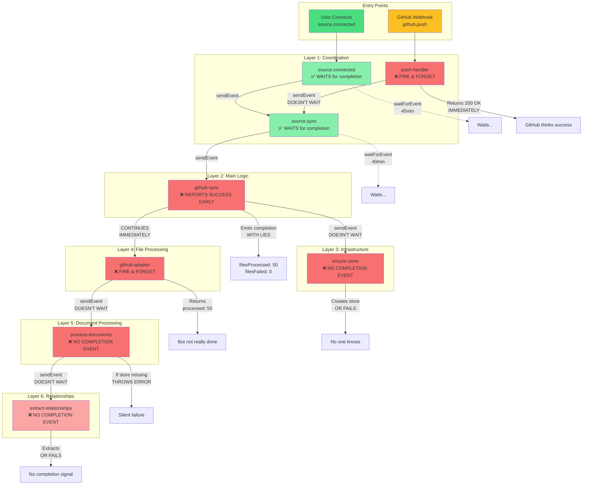
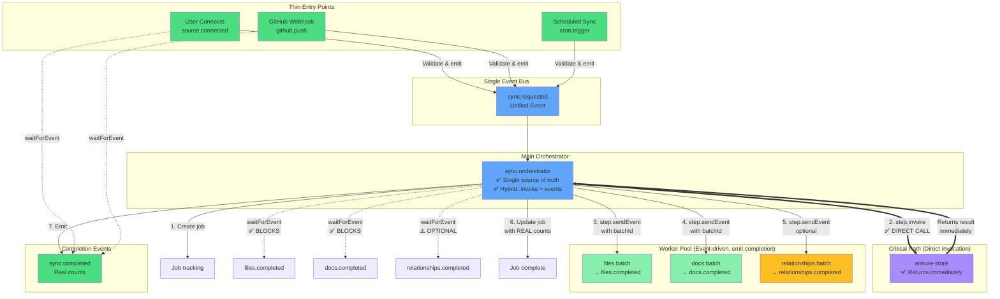

# Inngest Workflow Architecture Diagrams

## Current Architecture (Problematic)



### Current Architecture Problems Visualized

```
TIMELINE OF LIES:
━━━━━━━━━━━━━━━━━━━━━━━━━━━━━━━━━━━━━━━━━━━━━━━━━━━━━━━━━━━━━━━━━━━━

T+0s    User connects repo / GitHub webhook fires
        ↓
T+1s    source.connected starts (Creates Job #1: "running")
        ├─ sends "source.sync" event
        └─ waits for completion...

T+2s    source.sync starts (Creates Job #2: "running")
        ├─ sends "github.sync" event
        └─ waits for completion...

T+3s    github-sync starts
        ├─ sends "store.ensure" → DOESN'T WAIT ❌
        └─ continues immediately...

T+4s    github-sync fetches files (50 files found)
        ├─ sends 50 "docs.file.process" events → DOESN'T WAIT ❌
        └─ continues immediately...

T+5s    github-sync updates status
        ├─ Sets lastSyncStatus: "success" ← LIE! Files not processed
        ├─ Emits completion: filesProcessed: 50 ← LIE! Still queued
        └─ Job #3 marked "completed"

T+6s    source.sync receives completion
        └─ Job #2 marked "completed"

T+7s    source.connected receives completion
        └─ Job #1 marked "completed"

T+8s    ✅ User sees: "Success! 50 files processed"

        MEANWHILE IN PARALLEL (invisible to user):

T+10s   ensure-store starts
        ├─ Creates Pinecone index...
        └─ Takes 30 seconds...

T+15s   github-adapter batch 1 starts
        ├─ Fetches from GitHub...
        └─ Sends "documents.process" events

T+20s   process-documents starts
        ├─ Queries for store...
        ├─ ERROR: "Store not found" ❌
        └─ Retries 3x, all fail

T+40s   ensure-store completes
        └─ But too late! Files already failed

T+45s   ❌ Reality: 0 files actually processed
        ❌ User thinks: 50 files processed
        ❌ No error reporting anywhere
━━━━━━━━━━━━━━━━━━━━━━━━━━━━━━━━━━━━━━━━━━━━━━━━━━━━━━━━━━━━━━━━━━━━
```

---

## Proposed Unified Architecture (Enhanced with step.invoke)



### Unified Architecture Flow (Enhanced)

```
ACCURATE TIMELINE WITH HYBRID APPROACH:
━━━━━━━━━━━━━━━━━━━━━━━━━━━━━━━━━━━━━━━━━━━━━━━━━━━━━━━━━━━━━━━━━━━━

T+0s    User connects / GitHub webhook / Cron fires
        ↓
T+1s    Entry point validates and emits "sync.requested"
        └─ waits for "sync.completed"...

T+2s    sync.orchestrator starts
        ├─ Creates job (status: "running")
        ├─ step.invoke("ensure-store") ← DIRECT INVOCATION ✅
        └─ Blocks until store ready...

T+3s    ensure-store function executes
        ├─ Creates namespace
        ├─ Creates Pinecone index
        └─ Takes ~30s...

T+33s   ensure-store returns result ✅
        ├─ { success: true, storeId: "xxx", indexReady: true }
        └─ Orchestrator receives result IMMEDIATELY

T+34s   sync.orchestrator fetches files
        ├─ step.sendEvent("files.batch") with batchId
        └─ WAITS for "files.completed" ✅

T+35s   files.batch workflow starts
        ├─ Fetches 50 files from GitHub
        ├─ Processes in parallel (fan-out pattern)
        └─ Takes ~20s...

T+55s   files.batch emits "files.completed" ✅
        └─ { processed: 50, failed: 0, batchId: "xxx" }

T+56s   sync.orchestrator sends document processing
        ├─ step.sendEvent("docs.batch") with file data
        ├─ Includes storeId from ensure-store result ← GUARANTEED TO EXIST
        └─ WAITS for "docs.completed" ✅

T+57s   docs.batch workflow starts
        ├─ Store exists ✅ (guaranteed by step.invoke)
        ├─ Processes documents with embeddings
        └─ Takes ~15s...

T+72s   docs.batch emits "docs.completed" ✅
        └─ { processed: 50, failed: 0, embeddingsCreated: 150 }

T+73s   sync.orchestrator optionally triggers relationships
        ├─ step.sendEvent("relationships.batch")
        └─ Doesn't wait (optional enhancement)

T+74s   sync.orchestrator completes job
        ├─ Updates job with REAL counts ✅
        ├─ filesProcessed: 50 (verified from events)
        ├─ embeddingsCreated: 150 (actual count)
        └─ Emits "sync.completed"

T+75s   Entry point receives completion
        └─ Returns accurate results to user

T+76s   ✅ User sees: "Success! 50 files processed, 150 embeddings created"
        ✅ Reality matches report exactly
        ✅ No race conditions possible
        ✅ Full error tracking with immediate failure on store issues
━━━━━━━━━━━━━━━━━━━━━━━━━━━━━━━━━━━━━━━━━━━━━━━━━━━━━━━━━━━━━━━━━━━━
```

---

## Comparison: Current vs Proposed

### Current: Multiple Orchestration Points
```
source.connected ─┐
                  ├─→ source.sync ─→ github.sync ─→ [chaos]
github.push ──────┘

Problems:
- 3 different orchestration layers
- No single source of truth
- Fire-and-forget everywhere
- Success reported before work done
```

### Proposed: Single Orchestration Point
```
source.connected ─┐
github.push ──────┼─→ sync.requested ─→ sync.orchestrator ─→ [ordered]
cron.trigger ─────┘

Benefits:
- 1 orchestration point
- Single source of truth
- Proper dependency waiting
- Accurate status reporting
```

---

## Detailed Worker Communication Pattern (Hybrid Approach)

```
┌─────────────────────────────────────────────────────────────┐
│                      sync.orchestrator                       │
│              (Main Control Loop - Hybrid Pattern)            │
└─────────────────────────────────────────────────────────────┘
        │                    │                    │
        ▼                    ▼                    ▼
  DIRECT INVOKE        SEND EVENT           SEND EVENT
  step.invoke()       files.batch          docs.batch
        │                    │                    │
        ▼                    ▼                    ▼
┌──────────────┐    ┌──────────────┐    ┌──────────────┐
│ ensure-store │    │ files.batch  │    │  docs.batch  │
│   function   │    │   workflow   │    │   workflow   │
└──────────────┘    └──────────────┘    └──────────────┘
        │                    │                    │
        ▼                    ▼                    ▼
  RETURN VALUE         EMIT EVENT           EMIT EVENT
  { storeId }       files.completed      docs.completed
        │                    │                    │
        ▼                    ▼                    ▼
┌─────────────────────────────────────────────────────────────┐
│                      sync.orchestrator                       │
│     (Immediate result)  (Waits for events)  (Continues)     │
└─────────────────────────────────────────────────────────────┘
        │
        ▼
   EMIT EVENT
 sync.completed
        │
        ▼
┌─────────────────────────────────────────────────────────────┐
│                     Entry Points                             │
│               (Receive accurate results)                     │
└─────────────────────────────────────────────────────────────┘

Legend:
═══> Direct invocation (step.invoke) - Synchronous, returns immediately
───> Event-driven (step.sendEvent) - Asynchronous, requires waitForEvent
```

---

## Error Handling Flow

### Current: Errors Get Lost
```
github-sync
    ├─→ ensure-store (fails) ──→ ❌ No signal back
    ├─→ files.process ──→ process-documents (fails due to missing store)
    │                      └─→ ❌ Error logged but not propagated
    └─→ Emits success ──→ ✅ User sees success (BUT IT'S A LIE!)
```

### Proposed: Errors Propagate (Enhanced with step.invoke)
```
sync.orchestrator
    ├─→ step.invoke(ensure-store) ──→ THROWS immediately if fails
    ├─ Try/catch handles error ──→ STOPS PROCESSING
    ├─→ Updates job with failure status
    └─→ Emits sync.completed { success: false, error }
         └─→ Entry point receives ──→ User sees actual error

Benefits of step.invoke for critical path:
- Immediate error feedback (no event delay)
- Can use NonRetriableError for permanent failures
- Direct error context in stack trace
```

---

## Concurrency Model

### Current: Problematic Singleton
```
github-sync with singleton on sourceId:
- Full sync running (15 minutes)
- User pushes code → Incremental sync SKIPPED
- User's changes silently ignored!
```

### Proposed: Smart Concurrency
```
sync.orchestrator with concurrency control:

Option 1 - Queue Mode:
concurrency: {
  key: "event.data.sourceId",
  limit: 1,  // Process one at a time
}
→ Incremental sync queues behind full sync

Option 2 - Parallel by Type:
concurrency: {
  key: "event.data.sourceId + event.data.mode",
  limit: 1,  // One per type
}
→ Incremental can run during full sync

Option 3 - Smart Merge:
- Detect queued syncs
- Merge incremental into running full sync
- Skip redundant work
```

---

## Benefits Summary

| Aspect | Current Architecture | Proposed Architecture |
|--------|---------------------|----------------------|
| **Entry Points** | 2 different flows | Unified through sync.requested |
| **Orchestration** | 3 layers (connected→sync→github) | 1 layer (orchestrator) |
| **Completion Tracking** | Fire-and-forget (8 operations) | All workers emit completion |
| **Error Handling** | Silent failures | Errors propagate up |
| **Job Status** | Lies (reports before done) | Accurate (waits for completion) |
| **Store Creation** | Race condition | Proper dependency |
| **File Counts** | Guessed | Actually tracked |
| **Concurrency** | Blocks all syncs | Smart queueing |
| **Debugging** | Hard (distributed logic) | Easy (single orchestrator) |
| **Testing** | Complex (many paths) | Simple (one main path) |

---

## Migration Path

```
Phase 1: Add Completion Events (Stop the bleeding)
────────────────────────────────────────────────
Current State          Add Events              Result
─────────────          ──────────              ──────
ensure-store     +     store.completed    =    No more "store not found"
github-adapter   +     files.completed    =    Track actual processing
process-docs     +     docs.completed     =    Know when really done

Phase 2: Create Orchestrator (Clean architecture)
────────────────────────────────────────────────
sync.requested event → sync.orchestrator → Unified flow
Refactor entry points to be thin wrappers
Use step.invoke for critical dependencies

Phase 3: Remove Old Code (Simplify)
────────────────────────────────────────────────
Delete source.sync (redundant)
Simplify github-sync to just file fetching
Remove complex coordinator logic
```

This architecture ensures:
1. **Single source of truth** - One orchestrator knows everything
2. **Accurate reporting** - Wait for actual completion
3. **Proper error handling** - Failures bubble up
4. **Better debugging** - Linear flow, clear dependencies
5. **Easier maintenance** - Logic in one place

---

## Implementation Code Examples

### Main Orchestrator with Hybrid Approach

```typescript
import { inngest, NonRetriableError, RetryAfterError } from "@/inngest/client";
import { ensureStoreFunction } from "./ensure-store";

export const syncOrchestrator = inngest.createFunction(
  {
    id: "sync.orchestrator",
    name: "Sync Orchestrator - Hybrid Pattern",
    concurrency: {
      limit: 1,
      key: "event.data.sourceId",
    },
    onFailure: async ({ event, error, step }) => {
      // Update job status on failure
      await step.run("update-job-failure", async () => {
        await updateJobStatus(event.data.jobId, {
          status: "failed",
          error: error.message,
          failedAt: new Date(),
        });
      });
    },
  },
  { event: "sync.requested" },
  async ({ event, step, logger }) => {
    const { sourceId, mode = "full" } = event.data;

    // 1. Create tracking job
    const jobId = await step.run("create-job", async () => {
      return await createJob({
        sourceId,
        mode,
        status: "running",
      });
    });

    // 2. CRITICAL PATH: Use step.invoke for store creation
    // This guarantees the store exists before proceeding
    const storeResult = await step.invoke("ensure-store", {
      function: ensureStoreFunction,
      data: {
        sourceId,
        workspaceId: event.data.workspaceId,
      },
    });

    // Check result immediately - no race condition possible
    if (!storeResult.success) {
      throw new NonRetriableError(
        `Failed to create store: ${storeResult.error}`
      );
    }

    logger.info("Store created successfully", {
      storeId: storeResult.storeId
    });

    // 3. Fetch files to process
    const files = await step.run("fetch-files", async () => {
      return await fetchGitHubFiles(sourceId, {
        mode,
        since: mode === "incremental" ? event.data.since : undefined,
      });
    });

    // 4. FAN-OUT: Process files in parallel batches
    const batchSize = 50;
    const batches = chunkArray(files, batchSize);

    // Send events for parallel processing
    await step.run("send-file-batches", async () => {
      return await Promise.all(
        batches.map((batch, index) =>
          step.sendEvent(`file-batch-${index}`, {
            name: "files.batch.process",
            data: {
              batchId: `${jobId}-${index}`,
              sourceId,
              storeId: storeResult.storeId, // Pass store ID from invoke
              files: batch,
            },
          })
        )
      );
    });

    // 5. Wait for all batches to complete
    const batchResults = await Promise.all(
      batches.map((_, index) =>
        step.waitForEvent(`batch-${index}-complete`, {
          event: "files.batch.completed",
          match: "data.batchId",
          if: `event.data.batchId == "${jobId}-${index}"`,
          timeout: "10m",
        })
      )
    );

    // Check for failures
    const failedBatches = batchResults.filter(r => !r?.data?.success);
    if (failedBatches.length > 0) {
      logger.error("Some batches failed", { failedBatches });
    }

    // 6. Process documents with embeddings
    const processedFiles = batchResults
      .filter(r => r?.data?.success)
      .flatMap(r => r.data.processedFiles);

    await step.sendEvent("process-documents", {
      name: "docs.batch.process",
      data: {
        jobId,
        sourceId,
        storeId: storeResult.storeId,
        files: processedFiles,
      },
    });

    const docsResult = await step.waitForEvent("docs-complete", {
      event: "docs.batch.completed",
      match: "data.jobId",
      timeout: "20m",
    });

    // 7. Optional: Extract relationships (don't wait)
    if (event.data.extractRelationships) {
      await step.sendEvent("extract-relationships", {
        name: "relationships.extract",
        data: {
          jobId,
          sourceId,
          storeId: storeResult.storeId,
        },
      });
      // Not waiting - this is an enhancement
    }

    // 8. Update job with real counts
    const finalStatus = await step.run("update-job-success", async () => {
      const totalProcessed = batchResults
        .filter(r => r?.data?.success)
        .reduce((sum, r) => sum + (r.data.processed || 0), 0);

      const totalFailed = batchResults
        .reduce((sum, r) => sum + (r?.data?.failed || 0), 0);

      return await updateJobStatus(jobId, {
        status: "completed",
        filesProcessed: totalProcessed,
        filesFailed: totalFailed,
        embeddingsCreated: docsResult?.data?.embeddingsCreated || 0,
        completedAt: new Date(),
      });
    });

    // 9. Emit completion event
    await step.sendEvent("sync-completed", {
      name: "sync.completed",
      data: {
        sourceId,
        jobId,
        success: true,
        stats: finalStatus,
      },
    });

    return {
      success: true,
      jobId,
      stats: finalStatus,
    };
  }
);
```

### Ensure Store Function (Direct Invocation)

```typescript
export const ensureStoreFunction = inngest.createFunction(
  {
    id: "ensure-store",
    name: "Ensure Vector Store Exists",
    retries: 3,
  },
  { event: "internal/ensure.store" }, // Can be triggered directly or via event
  async ({ event, step }) => {
    const { sourceId, workspaceId } = event.data;

    try {
      // Check if store exists
      const existing = await step.run("check-existing-store", async () => {
        return await getVectorStore(sourceId);
      });

      if (existing) {
        return {
          success: true,
          storeId: existing.id,
          indexReady: true,
          existed: true,
        };
      }

      // Create new store
      const store = await step.run("create-store", async () => {
        return await createVectorStore({
          sourceId,
          workspaceId,
          namespace: `${workspaceId}-${sourceId}`,
        });
      });

      // Initialize Pinecone index
      await step.run("init-pinecone", async () => {
        return await initializePineconeIndex({
          namespace: store.namespace,
          dimension: 1536,
        });
      });

      // Verify index is ready
      const verified = await step.run("verify-index", async () => {
        return await verifyIndexReady(store.namespace);
      });

      if (!verified) {
        throw new NonRetriableError("Index creation verification failed");
      }

      return {
        success: true,
        storeId: store.id,
        indexReady: true,
        existed: false,
      };
    } catch (error) {
      if (error.code === "QUOTA_EXCEEDED") {
        throw new NonRetriableError("Pinecone quota exceeded");
      }

      // Other errors will be retried
      throw error;
    }
  }
);
```

### File Batch Processor (Event-Driven)

```typescript
export const fileBatchProcessor = inngest.createFunction(
  {
    id: "files.batch.processor",
    name: "Process File Batch",
    concurrency: {
      limit: 10, // Process up to 10 batches in parallel
    },
  },
  { event: "files.batch.process" },
  async ({ event, step }) => {
    const { batchId, sourceId, storeId, files } = event.data;

    const results = {
      processed: 0,
      failed: 0,
      errors: [] as any[],
    };

    // Process files in parallel within the batch
    const processResults = await step.run("process-files", async () => {
      return await Promise.allSettled(
        files.map(async (file) => {
          try {
            const content = await fetchFileContent(file.path);
            const processed = await processFile({
              sourceId,
              storeId,
              path: file.path,
              content,
            });
            return { success: true, file: file.path, processed };
          } catch (error) {
            return { success: false, file: file.path, error: error.message };
          }
        })
      );
    });

    // Count results
    processResults.forEach((result) => {
      if (result.status === "fulfilled" && result.value.success) {
        results.processed++;
      } else {
        results.failed++;
        if (result.status === "rejected") {
          results.errors.push(result.reason);
        }
      }
    });

    // Emit completion event
    await step.sendEvent("batch-complete", {
      name: "files.batch.completed",
      data: {
        batchId,
        sourceId,
        success: results.failed === 0,
        processed: results.processed,
        failed: results.failed,
        processedFiles: processResults
          .filter(r => r.status === "fulfilled" && r.value.success)
          .map(r => (r as any).value.processed),
      },
    });

    return results;
  }
);
```

### Key Patterns Demonstrated

1. **step.invoke() for Critical Dependencies**
   - Store creation must succeed before any processing
   - Immediate error feedback
   - No event round-trip overhead

2. **step.sendEvent() + waitForEvent for Parallel Work**
   - File processing can happen in parallel
   - Each batch has independent retry logic
   - Completion tracking via events

3. **Error Handling**
   - NonRetriableError for permanent failures
   - RetryAfterError for rate limits
   - onFailure handler for cleanup

4. **Concurrency Control**
   - Per-source concurrency limit
   - Parallel batch processing
   - Queue behavior for multiple syncs

5. **Accurate Tracking**
   - Real counts from actual processing
   - No premature success reporting
   - Full audit trail via events