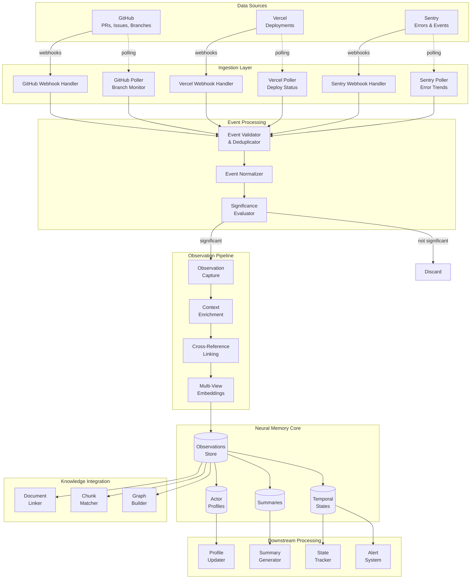
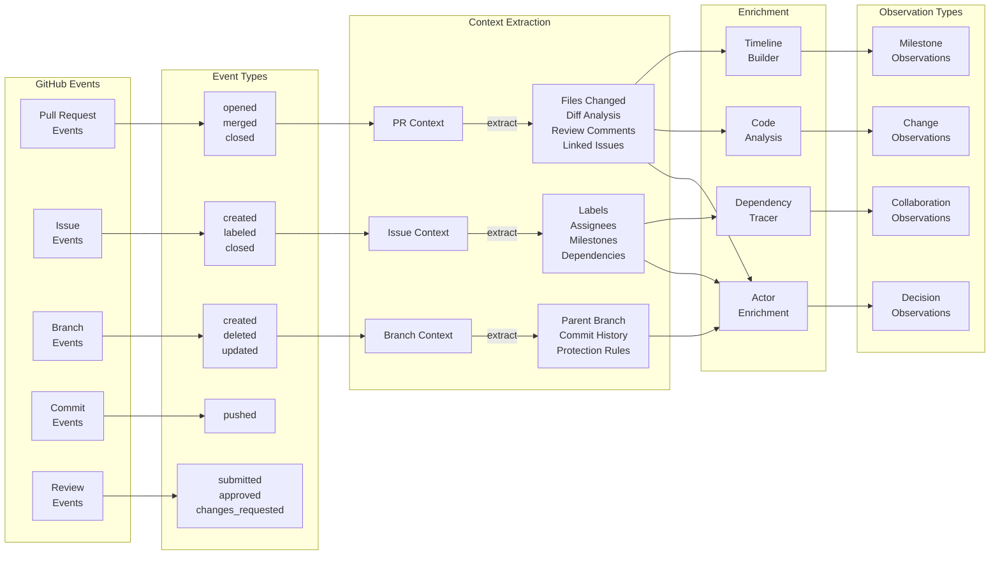
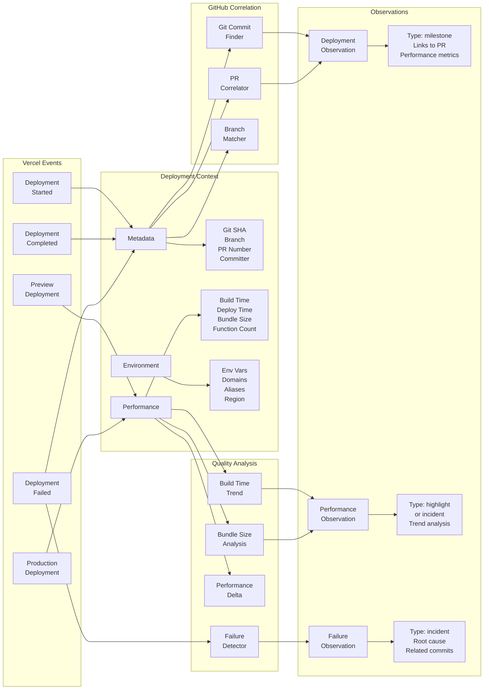
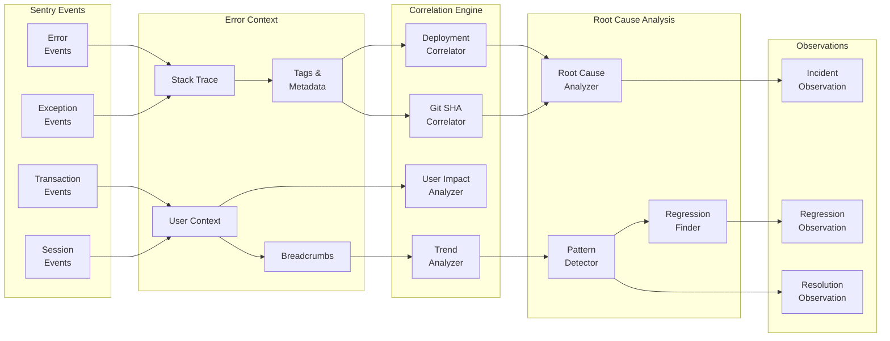
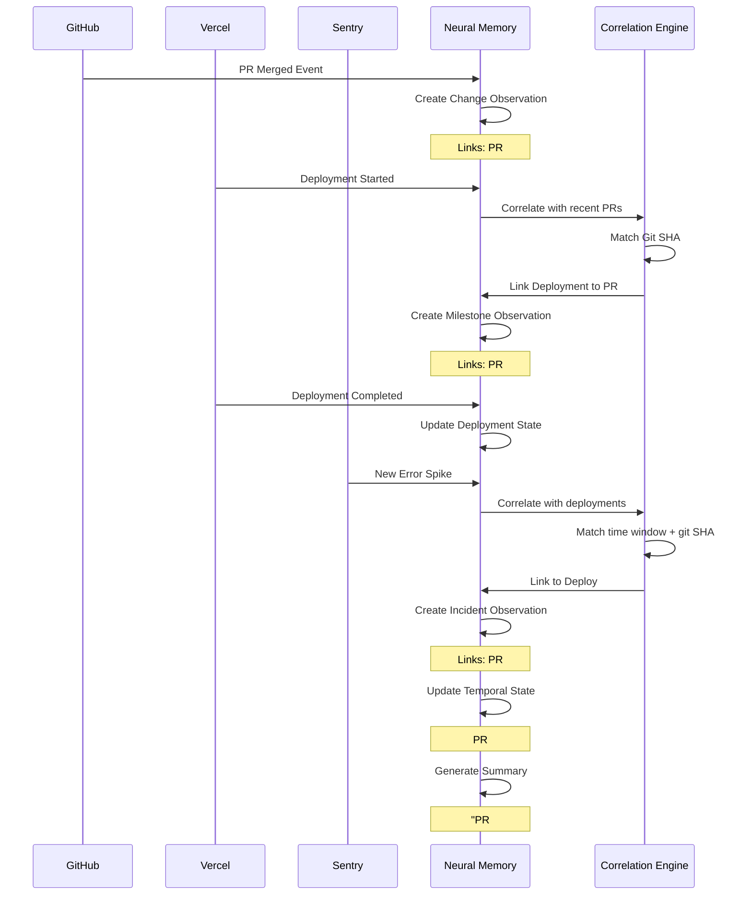
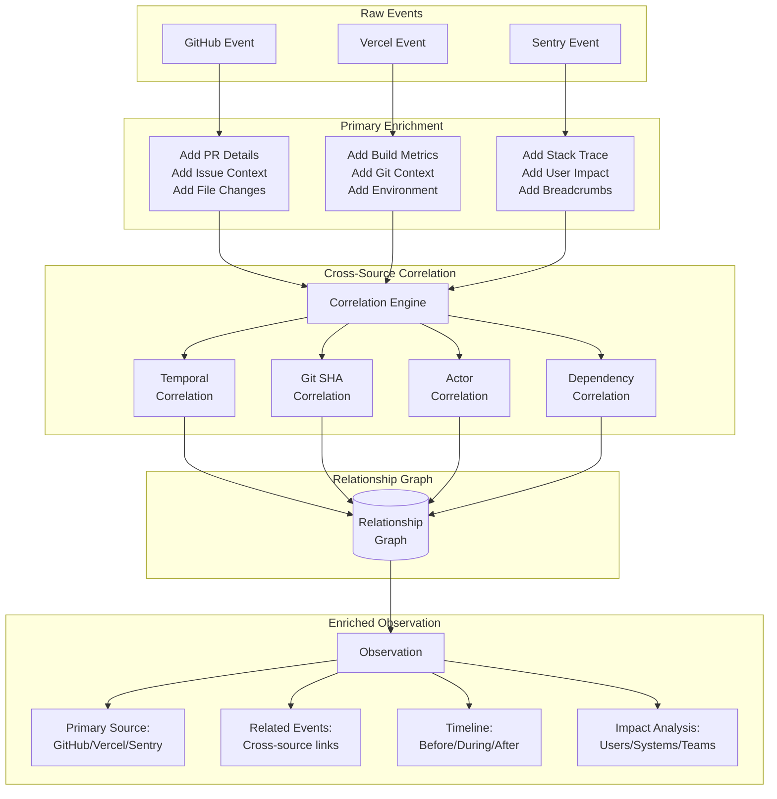
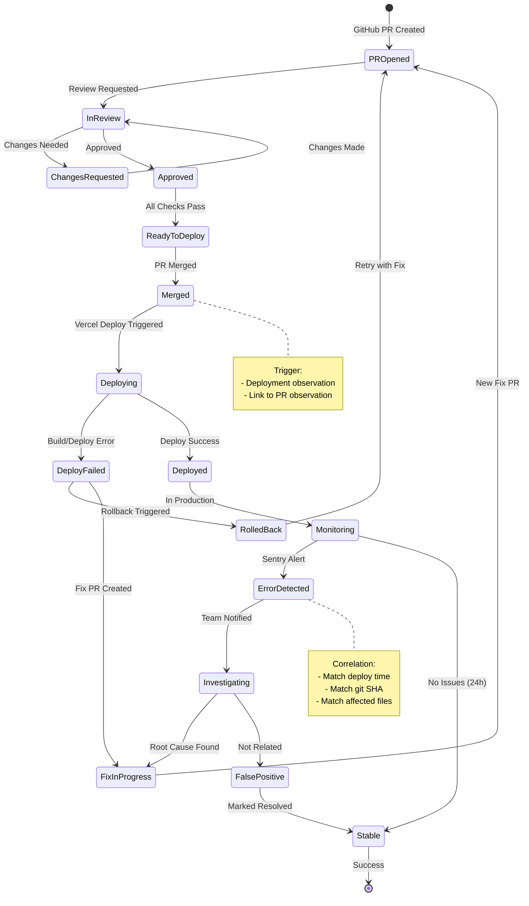
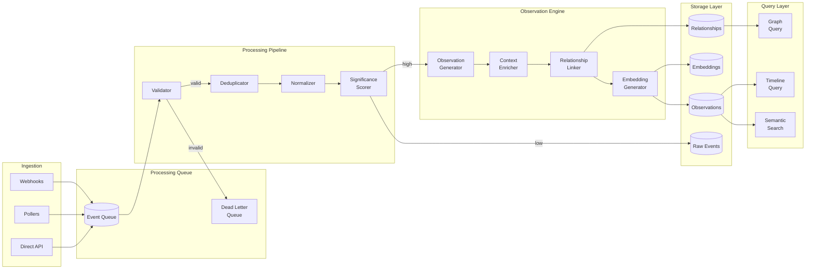

# Neural Memory Architecture: GitHub, Vercel & Sentry Integration

Last Updated: 2025-11-27

This document provides architectural diagrams and flow descriptions for how GitHub PRs/Issues/Branches, Vercel deployments, and Sentry errors integrate with the Neural Memory system.

---

## High-Level Architecture



---

## Data Source Integration Details

### 1. GitHub Integration Architecture



### 2. Vercel Deployment Architecture



### 3. Sentry Error Architecture



---

## Cross-Source Correlation Flow



---

## Observation Generation Rules

### GitHub → Observation Mapping

| GitHub Event | Observation Type | Significance Factors | Key Relationships |
|-------------|-----------------|---------------------|-------------------|
| PR Merged | `change` | File count, LoC, reviewer count | Issues, commits, reviews |
| PR with >10 comments | `decision` | Discussion length, participants | Issues, mentions, decisions |
| Issue Closed | `milestone` | Labels, time open, linked PRs | PRs, assignee, project |
| Branch Created (feature/*) | `change` | Branch naming, parent | Future PRs, commits |
| Review Changes Requested | `decision` | Review depth, suggestions | PR, files, reviewer expertise |
| PR Deployment Ready | `milestone` | Approvals, checks passed | Deploy readiness |

### Vercel → Observation Mapping

| Vercel Event | Observation Type | Significance Factors | Key Relationships |
|-------------|-----------------|---------------------|-------------------|
| Production Deploy | `milestone` | Success, performance | GitHub PR, commit, branch |
| Deploy Failed | `incident` | Error type, stage failed | GitHub commit, previous deploys |
| Build Time Regression | `incident` | Time delta, threshold | Recent PRs, dependencies |
| Bundle Size Increase >10% | `highlight` | Size delta, cause | GitHub PR, file changes |
| Preview Deploy | `change` | PR association | GitHub PR, branch |
| First Deploy (new project) | `milestone` | Project setup | GitHub repo, team |

### Sentry → Observation Mapping

| Sentry Event | Observation Type | Significance Factors | Key Relationships |
|-------------|-----------------|---------------------|-------------------|
| New Error Type | `incident` | User impact, frequency | Deploy, git SHA, files |
| Error Spike (>5x baseline) | `incident` | Spike magnitude, users affected | Recent deploy, PR |
| Error Resolved | `highlight` | Resolution time, method | Original incident, fix PR |
| Performance Regression | `incident` | Transaction impact, percentile | Deploy, code changes |
| New User Segment Errors | `insight` | Segment size, error pattern | Feature flags, rollout |
| Error Pattern Detected | `insight` | Pattern confidence, instances | Multiple errors, root cause |

---

## Enrichment & Correlation Pipeline



---

## Temporal State Machine



---

## Data Flow Architecture



---

## Implementation Architecture

### System Components

```typescript
// Core Event Types
interface GitHubEvent {
  type: 'pr_opened' | 'pr_merged' | 'issue_created' | 'branch_created';
  payload: {
    repository: string;
    actor: GitHubActor;
    timestamp: Date;
    data: any;
  };
}

interface VercelEvent {
  type: 'deployment_created' | 'deployment_ready' | 'deployment_error';
  payload: {
    projectId: string;
    deploymentId: string;
    gitSha: string;
    timestamp: Date;
    data: any;
  };
}

interface SentryEvent {
  type: 'error' | 'transaction' | 'session';
  payload: {
    projectId: string;
    eventId: string;
    timestamp: Date;
    data: any;
  };
}

// Correlation Engine
class CorrelationEngine {
  async correlate(event: Event): Promise<Correlations> {
    const correlations = await Promise.all([
      this.correlateByGitSha(event),
      this.correlateByTimeWindow(event),
      this.correlateByActor(event),
      this.correlateByDependency(event)
    ]);

    return this.mergeCorrelations(correlations);
  }

  private async correlateByGitSha(event: Event): Promise<GitCorrelation> {
    // Find all events with matching git SHA
    const gitSha = this.extractGitSha(event);
    if (!gitSha) return null;

    const related = await this.findEventsByGitSha(gitSha);
    return {
      type: 'git_sha',
      confidence: 1.0,
      relatedEvents: related
    };
  }

  private async correlateByTimeWindow(event: Event): Promise<TimeCorrelation> {
    // Find events within temporal proximity
    const window = this.getTimeWindow(event);
    const related = await this.findEventsInWindow(
      window.start,
      window.end,
      event.source
    );

    return {
      type: 'temporal',
      confidence: this.calculateTemporalConfidence(event, related),
      relatedEvents: related
    };
  }
}

// Observation Generator
class ObservationGenerator {
  async generate(
    event: Event,
    correlations: Correlations
  ): Promise<Observation> {
    // Determine observation type based on event and correlations
    const type = this.determineObservationType(event, correlations);

    // Extract characteristics based on type
    const characteristics = await this.extractCharacteristics(
      type,
      event,
      correlations
    );

    // Build observation
    return {
      id: generateId(),
      type,
      sourceEvent: event,
      correlations,
      characteristics,
      significance: await this.calculateSignificance(event, correlations),
      timestamp: event.timestamp,
      actor: event.actor,
      entities: this.extractEntities(event, correlations)
    };
  }

  private determineObservationType(
    event: Event,
    correlations: Correlations
  ): ObservationType {
    // Complex rules for determining observation type

    // PR merged + deployment = milestone
    if (event.type === 'pr_merged' && correlations.hasDeployment) {
      return 'milestone';
    }

    // Deployment + error spike = incident
    if (event.type === 'deployment_ready' && correlations.hasErrorSpike) {
      return 'incident';
    }

    // Error resolved + PR merged = highlight
    if (event.type === 'error_resolved' && correlations.hasPRFix) {
      return 'highlight';
    }

    // Default mappings
    return this.getDefaultType(event);
  }
}
```

---

## Key Relationships & Patterns

### 1. PR → Deployment → Error Pattern
```
GitHub PR Merged → Vercel Deployment → Sentry Error Spike
                ↓                    ↓
          Change Observation    Incident Observation
                ↓                    ↓
            Linked by Git SHA & Time Window
                        ↓
                  Root Cause Analysis
                        ↓
                Fix PR Created (new cycle)
```

### 2. Issue → PR → Deployment → Resolution Pattern
```
GitHub Issue Created → PR Opened → PR Merged → Deployment
         ↓                ↓           ↓            ↓
    Problem Obs     Decision Obs  Change Obs  Milestone Obs
                           ↓
                    Summary Generated:
                "Issue #X resolved by PR #Y, deployed successfully"
```

### 3. Error → Investigation → Fix Pattern
```
Sentry Error Detected → GitHub Issue Created → PR with Fix → Deployment
         ↓                     ↓                    ↓            ↓
   Incident Obs          Investigation Obs     Decision Obs  Resolution Obs
                                ↓
                        Actor Profile Updated:
                    "Expert in error resolution"
```

---

## Performance & Scalability Considerations

### Processing Rates
- **GitHub Events**: ~1000/minute peak
- **Vercel Events**: ~100/minute peak
- **Sentry Events**: ~5000/minute peak

### Optimization Strategies
1. **Batch Processing**: Group events in 100ms windows
2. **Significance Pre-filtering**: Quick score before deep analysis
3. **Correlation Caching**: Cache recent correlations (5min TTL)
4. **Embedding Batching**: Process 10 observations at once
5. **Async Processing**: Non-blocking pipeline with queues

### Storage Requirements
- **Raw Events**: 30-day retention (10TB estimated)
- **Observations**: Permanent (1TB/year estimated)
- **Embeddings**: Permanent (500GB/year estimated)
- **Relationships**: Graph database (100GB estimated)

---

## Monitoring & Alerting

### Key Metrics
1. **Ingestion Lag**: Time from event to observation
2. **Correlation Accuracy**: Manual verification sampling
3. **Significance Precision**: False positive rate
4. **Processing Throughput**: Events/second
5. **Storage Growth**: GB/day

### Alert Conditions
- Ingestion lag > 5 minutes
- Correlation confidence < 0.7 for >10% events
- Error rate > 1% in any pipeline stage
- Queue depth > 10,000 events
- Storage growth > 2x baseline

---

## Future Enhancements

### Phase 2: Advanced Correlations
- Machine learning for correlation patterns
- Predictive incident detection
- Automated root cause analysis

### Phase 3: Additional Sources
- Datadog metrics
- PagerDuty incidents
- Linear issues
- Slack discussions

### Phase 4: Intelligence Layer
- Automated summaries
- Trend detection
- Anomaly detection
- Recommendation engine