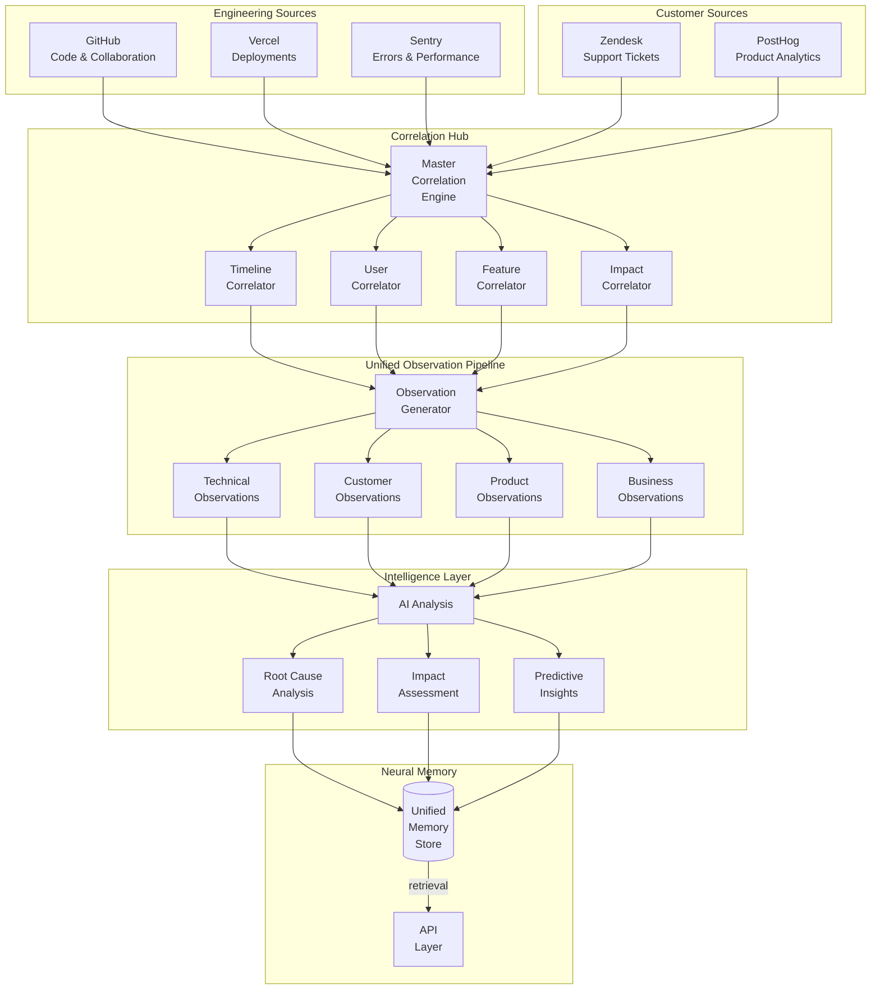
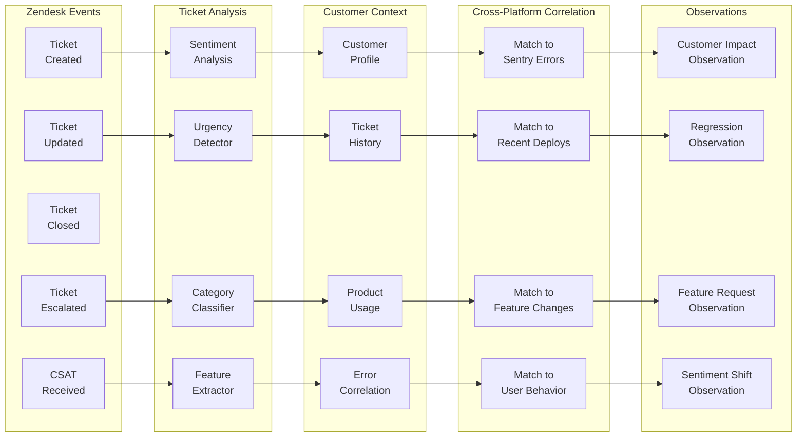
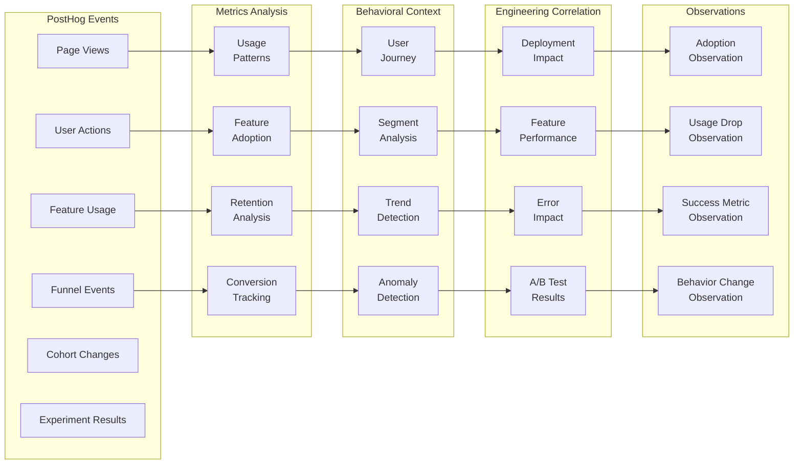
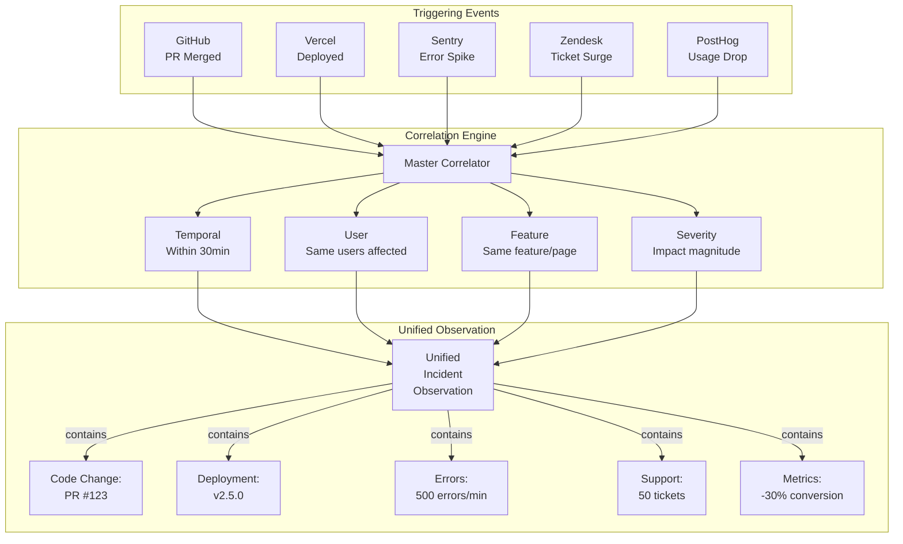
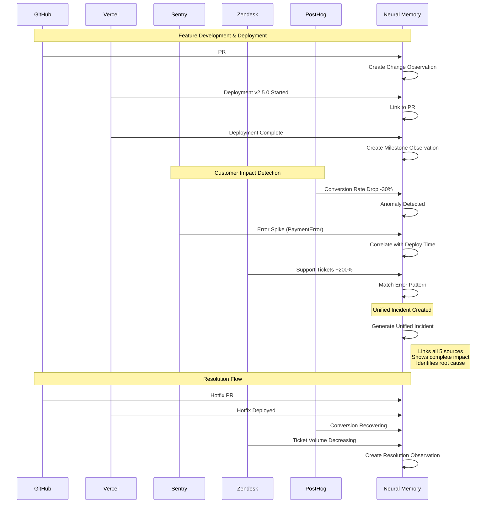
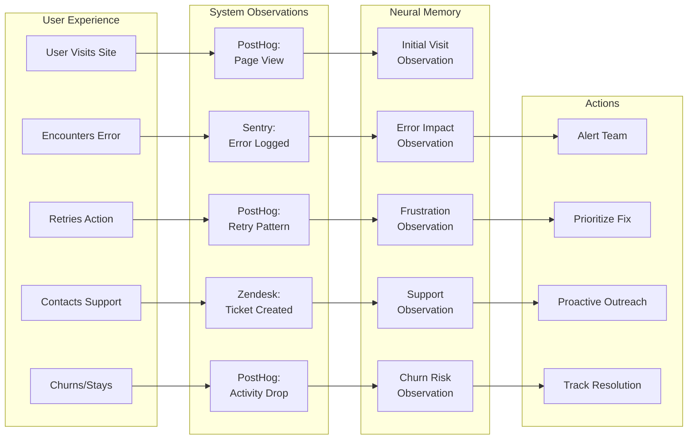

# Neural Memory Extended Architecture: Complete Observability Stack

Last Updated: 2025-11-27

This document extends the Neural Memory architecture to include **Zendesk** (customer support) and **PostHog** (product analytics), creating a complete observability stack that connects code changes to customer impact and product metrics.

---

## Complete Observability Architecture



---

## Zendesk Integration Architecture

### Support Ticket Processing Pipeline



### Zendesk → Observation Mapping

| Zendesk Event | Observation Type | Significance Factors | Key Correlations |
|---------------|-----------------|---------------------|-------------------|
| Ticket Created (Bug) | `incident` | Priority, customer tier, sentiment | Sentry errors, recent deploys |
| Ticket Escalated | `incident` | Escalation path, time to escalate | Feature usage, error patterns |
| Multiple Similar Tickets | `incident` | Volume, velocity, similarity | Deployment timeline, changes |
| Feature Request | `insight` | Request frequency, customer value | GitHub issues, roadmap |
| Positive CSAT after Fix | `highlight` | Score improvement, resolution time | Fix PR, deployment |
| Negative CSAT Spike | `incident` | Score drop, volume, reasons | Recent changes, errors |
| Support Trend Change | `insight` | Category shift, volume change | Product changes, campaigns |

---

## PostHog Integration Architecture

### Product Analytics Processing Pipeline



### PostHog → Observation Mapping

| PostHog Event | Observation Type | Significance Factors | Key Correlations |
|--------------|-----------------|---------------------|-------------------|
| Feature Adoption >80% | `highlight` | Adoption rate, time to adopt | GitHub PR, deployment |
| Conversion Drop >20% | `incident` | Drop magnitude, affected segment | Recent deploy, errors |
| New User Behavior Pattern | `insight` | Pattern strength, segment size | Feature changes, campaigns |
| Retention Improvement | `highlight` | Improvement %, cohort size | Product changes, fixes |
| Feature Usage Drop | `incident` | Drop %, user impact | Sentry errors, deploys |
| Successful Experiment | `decision` | Statistical significance, impact | GitHub PRs, future work |
| Funnel Abandonment Spike | `incident` | Abandonment rate, step | UX changes, errors |

---

## Complete Cross-Source Correlation Matrix



---

## Advanced Correlation Patterns

### 1. The Complete Impact Chain



### 2. Customer Feedback → Engineering Loop

```
Zendesk Tickets → Pattern Detection → GitHub Issue → PR → Deployment → PostHog Metrics
       ↓                  ↓                ↓         ↓         ↓            ↓
  Customer Pain    Feature Request    Engineering   Change    Release    Validation
       ↓                  ↓                ↓         ↓         ↓            ↓
                    Unified Observation:
        "Customer request implemented, 85% adoption, 4.5 CSAT"
```

### 3. Proactive Issue Detection Pattern

```
PostHog: Unusual user behavior detected (multiple retries on payment)
    ↓
Neural Memory: Correlates with subtle error rate increase in Sentry
    ↓
Alert: "Potential payment issue emerging - investigate before customer impact"
    ↓
Engineering: Fixes issue before Zendesk tickets arrive
```

---

## Intelligent Correlation Rules

### Multi-Source Correlation Engine

```typescript
interface UnifiedCorrelation {
  sources: {
    github?: GitHubContext;
    vercel?: VercelContext;
    sentry?: SentryContext;
    zendesk?: ZendeskContext;
    posthog?: PostHogContext;
  };
  confidence: number;
  impact: ImpactAssessment;
  timeline: TemporalChain;
  recommendations: Action[];
}

class MasterCorrelationEngine {
  async correlate(event: SourceEvent): Promise<UnifiedCorrelation> {
    // Level 1: Direct correlations
    const direct = await this.directCorrelations(event);

    // Level 2: Indirect correlations
    const indirect = await this.indirectCorrelations(event, direct);

    // Level 3: Behavioral correlations
    const behavioral = await this.behavioralCorrelations(event, direct);

    // Level 4: Predictive correlations
    const predictive = await this.predictiveCorrelations(event, direct);

    return this.buildUnifiedCorrelation([
      direct,
      indirect,
      behavioral,
      predictive
    ]);
  }

  private async directCorrelations(event: SourceEvent) {
    const correlations = [];

    // GitHub → Vercel (Git SHA)
    if (event.gitSha) {
      correlations.push(await this.findByGitSha(event.gitSha));
    }

    // Sentry → Zendesk (Error fingerprint in ticket)
    if (event.errorFingerprint) {
      correlations.push(await this.findTicketsByError(event.errorFingerprint));
    }

    // Vercel → PostHog (Deployment time = metric change)
    if (event.deploymentTime) {
      correlations.push(await this.findMetricChanges(event.deploymentTime));
    }

    // Zendesk → PostHog (Customer ID)
    if (event.customerId) {
      correlations.push(await this.findUserBehavior(event.customerId));
    }

    return correlations;
  }

  private async behavioralCorrelations(event: SourceEvent, direct: Correlations) {
    // Complex behavioral patterns

    // Pattern: Error → Support → Churn
    if (event.type === 'sentry_error') {
      const affectedUsers = await this.getAffectedUsers(event);
      const supportTickets = await this.findTicketsByUsers(affectedUsers);
      const churnRisk = await this.assessChurnRisk(affectedUsers);

      if (churnRisk.high) {
        return {
          pattern: 'error_support_churn',
          confidence: 0.85,
          urgency: 'critical',
          recommendation: 'Proactive customer outreach needed'
        };
      }
    }

    // Pattern: Feature Release → Adoption → Support
    if (event.type === 'vercel_deployment') {
      const feature = await this.extractFeatureFromDeployment(event);
      const adoption = await this.measureFeatureAdoption(feature);
      const supportImpact = await this.measureSupportImpact(feature);

      return {
        pattern: 'feature_release_impact',
        adoption: adoption.rate,
        supportLoad: supportImpact.ticketIncrease,
        recommendation: adoption.rate < 0.3 ? 'Consider UX improvements' : 'Success'
      };
    }
  }

  private async predictiveCorrelations(event: SourceEvent) {
    // ML-based predictions

    // Predict customer impact from code changes
    if (event.type === 'github_pr_merged') {
      const prediction = await this.mlModels.predictImpact({
        filesChanged: event.filesChanged,
        historicalIncidents: await this.getHistoricalIncidents(event.filesChanged),
        authorExperience: await this.getAuthorMetrics(event.author)
      });

      if (prediction.riskScore > 0.7) {
        return {
          prediction: 'high_risk_deployment',
          confidence: prediction.confidence,
          potentialImpact: {
            errorRate: prediction.errorRate,
            supportTickets: prediction.supportVolume,
            conversionImpact: prediction.conversionDrop
          },
          recommendation: 'Consider canary deployment or extra monitoring'
        };
      }
    }

    // Predict support volume from usage patterns
    if (event.type === 'posthog_usage_spike') {
      const supportPrediction = await this.predictSupportVolume(event);

      if (supportPrediction.increase > 0.5) {
        return {
          prediction: 'support_volume_increase',
          expectedIncrease: supportPrediction.increase,
          peakTime: supportPrediction.peakTime,
          recommendation: 'Scale support team for expected volume'
        };
      }
    }
  }
}
```

---

## Customer Journey Tracking

### Complete User Impact Flow



---

## Impact Assessment Framework

### Multi-Dimensional Impact Scoring

```typescript
interface ImpactAssessment {
  technical: {
    errorRate: number;        // Sentry
    performanceDelta: number; // Sentry
    availability: number;     // Vercel
  };
  customer: {
    ticketVolume: number;     // Zendesk
    sentimentScore: number;   // Zendesk
    csatDelta: number;        // Zendesk
  };
  business: {
    conversionRate: number;   // PostHog
    revenueImpact: number;    // PostHog
    userRetention: number;    // PostHog
    featureAdoption: number;  // PostHog
  };
  overall: {
    score: number;           // 0-100
    severity: 'critical' | 'high' | 'medium' | 'low';
    trend: 'improving' | 'stable' | 'degrading';
  };
}

class ImpactCalculator {
  calculate(observations: Observation[]): ImpactAssessment {
    const technical = this.calculateTechnicalImpact(observations);
    const customer = this.calculateCustomerImpact(observations);
    const business = this.calculateBusinessImpact(observations);

    const overall = this.calculateOverallImpact(technical, customer, business);

    return {
      technical,
      customer,
      business,
      overall
    };
  }

  private calculateOverallImpact(
    technical: TechnicalImpact,
    customer: CustomerImpact,
    business: BusinessImpact
  ): OverallImpact {
    // Weighted scoring based on criticality
    const weights = {
      errorRate: 0.15,
      performance: 0.10,
      availability: 0.15,
      ticketVolume: 0.15,
      sentiment: 0.10,
      conversion: 0.20,
      revenue: 0.15
    };

    const score = this.weightedScore([
      technical,
      customer,
      business
    ], weights);

    return {
      score,
      severity: this.getSeverity(score),
      trend: this.getTrend(observations)
    };
  }
}
```

---

## Observation Priority Matrix

### Significance Calculation with All Sources

| Observation Trigger | GitHub | Vercel | Sentry | Zendesk | PostHog | Priority |
|--------------------|---------|---------|---------|----------|----------|----------|
| New feature deployed | PR merged | Deployed | - | - | Usage tracked | Medium |
| Error after deploy | PR merged | Deployed | Error spike | - | - | High |
| Customer impact detected | PR merged | Deployed | Error spike | Tickets | Usage drop | **Critical** |
| Feature request pattern | Issue created | - | - | Multiple requests | - | Medium |
| Performance regression | PR merged | Deploy slow | Slow transactions | Complaints | Engagement drop | High |
| Successful fix | Fix PR | Deployed | Errors resolved | Tickets resolved | Metrics recovered | High |
| A/B test results | PR merged | Deployed | - | - | Experiment complete | Medium |

---

## Real-World Scenarios

### Scenario 1: Payment System Failure

```yaml
Timeline:
  10:00 - GitHub: PR #456 merged (payment provider update)
  10:15 - Vercel: Deployed to production
  10:20 - Sentry: PaymentError rate increases 5x
  10:22 - PostHog: Checkout conversion drops 40%
  10:25 - Zendesk: First "can't complete purchase" ticket
  10:30 - Zendesk: 20+ similar tickets

Neural Memory Response:
  10:22 - Critical Incident Observation created
  10:22 - Links PR #456 → Deployment → Errors → Conversion drop
  10:23 - Alert: "Payment system regression from PR #456"
  10:23 - Recommendation: "Immediate rollback or hotfix needed"
  10:25 - Customer Impact: "20+ customers affected, $50k potential revenue loss"

Resolution:
  10:35 - GitHub: Revert PR created
  10:40 - Vercel: Revert deployed
  10:45 - Sentry: Error rate normalizing
  10:50 - PostHog: Conversion recovering
  11:00 - Zendesk: Sending resolution updates to affected customers
```

### Scenario 2: Gradual Feature Adoption Issue

```yaml
Timeline:
  Day 1 - GitHub: PR #789 merged (new dashboard feature)
  Day 1 - Vercel: Deployed successfully
  Day 1 - PostHog: 5% adoption rate (expected 20%)
  Day 3 - PostHog: Still only 8% adoption
  Day 3 - Zendesk: Several "can't find feature" tickets
  Day 4 - PostHog: High bounce rate on dashboard page

Neural Memory Analysis:
  Day 3 - Insight Observation: "Low feature adoption detected"
  Day 3 - Correlation: Support tickets + low adoption + high bounce
  Day 4 - Recommendation: "UX issue likely - feature not discoverable"
  Day 4 - Links: PR #789 → Usage data → Support feedback

Resolution:
  Day 5 - GitHub: PR #810 improves feature discovery
  Day 6 - Vercel: UX improvements deployed
  Day 7 - PostHog: Adoption rate climbing to 35%
  Day 8 - Zendesk: No more discovery-related tickets
```

### Scenario 3: Cascading System Failure

```yaml
Timeline:
  14:00 - GitHub: Infrastructure PR #234 merged
  14:10 - Vercel: Deployment triggers
  14:11 - Vercel: Build fails (dependency issue)
  14:12 - Rollback to previous version
  14:13 - Sentry: Memory leak from rollback version
  14:15 - PostHog: User sessions dropping
  14:18 - Zendesk: "Site is slow" tickets arriving
  14:20 - Sentry: Out of memory crashes

Neural Memory Response:
  14:12 - Warning: "Failed deployment with rollback"
  14:15 - Incident: "Memory leak affecting users"
  14:18 - Critical: "Cascading failure detected"
  14:18 - Full Context: Shows failed PR → rollback → old bug → user impact
  14:19 - Recommendation: "Forward fix needed - rollback has known issue"

Resolution:
  14:25 - GitHub: Emergency fix PR
  14:35 - Vercel: Fix deployed successfully
  14:40 - Sentry: Memory usage normal
  14:45 - PostHog: User sessions recovering
  15:00 - Zendesk: Sending RCA to affected customers
```

---

## Implementation Roadmap

### Phase 1: Foundation (Current)
- ✅ GitHub + Vercel + Sentry integration
- ⏳ Basic correlation engine
- ⏳ Simple observation generation

### Phase 2: Customer Intelligence (Next)
- 🔲 Zendesk integration
- 🔲 PostHog integration
- 🔲 Customer impact scoring
- 🔲 Support pattern detection

### Phase 3: Advanced Correlation
- 🔲 ML-based correlation
- 🔲 Predictive impact assessment
- 🔲 Automated root cause analysis
- 🔲 Anomaly detection

### Phase 4: Proactive Intelligence
- 🔲 Risk prediction before deployment
- 🔲 Customer churn prevention
- 🔲 Automated incident response
- 🔲 Performance optimization suggestions

---

## Key Metrics for Success

### System Health
- **Correlation Accuracy**: >90% correct correlations
- **Detection Speed**: <2 minutes from event to observation
- **Coverage**: >95% of significant events captured

### Business Impact
- **MTTR Reduction**: 40% faster incident resolution
- **Support Deflection**: 25% fewer tickets through proactive fixes
- **Customer Satisfaction**: +10% CSAT from faster resolution
- **Feature Adoption**: +30% through usage insights

### Engineering Efficiency
- **Context Switching**: 50% less time gathering context
- **Root Cause Time**: 60% faster RCA
- **Duplicate Issues**: 80% reduction
- **Learning Velocity**: 2x faster team learning

---

## Conclusion

The integration of Zendesk and PostHog completes the observability stack, creating a system that can:

1. **Connect code to customer impact** - Every PR can be traced to its effect on users
2. **Predict issues before they escalate** - Behavioral patterns reveal problems early
3. **Automate correlation across 5 systems** - No manual investigation needed
4. **Provide complete context instantly** - All relevant information in one place
5. **Enable proactive support** - Fix issues before customers complain
6. **Measure true feature success** - Beyond deployment to actual usage and satisfaction

This creates a truly intelligent system that understands not just what happened, but why it happened, who it affected, and what to do about it.