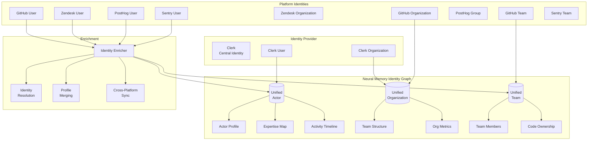
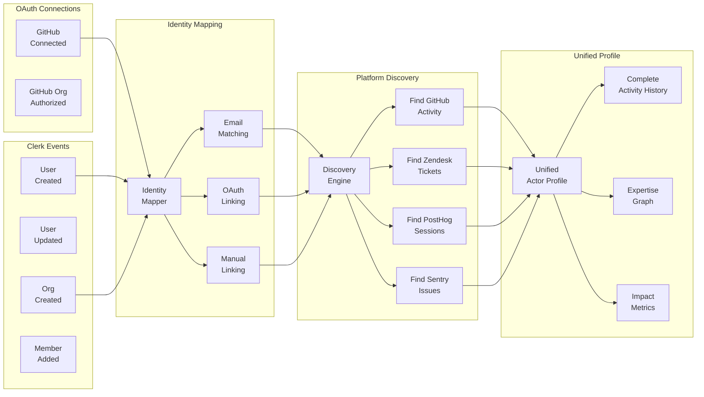
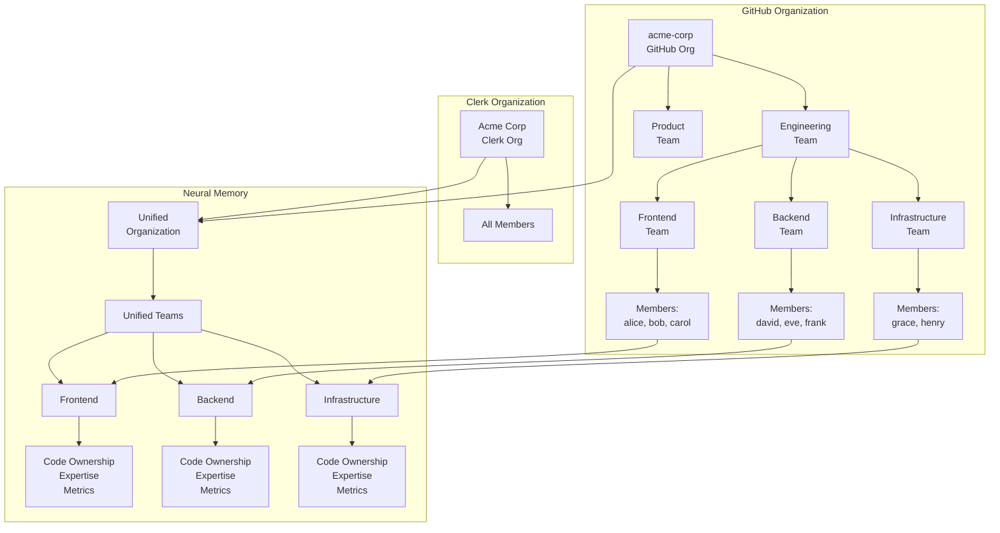
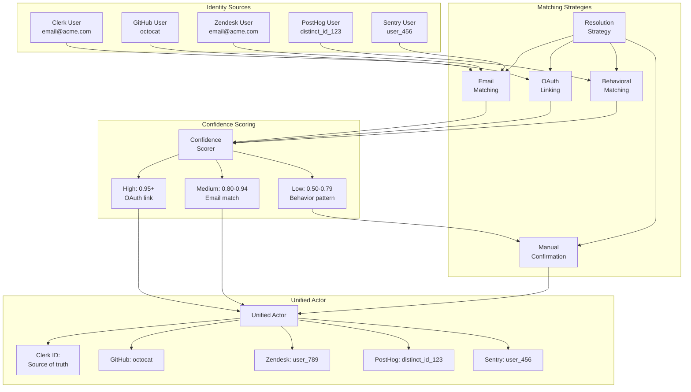
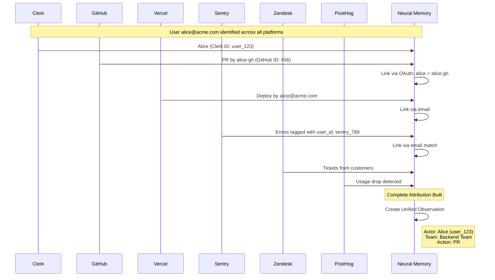

# Neural Memory Identity Layer: Unified Actor & Organization Architecture

Last Updated: 2025-11-27

This document defines the Identity Layer that unifies users and organizations across all systems (Clerk, GitHub, Zendesk, PostHog, Sentry) creating a complete actor graph for attribution, expertise tracking, and organizational intelligence.

---

## Identity Architecture Overview



---

## Clerk Integration Architecture

### User Identity Flow



### Clerk → Neural Memory Mapping

```typescript
interface ClerkUser {
  id: string;
  emailAddresses: EmailAddress[];
  externalAccounts: {
    provider: 'oauth_github' | 'oauth_google';
    providerUserId: string;
    username?: string;
  }[];
  organizationMemberships: {
    organization: {
      id: string;
      name: string;
      slug: string;
    };
    role: 'admin' | 'member';
  }[];
}

interface UnifiedActor {
  // Clerk as source of truth
  clerkId: string;
  primaryEmail: string;
  displayName: string;

  // Linked platform identities
  identities: {
    github?: {
      userId: number;
      username: string;
      teams: string[];
      organizations: string[];
    };
    zendesk?: {
      userId: number;
      email: string;
    };
    posthog?: {
      distinctId: string;
      anonymousId?: string;
    };
    sentry?: {
      userId: string;
      username: string;
    };
  };

  // Organization context
  organizations: {
    clerkOrgId: string;
    name: string;
    role: string;
    githubOrg?: string;
    teams: string[];
  }[];

  // Unified profile
  profile: ActorProfile;
  expertise: ExpertiseMap;
  activityTimeline: ActivityEvent[];
}
```

---

## GitHub Team & Organization Structure

### Team Hierarchy Mapping



### GitHub Team Context Enrichment

```typescript
interface GitHubTeamContext {
  team: {
    id: number;
    name: string;
    slug: string;
    description: string;
    privacy: 'secret' | 'closed' | 'open';
  };

  organization: {
    id: number;
    login: string;
    name: string;
  };

  members: {
    userId: number;
    username: string;
    role: 'member' | 'maintainer';
    clerkId?: string; // Resolved via OAuth or email
  }[];

  codeOwnership: {
    repositories: {
      name: string;
      ownedPaths: string[];
      codeownersRules: CodeownersRule[];
    }[];
  };

  metrics: {
    prCount: number;
    reviewCount: number;
    commitCount: number;
    activeMembers: number;
  };
}

interface UnifiedTeam {
  id: string;
  name: string;

  // Source mappings
  sources: {
    github?: {
      teamId: number;
      slug: string;
    };
    clerk?: {
      // Custom metadata if teams in Clerk
      metadata?: Record<string, any>;
    };
  };

  // Members with unified actor IDs
  members: {
    actorId: string; // Unified actor ID
    role: string;
    joinedAt: Date;
  }[];

  // Team intelligence
  expertise: {
    technologies: string[];
    domains: string[];
    codeAreas: string[];
  };

  ownership: {
    repositories: string[];
    services: string[];
    features: string[];
  };

  metrics: {
    velocity: number;
    quality: number;
    collaboration: number;
    customerImpact: number;
  };
}
```

---

## Identity Resolution Pipeline

### Multi-Source Identity Matching



### Identity Resolution Implementation

```typescript
class IdentityResolver {
  /**
   * Resolve identity across all platforms
   */
  async resolve(clerkUser: ClerkUser): Promise<UnifiedActor> {
    const identities = await Promise.all([
      this.resolveGitHub(clerkUser),
      this.resolveZendesk(clerkUser),
      this.resolvePostHog(clerkUser),
      this.resolveSentry(clerkUser)
    ]);

    // Build unified actor
    const actor: UnifiedActor = {
      clerkId: clerkUser.id,
      primaryEmail: clerkUser.primaryEmailAddress,
      displayName: clerkUser.fullName || clerkUser.username,
      identities: this.mergeIdentities(identities),
      organizations: await this.resolveOrganizations(clerkUser),
      profile: await this.buildProfile(clerkUser, identities),
      expertise: await this.calculateExpertise(identities),
      activityTimeline: await this.buildTimeline(identities)
    };

    return actor;
  }

  /**
   * Resolve GitHub identity
   */
  private async resolveGitHub(clerkUser: ClerkUser): Promise<GitHubIdentity> {
    // Strategy 1: OAuth connection (highest confidence)
    const oauthAccount = clerkUser.externalAccounts.find(
      a => a.provider === 'oauth_github'
    );

    if (oauthAccount) {
      const ghUser = await github.getUser(oauthAccount.providerUserId);
      const teams = await github.getUserTeams(ghUser.id);
      const orgs = await github.getUserOrganizations(ghUser.id);

      return {
        userId: ghUser.id,
        username: ghUser.login,
        teams: teams.map(t => t.slug),
        organizations: orgs.map(o => o.login),
        confidence: 1.0,
        method: 'oauth'
      };
    }

    // Strategy 2: Email matching (medium confidence)
    const email = clerkUser.primaryEmailAddress?.emailAddress;
    if (email) {
      const ghUser = await github.searchUserByEmail(email);
      if (ghUser) {
        return {
          userId: ghUser.id,
          username: ghUser.login,
          teams: await github.getUserTeams(ghUser.id),
          organizations: await github.getUserOrganizations(ghUser.id),
          confidence: 0.85,
          method: 'email_match'
        };
      }
    }

    // Strategy 3: Username matching (low confidence)
    if (clerkUser.username) {
      const ghUser = await github.getUser(clerkUser.username);
      if (ghUser) {
        return {
          userId: ghUser.id,
          username: ghUser.login,
          teams: [],
          organizations: [],
          confidence: 0.60,
          method: 'username_match',
          requiresConfirmation: true
        };
      }
    }

    return null;
  }

  /**
   * Resolve PostHog identity
   */
  private async resolvePostHog(clerkUser: ClerkUser): Promise<PostHogIdentity> {
    const email = clerkUser.primaryEmailAddress?.emailAddress;

    // Search by email
    const persons = await posthog.searchPersons({ email });

    if (persons.length === 1) {
      return {
        distinctId: persons[0].distinct_id,
        confidence: 0.90,
        method: 'email_match'
      };
    }

    // Multiple matches - use behavioral analysis
    if (persons.length > 1) {
      const bestMatch = await this.findBestPostHogMatch(
        clerkUser,
        persons
      );

      return {
        distinctId: bestMatch.distinct_id,
        confidence: 0.75,
        method: 'behavioral_match',
        requiresConfirmation: true
      };
    }

    return null;
  }

  /**
   * Behavioral matching for PostHog
   */
  private async findBestPostHogMatch(
    clerkUser: ClerkUser,
    candidates: PostHogPerson[]
  ): Promise<PostHogPerson> {
    // Score each candidate based on behavioral signals
    const scores = await Promise.all(
      candidates.map(async person => {
        let score = 0;

        // Check if user properties match
        if (person.properties.name === clerkUser.fullName) score += 0.3;
        if (person.properties.username === clerkUser.username) score += 0.3;

        // Check temporal patterns (activity during Clerk account creation)
        const activityNearCreation = await this.checkActivityNearDate(
          person,
          clerkUser.createdAt
        );
        if (activityNearCreation) score += 0.2;

        // Check organization match
        if (clerkUser.organizationMemberships.length > 0) {
          const orgMatch = await this.checkOrgMatch(
            person,
            clerkUser.organizationMemberships[0].organization
          );
          if (orgMatch) score += 0.2;
        }

        return { person, score };
      })
    );

    // Return highest scoring match
    const best = scores.reduce((max, curr) =>
      curr.score > max.score ? curr : max
    );

    return best.person;
  }
}
```

---

## Unified Actor Profile

### Complete Actor Intelligence

```mermaid
graph TB
    subgraph "Identity Core"
        ACTOR[Unified Actor]
        ACTOR --> BASIC[Basic Info<br/>Name, Email, Avatar]
        ACTOR --> LINKS[Platform Links<br/>GitHub, Zendesk, etc.]
    end

    subgraph "Engineering Intelligence"
        ENG[Engineering<br/>Profile]

        ENG --> CODE[Code Expertise]
        CODE --> LANG[Languages:<br/>TypeScript, Python]
        CODE --> AREAS[Code Areas:<br/>payments, auth]
        CODE --> FILES[File Ownership:<br/>src/payments/*]

        ENG --> COLLAB[Collaboration]
        COLLAB --> REVIEWS[Review Stats]
        COLLAB --> MENTORS[Mentorship]
        COLLAB --> TEAMS_ENG[Team Dynamics]
    end

    subgraph "Customer Intelligence"
        CUST[Customer<br/>Profile]

        CUST --> SUPPORT[Support Stats]
        SUPPORT --> TICKETS[Tickets Created]
        SUPPORT --> SATISFACTION[CSAT Scores]

        CUST --> PRODUCT[Product Usage]
        PRODUCT --> FEATURES[Features Used]
        PRODUCT --> ENGAGEMENT[Engagement Level]
    end

    subgraph "Impact Intelligence"
        IMPACT[Impact<br/>Metrics]

        IMPACT --> TECH[Technical Impact]
        TECH --> DEPLOYS[Deployments]
        TECH --> QUALITY[Code Quality]
        TECH --> INCIDENTS[Incidents Caused/Fixed]

        IMPACT --> BIZ[Business Impact]
        BIZ --> REVENUE[Revenue Contribution]
        BIZ --> CONVERSION[Conversion Impact]
        BIZ --> RETENTION[Retention Impact]
    end

    ACTOR --> ENG
    ACTOR --> CUST
    ACTOR --> IMPACT
```



### Actor Profile Schema

```typescript
interface UnifiedActorProfile {
  // Identity
  actorId: string;
  actorType: 'engineer' | 'customer' | 'hybrid';

  // Basic info
  name: string;
  email: string;
  avatar: string;
  timezone: string;

  // Platform identities
  identities: {
    clerk: { id: string; role: string; };
    github?: { username: string; userId: number; };
    zendesk?: { userId: number; };
    posthog?: { distinctId: string; };
    sentry?: { userId: string; };
  };

  // Organization context
  organizations: {
    id: string;
    name: string;
    role: string;
    teams: {
      id: string;
      name: string;
      role: string;
    }[];
  }[];

  // Engineering profile (if engineer)
  engineering?: {
    expertise: {
      languages: { name: string; proficiency: number; }[];
      frameworks: { name: string; proficiency: number; }[];
      domains: { name: string; expertise: number; }[];
      codeAreas: { path: string; ownership: number; }[];
    };

    activity: {
      prsMerged: number;
      reviewsGiven: number;
      commitsCount: number;
      linesChanged: number;
      filesChanged: number;
    };

    collaboration: {
      frequentCollaborators: string[]; // Actor IDs
      reviewerQuality: number;
      responseTime: number;
      mentorshipScore: number;
    };

    quality: {
      bugRate: number;
      testCoverage: number;
      documentationScore: number;
      codeReviewScore: number;
    };
  };

  // Customer profile (if customer/hybrid)
  customer?: {
    supportHistory: {
      ticketsCreated: number;
      avgSatisfaction: number;
      avgResolutionTime: number;
      topIssues: string[];
    };

    productUsage: {
      featuresUsed: string[];
      engagementScore: number;
      adoptionRate: number;
      churnRisk: number;
    };

    feedback: {
      featureRequests: number;
      bugReports: number;
      positiveComments: number;
      negativeComments: number;
    };
  };

  // Impact metrics
  impact: {
    technical: {
      deployments: number;
      deploymentsSuccessRate: number;
      incidentsCaused: number;
      incidentsFixed: number;
      performanceImpact: number;
    };

    business: {
      revenueImpact: number;
      conversionImpact: number;
      retentionImpact: number;
      customerSatisfactionImpact: number;
    };

    team: {
      knowledgeSharing: number;
      collaborationScore: number;
      leadershipScore: number;
    };
  };

  // Timeline
  activityTimeline: {
    date: Date;
    type: 'code' | 'review' | 'deploy' | 'incident' | 'support' | 'usage';
    description: string;
    impact: number;
    sources: string[];
  }[];

  // Metadata
  createdAt: Date;
  updatedAt: Date;
  lastActivityAt: Date;
}
```

---

## Organization Intelligence

### Team Performance & Ownership

```typescript
interface UnifiedOrganization {
  id: string;
  name: string;

  // Source mappings
  sources: {
    clerk: { orgId: string; };
    github: { orgId: number; login: string; };
  };

  // Team structure
  teams: {
    id: string;
    name: string;
    type: 'engineering' | 'product' | 'support' | 'cross-functional';

    members: {
      actorId: string;
      role: string;
      joinedAt: Date;
    }[];

    // Team ownership
    ownership: {
      repositories: {
        name: string;
        ownership: number; // 0-1
        paths: string[];
      }[];

      features: {
        name: string;
        status: 'active' | 'deprecated';
      }[];

      services: {
        name: string;
        uptime: number;
      }[];
    };

    // Team metrics
    metrics: {
      velocity: {
        prsMerged: number;
        storiesCompleted: number;
        trendDirection: 'up' | 'stable' | 'down';
      };

      quality: {
        bugRate: number;
        testCoverage: number;
        incidentRate: number;
      };

      collaboration: {
        reviewThroughput: number;
        knowledgeSharing: number;
        crossTeamWork: number;
      };

      customerImpact: {
        featureAdoption: number;
        supportTickets: number;
        satisfaction: number;
      };
    };

    // Team expertise
    expertise: {
      technologies: { name: string; proficiency: number; }[];
      domains: { name: string; expertise: number; }[];
      businessAreas: string[];
    };
  }[];

  // Organization-wide metrics
  metrics: {
    engineering: {
      totalPRs: number;
      deploymentFrequency: number;
      mttr: number;
      changeFailureRate: number;
    };

    customer: {
      totalTickets: number;
      avgSatisfaction: number;
      churnRate: number;
    };

    business: {
      activeUsers: number;
      conversionRate: number;
      featureAdoptionRate: number;
    };
  };
}
```

---

## Cross-Platform Attribution

### Example: Complete Incident Attribution



---

## Query Capabilities with Identity Layer

### Powerful Queries Enabled

```typescript
// 1. Find all work by an actor across all platforms
async function getActorCompleteHistory(clerkId: string) {
  const actor = await getUnifiedActor(clerkId);

  return {
    code: await getGitHubActivity(actor.identities.github),
    deployments: await getVercelDeployments(actor.identities.github),
    errors: await getSentryIssues(actor.identities.sentry),
    supportTickets: await getZendeskTickets(actor.identities.zendesk),
    productUsage: await getPostHogActivity(actor.identities.posthog)
  };
}

// 2. Find team performance metrics
async function getTeamMetrics(teamSlug: string) {
  const team = await getUnifiedTeam(teamSlug);
  const members = await getTeamMembers(team.id);

  return {
    engineering: {
      prsPerWeek: sumByMember(members, m => m.activity.prsMerged),
      deployFrequency: sumByMember(members, m => m.impact.technical.deployments),
      incidentRate: sumByMember(members, m => m.impact.technical.incidentsCaused)
    },
    customerImpact: {
      supportTickets: await getTeamSupportLoad(team),
      satisfaction: await getTeamSatisfactionScore(team),
      featureAdoption: await getTeamFeatureAdoption(team)
    }
  };
}

// 3. Find expertise for a code area
async function findExpertise(codeArea: string) {
  const experts = await db.query(`
    SELECT actor, expertise_score
    FROM actor_expertise
    WHERE code_area LIKE $1
    ORDER BY expertise_score DESC
    LIMIT 10
  `, [codeArea]);

  return experts.map(e => ({
    actor: await getUnifiedActor(e.actor),
    expertiseScore: e.expertise_score,
    recentActivity: await getRecentActivity(e.actor, codeArea)
  }));
}

// 4. Trace an incident to root cause with full actor context
async function traceIncident(incidentId: string) {
  const incident = await getObservation(incidentId);

  // Get all related events
  const events = await getRelatedEvents(incident);

  // Build complete actor timeline
  const actorsInvolved = await getInvolvedActors(events);

  return {
    rootCause: {
      pr: events.find(e => e.type === 'pr_merged'),
      author: actorsInvolved.find(a => a.role === 'author'),
      reviewers: actorsInvolved.filter(a => a.role === 'reviewer')
    },
    impact: {
      errors: events.filter(e => e.type === 'sentry_error'),
      affectedCustomers: await getAffectedCustomers(incident),
      businessImpact: await calculateBusinessImpact(incident)
    },
    timeline: buildActorTimeline(actorsInvolved, events)
  };
}

// 5. Find similar past incidents by actor
async function findSimilarIncidentsByActor(actorId: string) {
  const actor = await getUnifiedActor(actorId);

  // Find all incidents this actor was involved in
  const incidents = await db.query(`
    SELECT o.*
    FROM observations o
    JOIN observation_actors oa ON o.id = oa.observation_id
    WHERE oa.actor_id = $1
    AND o.type = 'incident'
    ORDER BY o.occurred_at DESC
  `, [actorId]);

  // Group by pattern
  return groupByPattern(incidents, {
    codeArea: true,
    errorType: true,
    customerImpact: true
  });
}
```

---

## Implementation: Clerk Webhook Handlers

```typescript
// api/console/src/inngest/workflow/identity/clerk-user-sync.ts
export const clerkUserSync = inngest.createFunction(
  {
    id: "identity.clerk.user.sync",
    concurrency: { limit: 10, key: "event.data.userId" }
  },
  { event: "clerk/user.created" },
  async ({ event, step }) => {
    const { userId } = event.data;

    // Step 1: Get Clerk user data
    const clerkUser = await step.run("fetch-clerk-user", async () => {
      return await clerkClient.users.getUser(userId);
    });

    // Step 2: Resolve GitHub identity (if connected)
    const githubIdentity = await step.run("resolve-github", async () => {
      const oauthAccount = clerkUser.externalAccounts.find(
        a => a.provider === 'oauth_github'
      );

      if (!oauthAccount) return null;

      // Fetch GitHub user data
      const ghUser = await github.users.getByUsername({
        username: oauthAccount.username
      });

      // Fetch teams and orgs
      const [teams, orgs] = await Promise.all([
        github.teams.listForAuthenticatedUser(),
        github.orgs.listForAuthenticatedUser()
      ]);

      return {
        userId: ghUser.data.id,
        username: ghUser.data.login,
        teams: teams.data.map(t => ({ id: t.id, slug: t.slug, name: t.name })),
        organizations: orgs.data.map(o => ({ id: o.id, login: o.login }))
      };
    });

    // Step 3: Resolve other platform identities
    const [zendeskIdentity, posthogIdentity, sentryIdentity] = await Promise.all([
      step.run("resolve-zendesk", async () => {
        return await resolveZendeskIdentity(clerkUser.primaryEmailAddress);
      }),
      step.run("resolve-posthog", async () => {
        return await resolvePostHogIdentity(clerkUser.primaryEmailAddress);
      }),
      step.run("resolve-sentry", async () => {
        return await resolveSentryIdentity(clerkUser.primaryEmailAddress);
      })
    ]);

    // Step 4: Create/update unified actor
    const actor = await step.run("create-unified-actor", async () => {
      return await db.insert(unifiedActors).values({
        id: generateActorId(),
        clerkId: userId,
        primaryEmail: clerkUser.primaryEmailAddress.emailAddress,
        displayName: clerkUser.fullName || clerkUser.username,
        identities: {
          github: githubIdentity,
          zendesk: zendeskIdentity,
          posthog: posthogIdentity,
          sentry: sentryIdentity
        },
        createdAt: new Date()
      }).onConflictDoUpdate({
        target: [unifiedActors.clerkId],
        set: {
          identities: sql`identities || ${JSON.stringify({
            github: githubIdentity,
            zendesk: zendeskIdentity,
            posthog: posthogIdentity,
            sentry: sentryIdentity
          })}`,
          updatedAt: new Date()
        }
      }).returning();
    });

    // Step 5: Build initial profile
    if (githubIdentity) {
      await step.sendEvent("build-profile", {
        name: "identity/profile.build",
        data: {
          actorId: actor[0].id,
          sources: ['github']
        }
      });
    }

    // Step 6: Sync historical data
    await step.sendEvent("sync-historical", {
      name: "identity/history.sync",
      data: {
        actorId: actor[0].id,
        sources: Object.keys(actor[0].identities)
      }
    });

    return {
      success: true,
      actorId: actor[0].id,
      identitiesResolved: Object.keys(actor[0].identities).length
    };
  }
);
```

---

## Key Benefits of Identity Layer

### 1. **Complete Context**
Every observation has full actor context:
- Who made the change
- What team they're on
- Their expertise level
- Past similar incidents

### 2. **Cross-Platform Attribution**
Single view of impact:
- Code change → Deployment → Errors → Support tickets → Usage impact
- All attributed to correct actors and teams

### 3. **Organizational Intelligence**
Understand team dynamics:
- Team performance metrics
- Code ownership clarity
- Expertise mapping
- Collaboration patterns

### 4. **Powerful Queries**
Enable questions like:
- "Show me all work by the payments team this month"
- "Who's the expert in the authentication system?"
- "Which team's changes are causing the most customer issues?"
- "What's the customer satisfaction impact of the frontend team?"

### 5. **Predictive Insights**
Historical actor data enables:
- Risk prediction based on author history
- Quality prediction based on team metrics
- Impact prediction based on past patterns

---

## Conclusion

The Identity Layer creates a unified actor graph that:

1. **Connects people across platforms** - Single identity across GitHub, Zendesk, PostHog, Sentry
2. **Understands organizational structure** - Teams, ownership, expertise
3. **Enables complete attribution** - Every change traced to people and impact
4. **Powers intelligent queries** - Find expertise, trace incidents, measure impact
5. **Builds team intelligence** - Performance, collaboration, customer impact metrics

This transforms Neural Memory from an event tracking system into a complete organizational intelligence platform that understands not just *what* happened, but *who* did it, *why* it matters, and *how* it impacted customers.