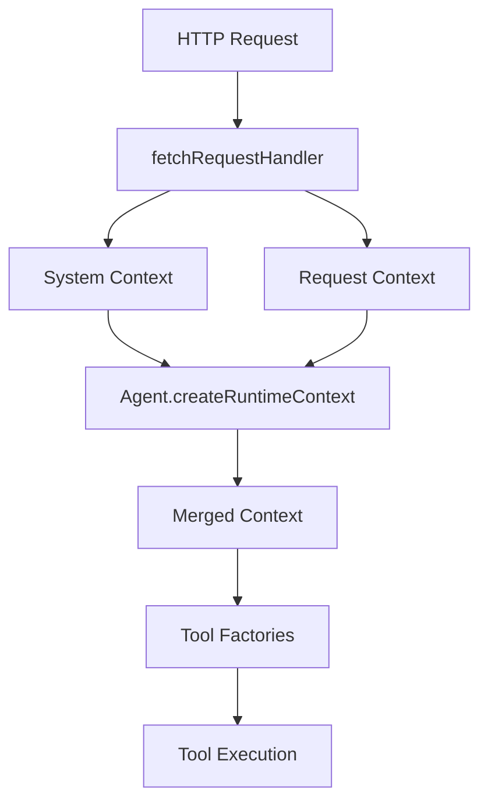

# Tool Factories

Tool factories are functions that create tools with access to runtime context. This pattern enables secure, context-aware tool execution without global state or manual parameter passing.

## Understanding Tool Factories

Traditional tools receive only their direct inputs:

```typescript
// Traditional tool - no context access
const tool = tool({
  execute: async ({ query }) => {
    // No access to user ID, session, etc.
    return search(query);
  },
});
```

Tool factories receive runtime context:

```typescript
// Tool factory - full context access
const toolFactory = createTool({
  execute: async ({ query }, context) => {
    // Access to userId, sessionId, and more
    return search(query, { userId: context.userId });
  },
});
```

## The createTool Function

The `createTool` function creates tool factories:

```typescript
import { createTool } from "@lightfastai/core/tool";
import { z } from "zod";

export const myTool = createTool<RuntimeContext>({
  description: "Tool description",
  inputSchema: z.object({
    // Input validation schema
  }),
  outputSchema: z.object({
    // Optional output schema
  }),
  execute: async (input, context) => {
    // Implementation with context access
  },
});
```

## Runtime Context Flow

Context flows from the request through to tool execution:



### Context Layers

1. **System Context** - Framework-provided
```typescript
{ sessionId: string, resourceId: string }
```

2. **Request Context** - From HTTP handler
```typescript
{ userAgent?: string, ipAddress?: string }
```

3. **Runtime Context** - Agent-specific
```typescript
{ /* your custom fields */ }
```

## Creating Tool Factories

### Basic Tool Factory

```typescript
import { createTool } from "@lightfastai/core/tool";
import { z } from "zod";

interface AppContext {
  userId: string;
  sessionId: string;
  permissions: string[];
}

export const databaseQueryTool = createTool<AppContext>({
  description: "Query the database",
  inputSchema: z.object({
    table: z.string(),
    query: z.string(),
  }),
  execute: async ({ table, query }, context) => {
    // Check permissions using context
    if (!context.permissions.includes(`read:${table}`)) {
      return { error: "Permission denied" };
    }
    
    // Execute query with user context
    const results = await db.query({
      sql: query,
      userId: context.userId,
      auditLog: true,
    });
    
    return { results };
  },
});
```

### Stateful Tool Factory

Tools can maintain session state:

```typescript
export const shoppingCartTool = createTool<AppContext>({
  description: "Manage shopping cart",
  inputSchema: z.object({
    action: z.enum(["add", "remove", "view", "checkout"]),
    productId: z.string().optional(),
    quantity: z.number().optional(),
  }),
  execute: async ({ action, productId, quantity }, context) => {
    // Use session-scoped cart
    const cartKey = `cart:${context.sessionId}`;
    
    switch (action) {
      case "add":
        await redis.hset(cartKey, productId!, quantity!);
        return { added: productId, quantity };
        
      case "remove":
        await redis.hdel(cartKey, productId!);
        return { removed: productId };
        
      case "view":
        const items = await redis.hgetall(cartKey);
        return { items };
        
      case "checkout":
        // Use userId for checkout
        const orderId = await createOrder({
          userId: context.userId,
          items: await redis.hgetall(cartKey),
        });
        await redis.del(cartKey); // Clear cart
        return { orderId };
    }
  },
});
```

### Conditional Tool Factory

Tools can adapt based on context:

```typescript
export const searchTool = createTool<AppContext>({
  description: "Search for information",
  inputSchema: z.object({
    query: z.string(),
    filters: z.record(z.string()).optional(),
  }),
  execute: async ({ query, filters }, context) => {
    // Different search capabilities based on user
    const searchConfig = {
      query,
      filters,
      // Premium users get more results
      limit: context.isPremium ? 50 : 10,
      // Premium users can search all content
      scope: context.isPremium ? "all" : "public",
      // Track usage by user
      userId: context.userId,
    };
    
    const results = await searchEngine.search(searchConfig);
    
    // Log usage for analytics
    await analytics.track("search", {
      userId: context.userId,
      query,
      resultCount: results.length,
      isPremium: context.isPremium,
    });
    
    return { results };
  },
});
```

## Tool Factory Sets

Organize related tool factories:

```typescript
// Define your runtime context type
interface AppRuntimeContext {
  userId: string;
  sessionId: string;
  environment: "development" | "production";
  features: {
    advancedSearch: boolean;
    export: boolean;
  };
}

// Create a set of tool factories
export const appTools = {
  // File operations
  fileWrite: createTool<AppRuntimeContext>({
    description: "Write a file",
    inputSchema: z.object({
      path: z.string(),
      content: z.string(),
    }),
    execute: async ({ path, content }, context) => {
      const fullPath = `users/${context.userId}/${path}`;
      await storage.write(fullPath, content);
      return { path: fullPath };
    },
  }),
  
  fileRead: createTool<AppRuntimeContext>({
    description: "Read a file",
    inputSchema: z.object({
      path: z.string(),
    }),
    execute: async ({ path }, context) => {
      const fullPath = `users/${context.userId}/${path}`;
      const content = await storage.read(fullPath);
      return { content };
    },
  }),
  
  // Conditional tools based on features
  ...(process.env.ENABLE_SEARCH && {
    search: createTool<AppRuntimeContext>({
      description: "Search content",
      inputSchema: z.object({
        query: z.string(),
      }),
      execute: async ({ query }, context) => {
        if (!context.features.advancedSearch) {
          return { error: "Advanced search not enabled" };
        }
        return await search(query);
      },
    }),
  }),
};

// Use in agent
const agent = createAgent({
  tools: appTools,
  createRuntimeContext: ({ sessionId, resourceId }): AppRuntimeContext => ({
    userId: resourceId,
    sessionId,
    environment: process.env.NODE_ENV as "development" | "production",
    features: {
      advancedSearch: checkFeature(resourceId, "advancedSearch"),
      export: checkFeature(resourceId, "export"),
    },
  }),
});
```

## Dynamic Tool Selection

Select tools based on runtime conditions:

```typescript
const agent = createAgent({
  tools: (context) => {
    // Base tools available to everyone
    const baseTools = {
      search: searchTool,
      help: helpTool,
    };
    
    // Add tools based on user role
    if (context.role === "admin") {
      return {
        ...baseTools,
        userManagement: userManagementTool,
        systemConfig: systemConfigTool,
        analytics: analyticsTool,
      };
    }
    
    if (context.role === "developer") {
      return {
        ...baseTools,
        codeExecution: codeExecutionTool,
        deployment: deploymentTool,
        monitoring: monitoringTool,
      };
    }
    
    // Regular users get base tools only
    return baseTools;
  },
  
  createRuntimeContext: ({ resourceId }) => ({
    role: getUserRole(resourceId),
  }),
});
```

## Wrapped Tool Execution

Add cross-cutting concerns to tool execution:

```typescript
import { wrapTraced, currentSpan } from "braintrust";

// Wrap with observability
const tracedExecute = wrapTraced(
  async function execute(input: any, context: AppRuntimeContext) {
    // Log to tracing span
    currentSpan().log({
      metadata: {
        toolName: "myTool",
        userId: context.userId,
        sessionId: context.sessionId,
        input,
      },
    });
    
    try {
      // Tool logic
      const result = await performOperation(input);
      
      currentSpan().log({
        output: result,
        success: true,
      });
      
      return result;
    } catch (error) {
      currentSpan().log({
        error: error.message,
        stack: error.stack,
      });
      throw error;
    }
  }
);

export const observableTool = createTool<AppRuntimeContext>({
  description: "Tool with observability",
  inputSchema: schema,
  execute: tracedExecute,
});
```

## Tool Composition Patterns

### Pipeline Pattern

Chain tools together:

```typescript
export const analysisPipeline = createTool<AppRuntimeContext>({
  description: "Complete analysis pipeline",
  inputSchema: z.object({
    dataSource: z.string(),
  }),
  execute: async ({ dataSource }, context) => {
    // Step 1: Fetch data
    const fetchTool = fetchDataTool(context);
    const { data } = await fetchTool.execute({ source: dataSource });
    
    // Step 2: Clean data
    const cleanTool = cleanDataTool(context);
    const { cleaned } = await cleanTool.execute({ data });
    
    // Step 3: Analyze
    const analyzeTool = analyzeDataTool(context);
    const { insights } = await analyzeTool.execute({ data: cleaned });
    
    // Step 4: Generate report
    const reportTool = generateReportTool(context);
    const { report } = await reportTool.execute({ insights });
    
    return { report, insights };
  },
});
```

### Delegation Pattern

Tools that delegate to other tools:

```typescript
export const smartQueryTool = createTool<AppRuntimeContext>({
  description: "Intelligently route queries",
  inputSchema: z.object({
    query: z.string(),
    type: z.enum(["structured", "semantic", "hybrid"]).optional(),
  }),
  execute: async ({ query, type }, context) => {
    // Determine query type if not specified
    const queryType = type || detectQueryType(query);
    
    switch (queryType) {
      case "structured":
        // Use SQL tool for structured queries
        const sqlTool = sqlQueryTool(context);
        return sqlTool.execute({ query });
        
      case "semantic":
        // Use vector search for semantic queries
        const vectorTool = vectorSearchTool(context);
        return vectorTool.execute({ query });
        
      case "hybrid":
        // Combine both approaches
        const [sqlResults, vectorResults] = await Promise.all([
          sqlQueryTool(context).execute({ query }),
          vectorSearchTool(context).execute({ query }),
        ]);
        
        return mergeResults(sqlResults, vectorResults);
    }
  },
});
```

### Retry Pattern

Add retry logic to tools:

```typescript
export const resilientApiTool = createTool<AppRuntimeContext>({
  description: "Call external API with retries",
  inputSchema: z.object({
    endpoint: z.string(),
    data: z.any(),
  }),
  execute: async ({ endpoint, data }, context) => {
    const maxRetries = 3;
    const backoffMs = 1000;
    
    for (let attempt = 1; attempt <= maxRetries; attempt++) {
      try {
        const response = await fetch(endpoint, {
          method: "POST",
          body: JSON.stringify(data),
          headers: {
            "X-User-Id": context.userId,
            "X-Attempt": attempt.toString(),
          },
        });
        
        if (response.ok) {
          return await response.json();
        }
        
        // Retry on 5xx errors
        if (response.status >= 500 && attempt < maxRetries) {
          await new Promise(resolve => 
            setTimeout(resolve, backoffMs * attempt)
          );
          continue;
        }
        
        // Don't retry client errors
        return {
          error: `API error: ${response.status}`,
        };
      } catch (error) {
        if (attempt === maxRetries) {
          return {
            error: `Failed after ${maxRetries} attempts: ${error.message}`,
          };
        }
        
        await new Promise(resolve => 
          setTimeout(resolve, backoffMs * attempt)
        );
      }
    }
  },
});
```

## Security Patterns

### Permission Checking

```typescript
export const secureTool = createTool<AppRuntimeContext>({
  description: "Security-aware tool",
  inputSchema: z.object({
    operation: z.enum(["read", "write", "delete"]),
    resource: z.string(),
  }),
  execute: async ({ operation, resource }, context) => {
    // Check permissions
    const hasPermission = await checkPermission({
      userId: context.userId,
      operation,
      resource,
    });
    
    if (!hasPermission) {
      return {
        error: "Permission denied",
        required: `${operation}:${resource}`,
      };
    }
    
    // Audit log
    await auditLog({
      userId: context.userId,
      operation,
      resource,
      timestamp: Date.now(),
      sessionId: context.sessionId,
    });
    
    // Execute operation
    return performSecureOperation({ operation, resource });
  },
});
```

### Input Sanitization

```typescript
export const safeTool = createTool<AppRuntimeContext>({
  description: "Tool with input sanitization",
  inputSchema: z.object({
    userInput: z.string(),
    format: z.enum(["html", "markdown", "plain"]),
  }),
  execute: async ({ userInput, format }, context) => {
    // Sanitize based on format
    let sanitized: string;
    
    switch (format) {
      case "html":
        sanitized = sanitizeHtml(userInput, {
          allowedTags: ["p", "br", "strong", "em"],
          allowedAttributes: {},
        });
        break;
        
      case "markdown":
        sanitized = sanitizeMarkdown(userInput);
        break;
        
      case "plain":
        sanitized = stripHtml(userInput);
        break;
    }
    
    // Process sanitized input
    return processInput(sanitized, context);
  },
});
```

## Testing Tool Factories

### Unit Testing

```typescript
import { describe, it, expect } from "vitest";

describe("searchTool", () => {
  it("should respect user permissions", async () => {
    const mockContext: AppRuntimeContext = {
      userId: "test-user",
      sessionId: "test-session",
      isPremium: false,
    };
    
    // Create tool with context
    const tool = searchTool(mockContext);
    
    // Execute tool
    const result = await tool.execute({
      query: "test query",
    });
    
    // Assert limited results for non-premium
    expect(result.results).toHaveLength(10);
  });
  
  it("should provide extended results for premium users", async () => {
    const premiumContext: AppRuntimeContext = {
      userId: "premium-user",
      sessionId: "test-session",
      isPremium: true,
    };
    
    const tool = searchTool(premiumContext);
    const result = await tool.execute({
      query: "test query",
    });
    
    // Premium users can get more results
    expect(result.results.length).toBeLessThanOrEqual(50);
  });
});
```

### Integration Testing

```typescript
describe("Tool Factory Integration", () => {
  it("should work with agent", async () => {
    const agent = createAgent({
      name: "test-agent",
      system: "Test system",
      model: testModel,
      tools: {
        search: searchTool,
      },
      createRuntimeContext: ({ resourceId }) => ({
        userId: resourceId,
        sessionId: "test",
        isPremium: true,
      }),
    });
    
    const { result } = await agent.stream({
      sessionId: "test",
      messages: [{ role: "user", content: "Search for TypeScript" }],
      memory: new InMemoryMemory(),
      resourceId: "test-user",
      systemContext: { sessionId: "test", resourceId: "test-user" },
      requestContext: {},
    });
    
    // Verify tool was called with context
    expect(result).toBeDefined();
  });
});
```

## Best Practices

### 1. Type Your Context
Always define and use typed context:

```typescript
// Good - typed context
interface MyContext {
  userId: string;
  permissions: string[];
}

const tool = createTool<MyContext>({
  execute: async (input, context) => {
    // context is fully typed
  },
});

// Bad - untyped context
const tool = createTool({
  execute: async (input, context: any) => {
    // No type safety
  },
});
```

### 2. Validate Context
Check context validity:

```typescript
execute: async (input, context) => {
  // Validate required context
  if (!context.userId) {
    return { error: "User not authenticated" };
  }
  
  if (!context.sessionId) {
    return { error: "Session required" };
  }
  
  // Proceed with valid context
}
```

### 3. Handle Errors Gracefully
Return errors as data, not exceptions:

```typescript
// Good - return error data
execute: async (input, context) => {
  try {
    const result = await riskyOperation();
    return { success: true, data: result };
  } catch (error) {
    return { 
      success: false, 
      error: error.message,
      retry: true,
    };
  }
}

// Less ideal - throwing errors
execute: async (input, context) => {
  const result = await riskyOperation(); // May throw
  return result;
}
```

### 4. Document Context Requirements
Be clear about what context is needed:

```typescript
/**
 * Search tool requiring authenticated context
 * 
 * Required context fields:
 * - userId: Authenticated user ID
 * - sessionId: Current session
 * - permissions: Array including "search" permission
 */
export const searchTool = createTool<AppContext>({
  description: "Search with user context",
  // ...
});
```

## Next Steps

- Learn about [Streaming](/agent-development/streaming) for real-time responses
- Explore [Memory Adapters](/memory-state/memory-adapters) for state management
- See [Creating Agents](/agent-development/creating-agents) for complete examples