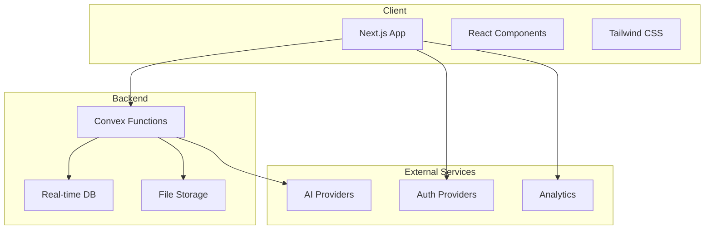

# Architecture Overview

Lightfast Chat is built with a modern, scalable architecture that prioritizes performance, developer experience, and maintainability.

## High-Level Architecture



## Core Technologies

### Frontend Stack

- **Next.js 15**: React framework with App Router
- **React 19**: UI library with server components
- **TypeScript**: Type-safe development
- **Tailwind CSS v4**: Utility-first styling
- **shadcn/ui**: Component library
- **Biome**: Linting and formatting

### Backend Stack

- **Convex**: Real-time backend platform
- **Edge Functions**: Serverless compute
- **WebSockets**: Real-time updates
- **File Storage**: Integrated file handling

### Infrastructure

- **Vercel**: Hosting and deployment
- **Turborepo**: Monorepo management
- **Bun**: Fast JavaScript runtime
- **GitHub Actions**: CI/CD pipeline

## Project Structure

### Monorepo Organization

```
lightfast-chat/
├── apps/
│   ├── www/                 # Main application
│   │   ├── src/
│   │   │   ├── app/        # Next.js app router
│   │   │   ├── components/ # React components
│   │   │   └── lib/        # Utilities
│   │   ├── convex/         # Backend functions
│   │   └── public/         # Static assets
│   └── docs/               # Documentation site
├── packages/
│   └── ui/                 # Shared UI library
├── scripts/                # Build scripts
└── turbo.json             # Turborepo config
```

### Key Directories

#### `/apps/www/src/app`
Next.js App Router pages and layouts:
- Route-based code splitting
- Server and client components
- Metadata and SEO optimization

#### `/apps/www/src/components`
Organized React components:
- `chat/`: Chat-specific components
- `auth/`: Authentication components
- `ui/`: Base UI components

#### `/apps/www/convex`
Backend functions and schema:
- Database queries and mutations
- Real-time subscriptions
- File handling
- External API integrations

## Data Flow

### Message Flow

1. **User Input**: Message entered in UI
2. **Optimistic Update**: Immediate UI update
3. **Convex Mutation**: Send to backend
4. **AI Processing**: Stream from provider
5. **Real-time Sync**: Update all clients

```typescript
// Simplified message flow
const sendMessage = useMutation(api.messages.send)

async function handleSend(content: string) {
  // Optimistic update
  setMessages(prev => [...prev, optimisticMessage])
  
  // Send to backend
  const message = await sendMessage({ content })
  
  // AI responds via subscription
  // Real-time updates via Convex
}
```

### Authentication Flow

1. **OAuth Request**: User clicks sign in
2. **Provider Auth**: GitHub/Google OAuth
3. **JWT Generation**: Create session token
4. **Convex Auth**: Validate and store
5. **Client Session**: Maintain auth state

## Design Patterns

### Component Patterns

**Compound Components**
```typescript
<Chat>
  <Chat.Messages />
  <Chat.Input />
  <Chat.Controls />
</Chat>
```

**Render Props**
```typescript
<DataProvider
  render={(data) => <MessageList messages={data} />}
/>
```

**Custom Hooks**
```typescript
const { messages, send, loading } = useChat(conversationId)
```

### State Management

**Local State**: Component-specific state
```typescript
const [isOpen, setIsOpen] = useState(false)
```

**Convex State**: Shared application state
```typescript
const messages = useQuery(api.messages.list)
```

**URL State**: Navigation and sharing
```typescript
const params = useSearchParams()
const model = params.get("model")
```

### Error Handling

**Error Boundaries**
```typescript
<ErrorBoundary fallback={<ErrorFallback />}>
  <ChatInterface />
</ErrorBoundary>
```

**Try-Catch Patterns**
```typescript
try {
  await sendMessage(content)
} catch (error) {
  toast.error("Failed to send message")
  captureException(error)
}
```

## Performance Optimization

### Build-Time Optimization

- **Code Splitting**: Automatic with App Router
- **Tree Shaking**: Remove unused code
- **Minification**: Compress JavaScript
- **Image Optimization**: Next.js Image component

### Runtime Optimization

- **Streaming SSR**: Progressive rendering
- **Partial Prerendering**: Static + dynamic
- **React Suspense**: Loading states
- **Memoization**: Prevent re-renders

### Caching Strategy

```typescript
// Static assets: 1 year
Cache-Control: public, max-age=31536000, immutable

// API responses: 5 minutes
Cache-Control: private, max-age=300

// Real-time data: No cache
Cache-Control: no-store
```

## Security Architecture

### Authentication

- **JWT Tokens**: Secure session management
- **OAuth 2.0**: Third-party authentication
- **RBAC**: Role-based access control
- **Session Validation**: Server-side checks

### Data Protection

- **Input Validation**: Sanitize user input
- **XSS Prevention**: Content security policy
- **CSRF Protection**: Token validation
- **Rate Limiting**: Prevent abuse

### API Security

```typescript
// Convex function with auth
export const sendMessage = mutation({
  args: { content: v.string() },
  handler: async (ctx, args) => {
    const identity = await ctx.auth.getUserIdentity()
    if (!identity) throw new Error("Unauthorized")
    
    // Validate and process...
  },
})
```

## Scalability Considerations

### Horizontal Scaling

- **Stateless Design**: No server state
- **Edge Deployment**: Global distribution
- **Load Balancing**: Automatic with Vercel
- **Database Sharding**: Handled by Convex

### Performance Metrics

- **TTFB**: < 200ms target
- **LCP**: < 2.5s target
- **FID**: < 100ms target
- **CLS**: < 0.1 target

### Monitoring

```typescript
// Performance monitoring
export function measurePerformance() {
  if (typeof window !== "undefined") {
    const navigation = performance.getEntriesByType("navigation")[0]
    const paint = performance.getEntriesByType("paint")
    
    analytics.track("performance", {
      ttfb: navigation.responseStart - navigation.fetchStart,
      fcp: paint.find(p => p.name === "first-contentful-paint")?.startTime,
      // ... more metrics
    })
  }
}
```

## Development Workflow

### Local Development

1. **Hot Reload**: Instant updates
2. **Type Safety**: TypeScript validation
3. **Error Overlay**: Development errors
4. **DevTools**: React and Redux tools

### CI/CD Pipeline

```yaml
# Simplified GitHub Actions workflow
name: CI/CD
on: [push, pull_request]

jobs:
  test:
    - run: bun install
    - run: bun run typecheck
    - run: bun run lint
    - run: bun test
    
  deploy:
    - run: vercel deploy --prod
```

### Deployment Strategy

1. **Preview Deployments**: Every PR
2. **Staging Environment**: Pre-production
3. **Production Deployment**: Main branch
4. **Rollback Strategy**: Instant reverts

## Integration Points

### AI Provider Integration

```typescript
// Abstracted AI provider interface
interface AIProvider {
  generateResponse(prompt: string): AsyncGenerator<string>
  validateApiKey(key: string): Promise<boolean>
}

// Provider implementations
class AnthropicProvider implements AIProvider { }
class OpenAIProvider implements AIProvider { }
```

### External Services

- **Analytics**: PostHog, Google Analytics
- **Error Tracking**: Sentry
- **File Storage**: Uploadthing
- **Search**: Algolia (optional)

## Future Architecture

### Planned Improvements

1. **Edge Computing**: Move more logic to edge
2. **Offline Support**: Service workers
3. **WebAssembly**: Performance-critical code
4. **Micro-frontends**: Modular architecture

### Scaling Roadmap

1. **Multi-region**: Global deployment
2. **Read Replicas**: Database scaling
3. **CDN Integration**: Asset delivery
4. **Queue System**: Background jobs

## Best Practices

### Code Organization

- **Feature-based**: Group by feature
- **Barrel Exports**: Clean imports
- **Shared Types**: Single source of truth
- **Consistent Naming**: Clear conventions

### Testing Strategy

- **Unit Tests**: Business logic
- **Integration Tests**: API endpoints
- **E2E Tests**: Critical paths
- **Performance Tests**: Load testing

### Documentation

- **Code Comments**: Complex logic
- **Type Documentation**: Public APIs
- **README Files**: Module overview
- **Architecture Decisions**: ADRs

## Next Steps

- Explore [Technical Stack](/docs/architecture/tech-stack) details
- Review [Convex Architecture](/docs/architecture/convex)
- Understand [Development Setup](/docs/setup)
- Learn about [Contributing](/docs/contributing)