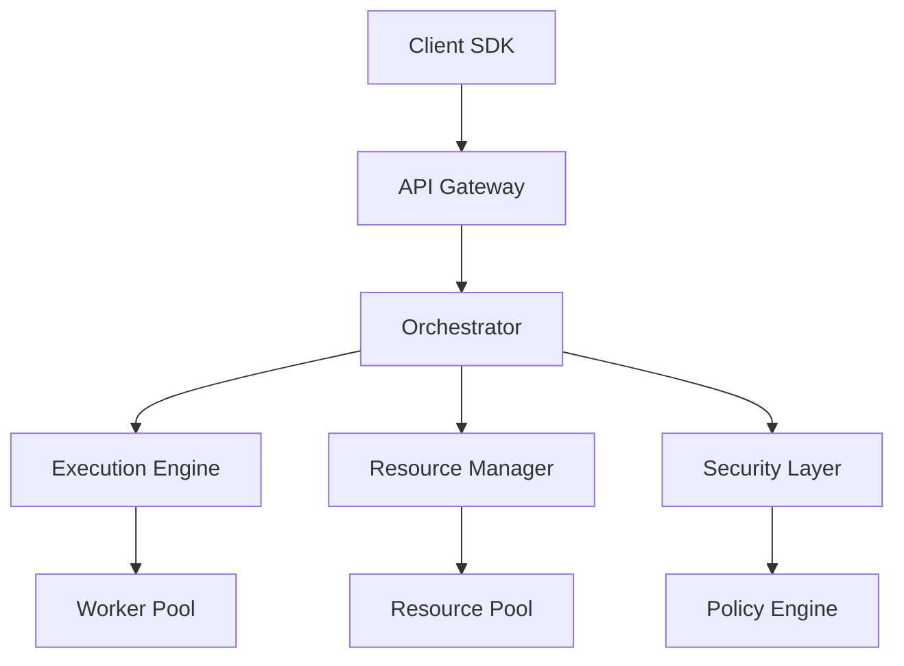

# System Architecture

Lightfast's architecture is designed for scale, reliability, and developer experience. This document provides a comprehensive overview of our system components and how they work together.

## High-Level Overview



## Core Components

### API Gateway

The entry point for all client requests. Responsibilities include:
- **Authentication & Authorization**: Validates API keys and permissions
- **Rate Limiting**: Enforces usage quotas and prevents abuse
- **Request Routing**: Directs requests to appropriate services
- **Response Caching**: Improves performance for repeated queries

### Orchestrator

The brain of the system that coordinates all operations:
- **Task Scheduling**: Determines execution order and timing
- **Load Balancing**: Distributes work across available resources
- **State Management**: Maintains agent and workflow state
- **Error Recovery**: Handles failures and implements retry logic

### Execution Engine

Where agent code actually runs:
- **Sandboxed Environments**: Isolated execution contexts
- **Tool Integration**: Manages tool calls and responses
- **Memory Management**: Handles context and conversation history
- **Performance Monitoring**: Tracks execution metrics

## Technical Deep Dive

### State Machine Implementation

Our state machine engine uses a deterministic finite automaton (DFA) model:

```typescript
type State = 'idle' | 'running' | 'waiting' | 'completed' | 'failed';

interface Transition {
  from: State;
  to: State;
  condition: (context: Context) => boolean;
  action?: (context: Context) => void;
}
```

This ensures predictable behavior and enables features like pause/resume and debugging.

### Resource Scheduling Algorithm

We use a modified token bucket algorithm for resource allocation:

1. Each resource type has a configurable capacity
2. Requests consume tokens based on estimated usage
3. Tokens regenerate at a configured rate
4. Priority queuing ensures critical tasks execute first

### Security Architecture

Multi-layered security approach:
- **Network Layer**: TLS 1.3, certificate pinning
- **Application Layer**: Input validation, output sanitization
- **Runtime Layer**: Process isolation, capability restrictions
- **Data Layer**: Encryption at rest, key rotation

## Performance Characteristics

### Latency Targets
- API Response: < 100ms p99
- Task Start: < 500ms p95
- Tool Call: < 1s p90

### Scalability
- Horizontal scaling up to 10,000 concurrent agents
- Automatic sharding for large workloads
- Geographic distribution for global reach

### Reliability
- 99.99% uptime SLA
- Automatic failover and recovery
- Data replication across regions

## Deployment Architecture

### Cloud Native Design

Built on Kubernetes for portability and scale:

```yaml
apiVersion: apps/v1
kind: Deployment
metadata:
  name: lightfast-engine
spec:
  replicas: 3
  selector:
    matchLabels:
      app: engine
  template:
    spec:
      containers:
      - name: engine
        image: lightfast/engine:latest
        resources:
          requests:
            memory: "1Gi"
            cpu: "500m"
          limits:
            memory: "2Gi"
            cpu: "1000m"
```

### Multi-Region Strategy

Active-active deployment across regions:
- US East (Primary)
- US West (Secondary)
- EU Central (GDPR compliance)
- APAC (Low latency for Asia)

## Integration Points

### External Services

Lightfast integrates with various external services:
- **LLM Providers**: OpenAI, Anthropic, Google
- **Cloud Storage**: S3, GCS, Azure Blob
- **Databases**: PostgreSQL, MongoDB, Redis
- **Monitoring**: Datadog, Prometheus, Grafana

### Webhook System

Event-driven architecture for real-time updates:

```typescript
interface WebhookEvent {
  type: 'agent.started' | 'agent.completed' | 'agent.failed';
  timestamp: Date;
  payload: Record<string, any>;
  signature: string; // HMAC-SHA256
}
```

## Monitoring & Observability

### Metrics Collection

Comprehensive metrics for system health:
- Request rate and latency
- Resource utilization
- Error rates and types
- Agent execution times

### Distributed Tracing

End-to-end visibility with OpenTelemetry:
- Request flow visualization
- Performance bottleneck identification
- Cross-service correlation

### Logging Architecture

Structured logging with contextual information:

```json
{
  "timestamp": "2024-01-10T10:30:00Z",
  "level": "INFO",
  "service": "execution-engine",
  "trace_id": "abc123",
  "agent_id": "agent-456",
  "message": "Tool execution completed",
  "duration_ms": 234
}
```

## Conclusion

Lightfast's architecture balances performance, reliability, and developer experience. Our modular design enables rapid iteration while maintaining production stability.