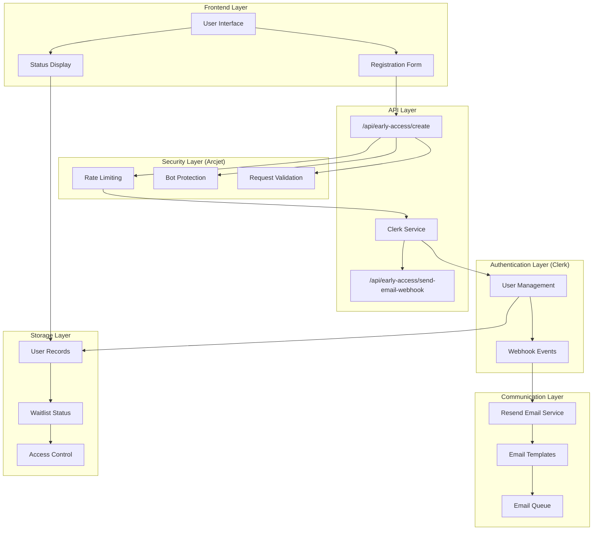
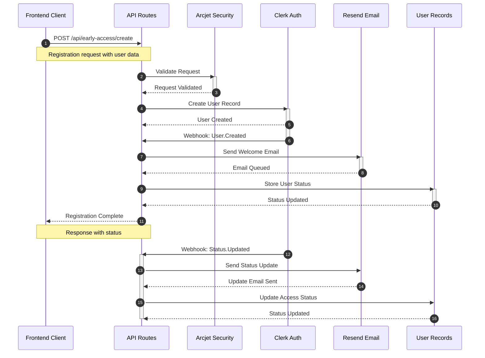

# React TD - Marketing & Early Access Portal

## Overview

The `www` package serves as the marketing and early access portal for React TD. Built with Next.js 15.3 and React 19, it implements a modern, secure, and performant architecture for handling early access registrations and user management.

## Key Features

- Early Access Registration System
- Automated Email Communications
- Secure User Authentication
- Analytics Integration
- Rate Limiting and Security Controls

## Architecture

### Tech Stack Updates

- Next.js 15.3 with TypeScript configuration
- React 19 with Server Components
- Enhanced type safety with Zod 3.24.0
- Updated environment variable handling with @t3-oss/env-nextjs 0.12.0

### Core Components

#### Authentication & User Management

- Integration with Clerk for secure authentication
- Webhook handling for user events
- Type-safe environment configuration

#### Email System

- Resend email integration for transactional emails
- Templated communications for:
  - Early access confirmations
  - Waitlist updates
  - Access grant notifications

#### Security Layer

- Arcjet integration for:
  - Rate limiting
  - Bot protection
  - Request validation
- Enhanced security headers
- CORS configuration

### Implementation Structure

```
src/
├── app/
│   └── (early-access)/
│       └── api/
│           └── early-access/
│               ├── create/           # Early access registration endpoint
│               └── send-email-webhook/ # Webhook handler for email notifications
├── lib/
│   └── email.ts                     # Email client configuration
├── config/                          # Configuration files
├── components/                      # React components
└── env.ts                          # Environment configuration
```

### System Architecture & Data Flow



### Implementation Flow



### Core Implementation Details

#### 1. Environment Configuration

```typescript
// env.ts
export const env = createEnv({
  extends: [
    vercel(),
    clerkEnvWithWebhook, // Auth with webhook support
    securityEnv, // Arcjet security
    emailEnv, // Resend email service
  ],
  // ... configuration
});
```

#### 2. Registration Flow

- User submits early access request through `/api/early-access/create`
- Request validation by Arcjet security layer
- User record creation in Clerk
- Confirmation email via Resend

#### 3. Webhook Processing

- Webhook events from Clerk to `/api/early-access/send-email-webhook`
- Email notification triggers
- Access status updates

#### 4. Security Implementation

- Rate limiting and bot protection via Arcjet
- Authentication state management through Clerk
- Type-safe environment variables
- Protected API routes

#### 5. Communication System

- Email service configuration via Resend
- Templated communications for:
  - Registration confirmation
  - Waitlist status updates
  - Access grant notifications

### Data Flow

1. **Early Access Registration**

   ```mermaid
   graph TD
   A[User Registration] --> B[Arcjet Security Check]
   B --> C[Clerk Auth Flow]
   C --> D[Webhook Event]
   D --> E[Email Notification]
   D --> F[Analytics Event]
   ```

2. **Webhook Processing**
   - Clerk webhook events trigger automated workflows
   - Event validation and processing
   - User status updates
   - Email notifications

## Configuration

### Environment Variables

Updated type-safe environment configuration using @t3-oss/env-nextjs:

```typescript
// Example env.ts structure
import { createEnv } from "@t3-oss/env-nextjs";
import { z } from "zod";

export const env = createEnv({
  server: {
    CLERK_SECRET_KEY: z.string(),
    RESEND_API_KEY: z.string(),
    ARCJET_API_KEY: z.string(),
  },
  client: {
    NEXT_PUBLIC_CLERK_PUBLISHABLE_KEY: z.string(),
  },
  runtimeEnv: process.env,
});
```

### Next.js Configuration

Using TypeScript for Next.js configuration:

```typescript
// next.config.ts
const config: NextConfig = {
  reactStrictMode: true,
  transpilePackages: [
    "@repo/ui",
    "@vendor/security",
    "@vendor/analytics",
    "@vendor/email",
    "@vendor/clerk",
  ],
};
```

## Development

### Prerequisites

- Node.js 20.x
- pnpm 8.x

### Setup

```bash
# Install dependencies
pnpm install

# Run development server
pnpm dev

# Build for production
pnpm build
```

### Environment Setup

Create a `.env` file with the following variables:

```bash
NEXT_PUBLIC_CLERK_PUBLISHABLE_KEY=pk_test_...
CLERK_SECRET_KEY=sk_test_...
RESEND_API_KEY=re_...
ARCJET_API_KEY=aj_...
```

## Testing

The application includes comprehensive testing:

- Unit tests for core functionality
- Integration tests for API endpoints
- E2E tests for critical user flows

## Deployment

The application is configured for deployment on Vercel with:

- Edge Runtime support
- Automated CI/CD pipeline
- Environment variable validation
- Build-time type checking

## Security Considerations

- All API routes are protected with Arcjet rate limiting
- Authentication state is managed securely through Clerk
- Environment variables are strictly typed and validated
- Security headers are configured for production
- CORS is properly configured for API routes

## Monitoring & Analytics

- Integration with analytics for user tracking
- Error monitoring and reporting
- Performance metrics collection
- User engagement tracking

## Dependencies

### Core

- next: ^15.3.0
- react: ^19.0.0
- react-dom: ^19.0.0
- @t3-oss/env-nextjs: ^0.12.0
- zod: ^3.24.0

### Vendor Packages

- @vendor/clerk: Authentication
- @vendor/email: Email service (Resend)
- @vendor/security: Security layer (Arcjet)
- @vendor/analytics: Analytics integration

## Contributing

Please refer to the main repository's contributing guidelines.

## License

This package is private and part of the React TD monorepo.
