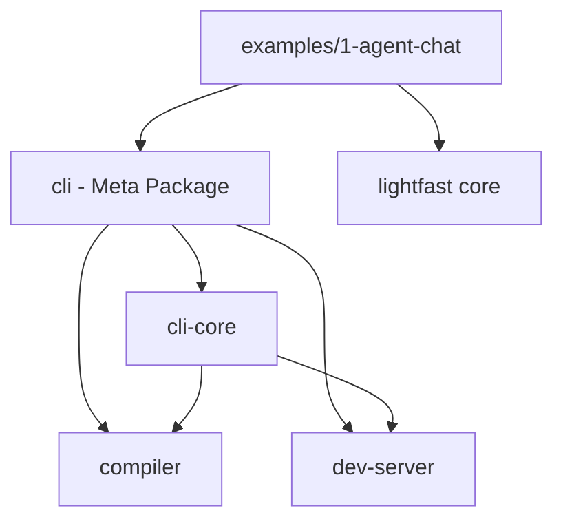

# Lightfast CLI Architecture

This document describes the modular CLI architecture, build processes, and development workflows for the Lightfast CLI ecosystem.

## Architecture Overview

The Lightfast CLI is built as a modular system with clean separation of concerns:

```
core/
├── cli/                    # 📦 Meta package (publishable)
├── cli-core/              # 🧠 Core CLI logic & commands  
├── compiler/              # ⚙️ TypeScript compilation engine
└── dev-server/            # 🌐 Development server (TanStack Start)
```

### Package Dependencies



**Note:** Currently both `cli` and `cli-core` depend on `compiler` and `dev-server`, creating duplicate dependencies. This works but could be optimized by making `cli` depend only on `cli-core`.

## Package Details

### 1. `@lightfastai/cli` (Meta Package)
**Purpose:** Lightweight publishable package that delegates to cli-core  
**Size:** ~100 bytes  
**Dependencies:** `@lightfastai/cli-core`, `@lightfastai/compiler`, `@lightfastai/dev-server` (all workspace packages)

```typescript
// core/cli/src/index.ts
#!/usr/bin/env node
import '@lightfastai/cli-core'
```

**Key Files:**
- `src/index.ts` - Simple delegation entry point
- `package.json` - Clean dependencies, publishing config
- `tsup.config.ts` - Minimal build with shebang injection

### 2. `@lightfastai/cli-core` (Core Logic)
**Purpose:** Contains all CLI commands, logic, and orchestration  
**Commands:** `dev`, `compile`, `clean`

```typescript
// core/cli-core/src/index.ts
import { Command } from 'commander'
import { devCommand } from './commands/dev.js'
import { compileCommand } from './commands/compile.js'  
import { cleanCommand } from './commands/clean.js'

const program = new Command()
  .name('@lightfastai/cli')
  .addCommand(devCommand)
  .addCommand(compileCommand) 
  .addCommand(cleanCommand)
```

**Key Files:**
- `src/commands/dev.ts` - Development server orchestration
- `src/commands/compile.ts` - TypeScript compilation commands
- `src/commands/clean.ts` - Build artifact cleanup
- `src/utils/package.ts` - Package info utilities

### 3. `@lightfastai/compiler` (Compilation Engine)
**Purpose:** TypeScript compilation with caching and bundling

```typescript
// Usage in cli-core
import { createCompiler, createConfigWatcher } from '@lightfastai/compiler'

const compiler = createCompiler({
  entryPoint: 'lightfast.config.ts',
  outputPath: '.lightfast/',
  watch: true
})

const result = await compiler.compile()
```

**Key Files:**
- `src/index.ts` - Main compiler API
- `src/transpiler.ts` - esbuild-based TypeScript transpilation
- `src/cache.ts` - File-based compilation caching
- `src/watcher.ts` - File watching and hot reload
- `src/error-formatter.ts` - Pretty error formatting

### 4. `@lightfastai/dev-server` (Development Server)
**Purpose:** TanStack Start-based web UI for agent management

**Key Files:**
- `src/app.tsx` - Main React application
- `src/routes/` - TanStack Router routes
- `src/routes/api/agents.ts` - Agent listing API
- `src/routes/api/agents.$agentId.ts` - Individual agent API  
- `src/routes/api/hot-reload.ts` - Hot reload API
- `src/server/agent-discovery.ts` - Agent introspection
- `vite.config.ts` - Vite configuration

## Development Workflow

### Adding New CLI Commands

1. **Create command in cli-core:**
```typescript
// core/cli-core/src/commands/my-command.ts
import { Command } from 'commander'

export const myCommand = new Command('my-command')
  .description('My new command')
  .option('-f, --flag', 'Example flag')
  .action(async (options) => {
    // Command implementation
  })
```

2. **Register in main CLI:**
```typescript
// core/cli-core/src/index.ts
import { myCommand } from './commands/my-command.js'
program.addCommand(myCommand)
```

3. **Build and test:**
```bash
cd core/cli-core && pnpm build
cd ../cli && pnpm build
cd ../../examples/1-agent-chat && node ../../core/cli/dist/index.js my-command --help
```

### Adding Compiler Features

1. **Extend compiler API:**
```typescript
// core/compiler/src/index.ts
export interface CompilerOptions {
  entryPoint: string
  outputPath: string
  minify?: boolean      // New option
  sourcemap?: boolean   // New option
}
```

2. **Update transpiler:**
```typescript
// core/compiler/src/transpiler.ts
const buildOptions: BuildOptions = {
  // ... existing options
  minify: options.minify ?? false,
  sourcemap: options.sourcemap ?? true
}
```

3. **Test compilation:**
```bash
cd core/compiler && pnpm build
cd ../../examples/1-agent-chat && node ../../core/cli/dist/index.js compile --help
```

### Adding Dev Server Features

1. **Add new route:**
```typescript
// core/dev-server/src/routes/my-route.tsx
import { createFileRoute } from '@tanstack/react-router'

export const Route = createFileRoute('/my-route')({
  component: MyComponent
})

function MyComponent() {
  return <div>My new feature</div>
}
```

2. **Add API endpoint:**
```typescript
// core/dev-server/src/routes/api/my-api.ts
import { createAPIFileRoute } from '@tanstack/react-start/api'

export const Route = createAPIFileRoute('/api/my-api')({
  GET: async ({ request }) => {
    return Response.json({ data: 'my-data' })
  }
})
```

3. **Test server:**
```bash
cd core/dev-server && pnpm build
cd ../../examples/1-agent-chat && node ../../core/cli/dist/index.js dev --port 3001
```

## Build Process

### Individual Package Builds

```bash
# Build specific packages
cd core/compiler && pnpm build     # TypeScript + bundling
cd core/dev-server && pnpm build   # Vite build (SSG + SSR)
cd core/cli-core && pnpm build     # CLI bundling with shebang
cd core/cli && pnpm build          # Meta package (delegates)
```

### Complete Build Pipeline

```bash
# 1. Build all packages in dependency order
pnpm --filter @lightfastai/compiler build
pnpm --filter @lightfastai/dev-server build  
pnpm --filter @lightfastai/cli-core build
pnpm --filter @lightfastai/cli build

# 2. Or use workspace command
pnpm build  # Turbo handles dependency order
```

### Build Outputs

```
core/cli/dist/index.js              # #!/usr/bin/env node + delegation
core/cli-core/dist/index.js         # CLI commands bundle  
core/compiler/dist/                 # Compiler API + utilities
core/dev-server/.output/             # TanStack Start SSG/SSR build
```

## Integration with Examples

### Setting Up New Example

1. **Create example project:**
```bash
mkdir examples/my-example
cd examples/my-example
pnpm init
```

2. **Add CLI dependency:**
```json
{
  "dependencies": {
    "@lightfastai/cli": "file:../../core/cli",
    "lightfast": "file:../../core/lightfast"
  },
  "scripts": {
    "dev": "cli dev",
    "compile": "cli compile"
  }
}
```

3. **Create lightfast.config.ts:**
```typescript
// examples/my-example/lightfast.config.ts
import { createLightfast } from "lightfast/client"
import { createAgent } from "lightfast/agent"

const myAgent = createAgent({
  name: "my-agent",
  system: "You are a helpful assistant",
  model: gateway("claude-3-5-sonnet-20241022")
})

export default createLightfast({
  agents: { myAgent },
  metadata: { name: "My Example" }
})
```

### Testing Integration

```bash
# From example directory
cd examples/my-example

# Test compilation
node ../../core/cli/dist/index.js compile
# ✔ Compiled lightfast.config.ts in 12.08ms

# Test dev server  
node ../../core/cli/dist/index.js dev --port 3001
# ✔ Lightfast server started at http://localhost:3001

# Test agent API
curl http://localhost:3001/api/agents
# {"success":true,"data":{"agents":[...]}}

# Test cleanup
node ../../core/cli/dist/index.js clean --cache
# ✔ Cleaned .lightfast cache
```

### Modular Agent Organization

Create `agents/` directory for better organization:

```typescript
// agents/my-agent.ts
import { createAgent } from "lightfast/agent"
export const myAgent = createAgent({ ... })

// lightfast.config.ts  
import { myAgent } from "./agents/my-agent.js"
export default createLightfast({ agents: { myAgent } })
```

## Testing & Debugging

### Manual Testing Workflow

```bash
# 1. Build packages
pnpm --filter @lightfastai/cli build

# 2. Test from example
cd examples/1-agent-chat
node ../../core/cli/dist/index.js --help
node ../../core/cli/dist/index.js dev --port 3001

# 3. Debug with verbose output
DEBUG=1 node ../../core/cli/dist/index.js dev
```

### Common Issues & Solutions

**Issue:** `@lightfastai/dev-server not found`  
**Solution:** Check workspace path resolution in `core/cli-core/src/commands/dev.ts:162`

**Issue:** TypeScript compilation errors  
**Solution:** Verify agent imports use `.js` extensions: `./agents/my-agent.js`

**Issue:** Dev server React errors  
**Solution:** These are often non-critical TanStack Start hydration issues

### Package Publishing

```bash
# 1. Build all packages
pnpm build

# 2. Test meta package
cd core/cli
npm pack --dry-run

# 3. Publish (when ready)
npm publish  # Only the meta package needs publishing
```

## Key Design Principles

1. **Modular Architecture** - Each package has single responsibility
2. **Clean Dependencies** - Meta package imports workspace packages  
3. **Developer Experience** - Simple `cli dev` command hides complexity
4. **Production Ready** - Optimized builds with proper error handling
5. **Extensible** - Easy to add commands, compiler features, and UI routes

## Architecture Optimization

### Current Dependency Issue

The current dependency structure creates duplication:
```json
// core/cli/package.json - Meta package
"dependencies": {
  "@lightfastai/cli-core": "workspace:*",
  "@lightfastai/compiler": "workspace:*",      // Duplicate
  "@lightfastai/dev-server": "workspace:*"    // Duplicate
}

// core/cli-core/package.json - Core package  
"dependencies": {
  "@lightfastai/compiler": "workspace:*",      // Duplicate
  "@lightfastai/dev-server": "workspace:*"    // Duplicate  
}
```

### Recommended Fix

For cleaner architecture, the meta package should only depend on cli-core:

```json
// core/cli/package.json - Optimized
"dependencies": {
  "@lightfastai/cli-core": "workspace:*"      // Only direct dependency
}
```

This would:
- Reduce published package size
- Eliminate duplicate dependencies
- Create cleaner separation of concerns
- Match the originally intended architecture

## File Structure Reference

```
core/
├── cli/                           # Meta package (publishable)
│   ├── src/index.ts              # Delegation entry point  
│   ├── package.json              # Clean dependencies
│   └── tsup.config.ts            # Build with shebang
├── cli-core/                     # Core CLI logic
│   ├── src/
│   │   ├── commands/             # CLI command implementations
│   │   ├── utils/               # Shared utilities  
│   │   └── index.ts            # Commander.js setup
│   └── package.json            # Depends on compiler + dev-server
├── compiler/                    # Compilation engine
│   ├── src/
│   │   ├── index.ts            # Main compiler API
│   │   ├── transpiler.ts       # esbuild integration
│   │   ├── cache.ts           # File-based caching
│   │   └── watcher.ts         # File watching
│   └── package.json           # esbuild, chokidar deps
└── dev-server/                # Development server
    ├── src/
    │   ├── routes/            # TanStack Router routes
    │   ├── server/           # Server-side utilities
    │   └── app.tsx          # React application
    ├── vite.config.ts       # Vite configuration
    └── package.json         # React, TanStack deps
```

This architecture enables rapid development while maintaining clean separation of concerns and excellent developer experience.