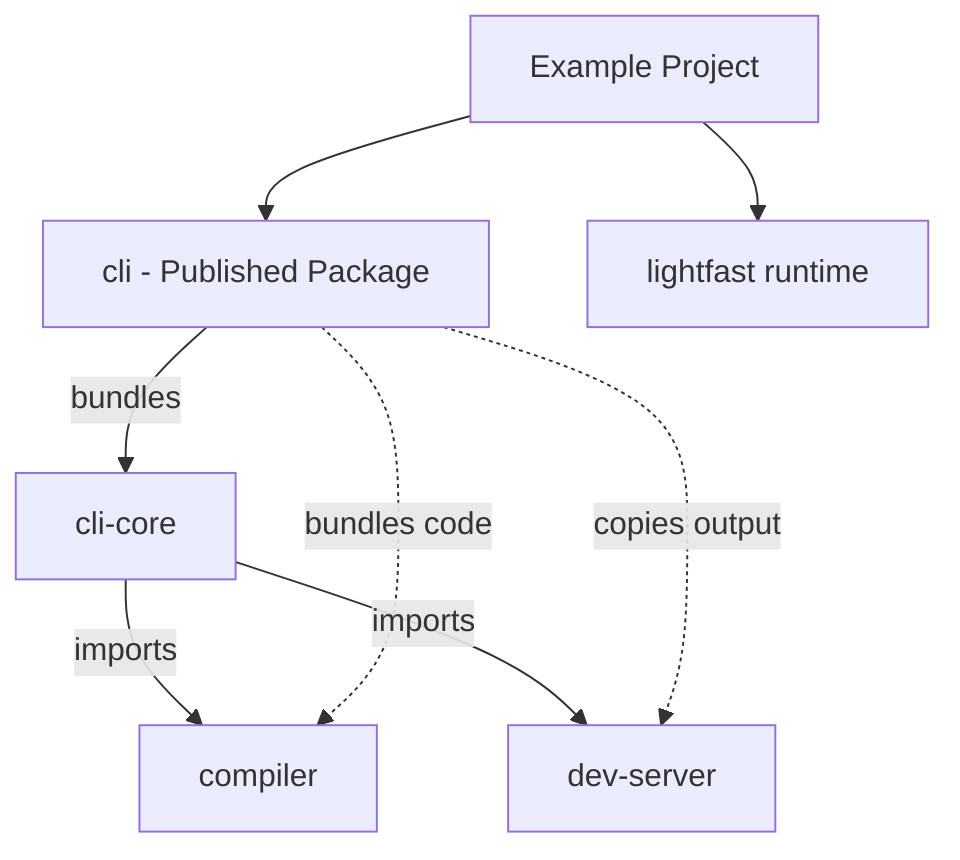

# Lightfast Core Architecture

This document describes the complete architecture, build system, and development workflows for the Lightfast Core packages.

## 🏗️ Architecture Overview

The Lightfast Core is organized as a monorepo with multiple packages that work together to provide a complete CLI solution:

```
core/
├── cli/                    # 📦 Published CLI package (bundles everything)
├── cli-core/              # 🧠 Core CLI logic & commands  
├── compiler/              # ⚙️ TypeScript compilation engine
├── dev-server/            # 🌐 Development server (React UI)
└── lightfast/             # 🚀 Core Lightfast runtime
```

### Package Status (as of 2025-08-30)
- ✅ **cli**: Builds and bundles successfully
- ✅ **cli-core**: All commands working (dev, compile, clean)
- ✅ **compiler**: Compiles and caches TypeScript configs
- ✅ **dev-server**: React UI builds and serves correctly
- ⚠️ **lightfast**: Runtime builds but DTS generation disabled due to type error

## 📊 Package Dependency Graph



## 🔨 Build System

### Build Order & Dependencies

The packages must be built in a specific order due to their dependencies:

1. **compiler** → No workspace dependencies, builds first
2. **cli-core** → Depends on compiler, builds second  
3. **dev-server** → Independent React app, builds third
4. **cli** → Bundles everything, builds last

### Complete Build Process

The CLI package includes a sophisticated build script (`scripts/build-all.js`) that handles the entire build pipeline:

```bash
# From core/cli directory
pnpm build

# This executes:
# 1. Clean all previous builds (ensures fresh state)
# 2. Build @lightfastai/compiler → dist/
# 3. Build @lightfastai/cli-core → dist/
# 4. Build @lightfastai/dev-server → .output/
# 5. Bundle CLI with everything → dist/

# Build lightfast runtime separately (required for examples)
cd ../lightfast && pnpm build
```

### Build Outputs

```
core/
├── compiler/dist/          # Compiled TypeScript compiler
├── cli-core/dist/         # Compiled CLI commands
├── dev-server/.output/    # Built React app (Vite/Nitro)
├── lightfast/dist/        # Compiled runtime modules
└── cli/dist/             # Final bundled CLI package
    ├── index.js          # 54KB bundled CLI
    └── dev-server-output/# Copied React app
```

**Note**: The lightfast package must be built before testing with examples.

## 📦 Publishing Strategy

**Only `@lightfastai/cli` is published to npm.** This single package contains everything users need:

### What Gets Published

```
@lightfastai/cli/
├── dist/
│   ├── index.js              # Bundled CLI (includes cli-core + compiler)
│   ├── index.d.ts           # TypeScript definitions
│   └── dev-server-output/   # Pre-built React UI
│       ├── public/          # Client-side assets
│       └── server/          # SSR server
├── package.json             # Runtime dependencies
└── README.md               # Documentation
```

**Package Size:** ~240KB compressed

### Why This Architecture?

1. **Single Installation** - Users only need `npm install @lightfastai/cli`
2. **No Version Conflicts** - All components versioned together
3. **Faster Startup** - Pre-bundled, no runtime compilation
4. **Smaller Size** - Shared dependencies bundled once

## 📋 Package Details

### 1. `@lightfastai/cli` (Published Package)

**Purpose:** The single npm package users install  
**Size:** ~240KB compressed  
**Contains:** Bundled CLI + pre-built UI

```typescript
// src/index.ts - Entry point that imports cli-core
import { Command } from 'commander'
import { devCommand } from '../../cli-core/src/commands/dev.js'
// ... imports and setup
```

**Key Files:**
- `src/index.ts` - CLI entry point
- `scripts/build-all.js` - Complete build pipeline
- `tsup.config.ts` - Bundling configuration
- `package.json` - Runtime dependencies

**Build Configuration:**
```typescript
// tsup.config.ts
{
  noExternal: [
    '@lightfastai/cli-core',
    '@lightfastai/compiler',
    /^\.\.\//  // Bundle relative imports
  ],
  external: ['@lightfastai/dev-server'], // Copied separately
}
```

### 2. `@lightfastai/cli-core` (Core Logic)

**Purpose:** Contains all CLI commands and orchestration  
**Commands:** `dev`, `compile`, `clean`

**Key Files:**
- `src/commands/dev.ts` - Development server command
- `src/commands/compile.ts` - TypeScript compilation
- `src/commands/clean.ts` - Cleanup command
- `src/utils/package.ts` - Package utilities

### 3. `@lightfastai/compiler` (Compilation Engine)

**Purpose:** TypeScript compilation with caching and hot reload

```typescript
// API Example
import { createCompiler } from '@lightfastai/compiler'

const compiler = createCompiler({
  entryPoint: 'lightfast.config.ts',
  outputPath: '.lightfast/',
  watch: true
})
```

**Key Features:**
- esbuild-based transpilation
- File-based caching
- Hot reload support
- Pretty error formatting

### 4. `@lightfastai/dev-server` (Development UI)

**Purpose:** React-based development server UI  
**Stack:** TanStack Start + React 19 + Vite

**Build Process:**
- Vite builds client and SSR bundles
- Nitro packages for production
- Output copied to CLI dist

### 5. `@lightfastai/lightfast` (Runtime)

**Purpose:** Core Lightfast runtime and agent framework  
**Used by:** Example projects and user applications

## 🛠️ Development Workflow

### Initial Setup

```bash
# Clone repository
git clone https://github.com/lightfastai/lightfast.git
cd lightfast

# Install all dependencies
pnpm install

# Navigate to core
cd core/cli
```

### Development Commands

```bash
# Full build (required after major changes)
pnpm build

# Quick rebuild (CLI only, assumes deps built)
pnpm build:quick

# Watch mode (CLI changes only)
pnpm dev

# Type checking
pnpm typecheck

# Linting
pnpm lint
```

### Testing Changes

```bash
# Direct testing
node dist/index.js --help
node dist/index.js dev --port 3001

# Test with example (requires lightfast to be built)
cd ../../examples/1-agent-chat
pnpm install --force  # Update file: references
node ../../core/cli/dist/index.js dev

# Or use npm scripts
npm run dev
```

### Verifying the Dev Server

```bash
# Check if server is running
curl http://localhost:3000

# Check agents API
curl http://localhost:3000/api/agents | jq

# Should return configured agents from lightfast.config.ts
```

### Adding New Features

#### New CLI Command

1. Create command in `cli-core/src/commands/`
2. Register in `cli-core/src/index.ts`
3. Run `pnpm build` to rebuild everything
4. Test with `node dist/index.js <command>`

#### Compiler Enhancement

1. Modify `compiler/src/`
2. Run `pnpm build` (rebuilds entire chain)
3. Changes automatically bundled into CLI

#### UI Update

1. Edit `dev-server/src/`
2. Run `pnpm build` to rebuild UI
3. Output automatically copied to CLI

## 🚀 Integration with Examples

### Example Project Setup

```json
// examples/1-agent-chat/package.json
{
  "dependencies": {
    "@lightfastai/cli": "file:../../core/cli",
    "lightfast": "file:../../core/lightfast"
  },
  "scripts": {
    "dev": "cli dev",
    "compile": "cli compile"
  }
}
```

### Lightfast Configuration

```typescript
// lightfast.config.ts
import { createLightfast } from "lightfast"
import { createAgent } from "lightfast/agent"

const myAgent = createAgent({
  name: "assistant",
  system: "You are a helpful assistant",
  model: "claude-3-5-sonnet"
})

export default createLightfast({
  agents: { myAgent },
  metadata: {
    name: "My Project",
    version: "1.0.0"
  }
})
```

## 📝 Important Notes

### Workspace Development

When using `file:` references in examples:

```bash
# After rebuilding CLI
cd examples/1-agent-chat

# Force update node_modules
pnpm install --force

# Or manually copy
cp ../../core/cli/dist/* node_modules/@lightfastai/cli/dist/
```

### Clean Builds

The build system always performs clean builds to avoid stale code:
- Removes all `dist/` directories
- Rebuilds from source
- Ensures consistent output

### Bundle vs Copy Strategy

- **Bundled:** TypeScript packages (cli-core, compiler)
  - Pure Node.js code
  - Can be bundled with tsup
  - Reduces dependencies
  
- **Copied:** React application (dev-server)
  - Different build system (Vite)
  - Includes client + server
  - Copied as static assets

## 🐛 Troubleshooting

### Common Issues

**"Dev-server output not found"**
```bash
# Run full build
pnpm build
```

**Module not found errors**
```bash
# Reinstall and rebuild
pnpm install --force
pnpm build
```

**Changes not reflected**
```bash
# Clean and rebuild
rm -rf dist ../*/dist ../*/.output
pnpm build
```

**Lightfast module not found in examples**
```bash
# Build lightfast package
cd core/lightfast && pnpm build

# Force update example dependencies
cd examples/1-agent-chat && pnpm install --force
```

**TypeScript errors in lightfast package**
```bash
# Currently DTS generation is disabled in tsup.config.ts
# The package builds and works without type definitions
```

## 📊 Performance & Size

### Bundle Sizes
- CLI bundle: ~54KB
- Dev-server output: ~600KB
- Total package: ~240KB compressed

### Build Times
- Full build: ~15 seconds
- Quick rebuild: ~2 seconds
- Dev mode: Instant hot reload

## 🔐 Security Considerations

- TypeScript compiled away (no source exposure)
- Dependencies bundled (version locked)
- React app pre-built (no build-time vulnerabilities)
- Minimal runtime dependencies

## 🎯 Best Practices

1. **Always run full build for releases** - Ensures consistency
2. **Build lightfast separately** - Required for example projects
3. **Test with examples** - Validates real usage  
4. **Monitor bundle size** - Keep CLI lightweight (~54KB)
5. **Document breaking changes** - Update CHANGELOG
6. **Clean builds for debugging** - Eliminates cache issues
7. **Force update dependencies** - Use `pnpm install --force` when testing file: references

## 📚 Related Documentation

- [cli/README.md](./cli/README.md) - CLI user documentation
- [cli/CLAUDE.md](./cli/CLAUDE.md) - CLI architecture details
- [compiler/README.md](./compiler/README.md) - Compiler documentation
- [dev-server/README.md](./dev-server/README.md) - UI documentation
- [lightfast/README.md](./lightfast/README.md) - Runtime documentation

## 🚦 Future Improvements

- [ ] Fix TypeScript DTS generation in lightfast package
- [ ] Include lightfast build in main build pipeline
- [ ] Parallel package builds for speed
- [ ] Incremental compilation support
- [ ] Tree-shaking for smaller bundles
- [ ] Plugin system for extensibility
- [ ] Remote dev server support
- [ ] Automated testing for all commands

---

This architecture provides a robust, maintainable foundation for the Lightfast CLI ecosystem while keeping the user experience simple with a single npm package installation.