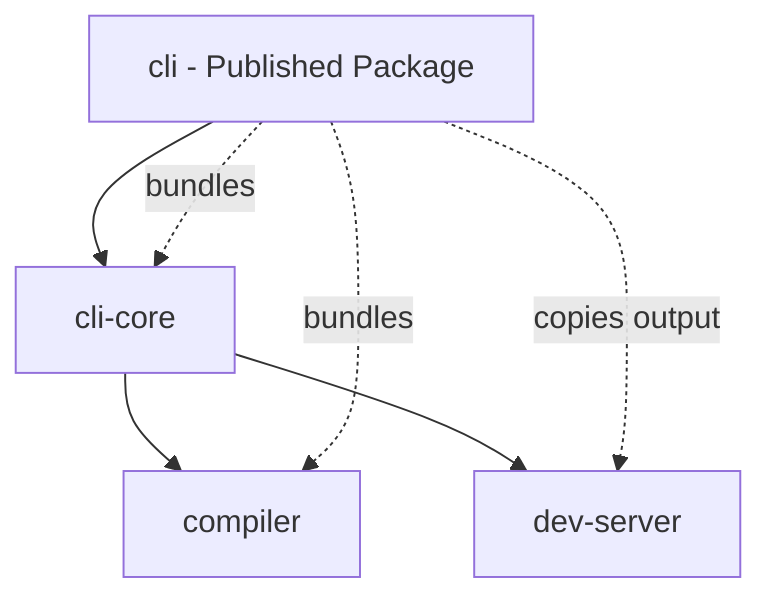

# CLI Build Architecture & Development Guide

This document explains the complete build architecture and development workflow for the Lightfast CLI.

## 🏗️ Build Architecture

The CLI uses a sophisticated multi-package build system that creates a single, self-contained npm package.

### Package Dependencies



### Build Order

The build must happen in a specific order due to dependencies:

1. **compiler** → No workspace dependencies, builds first
2. **cli-core** → Depends on compiler, builds second
3. **dev-server** → Independent React app, builds third
4. **cli** → Bundles everything, builds last

## 📦 What Gets Published

Only `@lightfastai/cli` is published to npm. It contains:

```
dist/
├── index.js              # 54KB - Bundled CLI with cli-core + compiler
├── index.d.ts           # TypeScript definitions
└── dev-server-output/   # Pre-built React UI
    ├── public/          # Client-side assets
    └── server/          # SSR server
```

### How It Works

1. **TypeScript Code** (cli-core, compiler) → Bundled into `index.js` via tsup
2. **React App** (dev-server) → Built separately, output copied to `dist/dev-server-output`
3. **Runtime Dependencies** → Listed in package.json (commander, chalk, etc.)

## 🔨 Build Process

### Complete Build (`pnpm build`)

Runs `scripts/build-all.js` which:

```javascript
// 1. Clean all previous builds
rm -rf compiler/dist cli-core/dist dev-server/.output cli/dist

// 2. Build compiler
cd compiler && pnpm build

// 3. Build cli-core (needs compiler)
cd cli-core && pnpm build

// 4. Build dev-server
cd dev-server && pnpm build

// 5. Bundle CLI
cd cli && pnpm build:bundle
```

### Quick Build (`pnpm build:quick`)

Only rebuilds the CLI bundle, assumes dependencies are already built.

## 🛠️ Development Workflow

### Initial Setup

```bash
# Clone and install
git clone https://github.com/lightfastai/lightfast.git
cd lightfast
pnpm install

# Navigate to CLI
cd core/cli
```

### Development Commands

```bash
# Full build (required first time and after major changes)
pnpm build

# Watch mode for CLI changes only
pnpm dev

# Quick rebuild (if deps unchanged)
pnpm build:quick

# Type checking
pnpm typecheck

# Linting
pnpm lint
```

### Testing Changes

```bash
# After building, test directly
node dist/index.js --help
node dist/index.js dev --port 3001

# Test with example project
cd ../../examples/1-agent-chat
node ../../core/cli/dist/index.js dev

# Or use npm scripts
npm run dev
```

### Important: Workspace Updates

When testing with examples that use `file:` references:

```json
// examples/1-agent-chat/package.json
"@lightfastai/cli": "file:../../core/cli"
```

After rebuilding, you may need to:
```bash
# Force update node_modules
pnpm install --force

# Or manually copy
cp core/cli/dist/* node_modules/@lightfastai/cli/dist/
```

## 🏗️ Build Configuration

### tsup.config.ts

```typescript
{
  entry: ['src/index.ts'],
  format: ['esm'],
  // Bundle workspace packages
  noExternal: [
    '@lightfastai/cli-core',
    '@lightfastai/compiler',
    /^\.\.\//  // Relative imports
  ],
  // Keep dev-server external (copied separately)
  external: ['@lightfastai/dev-server'],
  onSuccess: async () => {
    // 1. Add shebang
    // 2. Copy dev-server output
  }
}
```

### Key Design Decisions

1. **Bundle TypeScript packages** - Avoid runtime dependency issues
2. **Copy React build** - Can't bundle, different build process
3. **Clean builds** - Always rebuild from scratch to avoid stale code
4. **Single package publish** - Simpler for users, one `npm install`

## 🐛 Troubleshooting

### Build Issues

**Problem:** "Dev-server output not found"
```bash
# Solution: Run full build
pnpm build
```

**Problem:** "Cannot find module 'lightfast/dist/client/index.mjs'"
```bash
# Solution: Build the lightfast package
cd ../lightfast
pnpm build

# Then update example dependencies
cd ../../examples/1-agent-chat
pnpm install --force
```

**Problem:** Changes not reflected
```bash
# Solution: Clean and rebuild
rm -rf dist ../*/dist ../*/.output
pnpm build
```

**Problem:** Module not found in example
```bash
# Solution: Update node_modules
cd examples/1-agent-chat
pnpm install --force
```

### Development Tips

1. **Always run full build first** - Ensures all dependencies are built
2. **Use `pnpm dev` for iteration** - Watches only CLI source
3. **Test with `node dist/index.js`** - Simulates installed package
4. **Check bundle size** - Should be ~54KB for CLI bundle

## 📝 Adding Features

### Adding to CLI Commands

1. Edit files in `cli-core/src/commands/`
2. Run `pnpm build` to rebuild everything
3. Test with `node dist/index.js <command>`

### Adding to Compiler

1. Edit files in `compiler/src/`
2. Run `pnpm build` to rebuild chain
3. Changes automatically included in CLI bundle

### Adding to Dev Server

1. Edit files in `dev-server/src/`
2. Run `pnpm build` to rebuild UI
3. Output automatically copied to CLI dist

## 🚀 Publishing

### Pre-publish Checklist

- [ ] Run `pnpm build` for clean build
- [ ] Test all commands work
- [ ] Check bundle size with `npm pack --dry-run`
- [ ] Update version in package.json
- [ ] Update CHANGELOG.md

### Publish Process

```bash
# Build everything
pnpm build

# Check what will be published
npm pack --dry-run

# Create changeset
pnpm changeset

# Version packages
pnpm changeset version

# Publish to npm
pnpm changeset publish
```

### What Gets Published

- `dist/index.js` - Main CLI bundle
- `dist/dev-server-output/` - Pre-built UI
- `package.json` - With runtime deps
- `README.md` - Documentation

Total package size: ~240KB compressed

## 🔍 Architecture Deep Dive

### Why This Architecture?

1. **Single Package Distribution**
   - Users only install one package
   - No version mismatch issues
   - Simpler dependency management

2. **Build-time Bundling**
   - TypeScript compiled away
   - No runtime compilation needed
   - Faster startup time

3. **Pre-built UI**
   - React app built with Vite
   - Optimized production bundle
   - No client-side build needed

### Bundle Strategy

- **Bundle:** TypeScript packages (cli-core, compiler)
  - Pure Node.js code
  - Can be bundled with tsup
  - Reduces runtime dependencies

- **Copy:** React application (dev-server)
  - Different build process (Vite)
  - Includes client + server code
  - Copied as static assets

### Runtime Behavior

When user runs `cli dev`:

1. CLI detects it's running from `/dist` (production mode)
2. Finds bundled dev-server at `dist/dev-server-output/server/index.mjs`
3. Compiles user's `lightfast.config.ts` using bundled compiler
4. Starts dev server with compiled config
5. Opens browser to localhost:3000

## 🎯 Best Practices

1. **Always test after building** - Ensure bundle works correctly
2. **Keep bundle small** - Monitor size with `npm pack --dry-run`
3. **Document changes** - Update this file when architecture changes
4. **Test in examples** - Verify real-world usage works
5. **Clean builds for releases** - Avoid shipping stale code

## 📚 Related Documentation

- [README.md](./README.md) - User-facing documentation
- [../CLAUDE.md](../CLAUDE.md) - Overall architecture
- [package.json](./package.json) - Package configuration
- [tsup.config.ts](./tsup.config.ts) - Build configuration