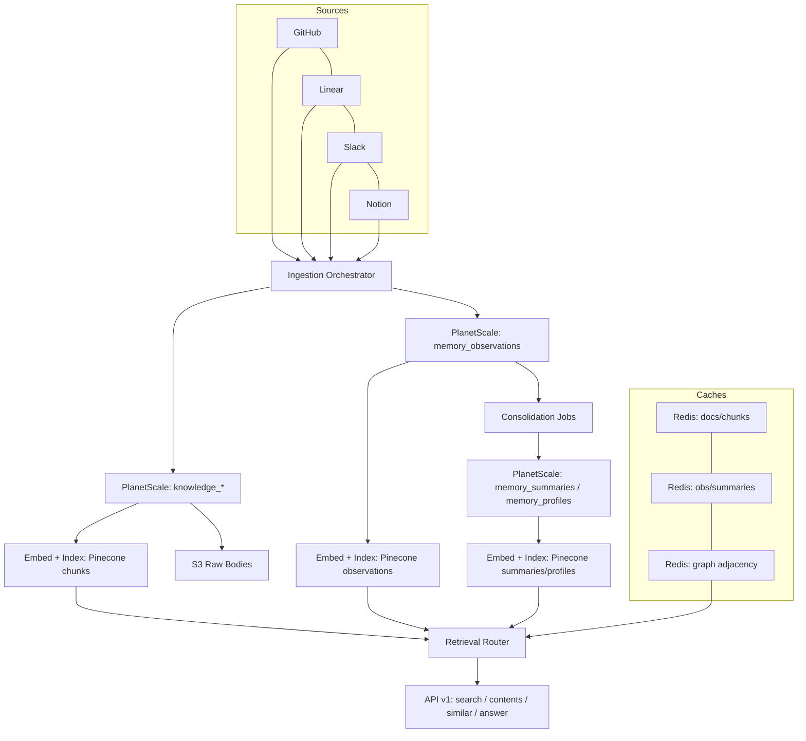

# Storage Architecture Visual Summary

Last Updated: 2025-10-28

## Target Architecture (Neural Memory)

```
                               ┌───────────────────────────────┐
                               │        Source Systems         │
                               │ GitHub ▪ Linear ▪ Slack ▪ ... │
                               └──────────────┬────────────────┘
                                              │
                                      Ingestion Orchestrator
                                        (Inngest + Workers)
                                              │
                         ┌────────────────────┴────────────────────┐
                         │                                         │
                 Normalized Doc + Chunks                Observation Drafts
                         │                                         │
                         ▼                                         ▼
                ┌──────────────────┐                        ┌──────────────────┐
                │ PlanetScale      │                        │ PlanetScale      │
                │ knowledge_*      │                        │ memory_observations│
                └────────┬─────────┘                        └────────┬─────────┘
                         │                                          │
                         │                                          │
                ┌────────▼──────────┐                      ┌─────────▼──────────┐
                │ Object Storage    │                      │ Consolidation Jobs │
                │ (S3 raw bodies)   │                      │ summaries ▪ profiles│
                └────────┬──────────┘                      └─────────┬──────────┘
                         │                                          │
                ┌────────▼──────────┐                      ┌─────────▼──────────┐
                │ Embedding Pipeline│                      │ Embedding Pipeline │
                │ (Cohere, versions)│                      │   (multi‑view)     │
                └────────┬──────────┘                      └─────────┬──────────┘
                         │                                          │
                ┌────────▼──────────┐                      ┌─────────▼──────────┐
                │ Pinecone: chunks  │                      │ Pinecone: obs/sum/ │
                │ namespace per ws  │                      │ profiles namespaces │
                └────────┬──────────┘                      └─────────┬──────────┘
                         │                                          │
                ┌────────▼──────────┐                      ┌─────────▼──────────┐
                │ Redis Caches      │◄───────┐     ┌──────►│ Redis Caches      │
                │ docs/chunks (TTL) │        │     │       │ obs/sum profiles  │
                └────────┬──────────┘        │     │       └─────────┬──────────┘
                         │                   │     │                 │
                         │                   │     │                 │
                ┌────────▼───────────────────▼─────▼─────────────────▼──────────┐
                │                   Retrieval Router (Service)                   │
                │   knowledge | neural | hybrid • graph bias (1–2 hops)         │
                │   fusion + rerank • rationale • hydration • logging            │
                └────────┬──────────────────────────────────────────────────────┘
                         │
                ┌────────▼──────────────────────────────────────────────────────┐
                │           Lightfast Public API + MCP (4 routes/tools)         │
                │   POST /v1/search • /contents • /similar • /answer (SSE opt)  │
                └───────────────────────────────────────────────────────────────┘
```

Graph signals (entities/relationships) live in PlanetScale with Redis adjacency caches; retrieval applies bounded bias and returns rationale.

---

## Ingestion & Consolidation

```
┌─────────────┐  ┌──────────────┐  ┌────────────────┐  ┌─────────────────┐  ┌────────────────────┐
│ Source Event│►│ Normalize     │►│ Doc/Chunk Build │►│ Drizzle Txn     │►│ Embed & Index      │
│ (webhook)   │  │ + Observations│  │ (200–400 tokens)│  │ (doc/chunk/obs) │  │ (chunks/observations)│
└─────────────┘  └──────┬───────┘  └────────┬───────┘  └────────┬────────┘  └──────────┬───────────┘
                        │                   │                   │                      │
                        ▼                   ▼                   ▼                      ▼
                  Dedupe Cache         S3 Upload           Persisted Rows         Pinecone Upsert
                  (Redis TTL)          (raw bodies)        (versioned)            (per‑ws namespace)

Nightly / thresholds:
Observations ► Cluster ► Summaries ► Embed/Index
Entities ► Rebuild Profiles (centroids) ► Update drift
```

---

## Retrieval & Rationale

```
┌────────────────────┐
│ User / Agent Query │
└──────────┬─────────┘
           │
           ▼
  ┌──────────────────────────────────────────────────────────────────────┐
  │ Router: knowledge | neural | hybrid                                  │
  │  - knowledge: lexical + dense over chunks                             │
  │  - neural: dense over observations (± summaries, profiles)            │
  │  - hybrid: run both, fuse weights (vector/lexical/graph/recency/…)    │
  └────────┬─────────────────────────────────────────────────────────────┘
           │
           ▼
  ┌────────────────────┐      Graph Bias (bounded 1–2 hops)      ┌────────────────────┐
  │ Fusion & Scoring   │◄────────────────────────────────────────►│ Graph Adjacency    │
  │ + cross‑encoder    │                                          │ (Redis + DB)       │
  └────────┬───────────┘                                          └────────┬───────────┘
           │                                                               │
           ▼                                                               │
  ┌────────────────────┐                                                   │
  │ Hydration (Redis → │                                                   │
  │ PlanetScale)       │                                                   │
  └────────┬───────────┘                                                   │
           │                                                               │
           ▼                                                               │
  ┌────────────────────┐                                                   │
  │ Compose Response   │  citations + rationale (entities/edges/evidence)  │
  └────────────────────┘                                                   │
```

Targets (p95): identifier <90 ms; semantic <150 ms; contents hydration <120 ms; answer 1.5–2.5 s (model‑dependent).

---

## Data Responsibilities Snapshot

| Layer | Stores | Notes |
|-------|--------|-------|
| PlanetScale | knowledge_*, memory_observations, memory_summaries, memory_profiles, entities, relationships | Source of truth; backups + PITR |
| S3 / GCS | Raw bodies, diffs, attachments | Versioned; referenced by raw pointers |
| Pinecone | chunks, observations, summaries, profiles (per‑ws namespaces) | Metadata under ~1 KB |
| Redis | Hot caches (docs/chunks/obs), dedupe keys, adjacency, queues | TTL; recoverable via DB replay |
| Observability | retrieval_logs, feedback_events, dashboards | latency splits, contribution shares, drift |

---

## Mermaid (alternate view)



---

Every answer cites evidence (chunks/observations) and, when graph influenced, includes a compact rationale of entities and edges.
