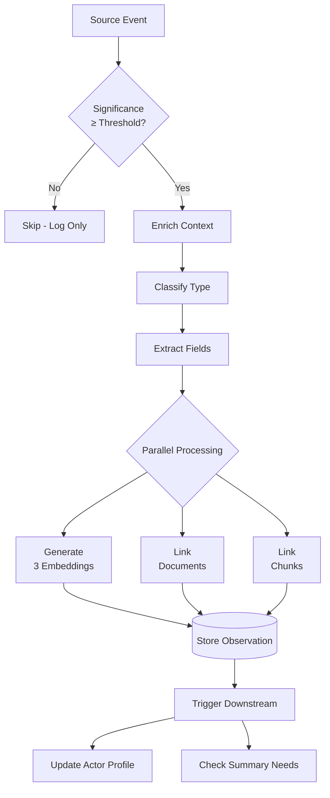

# Observation Capture Pipeline

## Overview

The observation capture pipeline transforms source events into searchable observations through a 7-step process: significance evaluation → context enrichment → classification → extraction → parallel processing → storage → downstream triggers.

## Pipeline Architecture



## Inngest Function Implementation

```typescript
import { inngest } from '@vendor/inngest/client';
import { enricherRegistry } from './enrichers';
import { generateMultiViewEmbeddings } from './embeddings';
import { db } from '@vendor/db/client';

export const observationCapture = inngest.createFunction(
  {
    id: "neural.observation.capture",
    concurrency: {
      limit: 20,                    // Max 20 concurrent per workspace
      key: "event.data.workspace_id"
    },
    retries: 3,                     // Retry on transient failures
  },
  { event: "neural/observation.capture" },
  async ({ event, step }) => {
    const { sourceEvent, workspaceId, storeId } = event.data;

    // Step 1: Significance Evaluation (BLOCKING)
    const significance = await step.run("evaluate-significance", async () => {
      return await evaluateSignificance(sourceEvent);
    });

    if (significance.score < SIGNIFICANCE_THRESHOLD) {
      return {
        skipped: true,
        reason: "Below significance threshold",
        score: significance.score
      };
    }

    // Step 2: Context Enrichment (BLOCKING)
    const context = await step.run("enrich-context", async () => {
      return await enricherRegistry.enrich(sourceEvent);
    });

    // Step 3: Classification (BLOCKING)
    const classification = await step.run("classify-observation", async () => {
      return await classifyObservationType(sourceEvent, context);
    });

    // Step 4: Extract Observation (BLOCKING)
    const observation = await step.run("extract-observation", async () => {
      return {
        id: generateObservationId(),
        workspaceId,
        storeId,
        occurredAt: sourceEvent.occurredAt,

        // Classification
        type: classification.type,
        confidence: classification.confidence,
        significance: significance.score,

        // Content
        title: await generateTitle(sourceEvent, classification),
        content: extractContent(sourceEvent),

        // Actor
        actorType: sourceEvent.actor?.type ?? 'system',
        actorId: sourceEvent.actor?.id ?? null,
        actorName: sourceEvent.actor?.name ?? null,
        actorMetadata: sourceEvent.actor?.metadata ?? null,

        // Source
        sourceReferences: sourceEvent.references ?? [],
        contextMetadata: context,
      };
    });

    // Step 5: Parallel Processing (3 concurrent operations)
    const [embeddings, docLinks, chunkLinks] = await Promise.all([
      step.run("generate-embeddings", async () => {
        try {
          return await generateMultiViewEmbeddings(observation);
        } catch (error) {
          console.error('Embedding generation failed:', error);

          // Queue for retry later
          await step.sendEvent("retry-embeddings", {
            name: "neural/embeddings.retry",
            data: { observationId: observation.id }
          });

          return null;
        }
      }),

      step.run("link-documents", async () => {
        return await findRelatedDocuments(workspaceId, observation);
      }),

      step.run("link-chunks", async () => {
        return await findRelatedChunks(workspaceId, observation);
      }),
    ]);

    // Step 6: Store Observation (BLOCKING, within transaction)
    const stored = await step.run("store-observation", async () => {
      return await db.transaction(async (tx) => {
        const [obs] = await tx.insert(workspaceNeuralObservations).values({
          ...observation,
          embeddingTitleId: embeddings?.titleId ?? null,
          embeddingContentId: embeddings?.contentId ?? null,
          embeddingSummaryId: embeddings?.summaryId ?? null,
          relatedDocuments: docLinks.map(d => d.id),
          relatedChunks: chunkLinks.map(c => c.id),
          createdAt: new Date(),
        }).returning();

        // Update store metrics
        await tx.update(workspaceStores)
          .set({
            observationCount: sql`observation_count + 1`,
            lastObservationAt: new Date()
          })
          .where(eq(workspaceStores.id, storeId));

        return obs;
      });
    });

    // Step 7: Trigger Downstream Events (NON-BLOCKING)
    await step.sendEvent("trigger-downstream", [
      {
        name: "neural/profile.update",
        data: {
          workspaceId,
          actorId: observation.actorId,
          observationId: stored.id
        }
      },
      {
        name: "neural/summary.check",
        data: {
          workspaceId,
          observationId: stored.id,
          type: observation.type
        }
      }
    ]);

    return {
      success: true,
      observationId: stored.id,
      type: observation.type,
      significance: significance.score,
      hasEmbeddings: embeddings !== null,
    };
  }
);
```

## Step 1: Significance Evaluation

Determines if an event is worth capturing as an observation.

```typescript
const SIGNIFICANCE_THRESHOLD = 60;  // 0-100 scale

interface SignificanceResult {
  score: number;
  factors: Record<string, number>;
  reasoning: string;
}

async function evaluateSignificance(
  event: SourceEvent
): Promise<SignificanceResult> {
  const factors: Record<string, number> = {};

  // Factor 1: Event Type (0-30 points)
  factors.eventType = getEventTypeScore(event.source, event.sourceType);

  // Factor 2: Content Depth (0-25 points)
  const contentLength = (event.title?.length ?? 0) + (event.body?.length ?? 0);
  factors.contentDepth = Math.min(25, contentLength / 100);

  // Factor 3: Actor Importance (0-20 points)
  if (event.actor) {
    const profile = await getActorProfile(event.actor.id);
    factors.actorImportance = profile ? profile.importance * 20 : 10;
  } else {
    factors.actorImportance = 5;  // System events less important
  }

  // Factor 4: Reference Count (0-15 points)
  const refCount = event.references?.length ?? 0;
  factors.referenceCount = Math.min(15, refCount * 5);

  // Factor 5: Temporal Uniqueness (0-10 points)
  const recentSimilar = await countRecentSimilarEvents(event, minutes(30));
  factors.temporalUniqueness = Math.max(0, 10 - recentSimilar);

  // Calculate total score
  const score = Object.values(factors).reduce((sum, val) => sum + val, 0);

  return {
    score,
    factors,
    reasoning: generateSignificanceReasoning(factors, score)
  };
}

function getEventTypeScore(source: string, type: string): number {
  const scores: Record<string, number> = {
    // GitHub
    'github:pull_request': 25,
    'github:issue': 20,
    'github:review': 15,
    'github:commit': 10,

    // Linear
    'linear:issue': 20,
    'linear:comment': 10,

    // Slack
    'slack:message': 15,
    'slack:thread_reply': 10,

    // Default
    'default': 10
  };

  return scores[`${source}:${type}`] ?? scores['default'];
}
```

## Step 2: Context Enrichment

Calls source-specific enricher (see [01-source-events.md](./01-source-events.md)).

```typescript
async function enrichContext(event: SourceEvent): Promise<EnrichedContext> {
  return await enricherRegistry.enrich(event);
}
```

## Step 3: Classification

Determines observation type and confidence.

```typescript
type ObservationType = 'decision' | 'highlight' | 'change' | 'incident';

interface Classification {
  type: ObservationType;
  confidence: number;  // 0-1
  reasoning: string;
}

async function classifyObservationType(
  event: SourceEvent,
  context: EnrichedContext
): Promise<Classification> {
  // Rule-based classification
  const rules = [
    {
      type: 'decision' as ObservationType,
      test: () =>
        event.sourceType === 'pull_request' &&
        (context.reviewers?.length ?? 0) >= 2,
      confidence: 0.85
    },
    {
      type: 'change' as ObservationType,
      test: () => event.sourceType === 'pull_request',
      confidence: 0.75
    },
    {
      type: 'incident' as ObservationType,
      test: () =>
        event.source === 'sentry' ||
        (event.metadata.severity === 'high'),
      confidence: 0.90
    },
    {
      type: 'highlight' as ObservationType,
      test: () => true,  // Default fallback
      confidence: 0.50
    }
  ];

  for (const rule of rules) {
    if (rule.test()) {
      return {
        type: rule.type,
        confidence: rule.confidence,
        reasoning: `Matched rule: ${rule.type}`
      };
    }
  }

  return {
    type: 'highlight',
    confidence: 0.50,
    reasoning: 'No specific rule matched, defaulting to highlight'
  };
}
```

## Step 4: Field Extraction

```typescript
async function generateTitle(
  event: SourceEvent,
  classification: Classification
): Promise<string> {
  if (event.title && event.title.length <= 200) {
    return event.title;
  }

  // Truncate long titles
  return event.title
    ? event.title.slice(0, 197) + '...'
    : `${classification.type} from ${event.source}`;
}

function extractContent(event: SourceEvent): string {
  const parts: string[] = [];

  if (event.title) parts.push(event.title);
  if (event.body) parts.push(event.body);

  const content = parts.join('\n\n');

  // Truncate to 10k chars
  return content.length > 10000
    ? content.slice(0, 9997) + '...'
    : content;
}
```

## Step 5: Parallel Processing

### 5a. Generate Embeddings

```typescript
interface MultiViewEmbeddings {
  titleId: string;
  contentId: string;
  summaryId: string;
}

async function generateMultiViewEmbeddings(
  obs: Observation
): Promise<MultiViewEmbeddings> {
  // Generate summary (for third embedding view)
  const summary = await generateSummary(obs.content);

  // Generate all 3 embeddings in parallel
  const [titleEmbed, contentEmbed, summaryEmbed] = await Promise.all([
    generateEmbedding(obs.title, {
      model: 'text-embedding-3-small',
      dimensions: 512
    }),
    generateEmbedding(obs.content, {
      model: 'text-embedding-3-large',
      dimensions: 1536
    }),
    generateEmbedding(summary, {
      model: 'text-embedding-3-small',
      dimensions: 768
    }),
  ]);

  return {
    titleId: titleEmbed.id,
    contentId: contentEmbed.id,
    summaryId: summaryEmbed.id,
  };
}

async function generateSummary(content: string): Promise<string> {
  if (content.length <= 500) return content;

  // Use cheap LLM for summarization
  const response = await llm.generate({
    model: 'claude-3-haiku',
    messages: [{
      role: 'user',
      content: `Summarize this in 2-3 sentences:\n\n${content}`
    }],
    maxTokens: 150
  });

  return response.content;
}
```

### 5b. Link Documents

```typescript
async function findRelatedDocuments(
  workspaceId: string,
  observation: Observation
): Promise<Document[]> {
  // Search by title embedding
  const results = await pinecone.query({
    namespace: `${workspaceId}/documents`,
    vector: await getEmbeddingVector(observation.embeddingTitleId),
    topK: 5,
    minScore: 0.7
  });

  return await db.select()
    .from(workspaceDocuments)
    .where(inArray(workspaceDocuments.id, results.matches.map(m => m.id)));
}
```

### 5c. Link Chunks

```typescript
async function findRelatedChunks(
  workspaceId: string,
  observation: Observation
): Promise<Chunk[]> {
  // Search by content embedding
  const results = await pinecone.query({
    namespace: `${workspaceId}/chunks`,
    vector: await getEmbeddingVector(observation.embeddingContentId),
    topK: 10,
    minScore: 0.65
  });

  return await db.select()
    .from(workspaceChunks)
    .where(inArray(workspaceChunks.id, results.matches.map(m => m.id)));
}
```

## Performance Targets

| Step | Target Latency | Notes |
|------|----------------|-------|
| Significance Eval | <200ms | Mostly DB queries |
| Context Enrichment | <500ms | External API calls |
| Classification | <100ms | Rule-based, fast |
| Field Extraction | <50ms | String operations |
| Embeddings (parallel) | <600ms | 3 API calls in parallel |
| Document Linking | <200ms | Vector search |
| Chunk Linking | <200ms | Vector search |
| Storage | <100ms | DB transaction |
| **Total (p95)** | **<2000ms** | End-to-end |

## Error Handling

```typescript
// Step with graceful degradation
const embeddings = await step.run("generate-embeddings", async () => {
  try {
    return await generateMultiViewEmbeddings(observation);
  } catch (error) {
    // Log error
    console.error('Embedding generation failed:', error);

    // Track metric
    metrics.embeddingErrors.inc({ workspace_id: workspaceId });

    // Queue for retry
    await step.sendEvent("retry-embeddings", {
      name: "neural/embeddings.retry",
      data: {
        observationId: observation.id,
        attempt: 1,
        maxAttempts: 3
      }
    });

    // Return null to continue without embeddings
    return null;
  }
});

// Observation stored even if embeddings failed
```

## Monitoring

```typescript
// Metrics to track
const metrics = {
  observationsCaptured: new Counter({
    name: 'neural_observations_captured_total',
    labelNames: ['workspace_id', 'type']
  }),

  significanceScores: new Histogram({
    name: 'neural_significance_scores',
    buckets: [0, 20, 40, 60, 80, 100]
  }),

  captureLatency: new Histogram({
    name: 'neural_capture_latency_ms',
    buckets: [100, 500, 1000, 2000, 5000]
  }),

  embeddingErrors: new Counter({
    name: 'neural_embedding_errors_total',
    labelNames: ['workspace_id']
  })
};
```

---

_Last updated: 2025-11-27_
