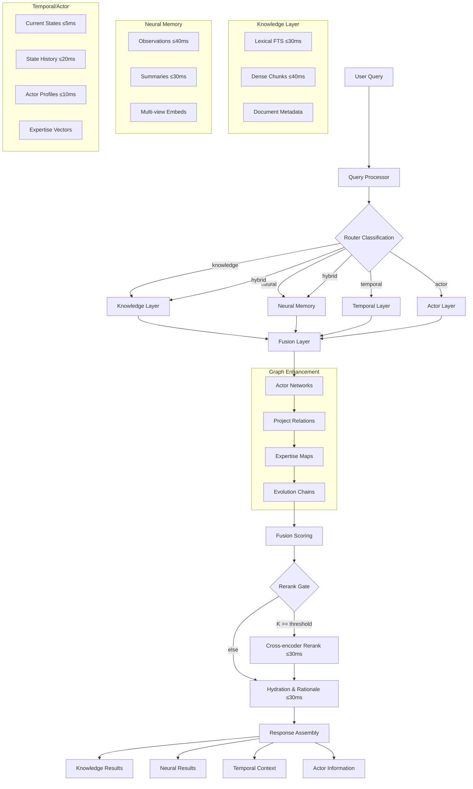

# Retrieval Router Internals with Neural Memory

Last Updated: 2025-11-27

This diagram set details the enhanced retrieval router with neural memory components: classification, parallel candidate generation (knowledge + neural + temporal), actor profiles, bounded graph bias, fusion/scoring, rerank, and hydration — with latency budgets and tunable knobs. See `./neural-memory-design.md` for detailed neural architecture.

---

## ASCII Overview

```
User Query
   │
   ▼
┌───────────────┐    Classification Signals
│ Query Process │──────────────────────────────────────────────────────────────┐
│  • parse syntax │  • identifiers (#123, PR-456) → knowledge                   │
│  • temporal ctx │  • temporal markers (yesterday, recently) → neural          │
│  • actor resolve│  • actor queries (@john, who owns) → actor                  │
│  • embed views  │  • state queries (status, progress) → temporal              │
└───────┬────────┘  • technical search → knowledge or hybrid                    │
        │ routerMode: knowledge | neural | hybrid | temporal | actor            │
        ▼
┌──────────────────────────┐  ┌─────────────────────────┐  ┌──────────────────────────┐
│ Knowledge Layer          │  │ Neural Memory Layer      │  │ Temporal/Actor Layer      │
│ • Lexical FTS ≤30ms     │  │ • Observations ≤40ms     │  │ • Current States ≤5ms     │
│ • Dense chunks ≤40ms    │  │ • Summaries ≤30ms        │  │ • State History ≤20ms     │
│ • Documents metadata    │  │ • Multi-view embeddings  │  │ • Actor Profiles ≤10ms    │
└────────┬─────────────────┘  └────────┬─────────────────┘  └────────┬──────────────────┘
         │                              │                              │
         └──────────────┬───────────────┴──────────────────────────────┘
                        │ seeds for graph + parallel retrieval
                        ▼
                ┌────────────────────────────────────────────────┐
                │ Enhanced Graph Traversal (≤15ms)               │
                │ • Actor collaboration networks                  │
                │ • Project/feature relationships                 │
                │ • Expertise mapping                             │
                │ • Temporal evolution chains                     │
                └───────────┬─────────────────────────────────────┘
                            │
                            ▼
                ┌────────────────────────────────────────────────┐
                │ Advanced Fusion & Scoring (≤10ms)              │
                │ score = wk*knowledge + wn*neural +             │
                │         wt*temporal + wa*actor +               │
                │         wg*graph + wr*recency +                │
                │         wi*importance                           │
                └───────────┬─────────────────────────────────────┘
                            │   if K ≥ RERANK_MIN_K
                            ▼
                ┌────────────────────────────────────────────────┐
                │ Cross‑Encoder Rerank (≤30ms)                   │
                │ • Neural + knowledge candidates                 │
                │ • Context-aware reranking                       │
                └───────────┬─────────────────────────────────────┘
                            │
                            ▼
                ┌────────────────────────────────────────────────┐
                │ Hydration & Rationale (≤30ms)                  │
                │ • Fetch: docs/chunks/observations/states       │
                │ • Build: highlights, temporal context          │
                │ • Generate: actor info, decision chains        │
                └────────────────────────────────────────────────┘
```

Targets (p95): identifier <90ms; semantic <150ms; neural <200ms; hybrid <250ms.

---

## Mermaid (Flow)



---

## Tunable Knobs (per workspace)

**Retrieval Parameters:**
- `topK_knowledge`: Top K from document/chunk retrieval (default: 20)
- `topK_observations`: Top K from observations (default: 15)
- `topK_summaries`: Top K from summaries (default: 10)
- `topK_profiles`: Top K actor profiles (default: 5)
- `fused_top_k`: Final candidates after fusion (default: 50)

**Neural Memory Parameters:**
- `observation_time_window`: Time range for observations (default: 30d)
- `summary_inclusion_threshold`: Min relevance for summaries (default: 0.7)
- `profile_expertise_threshold`: Min expertise score (default: 0.6)
- `temporal_decay_factor`: How fast relevance decays (default: 0.95)
- `multi_view_weight_distribution`: [title: 0.3, content: 0.5, summary: 0.2]

**Rerank Parameters:**
- `rerank_min_k`: Minimum candidates to trigger rerank (default: 10)
- `rerank_top_n`: Final results after rerank (default: 10)
- `rerank_threshold`: Min score to include (default: 0.5)
- `neural_rerank_boost`: Extra weight for neural results (default: 1.2)

**Graph Parameters:**
- `graph_hop_limit`: Max traversal depth (default: 2)
- `graph_weight`: Overall graph influence (default: 0.1)
- `hop_factors`: [1-hop: 1.0, 2-hop: 0.6]
- `actor_network_depth`: Collaboration network depth (default: 1)
- `expertise_propagation`: How expertise spreads (default: 0.7)

**Fusion Weights (mode-dependent):**
```yaml
knowledge_mode:
  knowledge: 0.70, neural: 0.10, temporal: 0.05,
  actor: 0.05, graph: 0.05, recency: 0.05

neural_mode:
  knowledge: 0.15, neural: 0.50, temporal: 0.15,
  actor: 0.10, graph: 0.05, recency: 0.05

hybrid_mode:
  knowledge: 0.30, neural: 0.25, temporal: 0.15,
  actor: 0.10, graph: 0.10, recency: 0.10

temporal_mode:
  knowledge: 0.10, neural: 0.30, temporal: 0.35,
  actor: 0.10, graph: 0.05, recency: 0.10

actor_mode:
  knowledge: 0.15, neural: 0.20, temporal: 0.10,
  actor: 0.35, graph: 0.15, recency: 0.05
```

**Performance Budgets:**
- `query_processing_budget_ms`: 20
- `candidate_generation_budget_ms`: 50
- `graph_traversal_budget_ms`: 15
- `rerank_budget_ms`: 30
- `hydration_budget_ms`: 30
- `disable_neural_when_slow`: false
- `disable_rerank_when_slow`: true

---

## Logging Fields

**Core Metrics:**
```typescript
interface RetrievalLog {
  // Request
  queryId: string
  query: string
  workspaceId: string

  // Router
  routerMode: 'knowledge' | 'neural' | 'hybrid' | 'temporal' | 'actor'
  routerConfidence: number

  // Latency breakdown (ms)
  stagesLatency: {
    queryProcessing: number
    candidateGeneration: {
      knowledge: number
      observations: number
      summaries: number
      profiles: number
      temporal: number
    }
    graphTraversal: number
    fusion: number
    rerank: number
    hydration: number
    total: number
  }

  // Results composition
  contributionShares: {
    chunks: number        // % from documents
    observations: number  // % from observations
    summaries: number    // % from summaries
    profiles: number     // % from actor profiles
    states: number       // % from temporal states
  }

  // Features used
  features: {
    rerankUsed: boolean
    thresholdsApplied: string[]
    neuralViewsUsed: string[]  // ['title', 'content', 'summary']
    temporalWindowDays: number
    actorNetworkDepth: number
  }

  // Graph influence
  graph: {
    seeds: string[]
    edgesTraversed: number
    boostApplied: number
    pathsGenerated: number
  }

  // Rationale tracking
  rationale: {
    entityIds: string[]
    observationIds: string[]
    temporalContext: string
    actorExpertise: Record<string, number>
  }

  // Cache performance
  cache: {
    hydrationHits: number
    profileHits: number
    stateHits: number
  }
}
```

---

## Fallbacks

**Performance Degradation:**
- Neural memory timeout → Fall back to knowledge-only mode
- Observation retrieval slow → Skip and use summaries only
- Profile computation delayed → Use cached or skip actor scoring
- Graph traversal budget exceeded → Skip graph enhancement
- Rerank degraded → Return fused order without reranking

**Data Sparsity:**
- No observations found → Boost knowledge weight
- No actor profiles → Disable actor mode
- Sparse temporal data → Use latest available state
- Limited summaries → Expand observation window
- Empty graph → Pure vector/lexical search

**Mode-Specific Fallbacks:**
```yaml
neural_mode_fallback:
  primary: observations
  fallback1: summaries
  fallback2: knowledge

temporal_mode_fallback:
  primary: current_states
  fallback1: recent_observations
  fallback2: historical_summaries

actor_mode_fallback:
  primary: profiles
  fallback1: activity_patterns
  fallback2: collaboration_graph
```

**Error Recovery:**
- Embedding service down → Use lexical search only
- Database connection lost → Serve from cache
- Pinecone unavailable → PostgreSQL full-text search
- Redis down → Direct database queries

---

## Continuous Improvement

**Calibration Sources:**
- User feedback signals (implicit and explicit)
- A/B testing of weight distributions
- Braintrust evaluation suites
- Query satisfaction metrics
- Latency vs quality trade-offs

**Adaptive Learning:**
- Profile evolution from usage patterns
- Summary quality from user interactions
- Weight optimization per workspace
- Router confidence adjustment
- Graph relationship strength updates

---

_Last reviewed: 2025-11-27_

See also:
- `./neural-memory-design.md` - Detailed neural memory architecture
- `./search-design.md` - Overall retrieval pipeline
- `../../operations/evaluation-playbook.md` - Quality measurement
