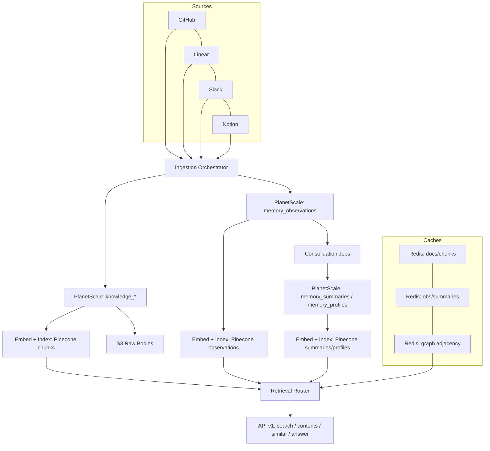

# Storage Architecture Visual Summary

Last Updated: 2025-10-28

## Target Architecture (Neural Memory)

```
                               ┌───────────────────────────────┐
                               │        Source Systems         │
                               │ GitHub ▪ Linear ▪ Slack ▪ ... │
                               └──────────────┬────────────────┘
                                              │
                                      Ingestion Orchestrator
                                        (Inngest + Workers)
                                              │
                         ┌────────────────────┴────────────────────┐
                         │                                         │
                 Normalized Doc + Chunks                Observation Drafts
                         │                                         │
                         ▼                                         ▼
                ┌──────────────────┐                        ┌──────────────────┐
                │ PlanetScale      │                        │ PlanetScale      │
                │ knowledge_*      │                        │ memory_observations│
                └────────┬─────────┘                        └────────┬─────────┘
                         │                                          │
                         │                                          │
                ┌────────▼──────────┐                      ┌─────────▼──────────┐
                │ Object Storage    │                      │ Consolidation Jobs │
                │ (S3 raw bodies)   │                      │ summaries ▪ profiles│
                └────────┬──────────┘                      └─────────┬──────────┘
                         │                                          │
                ┌────────▼──────────┐                      ┌─────────▼──────────┐
                │ Embedding Pipeline│                      │ Embedding Pipeline │
                │ (Cohere, versions)│                      │   (multi‑view)     │
                └────────┬──────────┘                      └─────────┬──────────┘
                         │                                          │
                ┌────────▼──────────┐                      ┌─────────▼──────────┐
                │ Pinecone: chunks  │                      │ Pinecone: obs/sum/ │
                │ namespace per ws  │                      │ profiles namespaces │
                └────────┬──────────┘                      └─────────┬──────────┘
                         │                                          │
                ┌────────▼──────────┐                      ┌─────────▼──────────┐
                │ Redis Caches      │◄───────┐     ┌──────►│ Redis Caches      │
                │ docs/chunks (TTL) │        │     │       │ obs/sum profiles  │
                └────────┬──────────┘        │     │       └─────────┬──────────┘
                         │                   │     │                 │
                         │                   │     │                 │
                ┌────────▼───────────────────▼─────▼─────────────────▼──────────┐
                │                   Retrieval Router (Service)                   │
                │   knowledge | neural | hybrid • graph bias (1–2 hops)         │
                │   fusion + rerank • rationale • hydration • logging            │
                └────────┬──────────────────────────────────────────────────────┘
                         │
                ┌────────▼───────────┐
                │ Public API (v1)    │
                │ search | contents  │
                │ similar | answer   │
                └────────────────────┘
```

---

## Mermaid (alternate view)



---

Every answer cites evidence (chunks/observations) and, when graph influenced, includes a compact rationale of entities and edges.
