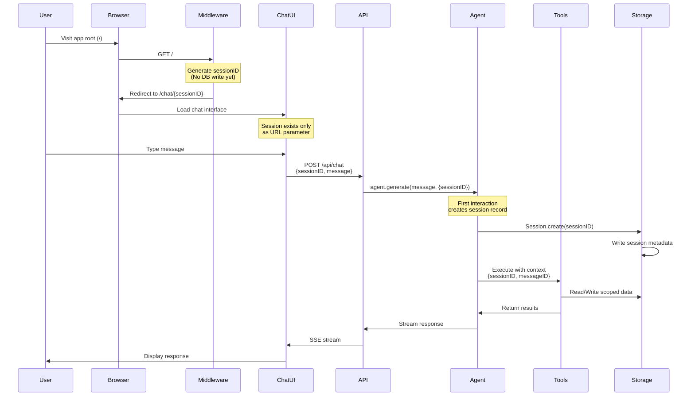
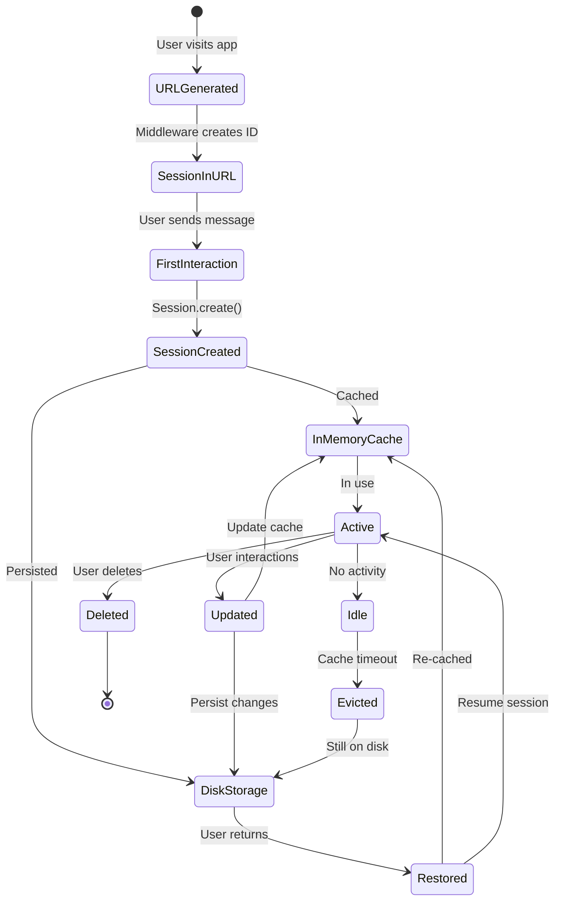
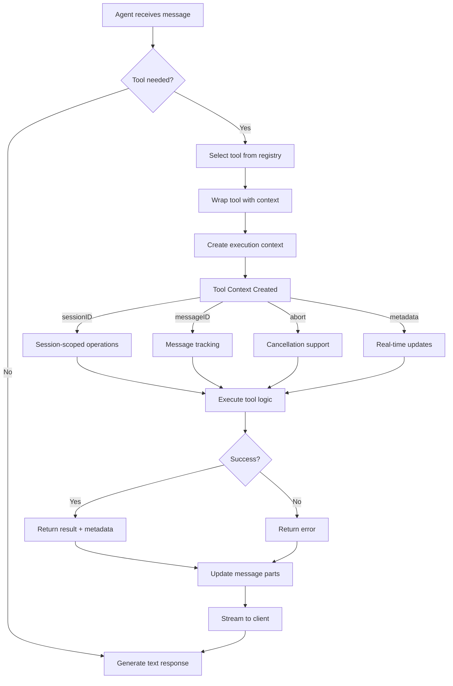
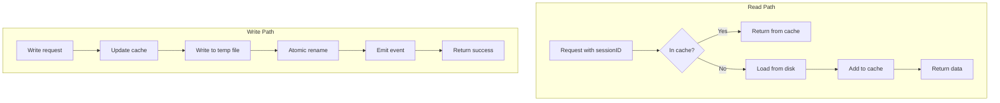

# OpenCode Architecture Diagrams

## 1. Session Creation and Agent Flow



## 2. Tool Context Flow Architecture

```mermaid
graph TB
    subgraph "Entry Points"
        CLI[CLI Command]
        Web[Web Interface]
        API[API Endpoint]
    end
    
    subgraph "Session Layer"
        SessionMgr[Session Manager]
        SessionCache[In-Memory Cache]
        SessionStorage[Session Storage]
    end
    
    subgraph "Agent Execution"
        Agent[Agent]
        Context[Execution Context]
        Tools[Tool Registry]
    end
    
    subgraph "Tool Execution"
        ToolWrapper[Tool Wrapper]
        ToolImpl[Tool Implementation]
        ToolContext[Tool Context<br/>- sessionID<br/>- messageID<br/>- abort signal<br/>- metadata()]
    end
    
    subgraph "Storage Layer"
        Storage[Storage Service]
        FileSystem[File System]
        EventBus[Event Bus]
    end
    
    CLI --> SessionMgr
    Web --> SessionMgr
    API --> SessionMgr
    
    SessionMgr --> SessionCache
    SessionMgr --> SessionStorage
    SessionCache -.->|miss| SessionStorage
    
    SessionMgr --> Agent
    Agent --> Context
    Context --> Tools
    Tools --> ToolWrapper
    
    ToolWrapper --> ToolContext
    ToolContext --> ToolImpl
    
    ToolImpl --> Storage
    Storage --> FileSystem
    Storage --> EventBus
    
    EventBus -.->|events| SessionMgr
    EventBus -.->|events| Web
```

## 3. State Management Architecture

```mermaid
graph LR
    subgraph "App State (Singleton)"
        App[App Instance]
        Services[Services Map]
        GlobalState[Global State]
    end
    
    subgraph "Service Registry"
        SessionService[Session Service]
        StorageService[Storage Service]
        ToolService[Tool Service]
        LSPService[LSP Service]
    end
    
    subgraph "Tool State"
        TodoState[Todo Tool State<br/>Map: sessionID → todos[]]
        FileTimeState[FileTime State<br/>Map: sessionID → files[]]
        CustomState[Custom Tool States]
    end
    
    App --> Services
    Services --> SessionService
    Services --> StorageService
    Services --> ToolService
    Services --> LSPService
    
    ToolService --> TodoState
    ToolService --> FileTimeState
    ToolService --> CustomState
    
    SessionService -->|uses| StorageService
    ToolService -->|uses| StorageService
```

## 4. Storage Layer Architecture

```mermaid
graph TB
    subgraph "Storage Operations"
        Write[writeJSON]
        Read[readJSON]
        List[list]
        Remove[remove]
    end
    
    subgraph "Atomic Write Process"
        Original[Original File]
        Temp[Temp File<br/>.tmp suffix]
        Rename[Atomic Rename]
        Cleanup[Cleanup Temp]
    end
    
    subgraph "Directory Structure"
        Root[~/.local/share/opencode/]
        Project[project/{id}/]
        Storage[storage/]
        Session[session/]
        Info[info/]
        Message[message/]
        Part[part/]
        Share[share/]
    end
    
    Write --> Temp
    Temp --> Rename
    Rename --> Original
    Rename --> Cleanup
    
    Read --> Original
    
    Root --> Project
    Project --> Storage
    Storage --> Session
    Session --> Info
    Session --> Message
    Session --> Part
    Session --> Share
    
    Write -.->|emit event| EventBus[Event Bus]
    EventBus -.->|notify| Subscribers[Subscribers]
```

## 5. Session Lifecycle



## 6. Tool Execution Flow



## 7. Memory Access Patterns



## Key Architectural Insights

### 1. **Lazy Session Creation**
- Sessions are NOT created when the user first arrives
- Session IDs are generated client-side or by middleware
- Actual session records are created on first interaction
- This reduces overhead for users who never interact

### 2. **Context Propagation**
- Session context flows through the entire stack
- Tools don't need to know about session management
- Context is injected automatically by the framework

### 3. **State Isolation**
- Each session has its own namespace
- Tools can maintain per-session state
- No cross-session data leakage

### 4. **Performance Optimization**
- In-memory caching for active sessions
- Lazy loading from disk when needed
- Event-driven updates for real-time sync

### 5. **Reliability Features**
- Atomic writes prevent corruption
- Migration system for schema evolution
- Graceful degradation if storage fails

## Implementation Order for hal9000

Based on this architecture analysis, here's the recommended implementation order:

1. **Phase 1: Context Infrastructure**
   - Add context types and interfaces
   - Update tool creation patterns
   - Implement context propagation

2. **Phase 2: Storage Layer**
   - Implement atomic write operations
   - Add event bus for updates
   - Create migration system

3. **Phase 3: Session Management**
   - Build session manager with caching
   - Implement lazy loading
   - Add session lifecycle hooks

4. **Phase 4: Tool Integration**
   - Update existing tools to use context
   - Add per-session state management
   - Implement real-time metadata updates

5. **Phase 5: Testing & Migration**
   - Create comprehensive test suite
   - Build migration tools for existing data
   - Deploy with feature flags