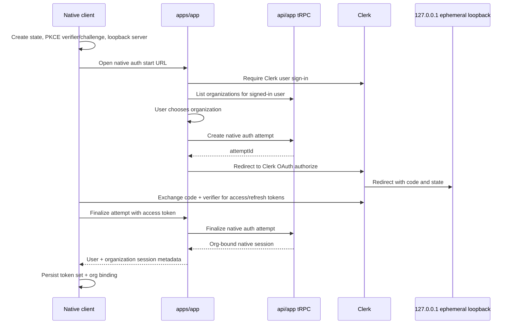

# Native Org-Bound Auth Design

## Context

Lightfast has two native clients:

- `core/cli`, a terminal client.
- `apps/desktop`, an Electron client.

Both clients should authenticate with Clerk OAuth using Authorization Code +
PKCE. The important product invariant is stronger than user authentication:

> A native client is either logged out, or authenticated as one user in one
> organization.

There is no valid native session that has a user but no selected organization.
The selected native organization may differ from the user's currently active
organization in the web app.

## Goals

- Use one org-bound native auth architecture for CLI and desktop.
- Use Clerk OAuth access and refresh tokens for native clients.
- Require organization selection in the `apps/app` layer before native sign-in
  completes.
- Keep native clients free of Lightfast API keys.
- Keep native clients free of `apps/app` internals; they interact only with
  public native-auth HTTP endpoints.
- Keep `apps/app` route handlers thin. They validate request shape and call the
  `api/app` tRPC server caller for business logic.
- Keep Clerk, database, membership, and auth-attempt logic inside `api/app`.
- Use loopback redirects with ephemeral local ports for both CLI and desktop.
- Store refresh tokens only in native local storage controlled by the native
  process.

## Non-Goals

- No user-only native session state.
- No native API-key creation or storage.
- No desktop-specific org chooser UI in Electron for v1.
- No org switch command or desktop org switcher in the first migration. Future
  switching should reuse the same org-bound native auth transaction.
- No attempt to preserve legacy desktop JWT sessions or legacy CLI auth state.
  Existing local auth files may be treated as expired and cleared.
- No direct Clerk or database calls from `apps/app` route handlers.

## Standards Posture

Native auth follows the OAuth 2.0 for Native Apps model:

- Authorization Code flow.
- PKCE with `S256`.
- System browser.
- Loopback redirect URI on `127.0.0.1` with an ephemeral port.

Implementation must verify Clerk configuration support for the exact loopback
redirect pattern before rollout. If Clerk requires registered redirect URIs with
fixed ports, the implementation plan must either use a supported Clerk pattern
or explicitly scope a provider-side configuration change.

## Architecture

The native auth system has four boundaries.

1. Native clients

   `core/cli` and `apps/desktop` generate PKCE, start a loopback callback
   server, open the app-layer auth route, exchange the Clerk authorization code,
   store the resulting token set, and attach native session headers to API
   calls.

2. `apps/app` native-auth facade

   App routes expose stable HTTP endpoints for native clients. These routes are
   the only Lightfast auth endpoints native clients know. They do not perform
   direct Clerk or database work. They call `api/app` tRPC server-side
   procedures.

3. `api/app` native-auth router

   The tRPC router owns native OAuth config, auth-attempt creation,
   finalization, Clerk OAuth token validation, organization membership
   validation, and native org-scoped identity construction.

4. Clerk

   Clerk owns user authentication and OAuth access/refresh token issuance.
   Lightfast owns organization binding.



## Native Session Invariant

The shared persisted session shape is conceptually:

```ts
type NativeSession = {
  schemaVersion: 2;
  appOrigin: string;
  client: "cli" | "desktop";
  oauth: {
    issuer: string;
    clientId: string;
  };
  tokens: {
    accessToken: string;
    refreshToken: string;
    tokenType: "Bearer";
    expiresAt: number;
  };
  user: {
    id: string;
    email?: string;
  };
  organization: {
    id: string;
    slug?: string;
    name?: string;
  };
};
```

A session is valid only when `tokens`, `user`, and `organization` are present.
If token refresh fails, organization validation fails, or stored schema
validation fails, the native client clears local auth and becomes logged out.

## Native Auth Attempts

Organization binding is represented by a short-lived native auth attempt created
by `api/app` after the user chooses an organization in `apps/app`.

The attempt should contain:

```ts
type NativeAuthAttempt = {
  id: string;
  client: "cli" | "desktop";
  userId: string;
  organizationId: string;
  redirectUri: string;
  codeChallenge: string;
  codeChallengeMethod: "S256";
  stateHash: string;
  expiresAt: number;
};
```

The attempt is single-use and expires quickly. Redis is the preferred backing
store because the data is ephemeral, security-sensitive, and not a durable
application record.

The OAuth `state` value should identify the attempt and carry enough entropy for
the native client to reject unrelated callbacks. It must not carry raw secrets.

## Request Authentication

Native API requests carry both the Clerk OAuth access token and the selected
Lightfast organization:

```http
Authorization: Bearer <clerk_oauth_access_token>
x-lightfast-native-client: cli | desktop
x-lightfast-organization-id: <organization_id>
```

`api/app` constructs an org-scoped identity only after validating:

- the Bearer token is a valid Clerk OAuth access token,
- the OAuth client ID matches the declared native client,
- required scopes are present,
- the organization exists,
- the user is still a member of the organization.

During auth finalization, `api/app` additionally verifies that the token user
matches the user recorded on the native auth attempt. During normal API
requests, the token user is the authenticated user and the organization header
selects the org-scoped context after membership validation.

This replaces any native API-key identity path and any desktop-specific Clerk
JWT-template identity path.

## `apps/app` Route Surface

The public native-auth route surface should be stable and client-oriented:

```text
/api/native-auth/cli/oauth-config
/api/native-auth/desktop/oauth-config
/api/native-auth/finalize
```

The app-layer browser flow should be stable and UI-oriented:

```text
/native-auth/:client/start
/native-auth/:client/select-org
```

Route names may be adjusted to match App Router conventions, but the conceptual
split should remain:

- API endpoints for native clients.
- Browser pages for user sign-in and org selection.
- tRPC procedures behind both.

## Shared Contract Package

`@repo/native-auth-contract` should own shared schemas and constants:

- native client enum,
- required OAuth scopes,
- PKCE method constants,
- loopback callback path,
- OAuth config response schema,
- finalize request and response schemas,
- native session metadata schema,
- native request header names.

Native clients and `apps/app` should import these contracts instead of
duplicating string literals.

The contract package should not own Clerk calls, token exchange implementation,
Electron storage, CLI storage, or tRPC procedures.

## CLI Design

`core/cli` should use the same org-bound transaction as desktop.

`lightfast auth login` opens `apps/app`, where the user signs in and chooses an
organization. The CLI stores the completed org-bound native session only after
finalization succeeds.

`lightfast auth status` should display both the signed-in user and selected
organization.

Future `lightfast auth switch` should rerun the same native auth transaction and
replace the stored org-bound session.

The CLI should not call app tRPC directly and should not know about `api/app`.
It should call only `apps/app` native-auth HTTP endpoints and regular public
application APIs.

## Desktop Design

`apps/desktop` should use the same org-bound transaction, launched from the
Electron main process.

The renderer asks the main process for auth through IPC. The main process owns:

- PKCE generation,
- loopback listener lifecycle,
- system browser launch,
- Clerk token exchange,
- refresh token rotation,
- encrypted local token storage,
- sign-out and auth clearing.

The renderer receives access tokens only through IPC when needed for tRPC
headers. It never receives refresh tokens.

The desktop app is signed in only after finalization returns organization
metadata. Until then it remains logged out.

## Storage

Desktop stores the native session using Electron `safeStorage`.

CLI stores the native session using the existing CLI configuration directory.
For v1, filesystem permissions plus schema validation are acceptable. A future
hardening pass may add optional OS keychain support, but this design does not
require it.

Both clients should version stored auth state and clear unknown or legacy
schemas.

## Environment and Config

Native clients should not require Clerk environment variables.

Clerk OAuth client IDs belong on the app/API side and are returned through the
native-auth config endpoints. The only client-specific Clerk values should be:

- CLI OAuth client ID.
- Desktop OAuth client ID.

Scopes and callback path constants should live in `@repo/native-auth-contract`,
not in environment variables.

## Cleanup Targets

After migration, remove the old native auth paths:

- legacy CLI API-key setup and login routes,
- native API-key creation from CLI auth,
- desktop `/desktop/auth` bridge that mints a Clerk JWT template,
- desktop `/api/auth/code`,
- desktop `/api/auth/token`,
- desktop short-code store for JWT handoff,
- desktop JWT-template verification helpers,
- custom-protocol redirect dependency for auth,
- docs that describe desktop auth as a 24-hour Clerk JWT template session.

## Testing

Testing should cover the complete auth story rather than only individual
helpers.

Focused unit coverage:

- contract schemas,
- PKCE verifier/challenge behavior,
- native auth attempt expiry and single-use behavior,
- Clerk OAuth token validation by native client,
- organization membership validation,
- legacy auth storage invalidation.

Integration coverage:

- CLI login receives an org-bound session.
- Desktop login receives an org-bound session.
- Requests without `x-lightfast-organization-id` are rejected.
- Requests with mismatched client ID and native client header are rejected.
- Requests for an organization the user does not belong to are rejected.
- Refresh failure clears native auth.

End-to-end coverage:

- Start app dev server.
- Run CLI OAuth login against local app using loopback.
- Launch desktop auth flow against local app using loopback.
- Verify authenticated tRPC/API calls succeed only with the selected org.

## Rollout

The safest rollout is staged:

1. Generalize native auth contracts and `api/app` validation.
2. Convert CLI to org-bound finalization while preserving the current command
   surface.
3. Convert desktop to the same org-bound transaction.
4. Remove legacy API-key and desktop JWT-template paths.
5. Update README and operational docs.

Each stage should be independently typechecked and tested. The final cleanup
stage should run repo-wide typecheck because it removes cross-package exports
and auth routes.
