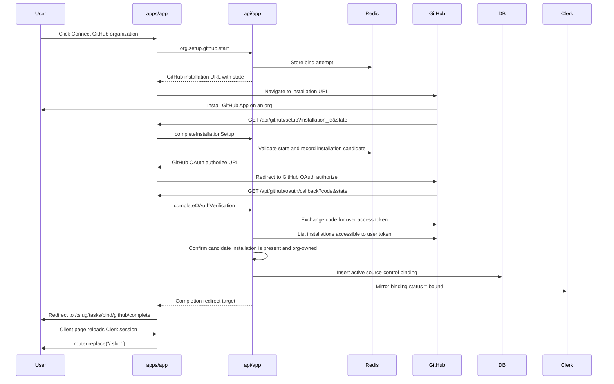

# GitHub Org Binding Design

## Context

Lightfast already has the core org binding gate:

- `lightfast_org_source_control_bindings` is the authoritative DB table for
  source-control bindings.
- Clerk organization `publicMetadata.lightfast.binding` mirrors only a compact
  `lf_binding_status` session claim for proxy routing.
- Unbound active orgs are redirected from product routes to
  `/:slug/tasks/bind`.
- `task.bind` is currently a non-production placeholder that writes an active
  DB row without a real provider installation.

This design replaces the placeholder with a real GitHub App installation flow
that binds one GitHub organization to one Lightfast organization.

## Decision

V1 is Lightfast-initiated only:

```text
/:slug/tasks/bind -> GitHub App installation -> Lightfast callback -> bound org
```

We will not support GitHub-first installs in v1. If someone installs the app
from GitHub without first starting from Lightfast, the setup callback should
show a recoverable error and direct them to start from the Lightfast org setup
page.

## Goals

- Bind one GitHub organization installation to one Lightfast organization.
- Require a Lightfast org admin to start and complete binding.
- Keep the DB binding row authoritative and keep Clerk as a non-sensitive
  routing mirror.
- Verify GitHub's `installation_id` before writing a binding.
- Store GitHub provider identifiers and non-sensitive metadata in the DB.
- Never store GitHub user access tokens from the setup verification step.
- Handle GitHub App uninstall/revocation webhooks so bound orgs become
  unbound promptly.
- Keep `apps/app` route handlers thin; business logic lives in `api/app`
  procedures/helpers.
- Keep the UI setup path small and compatible with the existing
  `lf_binding_status` session reload behavior.

## Non-Goals

- No GitHub-first unclaimed installation queue in v1.
- No multiple source-control bindings per Lightfast org in v1.
- No repository picker or repo-level binding in Lightfast in v1. The GitHub App
  installation page owns repository selection.
- No long-lived GitHub user-token storage.
- No GitHub Enterprise Server support in v1.
- No broader source-control abstraction beyond the current provider column.
- No complete GitHub event ingestion pipeline in this binding work.

## GitHub Docs Caveats

The implementation must account for these GitHub-specific constraints:

- The setup URL receives `installation_id`, but GitHub warns that this query
  parameter can be spoofed. Lightfast must not trust it until it is verified
  through GitHub APIs using a GitHub App user access token.
- Installation links can carry a `state` parameter. Lightfast should use this
  only as a high-entropy correlation token with a short TTL.
- To control the OAuth callback URL, do not rely on GitHub's automatic
  "Request user authorization during installation" option. Start a separate
  GitHub App OAuth web flow from the Lightfast setup callback and pass an exact
  `redirect_uri`.
- GitHub App user access tokens have fine-grained permissions rather than
  classic OAuth scopes. The token's reachable installations are the
  intersection of app access and user access.
- Users behind GitHub organization SAML SSO may need an active SAML session
  before the GitHub user-token API reports expected organization resources.
- `GET /user/installations` is paginated. The verifier must page until it finds
  the candidate installation or exhausts the result set.
- Only `target_type: "Organization"` installations are accepted. Personal-user
  installations are rejected for v1.
- GitHub App installation access tokens expire after one hour. Lightfast should
  mint them just-in-time and never persist them.
- GitHub App webhooks must be verified against the raw request body with
  `X-Hub-Signature-256` and constant-time comparison.
- GitHub may deliver webhooks out of order or with delay. Webhook handlers must
  be idempotent and should prefer revocation/deletion as the safest terminal
  state.
- Failed webhook deliveries are not automatically redelivered. Operationally,
  Lightfast should support manual or scheduled redelivery checks later.
- GitHub recommends responding to webhooks with 2xx within 10 seconds and doing
  longer work asynchronously.
- GitHub App webhooks are configured once per app, not per installed org. The
  endpoint must dispatch by `X-GitHub-Event` and payload `action`.
- Local webhook testing needs a public HTTPS URL; `localhost` is not sufficient
  for GitHub delivery.

Reference docs:

- <https://docs.github.com/en/enterprise-cloud@latest/apps/creating-github-apps/registering-a-github-app/about-the-setup-url>
- <https://docs.github.com/en/apps/sharing-github-apps/sharing-your-github-app>
- <https://docs.github.com/en/apps/creating-github-apps/authenticating-with-a-github-app/generating-a-user-access-token-for-a-github-app>
- <https://docs.github.com/en/apps/creating-github-apps/authenticating-with-a-github-app/authenticating-as-a-github-app-installation>
- <https://docs.github.com/en/rest/apps/installations>
- <https://docs.github.com/en/webhooks/using-webhooks/validating-webhook-deliveries>
- <https://docs.github.com/en/webhooks/using-webhooks/best-practices-for-using-webhooks>
- <https://docs.github.com/en/webhooks/testing-and-troubleshooting-webhooks/troubleshooting-webhooks>
- <https://docs.github.com/en/webhooks/using-webhooks/handling-failed-webhook-deliveries>
- <https://docs.github.com/en/webhooks/webhook-events-and-payloads>

## Architecture

The flow has five boundaries.

1. `apps/app` setup UI

   The bind card starts the GitHub installation flow and later refreshes the
   Clerk session so `lf_binding_status: "bound"` is present before navigating
   back to the workspace.

2. `apps/app` route handlers

   Route handlers receive GitHub callbacks and webhooks. They validate request
   shape, preserve raw webhook bodies for signature verification, call `api/app`
   server-side procedures/helpers, and perform redirects or JSON responses.

3. `api/app` GitHub binding domain

   This owns bind attempts, GitHub App config, GitHub API calls, DB binding
   writes, webhook processing, and Clerk metadata mirroring.

4. GitHub

   GitHub owns installation UI, app OAuth, installation metadata, installation
   tokens, and webhook delivery.

5. Clerk

   Clerk owns Lightfast user/org membership and mirrors non-sensitive binding
   status into the session token.

## Route Surface

New app routes:

```text
GET  /api/github/setup
GET  /api/github/oauth/callback
POST /api/github/webhook
GET  /:slug/tasks/bind/github/complete
```

`/api/github/setup` and `/api/github/oauth/callback` need Clerk middleware
context but should not be proxy-enforced as product routes. They should be
listed as public app routes in `apps/app/src/proxy.ts`.

`/api/github/webhook` must bypass Clerk enforcement and authenticate only with
GitHub webhook signature verification. It should be listed with the app-owned
API prefixes, like `/api/inngest` and `/api/v1`.

New tRPC surface:

```text
org.setup.github.start
org.setup.github.completeInstallationSetup
org.setup.github.completeOAuthVerification
```

`start` is called by the client. The two completion procedures are called only
from server route handlers through an app-owned caller.

`task.status` remains as the generic setup status query. The placeholder
`task.bind` should be removed from the product UI path. Production must not
mark an org bound without a verified GitHub installation.

## Bind Attempt State

Use Redis, following the native OAuth attempt pattern.

```ts
type GitHubOrgBindAttempt = {
  attemptId: string;
  phase: "installing" | "oauth_pending";
  clerkOrgId: string;
  orgSlug: string;
  lightfastUserId: string;
  stateHash: string;
  createdAt: string;
  expiresAt: string;
  providerInstallationId?: string;
  oauthStateHash?: string;
};
```

Attempt rules:

- TTL: 15 minutes.
- State: base64url JSON containing `attemptId` and a random nonce; store only a
  SHA-256 hash in Redis.
- Single active start per click; a second click may create a fresh attempt.
- `start` requires the current Lightfast user to be an admin of the active
  Lightfast org.
- Callback procedures must verify the current Clerk user matches
  `lightfastUserId` and is still an admin of `clerkOrgId`.
- The setup callback does not write the DB binding. It only records the
  candidate `providerInstallationId` and starts GitHub App OAuth.
- The OAuth callback consumes the attempt. Success writes the DB binding; any
  failure returns the user to setup with an error.

## Primary Flow



## GitHub Verification

The verifier should perform these checks before the DB write:

- GitHub OAuth callback `state` matches the Redis attempt and consumes it.
- GitHub OAuth `code` exchanges successfully using
  `GITHUB_APP_CLIENT_ID`, `GITHUB_APP_CLIENT_SECRET`, and the exact callback
  URL configured on the GitHub App.
- The user access token can list the candidate `installation_id` through
  `GET /user/installations`.
- The installation has `target_type: "Organization"`.
- The installation account has a numeric `id` and string `login`.
- The installation is not suspended.
- The installation `app_id` or `client_id` matches the configured GitHub App.
- The Lightfast user is still a Lightfast org admin.
- No other active Lightfast org is already bound to that installation.

The GitHub user access token is discarded after verification.

## DB Writes

The existing table is sufficient for v1.

`lightfast_org_source_control_bindings` should store:

- `clerkOrgId`: Lightfast Clerk org id.
- `provider`: `"github"`.
- `providerAccountId`: GitHub organization account id as a string.
- `providerAccountLogin`: GitHub organization login.
- `providerInstallationId`: GitHub App installation id as a string.
- `status`: `"active"`.
- `connectedByUserId`: Lightfast Clerk user id.
- `metadata`: non-sensitive installation metadata:
  - `repositorySelection`
  - `permissions`
  - `events`
  - `githubAppSlug`
  - `githubAppId`
  - `githubSetupAction` if provided
  - `verifiedBy: "github_user_installations"`

Repository helper changes:

- Add a provider-installation lookup helper.
- Add a bind-finalization helper that:
  - returns the existing active binding if it is already this exact
    installation for this Lightfast org,
  - throws `CONFLICT` if the Lightfast org is active-bound to another
    installation,
  - throws `CONFLICT` if another Lightfast org is active-bound to this
    installation,
  - inserts the active binding otherwise.
- Keep DB write before Clerk mirror on bind.
- Keep Clerk mirror before DB status transition on revocation.

The current unique indexes remain useful:

- `activeClerkOrgId` enforces one active binding per Lightfast org.
- `providerInstallationId` prevents the same installation from being bound to
  multiple rows.

If implementation finds that revoked historical rows block valid rebinds of the
same installation id, handle that explicitly in the helper by updating/reviving
the historical row instead of creating a duplicate. Do not hand-edit migration
SQL.

## Webhooks

Add `POST /api/github/webhook`.

Security requirements:

- Read the raw request body before JSON parsing.
- Verify `X-Hub-Signature-256` using `GITHUB_APP_WEBHOOK_SECRET`.
- Use `crypto.timingSafeEqual`.
- Require `X-GitHub-Event`.
- Use `X-GitHub-Delivery` for idempotency. Store processed successful delivery
  ids in Redis with a TTL. If a delivery is redelivered after success, return
  2xx without reprocessing.
- Return 2xx quickly. If processing grows beyond simple binding updates, move
  work behind Inngest or another queue.

Events for v1:

- `installation.deleted`
  - Find active/error binding by `providerInstallationId`.
  - Mirror Clerk status to `revoked` first.
  - Mark DB binding `revoked`.
  - Treat missing binding as successful no-op.
- `installation.suspend`
  - Find active binding by installation id.
  - Mirror Clerk status to `revoked`.
  - Mark DB binding `error` with metadata reason `github_installation_suspended`.
- `installation.unsuspend`
  - Find existing `error` binding by installation id.
  - Re-verify the installation as the GitHub App if needed.
  - Mark DB binding active and mirror Clerk status to `bound`.
- `installation.new_permissions_accepted`
  - Update stored permissions/events metadata.
  - Do not change bound status unless the installation was previously in an
    `error` state caused by missing permissions and now passes verification.
- `installation_repositories.added` and `installation_repositories.removed`
  - Update metadata for repository selection/repository counts if present.
  - Do not change bound status.
- `installation_target.renamed`
  - Update `providerAccountLogin` and metadata.

Future webhook note requested by product:

- Add explicit `github_app_authorization` handling for GitHub user
  authorization revocation. V1 does not store GitHub user access tokens, so this
  event does not affect binding state. When Lightfast stores user-scoped GitHub
  tokens or audit trails, this callback should clear those user-scoped records
  and keep installation-level bindings intact unless the installation itself is
  deleted.

Operational note:

- GitHub does not automatically redeliver failed webhook deliveries. Add a
  follow-up operational task for scheduled failed-delivery checks or a manual
  runbook.

## UI

`BindGithubCard` changes from a direct `task.bind` mutation to a real external
flow:

- Button label remains `Connect GitHub organization`.
- Mutation calls `org.setup.github.start`.
- On success, `window.location.assign(result.installationUrl)`.
- On mutation error, existing React Query mutation toast behavior applies.

Add a completion client page under:

```text
/:slug/tasks/bind/github/complete
```

This page:

- calls `session.reload()`,
- redirects to `/:slug`,
- shows a compact "Finishing connection..." loading state while the session is
  refreshing.

Error redirects should return to `/:slug/tasks/bind` with a compact error code
that the bind card can render or toast, for example:

```text
?github_error=expired_state
?github_error=installation_not_verified
?github_error=personal_account_not_supported
?github_error=permission_required
?github_error=installation_already_bound
```

Do not display provider secrets, installation tokens, raw GitHub OAuth errors,
or internal exception messages.

## Environment

Add server-only env values to `api/app/src/env.ts`:

```text
GITHUB_APP_ID
GITHUB_APP_SLUG
GITHUB_APP_CLIENT_ID
GITHUB_APP_CLIENT_SECRET
GITHUB_APP_PRIVATE_KEY
GITHUB_APP_WEBHOOK_SECRET
```

Implementation should normalize private keys that arrive with escaped newlines.

Derived URLs should use the current app origin:

```text
https://<app-origin>/api/github/setup
https://<app-origin>/api/github/oauth/callback
https://<app-origin>/api/github/webhook
```

GitHub App configuration:

- Setup URL: `/api/github/setup`.
- Callback URL: `/api/github/oauth/callback`.
- Webhook URL: `/api/github/webhook`.
- Webhook secret: `GITHUB_APP_WEBHOOK_SECRET`.
- Disable automatic "Request user authorization during installation" for v1 so
  Lightfast controls the OAuth callback URL and state.
- Subscribe only to the webhook events needed for binding lifecycle.

## Error Handling

- Expired/missing state: redirect to bind page with `expired_state`.
- GitHub OAuth denial: redirect with `github_authorization_denied`.
- Candidate installation not visible to the GitHub user token: redirect with
  `installation_not_verified`.
- Personal account install: redirect with `personal_account_not_supported`.
- Lightfast user no longer admin: redirect with `permission_required`.
- Existing binding conflict: redirect with `installation_already_bound` or
  `org_already_bound`.
- Clerk mirror failure after DB bind: log warning and still redirect to
  completion. Product API authorization reads the DB; the session claim may
  self-repair through a later mirror repair task.
- Webhook Clerk mirror failure during revocation: return non-2xx so GitHub
  records a failed delivery. This is safer than leaving a revoked installation
  with a `bound` session mirror.

## Testing

Follow TDD during implementation.

Focused unit tests:

- Redis bind attempt issue/verify/phase transition/consume behavior.
- GitHub installation URL includes app slug and state.
- Setup callback rejects missing, mismatched, or expired state.
- OAuth callback rejects invalid state, failed token exchange, personal account
  installs, inaccessible installations, and already-bound installation
  conflicts.
- OAuth callback writes provider ids and non-sensitive metadata on success.
- User access token is not persisted.
- Clerk mirror receives `bound` only after DB bind succeeds.
- Webhook signature validation uses raw body and rejects invalid signatures.
- `installation.deleted` mirrors `revoked` before DB revocation.
- Webhook delivery idempotency handles repeated `X-GitHub-Delivery`.
- Proxy tests cover `/api/github/webhook` bypass and GitHub setup/callback
  route admission.
- Bind card starts external navigation instead of calling placeholder bind.
- Completion page reloads Clerk session and redirects to workspace.

Integration/manual checks:

- Configure a dev GitHub App against an HTTPS tunnel.
- Start from an unbound Lightfast org and install the GitHub App on a GitHub
  organization.
- Confirm DB row contains GitHub org id/login/installation id.
- Confirm Clerk session claim updates after completion.
- Confirm product route no longer redirects to bind page.
- Uninstall the GitHub App and confirm binding becomes revoked/unbound.
- Redeliver the uninstall webhook and confirm idempotent success.

## Rollout

1. Add env schema and GitHub App config helper.
2. Add Redis bind attempt helpers.
3. Add GitHub API helper functions.
4. Add DB binding finalization/revocation helper changes.
5. Add tRPC setup GitHub router.
6. Add app route handlers.
7. Update proxy route admission.
8. Update bind UI and completion page.
9. Add webhook handler.
10. Remove or disable production placeholder binding.
11. Configure GitHub App URLs/secrets per environment.
12. Verify against a dev GitHub App before production rollout.

## Open Implementation Notes

- Prefer native `fetch` plus narrow Zod response schemas for GitHub's few API
  calls. Add Octokit only if implementation complexity grows beyond these
  endpoints.
- The tRPC route already runs on the Node.js runtime for GitHub App crypto.
  GitHub callback/webhook route handlers must also use `runtime = "nodejs"`.
- Use `catalog:` for any new external dependency, and keep internal dependencies
  on `workspace:*`.
- If schema changes become necessary, use `pnpm db:generate`; never write SQL by
  hand.
