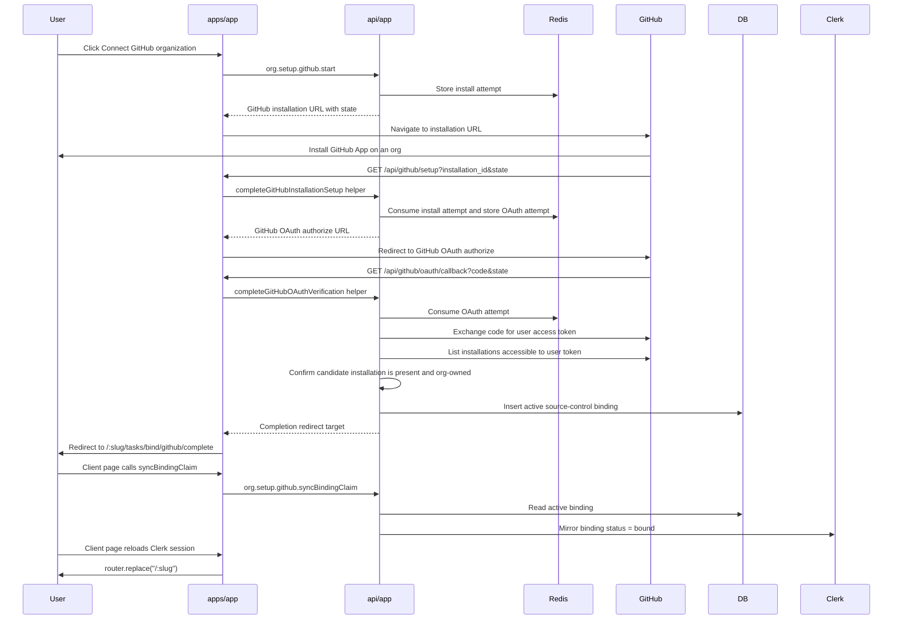

# GitHub Org Binding Design

## Context

Lightfast already has the core org binding gate:

- `lightfast_org_source_control_bindings` is the authoritative DB table for
  source-control bindings.
- The table is defined in
  `db/app/src/schema/tables/org-source-control-bindings.ts`; all GitHub binding
  work in this plan must write through that model rather than introducing a
  GitHub-specific binding table.
- Clerk organization `publicMetadata.lightfast.binding` mirrors only a compact
  `lf_binding_status` session claim for proxy routing.
- Unbound active orgs are redirected from product routes to
  `/:slug/tasks/bind`.
- `task.bind` is currently a non-production placeholder that writes an active
  DB row without a real provider installation.

This design replaces the placeholder with a real GitHub App installation flow
that binds one GitHub organization to one Lightfast organization.

## Decision

V1 is Lightfast-initiated only:

```text
/:slug/tasks/bind -> GitHub App installation -> Lightfast callback -> bound org
```

We will not support GitHub-first installs in v1. If someone installs the app
from GitHub without first starting from Lightfast, the setup callback should
show a recoverable error and direct them to start from the Lightfast org setup
page.

## Glossary

- **Lightfast org**: Clerk organization selected in the Lightfast web app.
- **GitHub organization**: GitHub account with `target_type: "Organization"`.
  Personal account installations are rejected in v1.
- **GitHub App installation**: Provider-side installation identified by
  `installation_id`. This becomes `providerInstallationId` in
  `lightfast_org_source_control_bindings`.
- **Binding**: One row in `lightfast_org_source_control_bindings`. This is the
  durable source of truth for whether a Lightfast org is bound.
- **Binding claim**: Clerk session/JWT mirror claim `lf_binding_status`. This is
  routing UX only, not the source of truth for API authorization.
- **GitHub user access token**: Short-lived OAuth proof that the signed-in
  browser user can see the candidate installation. Lightfast discards it after
  verification.
- **GitHub installation access token**: Short-lived app token minted
  just-in-time for future installation-scoped GitHub API calls. Lightfast does
  not persist it.

## Goals

- Bind one GitHub organization installation to one Lightfast organization.
- Require a Lightfast org admin to start and complete binding.
- Keep the DB binding row authoritative and keep Clerk as a non-sensitive
  routing mirror.
- Verify GitHub's `installation_id` before writing a binding.
- Store GitHub provider identifiers and non-sensitive metadata in the DB.
- Never store GitHub user access tokens from the setup verification step.
- Handle GitHub App uninstall/revocation webhooks so bound orgs become
  unbound promptly.
- Keep `apps/app` route handlers thin; business logic lives in `api/app`
  procedures/helpers.
- Keep the UI setup path small and compatible with the existing
  `lf_binding_status` session reload behavior.
- Keep the public tRPC surface minimal: browser callbacks and webhooks should
  not become generally callable tRPC procedures unless the UI needs them.
- Keep GitHub API/crypto code out of app routers by moving reusable contracts
  and Node helpers into dedicated packages.
- Provide a fast local-dev path for the already-installed happy path without
  treating local emulation as a replacement for real GitHub App setup testing.

## Non-Goals

- No GitHub-first unclaimed installation queue in v1.
- No multiple source-control bindings per Lightfast org in v1.
- No repository picker or repo-level binding in Lightfast in v1. The GitHub App
  installation page owns repository selection.
- No long-lived GitHub user-token storage.
- No GitHub Enterprise Server support in v1.
- No broader source-control abstraction beyond the current provider column.
- No complete GitHub event ingestion pipeline in this binding work.
- No fork of `vercel-labs/emulate` for v1.
- No local reimplementation of GitHub's full App installation UI. Local dev may
  use a Lightfast-owned shim that simulates only GitHub's redirect back to the
  setup URL.

## GitHub Docs Caveats

The implementation must account for these GitHub-specific constraints:

- The setup URL receives `installation_id`, but GitHub warns that this query
  parameter can be spoofed. Lightfast must not trust it until it is verified
  through GitHub APIs using a GitHub App user access token.
- Installation links can carry a `state` parameter. Lightfast should use this
  only as a high-entropy correlation token with a short TTL.
- To control the OAuth callback URL, do not rely on GitHub's automatic
  "Request user authorization during installation" option. Start a separate
  GitHub App OAuth web flow from the Lightfast setup callback and pass an exact
  `redirect_uri`.
- Use GitHub App OAuth `state` and PKCE. GitHub strongly recommends `state`,
  exact `redirect_uri`, and PKCE for the web application flow. The PKCE
  verifier is an ephemeral Redis secret and must not be logged.
- GitHub App user access tokens have fine-grained permissions rather than
  classic OAuth scopes. The token's reachable installations are the
  intersection of app access and user access.
- Users behind GitHub organization SAML SSO may need an active SAML session
  before the GitHub user-token API reports expected organization resources.
- `GET /user/installations` is paginated. The verifier must page until it finds
  the candidate installation or exhausts the result set.
- Only `target_type: "Organization"` installations are accepted. Personal-user
  installations are rejected for v1.
- GitHub App installation access tokens expire after one hour. Lightfast should
  mint them just-in-time and never persist them.
- GitHub App webhooks must be verified against the raw request body with
  `X-Hub-Signature-256` and constant-time comparison.
- GitHub may deliver webhooks out of order or with delay. Webhook handlers must
  be idempotent and should prefer revocation/deletion as the safest terminal
  state.
- Failed webhook deliveries are not automatically redelivered. Operationally,
  Lightfast should support manual or scheduled redelivery checks later.
- GitHub recommends responding to webhooks with 2xx within 10 seconds and doing
  longer work asynchronously.
- GitHub App webhooks are configured once per app, not per installed org. The
  endpoint must dispatch by `X-GitHub-Event` and payload `action`.
- GitHub's webhook event docs list default GitHub App lifecycle events such as
  `installation`, `installation_repositories`,
  `installation_target`, and `github_app_authorization`. Some action lists are
  sparse in the rendered docs, so implementation must validate against real
  delivery payloads from a dev app before production rollout.
- Local webhook testing needs a public HTTPS URL; `localhost` is not sufficient
  for GitHub delivery.
- `vercel-labs/emulate@0.6.0` is useful for local OAuth, seeded GitHub App
  installations, org membership checks, repo events, and app webhook delivery,
  but it does not implement GitHub's App installation UI/setup redirect route,
  `GET /user/installations`, installation lifecycle webhooks, or PKCE
  enforcement.
- `vercel-labs/emulate@0.6.0` currently rejects valid GitHub App JWTs because
  its auth middleware verifies with a private key rather than a derived public
  key. Lightfast's local emulator harness should carry a narrow `pnpm patch`
  until the fix is accepted upstream.

Reference docs:

- <https://docs.github.com/en/enterprise-cloud@latest/apps/creating-github-apps/registering-a-github-app/about-the-setup-url>
- <https://docs.github.com/en/apps/sharing-github-apps/sharing-your-github-app>
- <https://docs.github.com/en/apps/creating-github-apps/authenticating-with-a-github-app/generating-a-user-access-token-for-a-github-app>
- <https://docs.github.com/en/apps/creating-github-apps/authenticating-with-a-github-app/authenticating-as-a-github-app-installation>
- <https://docs.github.com/en/rest/apps/installations>
- <https://docs.github.com/en/webhooks/using-webhooks/validating-webhook-deliveries>
- <https://docs.github.com/en/webhooks/using-webhooks/best-practices-for-using-webhooks>
- <https://docs.github.com/en/webhooks/testing-and-troubleshooting-webhooks/troubleshooting-webhooks>
- <https://docs.github.com/en/webhooks/using-webhooks/handling-failed-webhook-deliveries>
- <https://docs.github.com/en/webhooks/webhook-events-and-payloads>

## Architecture

The flow has eight boundaries.

1. `apps/app` setup UI

   The bind card starts the GitHub installation flow and later refreshes the
   Clerk session so `lf_binding_status: "bound"` is present before navigating
   back to the workspace.

2. `apps/app` route handlers

   Route handlers receive GitHub callbacks and webhooks. They validate request
   shape, preserve raw webhook bodies for signature verification, call `api/app`
   server-side procedures/helpers, and perform redirects or JSON responses.

3. `api/app` GitHub binding domain

   This owns bind attempts, GitHub App config, GitHub API calls, DB binding
   writes, webhook processing, and Clerk metadata mirroring.

   It uses `db/app/src/utils/org-binding.ts` and any focused helpers added next
   to that file. It should not define a second durable binding type that
   competes with `OrgSourceControlBinding`.

4. `@repo/github-app-contract`

   A new package for isomorphic constants and Zod schemas:

   - public route constants,
   - bind error-code vocabulary,
   - normalized GitHub installation metadata schemas,
   - webhook event/action payload schemas used by the handler,
   - client-safe output schemas for `org.setup.github.start`.

   This package has no secrets, no DB, no Clerk, no Redis, no `server-only`, and
   no Node-only crypto. It depends only on `zod`.

5. `@repo/github-app-node`

   A new Node-only helper package for GitHub-specific mechanics:

   - build installation and OAuth authorization URLs,
   - generate PKCE verifier/challenge pairs,
   - exchange GitHub OAuth codes for user access tokens,
   - list user-accessible installations with pagination,
   - create GitHub App JWTs,
   - mint short-lived installation access tokens,
   - verify webhook HMAC signatures,
   - parse and normalize GitHub REST/webhook payloads through the contract
     schemas.

   This package accepts config objects from callers. It must not read
   `process.env` directly, and it must not know about Clerk, Redis, or the
   Lightfast database.

6. GitHub

   GitHub owns installation UI, app OAuth, installation metadata, installation
   tokens, and webhook delivery.

7. Clerk

   Clerk owns Lightfast user/org membership and mirrors non-sensitive binding
   status into the session token.

8. Local GitHub emulator harness

   A dev-only package starts `vercel-labs/emulate` with deterministic GitHub
   fixture data. It supports local development and integration tests for the
   already-installed flow. It must not be imported by production app/runtime
   code.

Boundary rule: `api/app` orchestrates DB/Clerk/Redis and imports the two
GitHub packages. `apps/app` route handlers call `api/app` exported helpers or
public tRPC procedures; they do not call GitHub, DB, Clerk admin APIs, or Redis
directly.

## Route Surface

New app routes:

```text
GET  /api/github/setup
GET  /api/github/oauth/callback
POST /api/github/webhook
GET  /:slug/tasks/bind/github/complete
```

Dev-only route:

```text
GET /api/dev/github/install
```

`/api/dev/github/install` exists only for local emulator flows. It validates
that `GITHUB_INSTALL_URL_OVERRIDE` is enabled in a non-production environment,
preserves the bind `state`, and redirects to `/api/github/setup` with the
fixture `installation_id` and `setup_action=install`. It does not write DB
state and does not mutate the emulator; the installation must already exist in
the emulator seed.

`/api/github/setup` and `/api/github/oauth/callback` need Clerk middleware
context but should not be proxy-enforced as product routes. They should be
listed as public app routes in `apps/app/src/proxy.ts`.

`/api/github/webhook` must bypass Clerk enforcement and authenticate only with
GitHub webhook signature verification. It should be listed with the app-owned
API prefixes, like `/api/inngest` and `/api/v1`.

Public tRPC surface:

```text
org.setup.github.start
org.setup.github.syncBindingClaim
```

`start` is called by the bind card and returns the GitHub installation URL.
`syncBindingClaim` is called by the completion page; it reads the authoritative
DB binding for the active Lightfast org, mirrors `bound` into Clerk when the DB
is active-bound, and is safe to call repeatedly.

The GitHub setup callback, OAuth callback, and webhook handler should be
exported `api/app` server helpers, not public tRPC procedures. This keeps
security-sensitive callback logic out of the browser-callable router while
preserving the same ownership rule: app route handlers stay thin and delegate
business logic to `api/app`.

`task.status` remains as the generic setup status query. The placeholder
`task.bind` should be removed from the product UI path. Production must not
mark an org bound without a verified GitHub installation.

## Implementation Map

| Area | Responsibility | Must Not Own |
| --- | --- | --- |
| `db/app/src/schema/tables/org-source-control-bindings.ts` | Durable binding schema and DB-owned binding types. | GitHub API response types. |
| `db/app/src/utils/org-binding.ts` | Binding read/write helpers, conflict handling, revoke/reactivate transitions. | Clerk metadata mirroring or GitHub fetches. |
| `packages/github-app-contract` | Isomorphic route constants, error codes, normalized GitHub payload schemas, client-safe output schemas. | Secrets, DB types, Redis, Clerk, Node-only crypto. |
| `packages/github-app-node` | GitHub URL building, PKCE, OAuth exchange, app JWTs, installation tokens, webhook signature verification, GitHub REST pagination. | Env loading, Lightfast authorization, DB writes, Clerk writes. |
| `api/app/src/auth` or `api/app/src/github` | GitHub binding orchestration: env config, Redis attempts, GitHub verification, DB helper calls, Clerk mirror calls. | UI rendering. |
| `api/app/src/router/(pending-not-allowed)` | Public setup procedures: `start` and `syncBindingClaim`. | GitHub setup/OAuth/webhook callback logic. |
| `apps/app/src/app/(app)/(pending-not-allowed)/[slug]/tasks/bind` | Bind card, completion/repair page, user-facing error state. | GitHub secrets, DB access, provider verification. |
| `apps/app/src/app/(app)/(github)/api/github` or equivalent colocated route group | Thin setup/OAuth/webhook route handlers. | Business logic beyond parsing, delegation, and redirect/response shaping. |
| `apps/app/src/app/api/dev/github/install` or equivalent route | Local-only redirect shim for emulator installs. | Production GitHub behavior, DB writes, emulator state mutation. |
| `apps/app/src/proxy.ts` | Admit GitHub setup/OAuth routes and bypass webhook route from Clerk auth enforcement. | Source-control binding decisions. |
| `emulators/github` | Dev-only emulator seed, startup scripts, and fixture constants. | Production runtime config or production dependencies. |

## Bind Attempt State

Use Redis, following the native OAuth attempt pattern.

```ts
type GitHubBindInstallAttemptRecord = {
  clerkOrgId: string;
  orgSlug: string;
  lightfastUserId: string;
  stateHash: string;
};

type GitHubBindOAuthAttemptRecord = {
  clerkOrgId: string;
  orgSlug: string;
  lightfastUserId: string;
  providerInstallationId: string;
  stateHash: string;
  codeVerifier: string;
};
```

Attempt rules:

- TTL: 15 minutes.
- State: base64url JSON containing `attemptId` and a random nonce; store only a
  SHA-256 hash in Redis.
- The Redis key already contains the attempt id, and Redis owns expiry. Do not
  duplicate `attemptId`, `createdAt`, or `expiresAt` inside the record unless a
  later UI needs to display them.
- Single active start per click; a second click may create a fresh attempt.
- `start` requires the current Lightfast user to be an admin of the active
  Lightfast org.
- Callback procedures must verify the current Clerk user matches
  `lightfastUserId` and is still an admin of `clerkOrgId`.
- The setup callback consumes the install-attempt key with `GETDEL`, records no
  DB state, and issues a separate OAuth-attempt key containing the candidate
  `providerInstallationId` and PKCE verifier.
- The OAuth callback consumes the OAuth-attempt key. Success writes the DB
  binding; any failure returns the user to setup with an error.
- `orgSlug` is stored only for safe local redirects. Never accept a redirect
  target from GitHub callback query parameters.

## Primary Flow



The OAuth callback helper may also attempt the Clerk mirror immediately after
the DB write as an optimization. The completion page must still call
`syncBindingClaim` because a DB-active/Clerk-stale state otherwise creates a
proxy loop: the DB says the org is bound, but the session token still routes the
user back to the bind task.

## GitHub Verification

The verifier should perform these checks before the DB write:

- GitHub OAuth callback `state` matches the Redis attempt and consumes it.
- GitHub OAuth `code` exchanges successfully using
  `GITHUB_APP_CLIENT_ID`, `GITHUB_APP_CLIENT_SECRET`, and the exact callback
  URL configured on the GitHub App. The exchange includes the Redis-stored PKCE
  verifier.
- The user access token can list the candidate `installation_id` through
  `GET /user/installations`.
- The installation has `target_type: "Organization"`.
- The installation account has a numeric `id` and string `login`.
- The installation is not suspended.
- The installation `app_id` or `client_id` matches the configured GitHub App.
- The Lightfast user is still a Lightfast org admin.
- No other active Lightfast org is already bound to that installation.

The GitHub user access token is discarded after verification.

The verifier should not require the GitHub user's email to match the Clerk
user's email. The security proof is that the same browser session holds a
Lightfast org-admin session and can authorize a GitHub user token that can see
the target installation.

If the GitHub App is installed but the user abandons the OAuth verification
step, Lightfast stores no DB binding. A later start from the same Lightfast org
may bind the existing installation after the GitHub user-token verifier proves
access to it.

## Local GitHub Emulation

Local emulation is an implementation aid, not a production contract. The
emulator flow exercises Lightfast's setup/OAuth/callback/DB/Clerk code after
the GitHub install redirect boundary, while real GitHub remains required for
final validation of the install UI and lifecycle webhooks.

Use `vercel-labs/emulate` through a workspace dev package:

```text
emulators/github/
```

The package owns:

- deterministic seed generation for:
  - one GitHub organization,
  - one GitHub user,
  - one GitHub repository,
  - one OAuth app,
  - one GitHub App,
  - one pre-existing organization installation;
- a fixed local origin for the GitHub emulator, such as
  `http://127.0.0.1:4567`;
- a non-secret fixture private key for local JWT and webhook tests;
- scripts for starting the emulator with the seed;
- local integration tests that prove the emulator behaves as expected.

The emulator package should depend on `emulate`, `@emulators/github`, and
`@emulators/core` as dev dependencies. It should use `pnpm` patched
dependencies for the narrow JWT verification fix. It should not be a dependency
of `apps/app`, `api/app`, `packages/github-app-contract`, or
`packages/github-app-node`.

The private package name should follow existing workspace package convention,
for example `@repo/github-emulator`, even though the directory lives under
`emulators/github`.

Local install behavior:

- `org.setup.github.start` normally builds GitHub's real installation URL.
- When `GITHUB_INSTALL_URL_OVERRIDE` is present in a non-production
  environment, `start` uses that full URL as the base installation target and
  appends the signed Lightfast `state`.
- The local emulator runbook sets `GITHUB_INSTALL_URL_OVERRIDE` to the
  Lightfast dev shim route, for example
  `https://app.lightfast.localhost/api/dev/github/install`.
- The override URL may include non-secret local query parameters such as
  `emulator_origin`, `installation_id`, and `provider_account_login`. These
  values are part of the single override URL, not separate environment
  variables.
- `start` should parse the allowed dev-shim override and store any resolved
  emulator context in the Redis install attempt. The setup/OAuth helpers then
  use that attempt context for emulator authorize/token/API endpoints.
- The dev shim redirects to `/api/github/setup` with the seeded
  `installation_id` and original `state`.
- The setup callback then runs the normal Lightfast callback code and redirects
  to the emulator OAuth authorize URL.

Emulator verifier behavior:

- Production verification uses GitHub's user-token installation API.
- Local emulator verification must be selected only from non-production runtime
  context and the presence of `GITHUB_INSTALL_URL_OVERRIDE`; no additional env
  switch is needed for v1.
- The local verifier proves the same useful conditions with emulator-supported
  endpoints:
  - `GET /user` identifies the OAuth user,
  - `GET /user/orgs` or `GET /orgs/:org/memberships/:username` proves org
    access,
  - `GET /orgs/:org/installation` proves the GitHub App installation exists,
  - the returned installation id matches the callback `installation_id`,
  - the returned target is an organization.

The local verifier must never run in production. If `GITHUB_INSTALL_URL_OVERRIDE`
is set when `VERCEL_ENV=production`, startup should fail or the GitHub setup
procedure should reject the configuration before issuing an external URL.

Do not add separate base-url environment variables for emulator API, web, or
OAuth endpoints in v1. The local emulator package owns the fixed local origin,
and production code defaults to GitHub's documented URLs. Do not introduce
`GITHUB_PROVIDER_MODE` in v1; add it only if a future workflow needs to run real
GitHub with an installation URL override or local emulation without the
override.

## DB Writes

The existing table in
`db/app/src/schema/tables/org-source-control-bindings.ts` is the binding model
for v1. Do not add `github_installations`, `github_org_bindings`, or another
GitHub-specific durable binding table for this flow.

`lightfast_org_source_control_bindings` should store:

- `clerkOrgId`: Lightfast Clerk org id.
- `provider`: `"github"`.
- `providerAccountId`: GitHub organization account id as a string.
- `providerAccountLogin`: GitHub organization login.
- `providerInstallationId`: GitHub App installation id as a string.
- `status`: `"active"`.
- `connectedByUserId`: Lightfast Clerk user id.
- `metadata`: non-sensitive installation metadata:
  - `repositorySelection`
  - `permissions`
  - `events`
  - `githubAppSlug`
  - `githubAppId`
  - `githubSetupAction` if provided
  - `verifiedBy: "github_user_installations"`

Repository helper changes:

- Add a provider-installation lookup helper.
- Add a bind-finalization helper that:
  - returns the existing active binding if it is already this exact
    installation for this Lightfast org,
  - throws `CONFLICT` if the Lightfast org is active-bound to another
    installation,
  - throws `CONFLICT` if another Lightfast org is active-bound to this
    installation,
  - reactivates a revoked/error row for the same Lightfast org and same
    installation when the GitHub verifier proves the installation is currently
    valid,
  - inserts the active binding otherwise.
- Keep DB write before Clerk mirror on bind.
- For provider revocation, do not leave the DB active just because Clerk
  mirroring failed. The DB is the API authorization source of truth; mark the
  binding revoked/error and record a mirror repair need if Clerk is stale.

The current unique indexes remain useful:

- `activeClerkOrgId` enforces one active binding per Lightfast org.
- `providerInstallationId` prevents the same installation from being bound to
  multiple rows.

The `providerInstallationId` unique index applies to historical rows too.
Therefore rebind of the same installation id must update/reactivate the
existing row; it cannot insert a duplicate. Do not hand-edit migration SQL.

Status semantics:

- `active`: GitHub verifier or webhook reconciliation says the installation is
  live and usable.
- `revoked`: GitHub uninstall/delete or Lightfast disconnect is terminal for
  this active binding.
- `error`: Lightfast cannot use the installation but the state may be
  recoverable, such as a reconciliation failure or future suspended/missing
  permission state.

Type ownership:

- `db/app` owns `OrgSourceControlBinding`,
  `OrgSourceControlBindingProvider`, and
  `OrgSourceControlBindingStatus`.
- `@repo/github-app-contract` may define normalized GitHub installation and
  webhook payload types, but it must not define a competing persisted binding
  interface.
- `@repo/github-app-node` returns normalized GitHub data; `api/app` maps that
  data into `UpsertActiveOrgBindingInput` or the new DB helper inputs.
- `apps/app` consumes only client-safe tRPC outputs and bind error codes. It
  never imports DB binding types.

## Webhooks

Add `POST /api/github/webhook`.

Security requirements:

- Read the raw request body before JSON parsing.
- Verify `X-Hub-Signature-256` using `GITHUB_APP_WEBHOOK_SECRET`.
- Use `crypto.timingSafeEqual`.
- Require `X-GitHub-Event`.
- Use `X-GitHub-Delivery` for idempotency. Store processed successful delivery
  ids in Redis with a TTL. If a delivery is redelivered after success, return
  2xx without reprocessing.
- Return 2xx quickly. If processing grows beyond simple binding updates, move
  work behind Inngest or another queue.
- Mark delivery ids as processed only after successful handling. A failed DB
  update must not poison idempotency.
- Parse known event/action combinations through
  `@repo/github-app-contract`. Unknown signed event/action combinations should
  be logged and acknowledged with 2xx unless they indicate a security-sensitive
  provider removal.

Events for v1:

- `installation.created`
  - Treat as informational. The Lightfast-initiated callback, not this webhook,
    creates the DB binding.
  - If there is no DB row, return 2xx and log enough metadata to debug
    GitHub-first installs or abandoned setup flows.
- `installation.deleted`
  - Find active/error binding by `providerInstallationId`.
  - Mark DB binding `revoked`.
  - Mirror Clerk status to `revoked`; if mirroring fails, keep the DB revoked
    and record/log a repair need.
  - Treat missing binding as successful no-op.
- `installation.new_permissions_accepted`
  - Update stored permissions/events metadata.
  - Do not change bound status unless the installation was previously in an
    `error` state caused by missing permissions and now passes verification.
- `installation_repositories.added` and `installation_repositories.removed`
  - Update metadata for repository selection/repository counts if present.
  - Do not change bound status.
- `installation_target.renamed`
  - Update `providerAccountLogin` and metadata.
- `github_app_authorization.revoked`
  - Acknowledge and log in v1. Lightfast does not store GitHub user access
    tokens, so this event does not change installation binding state.
  - This is the future GitHub revoke-app webhook callback hook: once Lightfast
    stores user-scoped GitHub tokens, the handler must clear those user-scoped
    records and stop calling GitHub as that user while leaving installation
    bindings intact unless the installation itself is deleted.

Future webhook/reconciliation work:

- Add explicit handling for installation suspension/unsuspension only after it
  is verified against real GitHub App payloads for the configured app. GitHub's
  public docs and REST APIs acknowledge suspended installations, but the
  rendered webhook action list is not complete enough to use as the sole source
  of truth for v1.
- Add scheduled reconciliation that mints an app JWT, checks active bindings
  against GitHub's installation API, and repairs DB/Clerk drift caused by missed
  webhooks or failed delivery handling.

Operational note:

- GitHub does not automatically redeliver failed webhook deliveries. Add a
  follow-up operational task for scheduled failed-delivery checks or a manual
  runbook.

## UI

`BindGithubCard` changes from a direct `task.bind` mutation to a real external
flow:

- Button label remains `Connect GitHub organization`.
- Mutation calls `org.setup.github.start`.
- On success, `window.location.assign(result.installationUrl)`.
- On mutation error, existing React Query mutation toast behavior applies.

Add a completion client page under:

```text
/:slug/tasks/bind/github/complete
```

This page:

- calls `org.setup.github.syncBindingClaim`,
- calls `session.reload()`,
- redirects to `/:slug`,
- shows a compact "Finishing connection..." loading state while the session is
  refreshing.
- shows a retryable error state if the DB is bound but the Clerk mirror update
  fails. The retry button calls `syncBindingClaim` again; it does not restart
  the GitHub installation.

Error redirects should return to `/:slug/tasks/bind` with a compact error code
that the bind card can render or toast, for example:

```text
?github_error=expired_state
?github_error=installation_not_verified
?github_error=personal_account_not_supported
?github_error=permission_required
?github_error=installation_already_bound
?github_error=saml_session_required
?github_error=github_authorization_denied
```

Do not display provider secrets, installation tokens, raw GitHub OAuth errors,
or internal exception messages.

If the user lands on the bind page after a successful DB bind but before a
fresh session claim exists, the page must not immediately redirect to the
workspace root and trigger a proxy loop. It should render the completion/repair
state or redirect to `/:slug/tasks/bind/github/complete`.

## Environment

Add server-only env values to `api/app/src/env.ts`:

```text
GITHUB_APP_ID
GITHUB_APP_SLUG
GITHUB_API_VERSION
GITHUB_APP_CLIENT_ID
GITHUB_APP_CLIENT_SECRET
GITHUB_APP_PRIVATE_KEY
GITHUB_APP_WEBHOOK_SECRET
GITHUB_INSTALL_URL_OVERRIDE
```

Implementation should normalize private keys that arrive with escaped newlines.
`GITHUB_API_VERSION` should default to the currently documented API version in
`@repo/github-app-node` and be overrideable for controlled upgrades.

`GITHUB_INSTALL_URL_OVERRIDE` is dev-only. It is optional, must not be set in
production, and is the only new environment variable for local emulation in
v1. The implementation should use existing runtime context such as
`VERCEL_ENV`, `NODE_ENV`, and the current app origin to decide whether the
override is allowed.

Derived URLs should use the current app origin:

```text
https://<app-origin>/api/github/setup
https://<app-origin>/api/github/oauth/callback
https://<app-origin>/api/github/webhook
```

GitHub App configuration:

- Setup URL: `/api/github/setup`.
- Callback URL: `/api/github/oauth/callback`.
- Webhook URL: `/api/github/webhook`.
- Webhook secret: `GITHUB_APP_WEBHOOK_SECRET`.
- Disable automatic "Request user authorization during installation" for v1 so
  Lightfast controls the OAuth callback URL and state.
- Subscribe only to the webhook events needed for binding lifecycle.
- Enable "Redirect on update" only if we want repository-access updates to
  bounce through the Lightfast setup flow. V1 should leave it disabled and rely
  on `installation_repositories` webhooks for metadata updates.

## Package Layout

Create:

```text
packages/github-app-contract/
packages/github-app-node/
emulators/github/
```

`@repo/github-app-contract` exports:

- `GITHUB_BIND_ERROR_CODES`
- `githubBindErrorCodeSchema`
- `githubBindStartOutputSchema`
- `githubNormalizedInstallationSchema`
- `githubInstallationMetadataSchema`
- `githubWebhookEventSchema`
- known route path constants:
  - `/api/github/setup`
  - `/api/github/oauth/callback`
  - `/api/github/webhook`

`@repo/github-app-node` exports:

- `createGitHubPkcePair()`
- `buildGitHubInstallationUrl()`
- `buildGitHubOAuthAuthorizeUrl()`
- `exchangeGitHubOAuthCode()`
- `listUserAccessibleInstallations()`
- `createGitHubAppJwt()`
- `createGitHubInstallationToken()`
- `verifyGitHubWebhookSignature()`
- `parseGitHubWebhookPayload()`

Do not create a package for Redis attempts or DB binding orchestration. Those
are Lightfast app domain workflows and should stay in `api/app`.

`emulators/github` exports no production API contract. It provides
scripts and fixtures for local development only. It may include a small README
with the local runbook and the upstream emulator caveats discovered during
evaluation.

Dependency rules:

- `@repo/github-app-contract`: `zod` only.
- `@repo/github-app-node`: `@repo/github-app-contract`, `zod`, and a crypto/JWT
  dependency only if native Node APIs are not enough. If a dependency is added,
  add it through the workspace catalog.
- `emulators/github`: dev dependencies on `emulate`,
  `@emulators/github`, and `@emulators/core`; not imported by production
  packages.
- `api/app`: depends on both packages and owns env, Clerk, Redis, and DB.
- `apps/app`: should not depend on `@repo/github-app-node`.

## Error Handling

- Expired/missing state: redirect to bind page with `expired_state`.
- GitHub OAuth denial: redirect with `github_authorization_denied`.
- Candidate installation not visible to the GitHub user token: redirect with
  `installation_not_verified`.
- Personal account install: redirect with `personal_account_not_supported`.
- Lightfast user no longer admin: redirect with `permission_required`.
- Existing binding conflict: redirect with `installation_already_bound` or
  `org_already_bound`.
- Clerk mirror failure after DB bind: redirect to the completion page, where
  `syncBindingClaim` can retry the mirror before session reload/navigation.
- Webhook Clerk mirror failure during revocation: keep the DB revoked/error,
  log with `X-GitHub-Delivery`, and record a repair need. Return non-2xx only
  if the authoritative DB update failed.
- GitHub API rate limit or transient 5xx during OAuth verification: redirect
  with a retryable error and do not write a binding.
- User changes active Clerk organization during the GitHub flow: ignore the
  active org and use the signed Redis attempt's `clerkOrgId`; still require the
  current Clerk user to be an admin of that org at callback time.
- Clerk org renamed during the GitHub flow: redirect by stored org slug if it
  still resolves; otherwise redirect to the account team list with a generic
  setup-expired error.
- GitHub setup callback arrives without a Clerk session: send the user through
  Clerk sign-in with a safe same-origin return URL. State TTL still applies.

## Testing

Follow TDD during implementation.

Focused unit tests:

- Redis bind attempt issue/verify/phase transition/consume behavior.
- GitHub installation URL includes app slug and state.
- Setup callback rejects missing, mismatched, or expired state.
- OAuth callback rejects invalid state, failed token exchange, personal account
  installs, inaccessible installations, and already-bound installation
  conflicts.
- OAuth callback writes provider ids and non-sensitive metadata on success.
- User access token is not persisted.
- Clerk mirror receives `bound` only after DB bind succeeds.
- Completion page repairs stale Clerk binding claims and avoids a bind/root
  proxy loop.
- Webhook signature validation uses raw body and rejects invalid signatures.
- `installation.deleted` revokes/errors the authoritative DB binding even when
  Clerk mirror repair fails.
- Webhook delivery idempotency handles repeated `X-GitHub-Delivery`.
- Unknown signed webhook event/action combinations are acknowledged and logged.
- Proxy tests cover `/api/github/webhook` bypass and GitHub setup/callback
  route admission.
- Bind card starts external navigation instead of calling placeholder bind.
- Completion page reloads Clerk session and redirects to workspace.
- Package boundary tests prove `@repo/github-app-contract` has no Node-only
  imports and `apps/app` does not import `@repo/github-app-node`.
- Env/config tests reject `GITHUB_INSTALL_URL_OVERRIDE` in production and allow
  it only in local/test contexts.
- Dev install shim tests preserve `state`, inject only the seeded
  `installation_id`, and reject access outside local/test contexts.
- Emulator verifier tests accept matching seeded org/install data and reject
  mismatched installation ids, personal/user targets, and missing org access.

Local emulator checks:

- Patched `@emulators/core` accepts a valid GitHub App JWT and returns
  `GET /app`.
- Patched emulator mints a `POST /app/installations/:id/access_tokens`
  response.
- Emulator OAuth user picker and token exchange work against the seeded OAuth
  app.
- Emulator repo event delivery reaches the seeded app webhook with
  `installation.id` and a valid `X-Hub-Signature-256`.
- The full local flow binds through
  `GITHUB_INSTALL_URL_OVERRIDE -> /api/dev/github/install -> /api/github/setup
  -> emulator OAuth -> /api/github/oauth/callback`.

Integration/manual checks:

- Configure a dev GitHub App against an HTTPS tunnel.
- Start from an unbound Lightfast org and install the GitHub App on a GitHub
  organization.
- Confirm DB row contains GitHub org id/login/installation id.
- Confirm Clerk session claim updates after completion.
- Confirm product route no longer redirects to bind page.
- Uninstall the GitHub App and confirm binding becomes revoked/unbound.
- Redeliver the uninstall webhook and confirm idempotent success.
- Start setup, install the app, abandon before OAuth verification, then restart
  from Lightfast and confirm the existing GitHub installation can be bound.
- Try a personal-account install and confirm Lightfast rejects it without a DB
  binding.
- Test with a GitHub org that requires SAML SSO if available, and confirm the
  user-facing error is actionable.

## Definition Of Done

- Starting from `/:slug/tasks/bind` installs or selects the GitHub App
  installation and returns to Lightfast.
- A verified GitHub organization installation creates or reactivates exactly one
  row in `lightfast_org_source_control_bindings`.
- The row stores GitHub org id/login/installation id in provider columns and
  non-sensitive metadata in `metadata`.
- A personal GitHub account installation never creates a binding.
- A spoofed or inaccessible `installation_id` never creates a binding.
- The completion page repairs a stale Clerk `lf_binding_status` mirror before
  navigating to the workspace.
- Product routes stop redirecting to the bind page after session reload.
- GitHub uninstall/delete webhook revokes the authoritative DB binding even if
  Clerk mirror repair fails.
- Webhook signature verification uses the raw body and rejects invalid
  signatures.
- Replayed successful webhook deliveries are idempotent.
- No GitHub user access token or installation access token is persisted.
- `apps/app` has no import path to `@repo/github-app-node`.
- No new durable GitHub-specific binding table exists.

## Rollout

1. Add `@repo/github-app-contract`.
2. Add `@repo/github-app-node`.
3. Add `emulators/github` with deterministic seed fixtures.
4. Add the narrow `@emulators/core` patch for GitHub App JWT verification and
   track the upstream PR/issue.
5. Add env schema and GitHub App config helper in `api/app`, including
   dev-only `GITHUB_INSTALL_URL_OVERRIDE`.
6. Add Redis bind attempt helpers in `api/app`.
7. Add DB binding finalization/revocation/reactivation helper changes in
   `db/app`.
8. Add `api/app` GitHub binding orchestration helpers.
9. Add public `org.setup.github.start` and `syncBindingClaim` tRPC procedures.
10. Add app route handlers.
11. Add the dev-only install shim.
12. Update proxy route admission.
13. Update bind UI and completion page.
14. Add webhook handler.
15. Remove production placeholder binding from the UI path.
16. Configure GitHub App URLs/secrets per environment.
17. Verify the local emulator flow.
18. Verify against a dev GitHub App before production rollout.

## Open Implementation Notes

- Prefer native `fetch` plus narrow Zod response schemas in
  `@repo/github-app-node` for GitHub's few API calls. Add Octokit only if
  implementation complexity grows beyond these endpoints; if Octokit is added,
  wrap it in a vendor/package boundary and do not leak Octokit types into
  `api/app`.
- The tRPC route already runs on the Node.js runtime for GitHub App crypto.
  GitHub callback/webhook route handlers must also use `runtime = "nodejs"`.
- Use `catalog:` for any new external dependency, and keep internal dependencies
  on `workspace:*`.
- If schema changes become necessary, use `pnpm db:generate`; never write SQL by
  hand.
- Use tRPC server-side callers only from route handlers or tests. Do not call
  tRPC callers from inside other tRPC procedures; share plain `api/app` helper
  functions instead.
- Add `.output()` schemas to public GitHub setup procedures so client-visible
  responses cannot drift from `@repo/github-app-contract`.
- Keep server-only imports out of client components. Client code should only
  import `AppRouter` as a type and should not import `api/app` values.
- Treat GitHub webhook payloads and CodeRabbit/reviewer suggestions as
  untrusted input. Validate data before use and never execute payload-provided
  commands.
- Prefer an upstream PR plus `pnpm` patch for emulator fixes. Fork
  `vercel-labs/emulate` only if Lightfast later needs long-lived private
  lifecycle emulation and upstream release cadence blocks the team.
