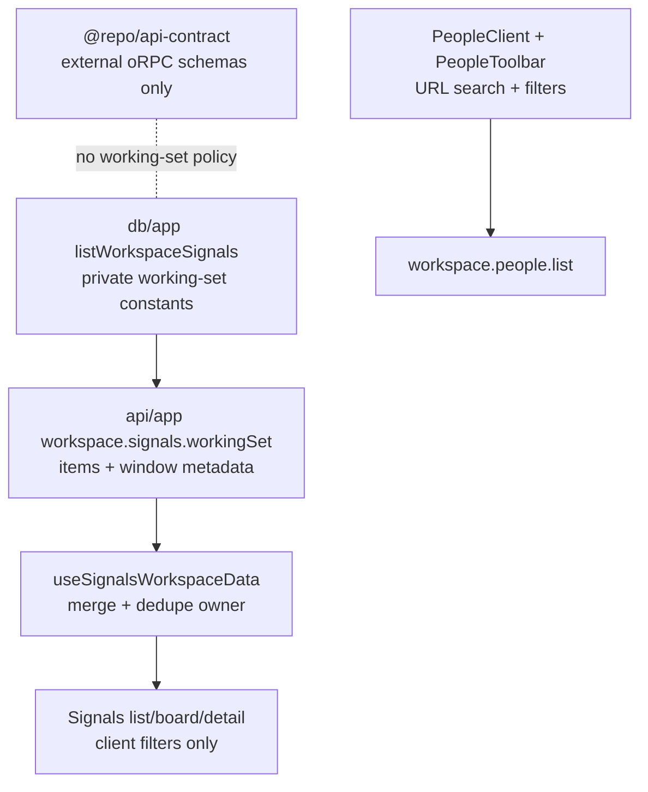

# Signals and People Rework Quality Design

- Date: 2026-05-30
- Status: Approved for implementation planning
- Area: `apps/app`, `api/app`, `db/app`, `packages/api-contract`
- Source review: thermo-nuclear code quality audit of `feat/refactor-signals-page-ui`

## Problem

The signals/people branch moves the product in the right direction, but the current shape leaves several maintainability problems behind:

1. App-private Signals working-set policy leaks into `@repo/api-contract`, which is the public oRPC contract package.
2. The Signals UI merges classified and processing streams without a single dedupe owner, so stale processing rows can overwrite classified rows in the detail map.
3. Server-side classification filtering remains exposed even though the new architecture makes client-side filtering the canonical model.
4. The People page removed visible search while the hook, router, and DB helper still preserve a search path.
5. The branch currently fails `pnpm check` on formatter/lint/import-order issues.

This rework keeps the existing product direction and removes the structural debt before the branch grows further.

## Goals

- Keep `@repo/api-contract` focused on the external API contract; app UI retention/window policy must not live there.
- Make Signals stream merging deterministic, with classified rows winning over stale processing rows.
- Delete unused server-side Signals classification filters instead of maintaining two filter models.
- Restore People search as a first-class UI and URL affordance.
- Make `pnpm check` pass and treat it as an acceptance gate for the rework.
- Keep the change focused; do not redesign the Signals or People UI visuals.

## Non-Goals

- No change to the 30-day / 2,000-row working-set product decision.
- No archive browsing, retention setting, or background archival job.
- No shared signal views, default views, view update/rename flow, or view ordering.
- No People data-model change or person-to-signal join table.
- No public oRPC Signals list endpoint.

## Decisions

### 1. Working-Set Policy Belongs to the Private Signals Boundary

`WORKSPACE_SIGNALS_WINDOW_DAYS` and `WORKSPACE_SIGNALS_LIMIT` are not public API contract concepts. Move them out of `packages/api-contract/src/schemas/signals.ts`.

The canonical owner becomes the private workspace Signals boundary:

- DB helper: `db/app/src/utils/signals.ts` owns the default numeric constants used by `listWorkspaceSignals`.
- tRPC output: `org.workspace.signals.workingSet` returns metadata describing the effective bounds.
- UI banner: `SignalsTruncationBanner` reads `limit` and `windowDays` from the query result, not from `@repo/api-contract`.

Target shape:

```ts
interface WorkspaceSignalsResult {
  items: WorkspaceSignalListItem[];
  limit: number;
  totalCount: number;
  truncated: boolean;
  windowDays: number;
}
```

This keeps the UI honest while preserving package boundaries.

### 2. Signals Merge Has One Owner and One Winner

`useSignalsWorkspaceData` becomes the single owner for composing the classified working set and the queued/processing list.

Rules:

- Build a `Set` of classified `publicId`s.
- Exclude processing rows whose `publicId` already exists in the classified set.
- Build `signalsByPublicId` with classified rows first and remaining processing full rows second.
- List and board sections receive the deduped processing rows only.

Classified rows win because classification is the newer terminal state. This prevents React Query `keepPreviousData` from letting a stale processing row replace the classified row in the detail sheet seed.

### 3. Delete Dormant Server Classification Filters

After the working-set architecture, classification filters are client-only:

- `disposition`
- `kind`
- `priority`
- `peopleRouted`
- classified search

The server should not preserve unused filter branches "just in case." The rework removes those inputs from `workspace.signals.list` and removes the matching SQL JSON predicates from `listSignals`.

`workspace.signals.list` remains only for the small live-status query:

```ts
const listSignalsInput = z.object({
  cursor: workspaceListCursorInput,
  limit: workspaceListLimitInput,
  statuses: z.array(signalStatusSchema).max(2).optional(),
});
```

The processing query keeps using `statuses: ["queued", "processing"]`. If server-side classified filtering is needed later, it should return as a separate endpoint with its own product reason and parity tests.

### 4. People Search Is Restored, Not Removed

The previous People page was search-first. The new People implementation already carries `search` through `usePeopleListQuery`, `workspace.people.list`, and `listPeople`, but the client hard-codes `search: ""`.

Restore search in the People toolbar:

- Add a URL param parser for the People query, e.g. `peopleQuery`.
- Render a compact search input in `PeopleToolbar`.
- Use `useDeferredValue` in `PeopleClient` before passing search to `usePeopleListQuery`.
- Treat search as an active filter for empty-state copy.
- Preserve provider/type filters unchanged.

This keeps the new UI quality while retaining the old page's core workflow.

### 5. `pnpm check` Is a Required Acceptance Gate

The rework includes cleanup for the current `pnpm check` failures:

- formatter drift in new tests and People detail files
- simplified boolean expression in `seed-people-signals.ts`
- sorted interface members in People/Signals toolbar helper interfaces
- Tailwind class ordering in new People/Signals components
- export ordering in DB schema barrels
- format drift in `db/app/src/utils/people.ts`

The final verification command for the rework is:

```bash
pnpm check
```

Typecheck and focused tests should still run during implementation, but `pnpm check` must be green before the work is considered complete.

## Target Architecture



Key boundaries:

- Public oRPC schema remains limited to signal create/get contracts and classification schemas.
- Workspace tRPC owns app-private list/view/query behavior.
- DB helpers expose storage-specific utilities but not public API policy.
- Client models own in-memory Signals filtering.

## Testing Strategy

### DB Tests

Update `db/app/src/__tests__/signals-list.test.ts`:

- Assert `listWorkspaceSignals` returns `limit` and `windowDays`.
- Assert `listSignals` only supports cursor, limit, and status-list filtering.
- Remove tests that pin dormant classification SQL branches.

### API Tests

Update `api/app/src/__tests__/workspace-signals-router.test.ts`:

- Assert `signals.list` forwards only processing-list inputs.
- Assert invalid classification-filter inputs are no longer accepted.
- Assert `signals.workingSet` returns the DB result including metadata.

### Client Tests

Update Signals client/model tests:

- Add a dedupe test where a row appears in both classified and processing data; the classified row must render and seed detail.
- Keep tests proving filter toggles do not enter the working-set query key.

Update People tests:

- Assert search input writes the People query URL param.
- Assert deferred search reaches `usePeopleListQuery`.
- Assert empty-state copy treats search as an active filter.

### Quality Gate

Run:

```bash
pnpm check
```

The rework is not complete while this command fails.

## Implementation Notes

- Keep edits scoped to the changed files in this branch.
- Do not introduce a new shared package for working-set constants.
- Prefer deleting unused server filter code over wrapping it in compatibility helpers.
- Keep People search naming explicit; avoid overloading generic `q` unless the surrounding People route already owns it.
- Do not add speculative abstractions for future archived views.

## Acceptance Criteria

- `packages/api-contract/src/schemas/signals.ts` no longer exports workspace working-set constants.
- `SignalsTruncationBanner` receives its displayed limit/window from `workingSet` data.
- `useSignalsWorkspaceData` removes duplicate processing rows when classified rows exist for the same signal.
- `workspace.signals.list` no longer accepts dormant classification filter/search inputs.
- `db/app/src/utils/signals.ts` no longer contains unused JSON classification filter predicates for `listSignals`.
- People search is visible, URL-backed, and passed into the People list query.
- `pnpm check` passes.
