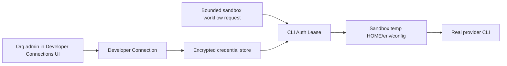

# CLI Provider Auth Sandbox Leases Design

Date: 2026-06-03
Status: Ready for written spec review

## Summary

Lightfast will add org-owned Developer Connections for authenticated provider
CLIs used by Lightfast-controlled sandbox workflows. An org admin connects a
provider once in the Lightfast UI. Any org member who is allowed to start a
Lightfast sandbox can then request that provider for a bounded sandbox
workflow. Lightfast creates a short-lived auth lease, materializes the provider
credential only inside the sandbox, and revokes the lease when the workflow
finishes.

The agent still runs the real CLIs:

- `pscale`
- `upstash` / `npx @upstash/cli`
- `sentry` / `npx sentry`
- `clerk` / `npx clerk`

Lightfast does not replace these tools with fake CLI lookalikes or raw API
wrappers. The product boundary is credential lifecycle and sandbox
materialization, not provider command emulation.

The first version should use one workspace-level UI, **Developer Connections**,
with provider-specific auth adapters underneath. Sentry should use CLI
device-code OAuth as the preferred path with token fallback. PlanetScale,
Upstash, and Clerk should use reliable manual credential forms in v1 while
preserving the same connection and lease model.

## Goals

- Let an org admin connect provider CLIs once through Lightfast.
- Scope every connection to one Lightfast organization.
- Allow any org member who can start Lightfast-controlled sandboxes to use
  enabled org-owned Developer Connections.
- Keep each lease actor-bound to the user who started the sandbox workflow.
- Avoid requiring provider CLI auth on the user's local machine or Codex
  worktree.
- Avoid delivering provider credentials directly to local or Codex worktree
  processes in v1.
- Run provider CLIs unchanged inside sandboxes.
- Keep provider credentials out of the repo, `.lightfast`, local home
  directories, shell history, and durable worktree files.
- Materialize credentials only as short-lived sandbox auth leases.
- Use the narrowest reliable credential for each provider.
- Preserve a future path for command policy, without making command policy the
  v1 safety mechanism.
- Support the current Lightfast internal provider set:
  - PlanetScale
  - Upstash
  - Sentry
  - Clerk

## Non-Goals

- No Vercel CLI auth management in v1. Vercel remains excluded because
  `vercel link`, `vercel env pull`, `.vercel` project state, and OIDC are
  repo/workspace-specific workflows rather than generic provider CLI auth.
- No AgentMail support in v1 because the current repo has no AgentMail command
  surface.
- No generic user-defined CLI marketplace in v1.
- No new `.lightfast/boxes` secret store.
- No local daemon, local process injection, or Codex worktree credential
  materialization in v1.
- No MCP tool exposure in v1. MCP was useful as a mental model for bounded
  workflows, but it is not part of the first delivery.
- No background or automation-triggered leases without an active human actor.
- No persistent shared sandbox home that accumulates provider CLI sessions.
- No replacement CLI binaries that translate commands into Lightfast API calls.
- No provider deletes or destructive provisioning cleanup automation in the
  first auth feature.
- No full command firewall in v1. The architecture must leave room for command
  policy, but v1 safety comes from credential scoping, isolated materialization,
  and sandbox destruction.

## Current Repo Command Surface

The current repo uses or documents provider CLIs in these places:

- Root dev scripts start local Inngest and local QStash dev tooling:
  - `npx inngest-cli@latest dev ...`
  - `npx --yes @upstash/qstash-cli dev -port=$PORT`
- Root `vercel:link` runs `pnpm dlx vercel@latest link --repo`.
- Local infra skills use PlanetScale and Upstash management CLIs:
  - `pscale auth check`
  - `pscale org list --format json`
  - `pscale branch show/create`
  - `pscale password create/delete`
  - `upstash auth whoami`
  - `upstash redis list/create/get/delete`
- Desktop sourcemap upload uses Sentry CLI through `pnpm exec sentry-cli`:
  - `releases new`
  - `sourcemaps upload`
  - `releases finalize`
- Clerk workflows and plans use the agent-oriented `clerk` CLI:
  - `clerk config pull`
  - `clerk config patch --dry-run`
  - `clerk api`
  - `clerk env pull`

Other package-runner commands such as `ultracite`, `sherif`, `shadcn`,
`tsx`, and `remotion` are package execution concerns, not provider credential
concerns.

## CLI Auth Findings

These findings come from running local or package-runner CLI help/version
commands, not provider docs.

| Provider | Observed CLI version/surface | Auth shape exposed by CLI | v1 implication |
| --- | --- | --- | --- |
| PlanetScale | `pscale version 0.283.0`; `pscale auth login`; `pscale service-token create --ttl`; `pscale service-token add-access --database`; global `--service-token-id` / `--service-token` | Browser/OAuth login exists, but every command can also authenticate with service token flags. Service tokens can be TTL-bound and granted specific access. | Use manual service-token id/token fields in v1. Defer OAuth/bootstrap token minting behind the same adapter. |
| Upstash | `upstash v0.3.0`; `npx @upstash/cli@latest`; `upstash auth login --email --api-key`; env `UPSTASH_EMAIL` / `UPSTASH_API_KEY`; config `.upstash.json` | No OAuth or device-code auth surfaced by CLI. Management auth is email + API key. | Use a key-based connection. Materialize either env vars or a temp `.upstash.json` only inside the sandbox. |
| Sentry | Local `sentry` observed at `0.33.0`; `npx sentry@latest` observed at `0.35.0`; `sentry auth login --token`; OAuth device-code text in help; `auth refresh`; `auth token` | CLI supports device-code OAuth and token import/export. | Use CLI OAuth/device-code for first-time connect. Store a refreshable/token credential and materialize it into sandbox CLI auth. |
| Clerk | `clerk 1.5.0`; `clerk auth login` browser OAuth; `clerk api --secret-key`; `clerk config patch --destructive`; no token import/export flag exposed by auth help | Browser OAuth exists for a human CLI session, but help does not expose a clean token materialization path. API commands can target a secret key. | Use app/instance secret-key connection in v1. Defer Clerk CLI OAuth session capture until Clerk exposes a stable import/export path or Lightfast intentionally supports their storage contract. |

The key conclusion: a single "OAuth everywhere" implementation would look good
in UI but would be brittle underneath. The minimal long-term architecture is one
connection UX with provider-specific auth adapters.

## Chosen Architecture

The v1 system has four boundaries.



### 1. Developer Connections

A Developer Connection is the durable, server-side record that says:

```text
this Lightfast organization has authorized this provider account
for Lightfast-controlled sandbox use
```

Connections are org-owned. The user who creates or updates a connection is
recorded for audit, but does not own exclusive runtime use. Any current org
member who is allowed to start a Lightfast sandbox may request a lease for an
enabled connection. Only org admins/owners can create, reconnect, disable, or
disconnect connections.

Conceptual fields:

- `publicId`
- `clerkOrgId`
- `currentOrgProviderKey`
- `provider`
- `providerAccountId`
- `providerAccountName`
- `authType`
- `credentialKind`
- `credentialSchemaVersion`
- `encryptedCredential`
- `scopes`
- `status`
- `enabledForSandboxes`
- `expiresAt`
- `lastVerifiedAt`
- `lastUsedAt`
- `lastUsedByUserId`
- `createdByUserId`
- `updatedByUserId`
- `createdAt`
- `updatedAt`
- `revokedAt`

The encrypted credential payload is provider-specific. It may contain a service
token, API key, refreshable token set, or app secret. It must never contain raw
CLI config directories as the primary storage format.

The first implementation should follow the existing connector table pattern:
keep historical rows and enforce one current row per `{clerkOrgId, provider}`
through a nullable current-key column plus a unique index. Reconnect inserts a
new current row, marks the previous row replaced/revoked, and clears the old
encrypted credential while keeping safe metadata.

V1 uses separate Developer Connection tables. It must not reuse
`lightfast_org_connector_connections` because MCP connectors and developer CLI
auth have different runtime semantics.

Tables:

```text
lightfast_org_developer_connections
lightfast_developer_connection_leases
```

`lightfast_org_developer_connections` should store encrypted credential columns
directly, following the repo's existing encrypted-token pattern, but only behind
a credential service/repository boundary. List/card/detail queries should not
select encrypted credential material. Only provider adapters and lease
materialization code may resolve and decrypt credentials.

Connection statuses:

```text
connected        credential valid and current
needs_reconnect  credential invalid, expired, or auth failure confirmed
revoked          disconnected by an admin
replaced         superseded by reconnect
```

The UI derives `Disabled` when the current connection is otherwise connected but
`enabledForSandboxes = false`.

### 2. Provider Auth Adapters

Each provider implements the same small interface:

```ts
type CliProviderAuthAdapter = {
  startConnect(input): Promise<ConnectStart>;
  finalizeConnect(input): Promise<ProviderConnectionPayload>;
  verify(connection): Promise<VerificationResult>;
  refresh?(connection): Promise<ProviderConnectionPayload>;
  createLease(connection, context): Promise<CliAuthLeasePayload>;
  materialize(lease, sandbox): Promise<MaterializedCliAuth>;
  revoke?(lease): Promise<void>;
};
```

The adapter hides provider-specific auth details while preserving one product
UX. It does not hide provider commands from the agent.

Provider v1 behavior:

- PlanetScale adapter:
  - Connect path: admin manually provides service token id/token.
  - Deferred connect path: run a temporary auth box that completes
    `pscale auth login`, then creates a TTL-bound service token and grants only
    required database access.
  - Lease materialization: inject `PLANETSCALE_SERVICE_TOKEN_ID` and
    `PLANETSCALE_SERVICE_TOKEN`, or pass equivalent CLI flags through the
    sandbox command environment.
- Upstash adapter:
  - Connect path: admin provides email and management API key.
  - Verification: non-mutating identity/list probe.
  - Lease materialization: write a temp `.upstash.json` under sandbox `HOME` or
    inject `UPSTASH_EMAIL` and `UPSTASH_API_KEY`.
  - Boundary: this is an Upstash management lease for workflows that explicitly
    need Upstash management CLI access. Generated Redis runtime values such as
    `KV_REST_API_URL` and `KV_REST_API_TOKEN` are separate app runtime material,
    not the same as the management credential.
- Sentry adapter:
  - Preferred connect path: CLI device-code OAuth using `sentry auth login`.
  - Fallback connect path: admin provides token.
  - Lease materialization: temp Sentry auth config or token env compatible with
    the real Sentry CLI.
- Clerk adapter:
  - Connect path: admin provides app/instance identity and instance secret key.
  - Verification: non-mutating `clerk api` or Backend API probe.
  - Lease materialization: inject `CLERK_SECRET_KEY` and app/instance targeting
    env/config expected by the real Clerk CLI.

### 3. CLI Auth Leases

A CLI auth lease is short-lived and created for one bounded sandbox workflow
execution. It is not a second durable provider credential and it is not an
open-ended interactive shell session.

Conceptual fields:

- `publicId`
- `connectionId`
- `clerkOrgId`
- `actorUserId`
- `sandboxRunId`
- `workflowRunId`
- `provider`
- `status`
- `issuedAt`
- `expiresAt`
- `materializedAt`
- `revokedAt`

Lease records are persisted without credential payloads. Persisting them lets
Lightfast revoke active leases when membership changes, inspect active usage,
and recover cleanup state after crashes.

V1 lease timing:

- Default TTL: 15 minutes.
- Hard maximum TTL: 30 minutes.
- Revoke immediately when the bounded workflow finishes.
- Revoke immediately when the actor loses org access.
- Mark as expired when the TTL passes, even if sandbox teardown failed.

Lease materialization rules:

- Materialize into a sandbox temp `HOME`, env block, or provider config path.
- Do not write to the user's real home directory.
- Do not write to the repo or worktree.
- Do not write secrets to `.lightfast`.
- Destroy the materialized files when the workflow completes or the sandbox
  stops.
- Redact secrets from terminal output, run logs, telemetry, and error payloads.
- Install or resolve CLI packages before provider credentials are present.

For `npx`/`pnpm dlx` tools, the safer long-term posture is to preinstall or pin
provider CLIs in the sandbox image before secrets are materialized. Package
resolution should not happen with provider credentials already present in the
ambient environment.

### 4. Sandbox Runner

The sandbox runner owns the boundary where credentials become usable by real
commands. It should:

- Create a clean sandbox process environment.
- Apply selected provider leases only for the requested workflow.
- Use temp config paths and temp home directories.
- Remove materialized credentials after the workflow.
- Record lease issuance and revocation audit events.

The v1 consumer is the Lightfast-controlled sandbox runner only. Local shells,
Codex worktrees, and external MCP clients do not receive provider credentials
directly in v1.

The runner may later enforce command policy at process launch or expose named
Lightfast-authored workflows. Those are not required for the first delivery.
V1 must not rely on command policy for core auth safety because an agent that
has ambient credentials can always attempt a different command. Provider-side
credential scope, explicit provider requests, short leases, and sandbox
isolation are the primary v1 controls.

## Developer Connections UI

Developer Connections is a separate workspace-level page modeled after the
existing Connectors page:

```text
/{orgSlug}/developer-connections
```

It should use the same broad interaction pattern:

- Server page prefetches the list query before hydrating the client.
- Client renders a searchable/filterable catalog.
- Each provider appears as an available or connected card.
- URL query state opens a provider detail sheet.
- Callback errors render as page-level banners and clear stale params.
- Admin-only actions are disabled for non-admin members.

Developer Connections must not be merged into the MCP Connectors page. MCP
Connectors expose provider tools to Lightfast automations and agents. Developer
Connections expose provider CLI credentials to Lightfast-controlled sandbox
workflows. Reusing layout patterns is good; reusing the domain model is not.

The v1 catalog shows four provider cards:

- PlanetScale
- Upstash
- Sentry
- Clerk

Provider cards may be visible before their adapter is fully enabled. A disabled
Connect button may show `Coming soon` or `Unavailable`, matching the existing
connector availability pattern.

### Connected Card Behavior

Connected cards show:

- Provider name and description.
- Status:
  - `Needs reconnect` when credential verification or refresh failed.
  - `Disabled` when the credential is valid but sandbox use is off.
  - `Connected` when the credential is valid and sandbox use is on.
- Safe account/resource metadata.
- `Use in sandboxes` toggle.
- Summary fields:
  - created by
  - last verified
  - last used
  - last used by
- Actions:
  - View details
  - Reconnect
  - Disconnect

There is no MCP tool list and no `Use in automations` or `Use in agents` toggle.

Successful connect defaults `enabledForSandboxes` to `true`. Admins can turn it
off without deleting the credential.

Non-admin members see read-only status cards. They can see whether a provider is
usable in sandboxes and safe metadata such as account/resource labels. They
cannot connect, reconnect, disconnect, toggle sandbox use, view secret-adjacent
details, or reveal credentials.

### Connect Dialogs

The Connect button opens a provider-specific dialog before any redirect or
submission. This keeps the page stable and handles providers that do not support
OAuth in v1.

Provider dialog behavior:

- Sentry:
  - Primary path: continue with Sentry device-code OAuth.
  - Fallback path: paste token.
- PlanetScale:
  - Service token id.
  - Service token.
- Upstash:
  - Email.
  - Management API key.
- Clerk:
  - App id or instance target.
  - Instance secret key.

Submitting a manual credential verifies it with a non-mutating provider probe
before creating the current connection row. Sentry OAuth starts the auth-box
flow, then finalizes into the same connection row shape.

PlanetScale OAuth/bootstrap is deferred. The v1 dialog should not imply that
Lightfast can complete `pscale auth login` and mint a service token automatically
yet.

Clerk platform keys are not the default v1 credential. V1 stores a specific
instance secret key. Platform-key support should be a separate, scarier mode if
a future workflow requires account-level app management.

## Runtime Behavior

When a Lightfast-controlled sandbox workflow requests provider CLI auth:

1. Lightfast resolves the current user and Lightfast organization.
2. Lightfast verifies the user is still an org member and is allowed to start
   the sandbox workflow.
3. The workflow explicitly requests a provider set.
4. Lightfast loads current active org-owned Developer Connections for only the
   requested providers.
5. Lightfast requires each connection to be `connected` and
   `enabledForSandboxes = true`.
6. Each adapter refreshes expiring credentials if supported and required.
7. Lightfast creates actor-bound lease rows with a 15 minute default TTL and
   30 minute maximum TTL.
8. The sandbox starts with a clean home and no provider credentials.
9. The sandbox runner materializes lease credentials into temp paths/env.
10. The workflow runs real provider CLIs.
11. On workflow completion, Lightfast destroys materialized auth and marks
    leases revoked or expired.

If the provider connection is expired, revoked, invalid, or fails verification,
the run should fail with a `needs_reconnect` style error instead of attempting
to repair auth inside the agent shell.

Provider verification should happen on connect/reconnect, manual Verify now, and
adapter-confirmed auth failure. Lease creation should not perform a provider
probe on every request because that makes sandbox startup slower and
rate-limit-dependent.

If a sandbox command fails, only adapter-confirmed auth failures mark the
connection `needs_reconnect`. Uncertain failures are recorded on the lease/run
without poisoning the org connection for everyone.

## Auth Box Requirements

An auth box is only for first-time connection or reconnect flows that require a
provider-hosted interactive login. In v1 this is primarily the Sentry
device-code OAuth path. It is stricter than a normal development sandbox:

- No repo checkout mounted.
- No agent-authored code mounted.
- No inherited user home directory.
- No inherited provider CLI config.
- Provider CLI installed or resolved before the auth attempt begins.
- Network egress limited to package install endpoints before auth and provider
  auth/API endpoints during auth where the sandbox provider supports it.
- Logs redacted before they are persisted or streamed to the UI.
- Destroyed immediately after the provider adapter extracts the narrow runtime
  credential.

For providers with browser OAuth that require a callback, Lightfast must provide
an explicit callback relay into the auth box. If that cannot be made reliable,
the adapter must use a manual token/key fallback rather than persisting opaque
human CLI session files.

## Provider Request Source

V1 does not need a repo-authored `.lightfast/boxes` folder and does not need a
hardcoded internal dev box profile.

The provider set comes from the bounded sandbox workflow request:

```text
requestedProviders = ["pscale", "sentry"]
```

Lightfast issues leases only for requested providers. It never materializes all
connected org credentials by default.

A future `.lightfast/boxes/*.json` format can describe repo-required tools and
provider bindings, but it must remain secret-free. It should never contain
provider tokens, local auth paths, or generated CLI config.

## Security Model

The primary threat is not that a CLI binary exists locally. The primary threat
is broad provider credentials being available to an agent in an uncontrolled
environment.

V1 controls:

- Org-owned connections with admin-only management.
- Actor-bound leases for the user who started the sandbox workflow.
- Membership checks at lease issue time and active-lease revocation on
  membership removal.
- One current active connection per provider per org.
- Explicit provider requests; no automatic all-provider materialization.
- Encrypted server-side credential storage.
- No credential storage in `.lightfast`.
- No credential storage in worktrees.
- No reliance on the user's local provider CLI auth.
- No direct local/Codex worktree credential delivery in v1.
- Auth boxes with no repo mounted and no agent-authored code.
- Runtime sandboxes with temp `HOME`.
- Lease materialization only for selected provider workflows.
- 15 minute default lease TTL, 30 minute hard max, and immediate teardown.
- Secret redaction in logs and errors.
- Provider-specific verification on connect/reconnect and auth failure.
- Provider-specific credential narrowing where the CLI supports it.

Provider-specific residual risk:

- PlanetScale risk is reduced by storing service tokens instead of human login
  sessions, and by granting only needed database access. The runtime token
  should not have organization-wide database delete permissions.
- Upstash management API keys appear broad from the CLI surface. V1 must treat
  them as high-risk and keep them out of ambient local environments.
- Sentry OAuth/token auth is suitable for this feature, but destructive CLI
  commands such as project deletion still require future command policy or
  provider-side scope limits.
- Clerk secret keys are powerful. V1 should prefer dev instance keys where
  possible and should not claim that Clerk OAuth has been safely materialized
  until there is a stable CLI-supported token path.

## Audit Events

Lightfast should record safe audit events for:

- connection created
- connection verified
- connection failed verification
- connection refreshed
- connection revoked
- connection replaced
- connection enabled for sandboxes
- connection disabled for sandboxes
- lease issued
- lease materialized
- lease expired
- lease revoked
- lease failed
- adapter-confirmed auth failure

Audit payloads must not include provider secrets, raw CLI config contents, full
provider responses, or command stdout/stderr that may contain secrets.

V1 should write audit records but not build a full audit timeline UI. Defer that
UI to a GitHub issue. The Developer Connections page may show safe summary
fields such as `created by`, `last verified`, `last used`, and `last used by`.

## Error Handling

- Invalid credentials mark the connection `needs_reconnect`.
- Expired non-refreshable credentials mark the connection `needs_reconnect`.
- Refresh failure marks the connection `needs_reconnect` unless the adapter can
  safely retry once.
- CLI failures mark the connection `needs_reconnect` only when the adapter
  confidently classifies the failure as provider-auth related.
- Uncertain CLI failures are recorded on the lease/run and leave the org
  connection status unchanged.
- Membership removal denies new leases and revokes active leases for that actor.
- Lease creation failure fails the sandbox workflow before credentials are
  materialized.
- Materialization failure tears down any partially written temp files.
- Workflow completion or sandbox teardown should revoke/delete temp files even
  if the agent process exits with an error.
- Provider verification should use non-mutating commands whenever possible.

## Testing

- Developer Connections page tests should mirror Connectors page coverage:
  server prefetch, catalog rendering, search/status filtering, detail sheet URL
  state, callback error banner, admin actions, and non-admin read-only cards.
- DB tests should verify one current row per `{clerkOrgId, provider}`,
  historical replaced/revoked rows, and credential clearing on replacement or
  disconnect.
- Lease table tests should verify issue/materialize/revoke/expire transitions,
  15 minute default TTL, 30 minute hard max, and no credential payload storage.
- Adapter unit tests should cover start/finalize/verify/lease/materialize for
  each provider with mocked CLI processes.
- CLI contract tests should snapshot the small help/version surfaces the design
  depends on:
  - `pscale auth login --help`
  - `pscale service-token create --help`
  - `upstash auth login --help`
  - `sentry auth login --help`
  - `clerk auth login --help`
  - `clerk api --help`
- Sandbox materialization tests should assert credentials are written only to
  temp paths/env and removed after teardown.
- Redaction tests should assert tokens do not appear in logs, errors, audit
  events, or telemetry.
- Permission tests should verify non-admins cannot manage connections, current
  org members with sandbox permission can request enabled provider leases, and
  removed members cannot create new leases.
- Membership removal tests should verify active actor-bound leases are revoked.
- Provider verification tests should avoid real destructive operations.

## Rollout

Phase 1 should implement the Developer Connections page, tables, lease service,
and provider adapter interface before enabling all runtime behavior. The catalog
should show all four providers, with connectability staged if needed:

1. Core data model and Developer Connections UI.
2. Sentry, because its CLI exposes the cleanest OAuth/device-code and token
   surface.
3. PlanetScale manual service-token connection.
4. Upstash email/API-key connection.
5. Clerk instance secret-key connection.
6. Lightfast-controlled sandbox runner lease materialization.

The implementation plan should keep the provider adapter interface stable so
each adapter can ship independently.

## Acceptance Criteria

- The workspace has a separate `/{orgSlug}/developer-connections` page modeled
  after the Connectors list/detail interaction pattern.
- The page shows PlanetScale, Upstash, Sentry, and Clerk provider cards.
- Org admins/owners can connect, reconnect, disable, enable, and disconnect
  provider connections.
- Non-admin members can view read-only provider availability/status cards.
- A connected provider is scoped to exactly one Lightfast organization.
- There is at most one current active connection per provider per org, while
  historical replaced/revoked rows are retained with credential material cleared.
- Successful connect defaults `enabledForSandboxes = true`.
- Disabled connections show `Disabled` in the UI and cannot be leased.
- Lightfast issues leases only for explicitly requested providers.
- Lease rows are persisted without credential payloads.
- Lease TTL defaults to 15 minutes, has a 30 minute hard max, and is revoked
  immediately when the workflow completes.
- Active leases are actor-bound and revoked when the actor loses org access.
- A Lightfast-controlled sandbox workflow can run the real provider CLI without
  the user's local provider auth being present.
- Provider secrets are not written to the repo, `.lightfast`, or the user's
  local home directory.
- Provider secrets are not delivered directly to local or Codex worktree
  processes in v1.
- PlanetScale v1 connection uses service token id/token fields.
- Upstash management sandbox auth uses temp CLI config/env rather than the
  user's local `.upstash.json`, and generated Redis runtime env is treated as a
  separate app runtime material.
- Sentry runtime sandbox auth can be created from CLI OAuth/device-code or a
  token fallback.
- Clerk runtime sandbox auth uses a connected instance secret key in v1.
- If a connection expires or becomes invalid, Lightfast asks an admin to
  reconnect instead of making the agent run interactive auth commands.

## Deferred Questions

- GitHub issue: full audit timeline UI for Developer Connections and leases.
- Whether `.lightfast/boxes/*.json` should become the repo-authored format for
  required tools and provider bindings.
- Whether command policy should be deny-list based, allow-list based, or
  provider-adapter based.
- Whether provider-authenticated workflows should be exposed through MCP later.
- Whether local/Codex worktree development should ever receive brokered
  credentials through a local daemon or another isolation layer.
- Whether PlanetScale OAuth/bootstrap should mint service tokens automatically
  after manual service-token v1 is stable.
- Whether Clerk will expose a stable CLI token import/export or device-code path
  suitable for sandbox materialization.
- Whether Upstash will expose OAuth or narrower management-token primitives that
  reduce the need to store broad management API keys.
