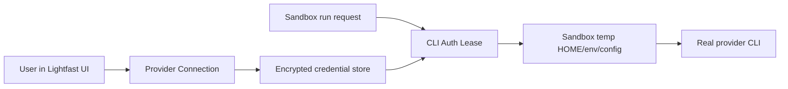

# CLI Provider Auth Sandbox Leases Design

Date: 2026-06-03
Status: Ready for written spec review

## Summary

Lightfast will add a minimal provider connection system for authenticated
developer CLIs used by Lightfast internal workflows. A user connects a provider
once in the Lightfast UI, scoped to a Lightfast organization. When local, cloud,
or Codex worktree development needs that provider, Lightfast creates a
short-lived sandbox auth lease and materializes the provider credential only
inside the sandbox.

The agent still runs the real CLIs:

- `pscale`
- `upstash` / `npx @upstash/cli`
- `sentry` / `npx sentry`
- `clerk` / `npx clerk`

Lightfast does not replace these tools with fake CLI lookalikes or raw API
wrappers. The product boundary is credential lifecycle and sandbox
materialization, not provider command emulation.

The first version should use one user-facing UX, **Connect Provider**, with
provider-specific auth adapters underneath. Sentry and PlanetScale can use
OAuth-like CLI bootstrap flows. Upstash and Clerk do not expose the same clean
CLI OAuth materialization surface, so v1 should use their reliable key-based
paths while still presenting them through the same connection UI.

## Goals

- Let a user authenticate provider CLIs once through Lightfast.
- Scope every connection to one Lightfast user and one Lightfast organization.
- Avoid requiring provider CLI auth on the user's local machine, cloud dev
  machine, or Codex worktree.
- Run provider CLIs unchanged inside sandboxes.
- Keep provider credentials out of the repo, `.lightfast`, local home
  directories, shell history, and durable worktree files.
- Materialize credentials only as short-lived sandbox auth leases.
- Use the narrowest reliable credential for each provider.
- Preserve a future path for command policy, without making command policy the
  v1 safety mechanism.
- Support the current Lightfast internal provider set:
  - PlanetScale
  - Upstash
  - Sentry
  - Clerk

## Non-Goals

- No Vercel CLI auth management in v1. Vercel remains excluded because
  `vercel link`, `vercel env pull`, `.vercel` project state, and OIDC are
  repo/workspace-specific workflows rather than generic provider CLI auth.
- No AgentMail support in v1 because the current repo has no AgentMail command
  surface.
- No generic user-defined CLI marketplace in v1.
- No new `.lightfast/boxes` secret store.
- No persistent shared sandbox home that accumulates provider CLI sessions.
- No replacement CLI binaries that translate commands into Lightfast API calls.
- No provider deletes or destructive provisioning cleanup automation in the
  first auth feature.
- No full command firewall in v1. The architecture must leave room for command
  policy, but v1 safety comes from credential scoping, isolated materialization,
  and sandbox destruction.

## Current Repo Command Surface

The current repo uses or documents provider CLIs in these places:

- Root dev scripts start local Inngest and local QStash dev tooling:
  - `npx inngest-cli@latest dev ...`
  - `npx --yes @upstash/qstash-cli dev -port=$PORT`
- Root `vercel:link` runs `pnpm dlx vercel@latest link --repo`.
- Local infra skills use PlanetScale and Upstash management CLIs:
  - `pscale auth check`
  - `pscale org list --format json`
  - `pscale branch show/create`
  - `pscale password create/delete`
  - `upstash auth whoami`
  - `upstash redis list/create/get/delete`
- Desktop sourcemap upload uses Sentry CLI through `pnpm exec sentry-cli`:
  - `releases new`
  - `sourcemaps upload`
  - `releases finalize`
- Clerk workflows and plans use the agent-oriented `clerk` CLI:
  - `clerk config pull`
  - `clerk config patch --dry-run`
  - `clerk api`
  - `clerk env pull`

Other package-runner commands such as `ultracite`, `sherif`, `shadcn`,
`tsx`, and `remotion` are package execution concerns, not provider credential
concerns.

## CLI Auth Findings

These findings come from running local or package-runner CLI help/version
commands, not provider docs.

| Provider | Observed CLI version/surface | Auth shape exposed by CLI | v1 implication |
| --- | --- | --- | --- |
| PlanetScale | `pscale version 0.283.0`; `pscale auth login`; `pscale service-token create --ttl`; `pscale service-token add-access --database`; global `--service-token-id` / `--service-token` | Browser/OAuth login exists, but every command can also authenticate with service token flags. Service tokens can be TTL-bound and granted specific access. | Use OAuth/bootstrap only to mint a scoped service token. Store and lease the service token, not the broad human CLI session. |
| Upstash | `upstash v0.3.0`; `npx @upstash/cli@latest`; `upstash auth login --email --api-key`; env `UPSTASH_EMAIL` / `UPSTASH_API_KEY`; config `.upstash.json` | No OAuth or device-code auth surfaced by CLI. Management auth is email + API key. | Use a key-based connection. Materialize either env vars or a temp `.upstash.json` only inside the sandbox. |
| Sentry | Local `sentry` observed at `0.33.0`; `npx sentry@latest` observed at `0.35.0`; `sentry auth login --token`; OAuth device-code text in help; `auth refresh`; `auth token` | CLI supports device-code OAuth and token import/export. | Use CLI OAuth/device-code for first-time connect. Store a refreshable/token credential and materialize it into sandbox CLI auth. |
| Clerk | `clerk 1.5.0`; `clerk auth login` browser OAuth; `clerk api --secret-key`; `clerk config patch --destructive`; no token import/export flag exposed by auth help | Browser OAuth exists for a human CLI session, but help does not expose a clean token materialization path. API commands can target a secret key. | Use app/instance secret-key connection in v1. Defer Clerk CLI OAuth session capture until Clerk exposes a stable import/export path or Lightfast intentionally supports their storage contract. |

The key conclusion: a single "OAuth everywhere" implementation would look good
in UI but would be brittle underneath. The minimal long-term architecture is one
connection UX with provider-specific auth adapters.

## Chosen Architecture

The v1 system has four boundaries.



### 1. Provider Connections

A provider connection is the durable, server-side record that says:

```text
this Lightfast user, in this Lightfast organization,
has authorized this provider account for CLI sandbox use
```

Connections are user-owned and org-scoped. Another user in the same Lightfast
org cannot use the connection unless a later explicit sharing model is added.

Conceptual fields:

- `publicId`
- `clerkUserId`
- `clerkOrgId`
- `provider`
- `providerAccountId`
- `providerAccountName`
- `authType`
- `encryptedCredential`
- `scopes`
- `status`
- `expiresAt`
- `lastVerifiedAt`
- `createdAt`
- `updatedAt`
- `revokedAt`

The encrypted credential payload is provider-specific. It may contain a service
token, API key, refreshable token set, or app secret. It must never contain raw
CLI config directories as the primary storage format.

### 2. Provider Auth Adapters

Each provider implements the same small interface:

```ts
type CliProviderAuthAdapter = {
  startConnect(input): Promise<ConnectStart>;
  finalizeConnect(input): Promise<ProviderConnectionPayload>;
  verify(connection): Promise<VerificationResult>;
  refresh?(connection): Promise<ProviderConnectionPayload>;
  createLease(connection, context): Promise<CliAuthLeasePayload>;
  materialize(lease, sandbox): Promise<MaterializedCliAuth>;
  revoke?(lease): Promise<void>;
};
```

The adapter hides provider-specific auth details while preserving one product
UX. It does not hide provider commands from the agent.

Provider v1 behavior:

- PlanetScale adapter:
  - Preferred connect path: run a temporary auth box that completes
    `pscale auth login`, then creates a TTL-bound service token and grants only
    required database access.
  - Fallback connect path: user manually provides service token id/token.
  - Lease materialization: inject `PLANETSCALE_SERVICE_TOKEN_ID` and
    `PLANETSCALE_SERVICE_TOKEN`, or pass equivalent CLI flags through the
    sandbox command environment.
- Upstash adapter:
  - Connect path: user provides email and management API key.
  - Verification: non-mutating identity/list probe.
  - Lease materialization: write a temp `.upstash.json` under sandbox `HOME` or
    inject `UPSTASH_EMAIL` and `UPSTASH_API_KEY`.
- Sentry adapter:
  - Preferred connect path: CLI device-code OAuth using `sentry auth login`.
  - Fallback connect path: user provides token.
  - Lease materialization: temp Sentry auth config or token env compatible with
    the real Sentry CLI.
- Clerk adapter:
  - Connect path: user provides app/instance identity and secret key.
  - Verification: non-mutating `clerk api` or Backend API probe.
  - Lease materialization: inject `CLERK_SECRET_KEY` and app/instance targeting
    env/config expected by the real Clerk CLI.

### 3. CLI Auth Leases

A CLI auth lease is short-lived and created for one sandbox run. It is not a
second durable provider credential.

Conceptual fields:

- `publicId`
- `connectionId`
- `clerkUserId`
- `clerkOrgId`
- `sandboxId`
- `provider`
- `status`
- `issuedAt`
- `expiresAt`
- `materializedAt`
- `revokedAt`

Lease materialization rules:

- Materialize into a sandbox temp `HOME`, env block, or provider config path.
- Do not write to the user's real home directory.
- Do not write to the repo or worktree.
- Do not write secrets to `.lightfast`.
- Destroy the materialized files when the sandbox stops.
- Redact secrets from terminal output, run logs, telemetry, and error payloads.
- Install or resolve CLI packages before provider credentials are present.

For `npx`/`pnpm dlx` tools, the safer long-term posture is to preinstall or pin
provider CLIs in the sandbox image before secrets are materialized. Package
resolution should not happen with provider credentials already present in the
ambient environment.

### 4. Sandbox Runner

The sandbox runner owns the boundary where credentials become usable by real
commands. It should:

- Create a clean sandbox process environment.
- Apply selected provider leases only for the requested run.
- Use temp config paths and temp home directories.
- Remove materialized credentials after the run.
- Record lease issuance and revocation audit events.

The runner may later enforce command policy at process launch, such as denying
`pscale database delete` or requiring human approval for destructive provider
commands. v1 must not rely on command policy for core auth safety because an
agent that has ambient credentials can always attempt a different command.
Provider-side credential scope and lease isolation are the primary v1 controls.

## First-Time Authentication UX

All providers use one UI shell:

```text
Settings -> Developer Connections -> Connect Provider
```

The provider detail changes by adapter.

### PlanetScale

User chooses PlanetScale and selects the Lightfast organization/database scope.

Preferred flow:

1. Lightfast starts an auth box with no repo mounted and no agent code.
2. Auth box runs the real `pscale auth login`.
3. Lightfast streams the browser/device instructions into the UI.
4. User completes provider login in the browser.
5. Auth box verifies the account/org.
6. Auth box creates a TTL service token.
7. Auth box grants only the required database access.
8. Lightfast stores the service token id/token encrypted.
9. Auth box destroys the broad human CLI session.

If `pscale auth login` requires a localhost callback, Lightfast must relay that
callback into the auth box or use the manual service-token fallback. The auth
box flow is acceptable only when Lightfast can complete the real CLI login
without placing the resulting human session on the user's local machine.

The runtime sandbox never receives the human `pscale auth login` session. It
receives only the scoped service token.

Fallback flow:

1. User creates a service token manually in PlanetScale.
2. User pastes service token id/token into Lightfast.
3. Lightfast verifies the token with non-mutating commands.

### Upstash

User chooses Upstash and enters email plus management API key.

The current Upstash CLI surface does not expose OAuth. Lightfast should not
simulate OAuth or scrape console sessions. It should use the CLI-supported
email/API-key auth shape and keep it isolated.

### Sentry

User chooses Sentry.

Preferred flow:

1. Lightfast starts an auth box.
2. Auth box runs the real `sentry auth login`.
3. User completes the device-code OAuth prompt.
4. Auth box reads the resulting token through the CLI-supported auth surface.
5. Lightfast verifies identity/org/project.
6. Lightfast stores the token metadata encrypted.
7. Auth box destroys temp CLI state.

Fallback flow:

1. User provides a Sentry token.
2. Lightfast verifies it.

### Clerk

User chooses Clerk and connects a specific Clerk app/instance.

V1 should ask for the reliable headless material:

- application id or instance target
- secret key or platform key, depending on supported operations

The current Clerk CLI exposes browser OAuth for human login, but does not expose
a clean token import/export path in `clerk auth login --help`. Capturing Clerk
keychain or opaque CLI state would make the architecture depend on private CLI
storage behavior. That is deferred.

## Runtime Behavior

When an agent run requests a sandbox:

1. Lightfast resolves the current user and Lightfast organization.
2. Lightfast loads active provider connections owned by that user in that org.
3. Lightfast creates leases only for requested providers.
4. Each adapter refreshes or verifies the connection if needed.
5. The sandbox starts with a clean home and no provider credentials.
6. The sandbox runner materializes lease credentials into temp paths/env.
7. The agent runs real CLIs.
8. On run completion, Lightfast destroys materialized auth and marks leases
   revoked or expired.

If the provider connection is expired, revoked, invalid, or fails verification,
the run should fail with a `needs_reconnect` style error instead of attempting
to repair auth inside the agent shell.

## Auth Box Requirements

An auth box is only for first-time connection or reconnect. It is stricter than
a normal development sandbox:

- No repo checkout mounted.
- No agent-authored code mounted.
- No inherited user home directory.
- No inherited provider CLI config.
- Provider CLI installed or resolved before the auth attempt begins.
- Network egress limited to package install endpoints before auth and provider
  auth/API endpoints during auth where the sandbox provider supports it.
- Logs redacted before they are persisted or streamed to the UI.
- Destroyed immediately after the provider adapter extracts the narrow runtime
  credential.

For providers with browser OAuth that require a callback, Lightfast must provide
an explicit callback relay into the auth box. If that cannot be made reliable,
the adapter must use a manual token/key fallback rather than persisting opaque
human CLI session files.

## Box Configuration

V1 does not need a repo-authored `.lightfast/boxes` folder.

The minimal first version can use a Lightfast-owned internal dev box profile
configured through the app/database. That profile declares the provider set:

```text
pscale
upstash
sentry
clerk
```

This keeps auth out of the repo and avoids designing a generic custom-CLI
manifest before the product knows enough.

A future `.lightfast/boxes/*.json` format can describe repo-required tools and
provider bindings, but it must remain secret-free. It should never contain
provider tokens, local auth paths, or generated CLI config.

## Security Model

The primary threat is not that a CLI binary exists locally. The primary threat
is broad provider credentials being available to an agent in an uncontrolled
environment.

V1 controls:

- User-owned, org-scoped connections.
- Encrypted server-side credential storage.
- No credential storage in `.lightfast`.
- No credential storage in worktrees.
- No reliance on the user's local provider CLI auth.
- Auth boxes with no repo mounted and no agent-authored code.
- Runtime sandboxes with temp `HOME`.
- Lease materialization only for selected provider runs.
- Lease expiry and teardown.
- Secret redaction in logs and errors.
- Provider-specific verification before first use.
- Provider-specific credential narrowing where the CLI supports it.

Provider-specific residual risk:

- PlanetScale risk is reduced by storing service tokens instead of human login
  sessions, and by granting only needed database access. The runtime token
  should not have organization-wide database delete permissions.
- Upstash management API keys appear broad from the CLI surface. V1 must treat
  them as high-risk and keep them out of ambient local environments.
- Sentry OAuth/token auth is suitable for this feature, but destructive CLI
  commands such as project deletion still require future command policy or
  provider-side scope limits.
- Clerk secret keys are powerful. V1 should prefer dev instance keys where
  possible and should not claim that Clerk OAuth has been safely materialized
  until there is a stable CLI-supported token path.

## Audit Events

Lightfast should record safe audit events for:

- connection created
- connection verified
- connection failed verification
- connection refreshed
- connection revoked
- lease issued
- lease materialized
- lease expired
- lease revoked

Audit payloads must not include provider secrets, raw CLI config contents, full
provider responses, or command stdout/stderr that may contain secrets.

## Error Handling

- Invalid credentials mark the connection `needs_reconnect`.
- Expired non-refreshable credentials mark the connection `needs_reconnect`.
- Refresh failure marks the connection `needs_reconnect` unless the adapter can
  safely retry once.
- Lease creation failure fails the sandbox run before credentials are
  materialized.
- Materialization failure tears down any partially written temp files.
- Sandbox teardown should revoke/delete temp files even if the agent process
  exits with an error.
- Provider verification should use non-mutating commands whenever possible.

## Testing

- Adapter unit tests should cover start/finalize/verify/lease/materialize for
  each provider with mocked CLI processes.
- CLI contract tests should snapshot the small help/version surfaces the design
  depends on:
  - `pscale auth login --help`
  - `pscale service-token create --help`
  - `upstash auth login --help`
  - `sentry auth login --help`
  - `clerk auth login --help`
  - `clerk api --help`
- Sandbox materialization tests should assert credentials are written only to
  temp paths/env and removed after teardown.
- Redaction tests should assert tokens do not appear in logs, errors, audit
  events, or telemetry.
- Permission tests should verify user A cannot lease user B's org-scoped
  connection.
- Provider verification tests should avoid real destructive operations.

## Rollout

Phase 1 should implement the architecture with the four provider adapters but
allow staged provider enablement:

1. Sentry, because its CLI exposes the cleanest OAuth/device-code and token
   surface.
2. PlanetScale, because its runtime credential can be narrowed to service
   tokens.
3. Upstash, because it is key-based but needed for current local infra.
4. Clerk, because it is valuable for agent workflows but the safest v1 path is
   secret-key based rather than opaque CLI session capture.

The implementation plan should keep the provider adapter interface stable so
each adapter can ship independently.

## Acceptance Criteria

- A user can connect Sentry, PlanetScale, Upstash, and Clerk through one
  Lightfast provider connection area.
- A connected provider is scoped to exactly one Lightfast user and one
  Lightfast organization.
- A sandbox can run the real provider CLI without the user's local provider auth
  being present.
- Provider secrets are not written to the repo, `.lightfast`, or the user's
  local home directory.
- PlanetScale runtime sandbox auth uses a service token rather than the broad
  human `pscale auth login` session.
- Upstash runtime sandbox auth uses temp CLI config/env rather than the user's
  local `.upstash.json`.
- Sentry runtime sandbox auth can be created from CLI OAuth/device-code or a
  token fallback.
- Clerk runtime sandbox auth uses a connected app/instance secret key in v1.
- If a connection expires or becomes invalid, Lightfast asks the user to
  reconnect instead of making the agent run interactive auth commands.

## Deferred Questions

- Whether Lightfast should add explicit org-shared provider connections after
  user-owned org-scoped connections are stable.
- Whether `.lightfast/boxes/*.json` should become the repo-authored format for
  required tools and provider bindings.
- Whether command policy should be deny-list based, allow-list based, or
  provider-adapter based.
- Whether Clerk will expose a stable CLI token import/export or device-code path
  suitable for sandbox materialization.
- Whether Upstash will expose OAuth or narrower management-token primitives that
  reduce the need to store broad management API keys.
