# Signal-Scoped Entity Enrichment Producers Design

Date: 2026-06-07

## Summary

Lightfast already has two adjacent systems:

- PR #839 persists signal entity links in `orgSignalEntityLinks` and resolves them against the existing `orgPeople` table.
- PR #841 added the canonical entity graph sink: `app/connector.profile.observed` runs entity resolution and persists canonical people, accounts, affiliations, source identities, observations, evidence, and candidate versions.

This slice connects them through a tightly scoped signal enrichment path. Enrichment starts only after a user-created signal is classified and entity links are persisted. Eligible unresolved signal mentions are fetched from X or GitHub, normalized into the existing `EntityObservation` contract, emitted through `app/connector.profile.observed`, persisted into the canonical entity graph, projected into `orgPeople` as a temporary compatibility bridge, and then reconciled back to the original signal links.

This is not a general "every profile lookup becomes graph fuel" system. Generic X tool calls, GitHub account binding, public profile lookups, searches, posts, repo contributors, and discovery flows are out of scope unless they are part of the signal enrichment workflow.

The `orgPeople` projection is temporary. The long-term People product should be backed by canonical graph people, not by one compatibility row per identity.

## Goals

- Trigger enrichment only from persisted signal entity links.
- Add a new `app/signal.entity-enrichment.requested` event emitted after signal entity-link indexing.
- Fetch only eligible unresolved X/GitHub signal targets.
- Convert fetched X/GitHub profile payloads into the existing `EntityObservation` contract.
- Emit `app/connector.profile.observed` with deterministic ids and signal provenance.
- Persist graph rows through the existing `runEntityResolution` workflow.
- Project exact X/GitHub person identities from `orgEntityPeople` into `orgPeople` so PR #839 signal entity links resolve without a table migration.
- Verify locally through the UI with `agent-browser`, using emulators/fake data and no Exa key.

## Non-Goals

- Do not enrich from generic X connector runtime calls.
- Do not enrich from GitHub user account binding.
- Do not enrich from arbitrary public GitHub lookups unless called by signal enrichment.
- Do not enrich from X posts/searches, repo contributors, commit authors, issue authors, PR authors, org members, or inferred mentions.
- Do not add Exa/web search enrichment in this slice.
- Do not build automated lead discovery, crawling, or "find similar people" features in this slice.
- Do not migrate `orgSignalEntityLinks.resolvedPersonId` to `orgEntityPeople` in this slice.
- Do not migrate the `/people` product surface from `orgPeople` to `orgEntityPeople` in this slice.
- Do not require Gmail ingestion for this slice.
- Do not add a new pending-enrichment queue table in this slice.
- Do not depend on live X/GitHub APIs for the local reliability harness.

## Architecture

```mermaid
flowchart LR
  A["User creates Signal"] --> B["classifySignal"]
  B --> C["app/signal.entity-index.requested"]
  C --> D["indexSignalEntities"]
  D --> E["orgSignalEntityLinks persisted"]
  E --> F["app/signal.entity-enrichment.requested"]
  F --> G["Fetch eligible unresolved X/GitHub targets"]
  G --> H["Provider payload adapters"]
  H --> I["app/connector.profile.observed"]
  I --> J["runEntityResolution"]
  J --> K["orgEntityPeople / orgEntityAccounts"]
  K --> L["Project exact identities into orgPeople"]
  L --> M["Reconcile PR #839 signal entity links"]
```



The signal entity-link table is the activation source. The entity graph remains the canonical model for enriched profile knowledge. `orgPeople` remains a compatibility table for existing signal links and People surfaces until the later migration is designed. New product work should treat this bridge as transitional rather than expanding `orgPeople` as the permanent People model.

Provider clients and emulators only know provider payloads. The signal enrichment workflow knows org/provider access and target policy. The entity graph only knows normalized `EntityObservation` records.

## Components

### Signal Enrichment Event

Add `app/signal.entity-enrichment.requested`:

```ts
{
  clerkOrgId: string;
  signalId: string;
  reason: "signal_indexed" | "manual_retry" | "backfill";
}
```

`indexSignalEntities` should emit this event after `replaceSignalEntityLinks` persists links. The event should not include target lists. The enrichment workflow reloads persisted links by `signalId` so retries and backfills use current DB state.

### Enrichment Target Extraction

Add a DB/helper boundary such as:

```ts
listSignalEntityEnrichmentTargets(db, { clerkOrgId, signalId })
```

It should load persisted unresolved `orgSignalEntityLinks`, derive provider targets, dedupe by provider identity, and return only targets supported by this slice.

Eligible targets:

- `profile_url` with host `x.com` or `twitter.com` -> X username.
- `profile_url` with host `github.com` -> GitHub login.
- `handle` whose anchor text starts with `@` -> X username.

Skipped targets:

- `name`
- `email`
- LinkedIn profile URLs
- website profile URLs
- generic domains
- bare `handle` values with no `@` and no provider URL
- ambiguous handles that would require querying multiple providers

Target caps:

- Deduplicate before caps.
- Fetch at most 10 X targets per signal.
- Fetch at most 10 GitHub targets per signal.
- Return diagnostics for skipped over-cap targets.

### Provider Access

X enrichment requires an active org X connector. If unavailable, keep links unresolved and return a skipped diagnostic.

GitHub enrichment requires the org's active GitHub App/source-control binding. Use the binding's `providerInstallationId` with `getCachedGitHubInstallationToken({ installationId })`, then call GitHub through that installation token. If unavailable or token minting fails, keep links unresolved and return a skipped diagnostic.

Local/dev flows may use emulators/fake payloads without real provider credentials.

### Provider Fetchers And Adapters

Add pure adapter functions for X and GitHub profile payloads.

X user lookup should request rich fields:

```txt
user.fields=id,name,username,description,location,url
```

The X adapter normalizes provider user payloads into `XProfileObservation`:

- `id`
- `username`
- `name`
- `description`
- `location`
- `url`
- `observedAt`

GitHub should add a public user lookup helper for `GET /users/{login}` and preserve richer authenticated/public user fields in `@repo/github-app-node`:

- `id`
- `login`
- `type`
- `name`
- `company`
- `blog`
- `email`
- `location`
- `twitterUsername`
- `bio`

The GitHub adapter normalizes those payloads into `GitHubProfileObservation`.

Adapters must be side-effect free. Invalid profiles return structured skipped records or an empty observation rather than throwing through the workflow for expected provider data gaps.

### Signal Enrichment Workflow

Add a workflow triggered by `app/signal.entity-enrichment.requested`:

1. Load eligible unresolved enrichment targets from persisted signal links.
2. Check provider access.
3. Fetch X targets in batches where possible, using `getUsersByUsernames` semantics.
4. Fetch GitHub targets by login using the org installation token.
5. Convert successful payloads into observations.
6. Emit `app/connector.profile.observed` if at least one valid observation exists.
7. Return diagnostics for fetched, emitted, skipped, missing-provider, invalid-payload, and over-cap targets.

Provider fetch failure should not fail signal entity indexing. The enrichment workflow can retry independently and can be manually retried later.

### Entity Observation Event Provenance

Extend `app/connector.profile.observed` with optional source metadata:

```ts
{
  clerkOrgId: string;
  ingestionId: string;
  observations: EntityObservation[];
  resolverVersion?: string;
  source?: {
    kind: "signal_entity_enrichment";
    signalId: string;
    reason: "signal_indexed" | "manual_retry" | "backfill";
  };
}
```

Use resolver version:

```txt
signal-entity-enrichment-v1
```

`ingestionId` and event id should include provider profile ids plus a hash of normalized observation content. The same org, signal, provider ids, and normalized content should produce the same ids; changed profile content should produce a new ingestion id.

### Entity Graph Projection

Extend `runEntityResolution` after graph persistence with a best-effort projection step:

1. Use source identity keys from the current observations to locate graph people touched by the current ingestion.
2. Load their X/GitHub source identities.
3. Project exact handle identities into `orgPeople`.
4. Return the projected `Person[]` rows.
5. Reconcile signal entity links with those rows.

Projection should create one `orgPeople` row per exact X/GitHub handle identity. If one canonical graph person has both X and GitHub identities, the bridge has one row per identity. The future graph-backed People surface should collapse those identities into one visible person.

Projected rows should preserve:

- display name from the graph person
- identity provider and type
- original and normalized identity value
- metadata with `source: "entity_graph_projection"`, graph person public id, canonical key, graph status, graph confidence, source identity key, source identity public id, resolver version, and signal source metadata when present

Use a new `personSource` value of `entity_graph` for newly projected rows. If the identity key already exists, apply this deterministic source rule:

- existing `entity_graph` stays `entity_graph`
- existing `signal`, `team_member`, or `mixed` stays visible and becomes `mixed`

Projection may include graph people with status `confirmed`, `likely`, or `possible` when the projected identity itself is an exact X/GitHub handle from a direct provider profile observation. The graph person can remain `possible`; the handle identity is still deterministic enough to resolve exact signal mentions.

### Signal-Link Reconciliation

After projection, call `reconcileSignalEntityLinksForPeople` with projected rows. This lets PR #839's unresolved mentions resolve as soon as profile observations arrive.

For this slice, signal UI links continue to point to the current `orgPeople.publicId` route/query behavior. The metadata bridge lets a future People migration route to the canonical graph person.

Reconciliation failure should not fail entity graph persistence. It should be logged and returned in workflow output as a projection/reconciliation diagnostic.

## Data Flow

1. A user creates a signal through the existing UI/API.
2. `classifySignal` classifies it and emits `app/signal.entity-index.requested`.
3. `indexSignalEntities` extracts deterministic/AI entity-link candidates, persists them with `replaceSignalEntityLinks`, then emits `app/signal.entity-enrichment.requested`.
4. The signal enrichment workflow reloads unresolved persisted links and derives eligible X/GitHub targets.
5. The workflow fetches profiles through the org's provider access or emulator.
6. The workflow normalizes provider payloads into `EntityObservation[]`.
7. The workflow emits `app/connector.profile.observed` with `source.kind = "signal_entity_enrichment"`.
8. `runEntityResolution` persists source identities, observations, candidate groups, canonical people, accounts, and affiliations.
9. `runEntityResolution` projects exact X/GitHub person identities into `orgPeople`.
10. `runEntityResolution` reconciles unresolved signal entity links against projected people.
11. Existing signal APIs/MCP/UI can show resolved linked people through `orgPeople`; canonical graph read APIs continue to show graph people/accounts.

The raw provider payload is not the canonical model. It can be kept in logs or provider call ledgers where existing infrastructure already does so, but entity graph storage should continue to rely on normalized observations and evidence.

## Reliability

- Signal creation and signal entity-link indexing should succeed even if enrichment cannot run.
- If provider access is missing, skip enrichment and return diagnostics; do not create a pending target table.
- If a provider call succeeds but normalization fails for one profile, skip that profile and include a skipped count.
- If a batch has mixed valid and invalid profiles, emit valid observations.
- If a batch has zero valid observations, do not send `app/connector.profile.observed`.
- Event ids and `ingestionId`s must be deterministic from normalized observation content, so repeated identical runs are boring and changed profile content can re-run.
- Projection should be idempotent by `orgPeople` identity key.
- Signal-link reconciliation is best effort after graph persistence.
- Producer hooks and diagnostics must not leak raw tokens or secrets.
- Adapter errors should be testable without network access.

## Local Harness

Primary local verification should be UI-driven with `agent-browser`:

1. Start local dev normally.
2. Use the Signals UI to create a signal containing X/GitHub mentions.
3. Let signal classification and entity-link indexing run.
4. Let signal enrichment fetch emulator/fake profiles.
5. Verify in the signal detail UI that unresolved links become resolved people.
6. Verify the temporary People UI compatibility row exists only as a bridge.

Add a secondary dev/debug path: a dev-only "retry enrichment for this signal id" action/mutation that queues `app/signal.entity-enrichment.requested` with `reason: "manual_retry"`. This is for isolating enrichment after a signal already exists; it is not the primary product harness.

Keep `pnpm entity-graph:simulated` as a low-level direct-ingest check. It does not replace the UI-driven product-path verification.

Upgrade emulators so local UI verification does not require real APIs:

- X emulator user endpoints return `id`, `name`, `username`, `description`, `location`, and `url`.
- GitHub emulator supports `GET /users/{login}` and returns `id`, `login`, `type`, `name`, `company`, `blog`, `email`, `location`, `twitter_username`, and `bio`.

## Testing

Add focused tests before implementation:

- Signal target extraction tests from persisted-link shapes.
- Target dedupe and cap tests.
- X payload adapter tests.
- GitHub payload adapter tests.
- Stable ingestion id and event id tests that include normalized content hash.
- Signal enrichment workflow tests for missing X connector, missing GitHub binding, mixed provider success, invalid payloads, empty observations, and successful event emission.
- `indexSignalEntities` test showing it emits `app/signal.entity-enrichment.requested` after persisted links.
- Workflow tests showing graph persistence, projection into `orgPeople`, and signal-link reconciliation.
- Emulator tests for the richer X/GitHub profile payloads.
- Agent-browser local verification script or runbook for create-signal -> resolved links.

The implementation should run focused package tests touched by the change, followed by `pnpm typecheck` if the touched surface spans multiple packages.

## Follow-Up GitHub Issues

Create these issues after the design is accepted:

1. Migrate signal entity links from `orgPeople` compatibility resolution to canonical `orgEntityPeople`.
2. Add Exa/web enrichment as another signal enrichment provider behind the same adapter/emitter boundary.
3. Migrate the `/people` product surface to canonical graph people, showing one graph person with multiple identities instead of one compatibility row per identity.
4. Design broader discovery/lead-finding from posts, repo activity, interactions, followers, and similar-profile expansion.

## Acceptance Criteria

- Signal entity-link indexing emits `app/signal.entity-enrichment.requested`.
- Enrichment derives targets only from persisted unresolved signal links.
- X enrichment requires an active X connector.
- GitHub enrichment requires the org GitHub App binding and uses its installation token.
- `runEntityResolution` persists graph people/accounts from signal enrichment observations.
- Exact X/GitHub handle identities are projected into `orgPeople` with `personSource: "entity_graph"` for bridge-only rows.
- Existing PR #839 signal entity links can resolve after projected people are created.
- Repeated runs with the same normalized profile content are idempotent, while changed profile content can produce a new ingestion id.
- Local end-to-end verification can be driven through the Signals UI with `agent-browser`.
- No Exa key is required.
- Deferred Exa, signal-link migration, People surface migration, and broad discovery work is tracked separately.
