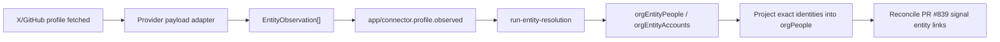

# Real Entity Enrichment Producers Design

Date: 2026-06-07

## Summary

Lightfast already has the core entity graph sink: `app/connector.profile.observed` runs entity resolution and persists canonical people, accounts, affiliations, source identities, observations, evidence, and candidate versions. The next slice makes that graph work from real product inputs by adding deterministic X and GitHub profile observation producers.

The first real-life system should enrich every external X/GitHub profile that Lightfast observes, not only the connected owner account. When a connector, emulator, or dev trigger fetches a profile, Lightfast converts the provider payload into normalized `EntityObservation` records, emits the existing entity graph event, persists canonical graph entities, projects exact person identities into the existing `orgPeople` compatibility table, and reconciles unresolved signal entity links from PR #839.

Exa/web enrichment and a full migration of signal entity links to canonical `orgEntityPeople` are out of scope for this slice and should be tracked as follow-up GitHub issues.

## Goals

- Convert observed X and GitHub profile payloads into the existing `EntityObservation` contract.
- Emit `app/connector.profile.observed` with deterministic event ids and ingestion ids.
- Upgrade local X/GitHub emulators so the product path can be debugged without real APIs or Exa.
- Persist graph rows through the existing `runEntityResolution` workflow.
- Project exact X/GitHub person identities from `orgEntityPeople` into `orgPeople` so PR #839 signal entity links resolve without a table migration.
- Add local tests and a dev-only harness that exercise provider payload -> observation -> event -> graph -> `orgPeople` projection -> signal-link reconciliation.

## Non-Goals

- Do not add Exa/web search enrichment in this slice.
- Do not migrate `orgSignalEntityLinks.resolvedPersonId` to `orgEntityPeople` in this slice.
- Do not build automated lead discovery, crawling, or "find similar people" features in this slice.
- Do not require Gmail ingestion for this slice.
- Do not depend on live X/GitHub APIs for the local reliability harness.

## Architecture



Provider clients and emulators only know provider payloads. The entity graph only knows normalized `EntityObservation` records. A new app service sits between them and owns normalization, event emission, idempotency, diagnostics, and compatibility projection.

The graph remains canonical for enriched profile knowledge. `orgPeople` remains a compatibility table for existing signal links and People surfaces until the later migration is designed.

## Components

### Provider Adapters

Add pure adapter functions for X and GitHub profile payloads.

X adapter input should accept the provider shape returned by X user lookup tools. It should normalize fields into `XProfileObservation`:

- `id`
- `username`
- `name`
- `description`
- `location`
- `url`
- `observedAt`

GitHub adapter input should accept authenticated and public user API shapes. It should normalize fields into `GitHubProfileObservation`:

- `id`
- `login`
- `name`
- `company`
- `blog`
- `email`
- `location`
- `twitterUsername`
- `bio`
- `observedAt`

Adapters must be side-effect free. Invalid profiles return structured skipped records or an empty observation, rather than throwing through the producer path for expected provider data gaps.

### Observation Emitter Service

Add an app service that accepts provider payloads plus provenance:

```ts
{
  clerkOrgId: string;
  provider: "x" | "github";
  source: "connector_tool" | "github_user_account" | "dev_emulator";
  sourceRef: string;
  payload: unknown;
  observedAt?: Date;
}
```

The service converts payloads through adapters, filters invalid results, builds deterministic identifiers, and sends `app/connector.profile.observed` only when at least one valid observation exists.

`ingestionId` and Inngest event id should be stable for the same org, provider, source, and provider profile ids. A stable hash is preferred over timestamps:

```ts
profiles:<provider>:<source>:<sha256(org + sourceRef + sortedProfileIds)>
```

### Producer Hooks

Wire the emitter into places where profiles are already fetched or are explicitly fetched by the local harness:

- X connector runtime results for `getUsersMe`, `getUsersByUsername`, `getUsersByUsernames`, `getUsersById`, and `getUsersByIds`.
- GitHub user account binding after `GET /user` returns the authenticated user's profile.
- A GitHub public user lookup helper, backed by the emulator, for explicit dev/local profile observation by login.
- A dev-only tRPC trigger that feeds X/GitHub emulator or fake profile payloads through the same emitter service used by real producer hooks.

This slice observes profiles when they are fetched. It does not crawl social graphs, infer new targets, or automatically fetch every unresolved signal mention.

### Entity Graph Projection

Extend the entity resolution workflow after graph persistence with a best-effort projection step:

1. Use source identity keys from the current observations to locate graph people touched by the current ingestion.
2. Load their X/GitHub source identities.
3. Project exact handle identities into `orgPeople`.
4. Return the projected `Person[]` rows.
5. Reconcile signal entity links with those rows.

Projection should create one `orgPeople` row per exact X/GitHub handle identity. The row should preserve:

- display name from the graph person
- identity provider and type
- original and normalized identity value
- metadata with `source: "entity_graph_projection"`, graph person public id, canonical key, graph status, graph confidence, and source identity key

Use a new `personSource` value of `entity_graph` for newly projected rows. If the identity key already exists, apply this deterministic source rule:

- existing `entity_graph` stays `entity_graph`
- existing `signal`, `team_member`, or `mixed` stays visible and becomes `mixed`

This keeps the compatibility table honest: projected-only rows are identifiable, and rows seen from more than one source remain `mixed`.

Projection may include graph people with status `confirmed`, `likely`, or `possible` when the projected identity itself is an exact X/GitHub handle from a direct provider profile observation. The graph person can remain `possible`; the handle identity is still deterministic enough to resolve exact signal mentions.

### Signal-Link Reconciliation

After projection, call `reconcileSignalEntityLinksForPeople` with projected rows. This lets PR #839's unresolved mentions resolve as soon as profile observations arrive.

Reconciliation failure should not fail entity graph persistence. It should be logged and returned in workflow output as a projection/reconciliation diagnostic.

## Data Flow

1. A connector, GitHub service, or dev trigger fetches one or more X/GitHub profiles.
2. The producer service normalizes provider payloads into `EntityObservation[]`.
3. The producer sends `app/connector.profile.observed` with deterministic identifiers.
4. `runEntityResolution` persists source identities, observations, candidate groups, canonical people, accounts, and affiliations.
5. The workflow projects exact X/GitHub person identities into `orgPeople`.
6. The workflow reconciles unresolved signal entity links against the projected people.
7. Existing entity graph read APIs continue to show canonical people/accounts, and existing signal APIs/MCP/UI can resolve linked people through `orgPeople`.

The raw provider payload is not the canonical model. It can be kept in logs or provider call ledgers where existing infrastructure already does so, but entity graph storage should continue to rely on normalized observations and evidence.

## Reliability

- If a provider call succeeds but normalization fails for one profile, skip that profile and include a skipped count in diagnostics.
- If a batch has mixed valid and invalid profiles, emit valid observations.
- If a batch has zero valid observations, do not send Inngest.
- Event ids and `ingestionId`s must be deterministic, so retries and repeated emulator runs do not create noisy candidate versions.
- Projection should be idempotent by `orgPeople` identity key.
- Signal-link reconciliation is best effort after graph persistence.
- Producer hooks must avoid leaking raw tokens or secrets into diagnostics.
- Adapter errors should be testable without network access.

## Local Harness

The local harness should prove the product path without Exa or live APIs:

- Upgrade the X emulator to return realistic profile fields for user endpoints.
- Upgrade the GitHub emulator to return realistic profile fields for `GET /user` and public user lookup by login.
- Add fake/emulator profile fixtures that cover clean cross-links, different handles, X-only profiles, GitHub-only profiles, conflicting affiliations, stale company claims, and domain-only businesses.
- Add a dev-only tRPC trigger that feeds fake/emulator payloads through the observation emitter.
- Keep `pnpm entity-graph:simulated` as a low-level direct-ingest check.
- Add a product-path local check that uses the new producer service and verifies graph rows, `orgPeople` projection, and signal-link reconciliation.

## Testing

Add focused tests before implementation:

- X payload adapter tests.
- GitHub payload adapter tests.
- Stable ingestion id and event id tests.
- Observation emitter tests for valid, invalid, mixed, and empty batches.
- X runtime producer hook tests for tool result shapes with object and array `data`.
- GitHub profile producer tests for authenticated and public user payloads.
- Workflow tests showing graph persistence, projection into `orgPeople`, and signal-link reconciliation.
- Emulator tests for the richer X/GitHub profile payloads.

The implementation should also run the focused package tests touched by the change, followed by `pnpm typecheck` if the touched surface spans multiple packages.

## Follow-Up GitHub Issues

Create these issues after the design is accepted:

1. Migrate signal entity links from `orgPeople` compatibility resolution to canonical `orgEntityPeople`.
2. Add Exa/web enrichment as another observation producer behind the same adapter/emitter boundary.

## Acceptance Criteria

- A local dev trigger can ingest fake/emulator X and GitHub profiles through the same producer service as real hooks.
- `runEntityResolution` persists graph people/accounts from producer-emitted events.
- Exact X/GitHub handle identities are projected into `orgPeople` with `personSource: "entity_graph"`.
- Existing PR #839 signal entity links can resolve after projected people are created.
- Repeated runs with the same input are idempotent and do not create noisy candidate versions.
- No Exa key is required.
- Deferred Exa and signal-link migration work is tracked separately.
