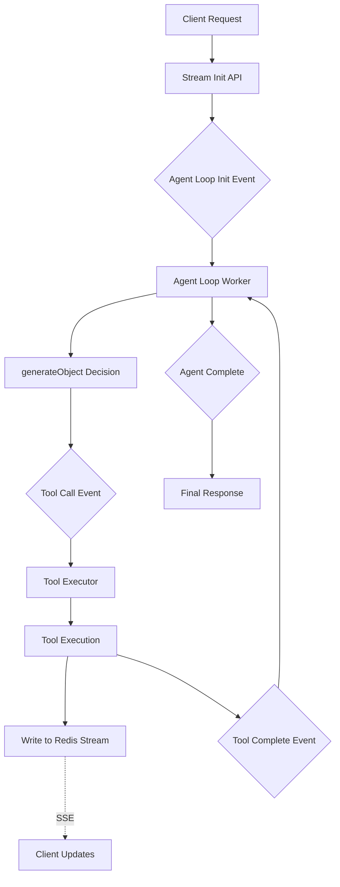

# Event-Driven Agent Architecture

## Overview

This architecture reimagines AI agent execution as a distributed, event-driven system. Instead of a single long-running HTTP request (like Vercel's `streamText`), we decompose agent workflows into discrete, resumable events that can execute independently across multiple workers.

## Architecture Pattern



## Core Concepts

### 1. Event-Driven Decomposition
Traditional streaming:
```
HTTP Request → LLM Stream → Tool Calls → Response → Timeout ❌
```

Event-driven approach:
```
HTTP Request → Event 1 → Event 2 → ... → Event N → Response ✅
Each event < 10 seconds
```

### 2. State Management
- **Session State**: Stored in Redis with sessionId as key
- **Message History**: Accumulated in Redis, accessed by workers
- **Tool Results**: Written directly to Redis streams for real-time updates
- **Agent Memory**: Persisted between events

### 3. Event Types

#### Core Events
- `agent.loop.init` - Starts a new agent conversation
- `agent.tool.call` - Requests tool execution
- `tool.execution.start` - Tool begins processing
- `tool.execution.complete` - Tool finished successfully
- `tool.execution.failed` - Tool failed after retries
- `agent.loop.complete` - Agent finished all tasks

## Implementation Architecture

### Component Responsibilities

#### 1. Stream Initializer (`/api/v2/stream/init`)
- Creates unique sessionId
- Initializes Redis state
- Emits `agent.loop.init` event via Qstash
- Returns sessionId to client immediately

#### 2. Agent Loop Worker
- Receives loop events
- Fetches conversation state from Redis
- Uses `generateObject` to decide next action
- Emits tool call events
- Handles completion logic

#### 3. Tool Executor
- Wraps tool execution in Qstash workflow
- Implements retry logic (5 attempts)
- Injects runtime context (sessionId)
- Writes results to Redis stream
- Emits completion events

#### 4. Stream Consumer
- Existing SSE infrastructure
- Reads from Redis streams
- Delivers real-time updates to client

### Event Flow Example

```typescript
// 1. Client initiates
POST /api/v2/stream/init
{
  "messages": [
    { "role": "user", "content": "Calculate 25 * 4 and tell me the weather" }
  ]
}

// 2. Agent Loop Init Event
{
  "type": "agent.loop.init",
  "sessionId": "123456",
  "messages": [...],
  "timestamp": "2024-01-28T10:00:00Z"
}

// 3. Agent decides to use calculator
{
  "type": "agent.tool.call",
  "sessionId": "123456",
  "tool": "calculator",
  "arguments": { "expression": "25 * 4" },
  "toolCallId": "tc_001"
}

// 4. Tool executes and completes
{
  "type": "tool.execution.complete",
  "sessionId": "123456",
  "toolCallId": "tc_001",
  "result": { "value": 100 }
}

// 5. Agent decides next tool
{
  "type": "agent.tool.call",
  "sessionId": "123456", 
  "tool": "weather",
  "arguments": { "location": "current" },
  "toolCallId": "tc_002"
}

// ... continues until agent.loop.complete
```

## Event Schemas & Emitter

### Event Schemas

All events in the system are strongly typed using Zod schemas. The schemas ensure consistency and provide runtime validation.

```typescript
import { EventType, type AgentLoopInitEvent } from "@lightfast/ai/v2/events";

// All events follow this base structure
interface BaseEvent {
  id: string;          // Unique event ID (evt_xxx)
  type: EventType;     // Discriminated union type
  sessionId: string;   // Correlation ID
  timestamp: string;   // ISO 8601
  version: "1.0";      // Schema version
}
```

#### Available Event Types

- `agent.loop.init` - Start a new agent conversation
- `agent.loop.complete` - Agent finished successfully
- `agent.loop.error` - Agent encountered an error
- `agent.tool.call` - Agent requests tool execution
- `tool.execution.start` - Tool begins processing
- `tool.execution.complete` - Tool finished successfully
- `tool.execution.failed` - Tool failed after retries
- `stream.write` - Write data to Redis stream
- `resource.request` - Request a pooled resource (future)
- `resource.release` - Release a pooled resource (future)

### Event Emitter

The event emitter provides type-safe methods for publishing events to Qstash.

```typescript
import { createEventEmitter } from "@lightfast/ai/v2/events";

// Initialize emitter
const emitter = createEventEmitter({
  qstashUrl: process.env.QSTASH_URL,
  qstashToken: process.env.QSTASH_TOKEN,
  topicPrefix: "agent", // Optional, defaults to "agent"
});

// Emit events with full type safety
await emitter.emitAgentLoopInit(sessionId, {
  messages: [
    { role: "user", content: "Hello!" }
  ],
  temperature: 0.7,
  maxIterations: 10,
  tools: ["calculator", "weather"],
});

// Session-scoped emitter (auto-includes sessionId)
const session = emitter.forSession(sessionId);
await session.emitAgentToolCall({
  toolCallId: "tc_001",
  tool: "calculator",
  arguments: { expression: "2 + 2" },
  iteration: 1,
  priority: "normal",
});
```

### Event Topics

Events are published to Qstash topics based on their type:
- `agent.loop.init` → `agent.agent-loop-init`
- `agent.tool.call` → `agent.agent-tool-call`
- `tool.execution.complete` → `agent.tool-execution-complete`

Workers subscribe to these topics to handle events.

## Incremental Adoption Plan

### Phase 1: Core Infrastructure ✅
- [x] Redis streaming infrastructure
- [x] SSE client consumption
- [x] Event schema definitions
- [x] Basic event emitter

### Phase 2: Agent Loop
- [ ] Agent loop worker
- [ ] State management
- [ ] generateObject integration
- [ ] Event routing

### Phase 3: Tool Execution
- [ ] Tool executor wrapper
- [ ] Retry logic
- [ ] Error handling
- [ ] Result streaming

### Phase 4: Production Features
- [ ] Resource pooling
- [ ] Priority queuing  
- [ ] Monitoring/observability
- [ ] Rate limiting

## Benefits

1. **No Timeout Limits**: Each event executes in seconds, not minutes
2. **Natural Checkpointing**: Resume from any tool completion
3. **Resource Management**: Queue and throttle expensive operations
4. **Failure Isolation**: Tool failures don't crash the agent
5. **Horizontal Scaling**: Distribute work across many workers
6. **Observable**: Every event is trackable and debuggable

## Trade-offs

1. **Complexity**: More moving parts than single request
2. **Latency**: Each event hop adds ~100-200ms
3. **Consistency**: Distributed state management
4. **Development**: Harder to test locally

## Future Enhancements

### Resource Pooling (Browserbase Example)
```typescript
// Resource pool manager
class BrowserbasePool {
  private available: Set<string> = new Set();
  private inUse: Map<string, string> = new Map();
  private queue: Queue<PendingRequest> = new Queue();
  
  async requestSession(sessionId: string): Promise<string | null> {
    if (this.available.size > 0) {
      const browserId = this.available.values().next().value;
      this.available.delete(browserId);
      this.inUse.set(sessionId, browserId);
      return browserId;
    }
    
    // Queue the request
    await this.queue.push({ sessionId, priority: "normal" });
    return null;
  }
}
```

### Parallel Tool Execution
```typescript
// Future: Execute independent tools in parallel
const toolPlan = await generateObject({
  schema: z.object({
    parallel: z.array(z.object({
      tool: z.string(),
      arguments: z.any()
    })),
    sequential: z.array(...)
  })
});

// Emit multiple tool events simultaneously
await Promise.all(
  toolPlan.parallel.map(tool => 
    emitEvent("agent.tool.call", { ...tool })
  )
);
```

### Event Batching
```typescript
// Batch simple operations to reduce latency
const batch = await collectSimpleTools(events, 100); // 100ms window
const results = await executeToolBatch(batch);
await emitBatchResults(results);
```

## Getting Started

1. **Setup Qstash**: Configure Upstash Qstash for event routing
2. **Deploy Workers**: Set up Vercel functions for each worker type
3. **Configure Redis**: Ensure Redis is accessible from all workers
4. **Test Events**: Use the test tools to verify flow

## Testing Strategy

### Unit Tests
- Event emission and consumption
- State management operations
- Tool execution with mocked events

### Integration Tests
- End-to-end event flows
- Retry logic verification
- State consistency checks

### Load Tests
- Concurrent agent sessions
- Resource pool saturation
- Event throughput limits

## Monitoring

Key metrics to track:
- Event processing latency
- Tool execution duration
- Retry rates and failures
- Queue depths
- Resource utilization

## Security Considerations

- Validate all events with schemas
- Authenticate event sources
- Encrypt sensitive data in events
- Rate limit event emission
- Audit event trails

---

## Legacy: Resumable LLM Streams

The foundation of this architecture builds on the resumable streaming pattern from [Upstash](https://upstash.com/blog/resumable-llm-streams).

### Existing Components

#### Stream Infrastructure
- `server/stream-generator.ts` - Writes agent output to Redis streams
- `server/stream-consumer.ts` - Delivers updates via SSE
- `server/types.ts` - Message types and schemas
- `react/use-resumable-stream.ts` - Auto-reconnecting React hook

These components continue to handle the real-time delivery of agent updates to clients, while the event-driven layer orchestrates the agent execution.