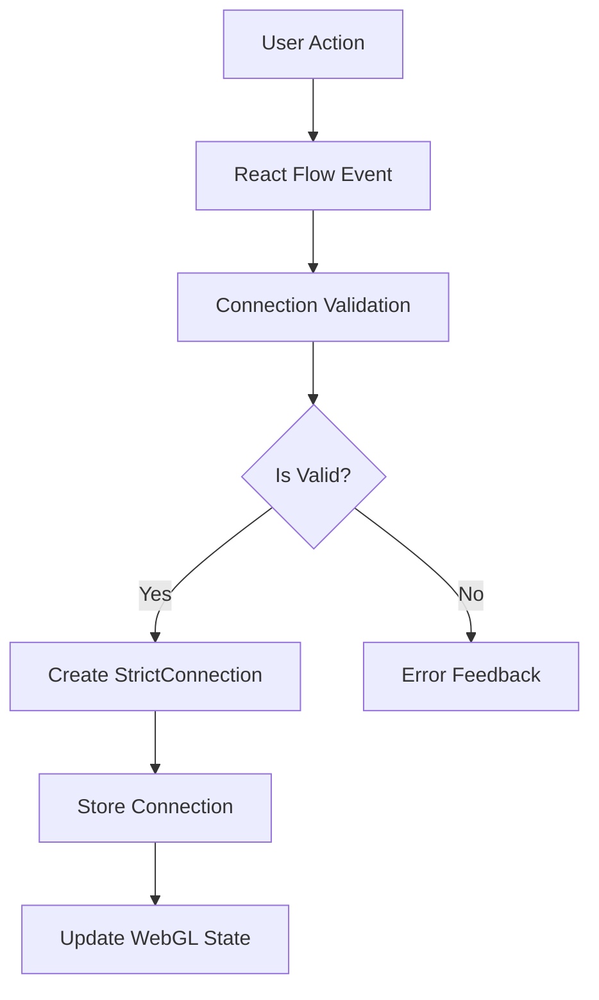
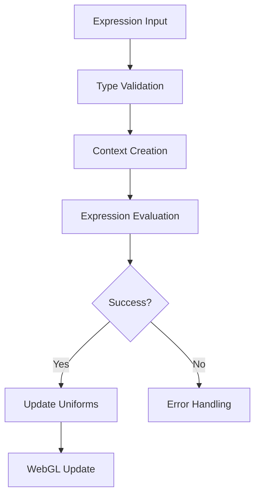

# Data Flow Design

## Overview

The data flow system manages the movement of data through the application, handling connections between nodes, expression evaluation, and uniform updates. It ensures type safety at every step while maintaining performance.

## Component and Data Flow Diagram

```
┌─────────────────────────────┐     ┌─────────────────────────────┐
│                             │     │                             │
│       Texture Registry      │     │         Field Types         │
│  (packages/webgl/types/)    │     │  (packages/webgl/types/)    │
│                             │     │                             │
└───────────────┬─────────────┘     └─────────────┬───────────────┘
                │                                  │
                │ Defines                          │ Provides
                │ available                        │ metadata
                │ inputs                           │ structure
                ▼                                  ▼
┌─────────────────────────────┐     ┌─────────────────────────────┐
│                             │     │                             │
│     TextureHandle Types     │◄────┤      Texture Uniform        │
│  (vendor/db/schema/types/)  │     │  (packages/webgl/types/)    │
│                             │     │                             │
└───────────────┬─────────────┘     └─────────────────────────────┘
                │
                │ Provides
                │ validation
                │ utilities
                ▼
┌─────────────────────────────┐
│                             │
│       Edge DB Schema        │
│  (vendor/db/schema/tables/) │
│                             │
└───────────────┬─────────────┘
                │
                │ Database
                │ structure
                ▼
┌─────────────────────────────┐
│                             │
│      useAddEdge Hook        │
│   (app/workspace/hooks/)    │
│                             │
└───────────────┬─────────────┘
                │
                │ Connects
                │ UI to data
                ▼
┌─────────────────────────────┐     ┌─────────────────────────────┐
│                             │     │                             │
│       TextureNode           │◄────┤        NodeHandle          │
│ (app/workspace/components/) │     │ (app/workspace/components/) │
│                             │     │                             │
└─────────────────────────────┘     └─────────────────────────────┘
```

## Unified System Architecture

```
┌──────────────────┐     ┌───────────────────┐     ┌────────────────────┐
│                  │     │                   │     │                    │
│  TextureTypeConfig    │     StrictConnection    │     TextureUniform  │
│  (Registry)      │     │     (Data Model)  │     │     (Simplified)   │
│                  │     │                   │     │                    │
└────────┬─────────┘     └─────────┬─────────┘     └──────────┬─────────┘
         │                         │                          │
         ▼                         ▼                          ▼
┌──────────────────────────────────────────────────────────────────────┐
│                                                                      │
│                   Unified Texture Update System                      │
│                                                                      │
├──────────────────────────────────────────────────────────────────────┤
│                                                                      │
│ ┌────────────────┐ ┌────────────────┐ ┌─────────────┐ ┌───────────┐ │
│ │ Connection     │ │ Shader         │ │ Expression  │ │ Uniform   │ │
│ │ Management     │ │ Management     │ │ Evaluation  │ │ Updates   │ │
│ └────────────────┘ └────────────────┘ └─────────────┘ └───────────┘ │
│                                                                      │
└──────────────────────────────────────────────────────────────────────┘
```

## Core Data Flows

### 1. Connection Flow



### 2. Expression Flow



## Type-Safe Data Structures

### 1. Connection Types

```typescript
export interface StrictConnection extends BaseConnection {
  sourceHandle: HandleId;
  targetHandle: HandleId;
}

export interface ConnectionState {
  connections: Map<string, StrictConnection>;
  validationCache: ValidationCache;
  pendingUpdates: Set<string>;
}
```

### 2. Expression Types

```typescript
export interface ExpressionState {
  expressions: ExpressionMap;
  context: ExpressionContext;
  cache: Map<string, ExpressionResult>;
}

export interface UniformState {
  uniforms: Map<string, UniformConfig>;
  values: Map<string, number | boolean>;
  dirty: Set<string>;
}
```

## Data Flow Components

### 1. Connection Management

```typescript
export class ConnectionManager {
  private state: ConnectionState;
  private validator: ConnectionValidator;

  constructor() {
    this.state = {
      connections: new Map(),
      validationCache: createValidationCache(),
      pendingUpdates: new Set(),
    };
  }

  public addConnection(connection: BaseConnection): Result<StrictConnection> {
    const validated = this.validator.validate(connection);
    if (!validated.success) {
      return { success: false, error: validated.error };
    }

    const strict = validated.value;
    this.state.connections.set(strict.id, strict);
    this.state.pendingUpdates.add(strict.id);

    return { success: true, value: strict };
  }

  public removeConnection(id: string): void {
    this.state.connections.delete(id);
    this.state.validationCache.delete(id);
    this.state.pendingUpdates.add(id);
  }
}
```

### 2. Expression Management

```typescript
export class ExpressionManager {
  private state: ExpressionState;
  private evaluator: ExpressionEvaluator;

  constructor() {
    this.state = {
      expressions: new Map(),
      context: createContext(),
      cache: new Map(),
    };
  }

  public addExpression(
    id: string,
    expression: Expression,
  ): Result<ExpressionResult> {
    const result = this.evaluator.evaluate(expression, this.state.context);
    if (result.success) {
      this.state.expressions.set(id, expression);
      this.state.cache.set(id, result.value);
    }
    return result;
  }

  public updateContext(update: Partial<ExpressionContext>): void {
    this.state.context = { ...this.state.context, ...update };
    this.invalidateCache();
  }
}
```

### 3. Uniform Management

```typescript
export class UniformManager {
  private state: UniformState;
  private expressions: ExpressionManager;

  constructor() {
    this.state = {
      uniforms: new Map(),
      values: new Map(),
      dirty: new Set(),
    };
  }

  public updateUniforms(shader: ShaderMaterial): void {
    for (const [name, config] of this.state.uniforms) {
      if (this.state.dirty.has(name)) {
        const value = this.expressions.evaluate(config.expression);
        if (value.success) {
          shader.uniforms[name].value = value.value;
          this.state.values.set(name, value.value);
        }
      }
    }
    this.state.dirty.clear();
  }
}
```

## Data Transformation Flow

### 1. Configuration to UI

```
Shader Constraints (ADD_UNIFORM_CONSTRAINTS, etc.)
↓
getTextureInputsForType() → TextureInput[] metadata
↓
TextureNode renders NodeHandle components
```

### 2. UI to Database

```
User connects nodes visually
↓
Connection event (source, target, sourceHandle, targetHandle)
↓
validateConnection() validates format and creates StrictConnection
↓
useAddEdge.mutateAsync() processes the connection
↓
Optimistic update to UI
↓
API call to create Edge in database
↓
InsertEdgeSchema validates format using isValidTextureHandleId()
```

### 3. Database to WebGL

```
Edge data loaded from database
↓
getUniformForEdge() converts handle to uniform name
↓
Shader receives uniform with texture data
```

## Performance Optimizations

### 1. Caching Strategy

```typescript
export interface CacheStrategy {
  shouldCache(key: string): boolean;
  getCached(key: string): unknown | undefined;
  setCached(key: string, value: unknown): void;
  invalidate(pattern?: string): void;
}

export class ExpressionCache implements CacheStrategy {
  private cache: Map<string, CacheEntry>;
  private config: CacheConfig;

  public shouldCache(expression: Expression): boolean {
    return this.config.shouldCache(expression);
  }

  public invalidatePattern(pattern: string): void {
    for (const [key] of this.cache) {
      if (key.includes(pattern)) {
        this.cache.delete(key);
      }
    }
  }
}
```

### 2. Batch Processing

```typescript
export interface BatchProcessor {
  addToBatch(item: unknown): void;
  processBatch(): Promise<void>;
  clearBatch(): void;
}

export class UniformBatchProcessor implements BatchProcessor {
  private batch: Set<string>;
  private processing: boolean;

  public async processBatch(): Promise<void> {
    if (this.processing) return;
    this.processing = true;

    try {
      // Process uniforms in batches
      const batches = this.createBatches(Array.from(this.batch));
      for (const batch of batches) {
        await this.processUniformBatch(batch);
      }
    } finally {
      this.processing = false;
      this.batch.clear();
    }
  }
}
```

## Success Metrics

1. **Performance**

   - Expression evaluation < 1ms
   - Uniform updates < 0.5ms
   - Connection validation < 2ms

2. **Type Safety**

   - 100% type coverage
   - No runtime type errors
   - Clear error messages

3. **Resource Usage**
   - Memory usage < 50MB
   - CPU usage < 5%
   - GPU optimization
