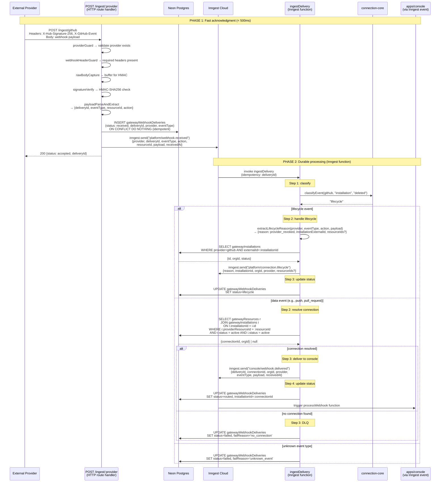
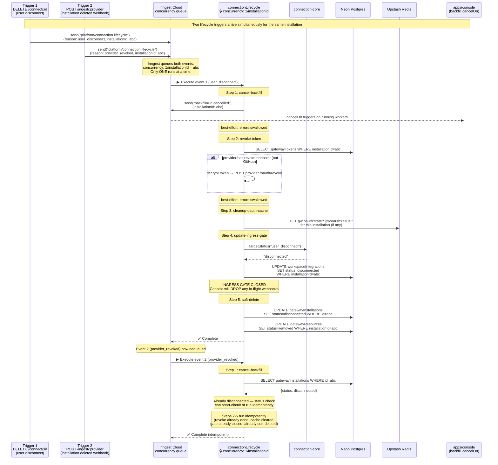
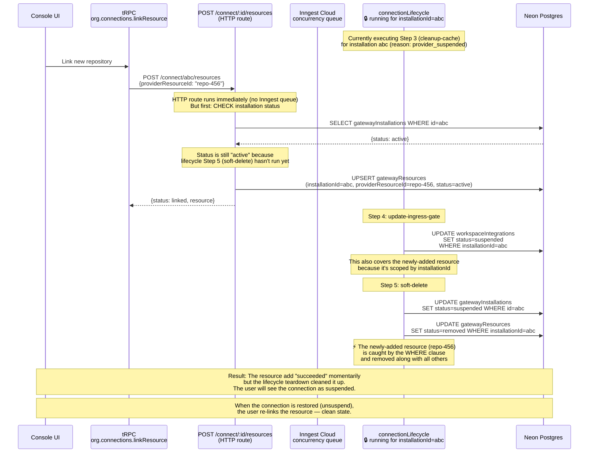
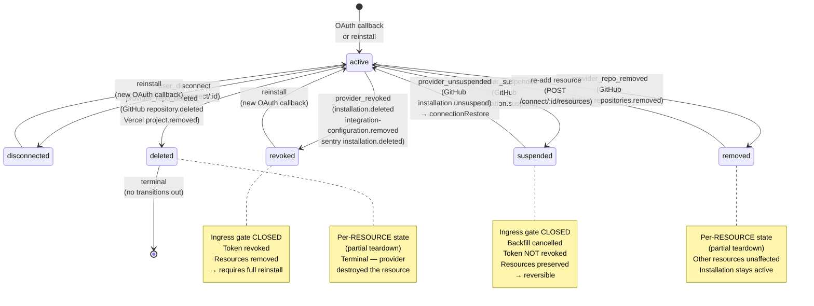
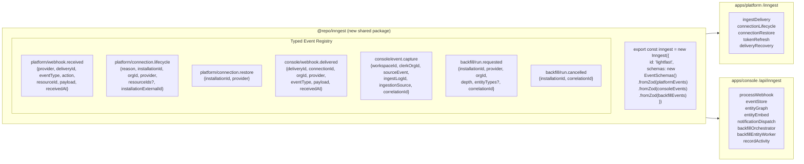
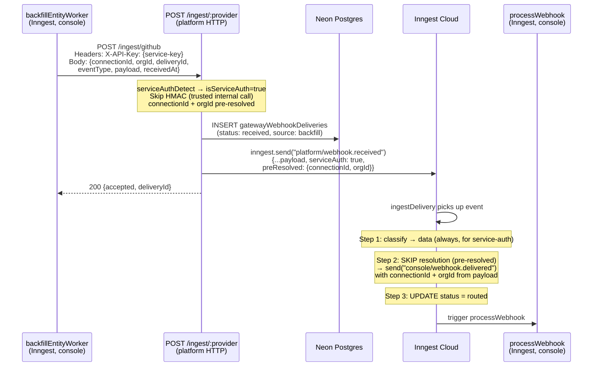
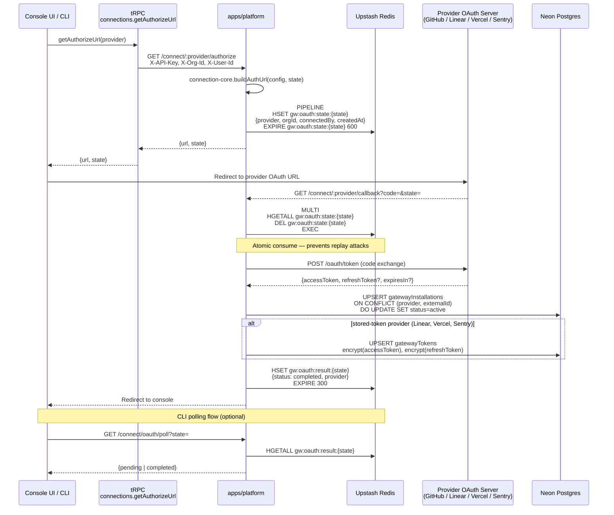

# apps/platform Architecture Redesign

## Executive Summary

Radical redesign of the platform service that:
- **Drops Upstash Workflow + QStash entirely** — Inngest as the sole durable execution engine
- **Eliminates race conditions** via Inngest concurrency serialization (1 per installation)
- **Classify-first ingest** — webhook type determines routing BEFORE connection resolution
- **Self-healing** — write-ahead log + cron recovery for missed events
- **Provider-adaptive rate limiting** — per-provider throttle configs via Inngest
- **Single event bus** — platform and console share one Inngest app via `@repo/inngest`

Designed for a 1-2 person team: one durable execution system, one dashboard, one mental model.

---

## What We're Dropping

| Dropped | Replacement | Why |
|---------|-------------|-----|
| Upstash Workflow (3 workflows) | Inngest functions | Zero advanced features used; two systems = 2x operational cost |
| QStash (internal routing) | Inngest events | Typed events > HTTP publishes; no service discovery needed |
| QStash delivery callbacks | Inngest observability | Native step-level visibility replaces callback tracking |
| QStash deduplication | Inngest idempotency | `idempotency: "event.data.deliveryId"` |
| Redis resource routing cache | DB-only routing | `gw:resource:*` was never read for routing (confirmed in codebase) |
| 4 delivery statuses | 3 statuses | `received → routed → failed` (Inngest dashboard for execution detail) |

**Kept:** Redis for OAuth state (atomic MULTI HGETALL+DEL consume pattern — hard to replicate atomically in Postgres).

---

## Key Innovations

### 1. Inngest Concurrency as Distributed Lock

```
connectionLifecycle: concurrency: { limit: 1, key: installationId }
connectionRestore:   concurrency: { limit: 1, key: installationId }
```

All lifecycle operations for a given installation are **naturally serialized by Inngest's queue**. No distributed locks. No optimistic locking needed. If a resource-add webhook arrives while a teardown is running, Inngest queues it. If two lifecycle webhooks arrive simultaneously, one waits.

### 2. Classify-First Ingest

The original system routes THEN handles lifecycle (separate services, race window). The redesign classifies FIRST:

```
webhook → classify(provider, eventType) → lifecycle | data | unknown
```

Lifecycle events never enter the data pipeline. Data events never trigger lifecycle. The classification happens in-process inside the `ingestDelivery` Inngest function, using `@repo/connection-core`.

### 3. Write-Ahead + Cron Recovery

```
Route handler: persist(received) → inngest.send() → return 200
Cron (every 1m): scan(status=received AND age > 2min) → re-fire events
```

Even if `inngest.send()` fails silently, the cron catches it. The system is self-healing.

### 4. Proactive Token Refresh

```
tokenRefresh (cron every 5m): scan tokens where expiresAt < now + 10m → refresh
```

Proxy calls never encounter expired tokens. Eliminates the 401→retry→refresh cascade.

### 5. Single Event Bus

`@repo/inngest` exports one typed client. Both `apps/platform` and `apps/console` register serve endpoints. Events cross service boundaries natively.

```
platform fires: console/webhook.delivered → console's processWebhook picks it up
platform fires: backfill/run.cancelled → console's backfillWorker cancelOn picks it up
```

No QStash. No HTTP. Just typed events.

---

## Diagram 1: apps/platform Master Architecture

```mermaid
flowchart TD
    EXT["External Providers\nGitHub · Vercel · Linear · Sentry\n(webhooks + OAuth callbacks)"]
    CLI["Browser / CLI\n(OAuth flows, API calls)"]

    subgraph platform["apps/platform  (Hono + srvx + Inngest)"]
        direction TB

        subgraph mw["Global Middleware  (every request)"]
            direction LR
            MW1["requestId\n(nanoid)"] --> MW2["sentry\n(captureException)"] --> MW3["lifecycle\n(structured logs)"] --> MW4["errorSanitizer\n(5xx → generic)"]
        end

        subgraph routes["HTTP Routes — fast path (all < 500ms, no durable logic)"]
            R_INGEST["POST /ingest/:provider\n─────────────────────\nproviderGuard\nHMAC verify OR X-API-Key\nrawBodyCapture\npayloadParseAndExtract\n─────────────────────\n① INSERT delivery (received)\n② inngest.send(webhook.received)\n③ return 200 {accepted}"]

            R_OAUTH["GET /connect/:p/authorize\n─────────────────────\napiKeyAuth + tenantMiddleware\nBuild OAuth URL\nRedis SET state TTL 600s\nReturn {url, state}\n─────────────────────\nGET /connect/:p/callback\n─────────────────────\nRedis MULTI get+del state\nExchange code for tokens\nUPSERT installation\nEncrypt + store tokens\nRedis SET result TTL 300s\n─────────────────────\nGET /connect/oauth/poll\n─────────────────────\nRedis GET result\nReturn {pending|completed}"]

            R_CONNECT["GET /connect/:id\nConnection details + resources\n─────────────────────\nDELETE /connect/:id\ninngest.send(connection.lifecycle)\nReturn {teardown_initiated}\n─────────────────────\nGET /token/:id\nDecrypt + refresh-if-expired\nReturn {accessToken, expiresIn}\n─────────────────────\nPOST /proxy/:id\nAcquire token → proxy fetch\n401 retry with force-refresh"]

            R_RES["POST /connect/:id/resources\nUPSERT resource row\n─────────────────────\nDELETE /connect/:id/resources/:r\nSoft-delete resource\n─────────────────────\nGET /connect/:id/runs\nBackfill history\n─────────────────────\nPOST /connect/:id/runs\nRecord backfill run result"]

            R_ADMIN["GET /admin/health\nDB probe\n─────────────────────\nGET /admin/dlq\nPaginated failed deliveries\n─────────────────────\nPOST /admin/dlq/replay\nRe-fire events for deliveryIds[]\n─────────────────────\nPOST /admin/replay/catchup\nRe-fire received deliveries\nfor an installationId"]
        end

        R_SERVE["GET|POST /inngest  (Inngest serve endpoint)"]

        subgraph fns["Inngest Functions — durable, retriable, observable"]
            F_INGEST["⚡ ingestDelivery\ntrigger: platform/webhook.received\n═══════════════════════════\n❶ classify\n  → connection-core.classifyEvent()\n  → lifecycle | data | unknown\n\n❷ route\n  [data]  resolve connection via DB join\n          → send(console/webhook.delivered)\n  [lifecycle] extract reason\n          → send(platform/connection.lifecycle)\n          OR send(platform/connection.restore)\n  [unknown] mark DLQ\n\n❸ update delivery status\n  → routed | lifecycle | failed\n═══════════════════════════\nidempotency: deliveryId\nconcurrency: 50 global · 20/provider\nretries: 3"]

            F_LIFECYCLE["🔒 connectionLifecycle\ntrigger: platform/connection.lifecycle\n═══════════════════════════\n❶ cancel-backfill\n  → sendEvent(backfill/run.cancelled)\n  best-effort\n\n❷ revoke-token\n  → skip if GitHub (on-demand JWTs)\n  → decrypt + POST revoke endpoint\n  best-effort\n\n❸ cleanup-oauth-cache\n  → Redis DEL gw:oauth:* for installation\n\n❹ update-ingress-gate\n  → connection-core.targetStatus(reason)\n  → UPDATE workspaceIntegrations.status\n  partial: only affected resourceIds\n  full: all resources for installation\n\n❺ soft-delete\n  → UPDATE gatewayInstallations.status\n  → UPDATE gatewayResources.status\n  full: all resources → removed\n  partial: specific resources only\n═══════════════════════════\n🔒 concurrency: 1/installationId\n← serializes ALL lifecycle ops\nretries: 5 · timeout: 5m"]

            F_RESTORE["🔓 connectionRestore\ntrigger: platform/connection.restore\n═══════════════════════════\n❶ restore-installation\n  → UPDATE gatewayInstallations\n    SET status=active\n\n❷ restore-integrations\n  → UPDATE workspaceIntegrations\n    SET status=active\n    WHERE status=suspended\n═══════════════════════════\n🔒 concurrency: 1/installationId\nretries: 3"]

            F_TOKEN["🔄 tokenRefresh\ntrigger: cron schedule 5m\n═══════════════════════════\nScan: gatewayTokens\n  WHERE expiresAt < now + 10min\n  AND installation.status = active\n\nFor each: decrypt refresh token\n  → POST provider refresh endpoint\n  → encrypt + update stored token\n\nSkips: GitHub (on-demand JWTs)\n       Vercel (non-expiring tokens)\n═══════════════════════════\nPrevents proxy-call token failures"]

            F_RECOVERY["🩹 deliveryRecovery\ntrigger: cron schedule 1m\n═══════════════════════════\nScan: gatewayWebhookDeliveries\n  WHERE status=received\n  AND receivedAt < now - 2min\n  LIMIT 100\n\nFor each: re-fire\n  inngest.send(webhook.received)\n  with same payload\n═══════════════════════════\nSelf-healing for missed events\nidempotency prevents double-processing"]
        end
    end

    DB[("@db/console\nNeon Postgres\n(shared with console)")]
    REDIS[("Upstash Redis\nOAuth state only\ngw:oauth:state:*\ngw:oauth:result:*")]
    INNGEST_CLOUD["Inngest Cloud\nEvent bus + durable execution\nSingle app shared with console"]
    CORE["@repo/connection-core\nclassifier · state-machine\nprovider definitions · HMAC configs"]
    CONSOLE["apps/console\n(Inngest serve endpoint)"]

    EXT -->|"POST /ingest/:provider\nwebhook payloads"| R_INGEST
    CLI -->|"OAuth + API calls"| R_OAUTH
    CLI -->|"Connection management"| R_CONNECT

    R_INGEST -->|"① persist"| DB
    R_INGEST -->|"② fire event"| INNGEST_CLOUD
    R_CONNECT -->|"fire lifecycle event"| INNGEST_CLOUD
    R_OAUTH -->|"state + result"| REDIS
    R_OAUTH -->|"installations + tokens"| DB
    R_CONNECT --> DB
    R_RES --> DB
    R_ADMIN --> DB

    INNGEST_CLOUD <-->|"invoke platform functions"| R_SERVE

    F_INGEST -->|"classify"| CORE
    F_LIFECYCLE -->|"targetStatus(reason)"| CORE
    fns --> DB

    F_INGEST -.->|"send: console/webhook.delivered"| INNGEST_CLOUD
    F_INGEST -.->|"send: platform/connection.lifecycle"| INNGEST_CLOUD
    F_INGEST -.->|"send: platform/connection.restore"| INNGEST_CLOUD
    F_LIFECYCLE -.->|"send: backfill/run.cancelled"| INNGEST_CLOUD
    INNGEST_CLOUD -.->|"deliver console events"| CONSOLE

    style F_LIFECYCLE fill:#1a1a2e,stroke:#e94560,stroke-width:2px
    style F_RESTORE fill:#1a1a2e,stroke:#0f3460,stroke-width:2px
    style F_INGEST fill:#1a1a2e,stroke:#16213e,stroke-width:2px
```



---

## Diagram 2: Ingest-Delivery Pipeline (The Critical Path)

The most important flow in the system. Shows the classify-first innovation and how lifecycle events are handled inline.



---

## Diagram 3: Connection Lifecycle with Serialization

Shows how `concurrency: 1/installationId` eliminates race conditions for concurrent operations.



---

## Diagram 4: Race Condition Resolution — Resource Add During Lifecycle

The most dangerous race: a user adds a resource while a lifecycle teardown is running.



---

## Diagram 5: Connection State Machine



---

## Diagram 6: Provider-Aware Rate Limiting (Backfill)

Shows how each provider gets appropriate rate limiting through the Inngest throttle + dynamic sleep dual-layer.

```mermaid
flowchart TD
    subgraph orchestrator["backfillOrchestrator (Inngest, console)"]
        O1["Trigger: backfill/run.requested"]
        O2["step.invoke backfillEntityWorker × N"]
        O1 --> O2
    end

    subgraph worker["backfillEntityWorker (Inngest, console)"]
        direction TB

        subgraph layer1["Layer 1: Inngest Throttle (pre-flight gate)"]
            T1["throttle:\n  limit: provider-budget/hr\n  period: 1h\n  key: provider + installationId\n\nGitHub:  4000/hr  (5000 - 1000 reserved)\nLinear:  2000/hr  (400/min budget)\nVercel:  3000/hr  (120/s budget)\nSentry:  1500/hr  (40/s budget)"]
        end

        subgraph layer2["Layer 2: Inngest Concurrency (parallelism cap)"]
            C1["concurrency:\n  {limit: 5, key: orgId}\n  {limit: 10, global}\n\nMax 5 workers per org\nMax 10 workers total\n← prevents quota stampede"]
        end

        subgraph layer3["Layer 3: Response-Header Sleep (reactive)"]
            direction TB
            FETCH["step.run: fetch-page-N\nPOST /proxy/:id\n→ provider API call"]
            CHECK{"remaining < 10%\nof limit?"}
            SLEEP["step.sleep:\nrate-limit-page-N\nduration: until resetAt\n← durable sleep,\nno execution slot held"]
            NEXT["Next page"]

            FETCH --> CHECK
            CHECK -->|yes| SLEEP
            SLEEP --> NEXT
            CHECK -->|no| NEXT
        end

        subgraph layer4["Layer 4: cancelOn (safety valve)"]
            CANCEL["cancelOn: backfill/run.cancelled\n  match: installationId\n\n← lifecycle teardown fires this\n← worker stops immediately"]
        end
    end

    subgraph headers["Provider Rate Limit Headers"]
        H1["GitHub\nx-ratelimit-remaining\nx-ratelimit-limit\nx-ratelimit-reset (epoch seconds)\n5000 req/hr per installation"]
        H2["Linear\nx-ratelimit-requests-remaining\nx-ratelimit-requests-limit\nx-ratelimit-requests-reset (epoch ms)\n400 req/min (request-based)"]
        H3["Vercel\nx-ratelimit-remaining\nx-ratelimit-limit\nx-ratelimit-reset (epoch seconds)\n120 req/s per token"]
        H4["Sentry\nx-sentry-rate-limit-remaining\nx-sentry-rate-limit-limit\nx-sentry-rate-limit-reset (epoch s, float)\n40 req/s org-wide"]
    end

    FETCH -.->|"reads"| headers

    style layer1 fill:#1a1a2e,stroke:#e94560
    style layer2 fill:#1a1a2e,stroke:#0f3460
    style layer3 fill:#1a1a2e,stroke:#16213e
    style layer4 fill:#1a1a2e,stroke:#533483
```



---

## Diagram 7: Inngest Event Schema (Shared via @repo/inngest)



---

## Diagram 8: Service-Auth Path (Backfill → Platform → Console)

The backfill entity worker dispatches synthetic webhooks. These bypass HMAC verification and classification.



---

## Diagram 9: OAuth Flow (Platform)



---

## Provider Scoping Model

How the connection model handles different provider hierarchies:

```mermaid
flowchart TD
    subgraph github["GitHub  (org+repo hierarchy)"]
        direction TB
        GH_INSTALL["gatewayInstallation\nexternalId: installation_id (numeric)\nscope: org or user account\nauth: app-token (on-demand JWT)\ninstallationMode: multi"]
        GH_RES1["gatewayResource\nproviderResourceId: repo.id\nresourceName: owner/repo"]
        GH_RES2["gatewayResource\nproviderResourceId: repo.id\nresourceName: owner/repo2"]
        GH_INSTALL --> GH_RES1
        GH_INSTALL --> GH_RES2

        GH_LIFE["Lifecycle events:\ninstallation.deleted → full teardown\ninstallation.suspend → suspend all\ninstallation_repos.removed → partial teardown\nrepository.deleted → partial teardown"]
    end

    subgraph linear["Linear  (flat workspace)"]
        direction TB
        LI_INSTALL["gatewayInstallation\nexternalId: organization.id (UUID)\nscope: entire workspace\nauth: oauth (stored token)\ninstallationMode: merged"]
        LI_RES1["gatewayResource\nproviderResourceId: team.id\nresourceName: team name"]
        LI_RES2["gatewayResource\nproviderResourceId: team.id\nresourceName: team name2"]
        LI_INSTALL --> LI_RES1
        LI_INSTALL --> LI_RES2

        LI_LIFE["Lifecycle events:\n(none via webhook)\nOnly user-initiated disconnect"]
    end

    subgraph vercel["Vercel  (team+project hierarchy)"]
        direction TB
        VC_INSTALL["gatewayInstallation\nexternalId: team_id or user_id\nscope: Vercel team/personal\nauth: oauth (non-expiring token)\ninstallationMode: multi"]
        VC_RES1["gatewayResource\nproviderResourceId: project.id\nresourceName: project name"]
        VC_INSTALL --> VC_RES1

        VC_LIFE["Lifecycle events:\nintegration-configuration.removed → full teardown\nproject.removed → partial teardown"]
    end

    subgraph sentry["Sentry  (installation-scoped)"]
        direction TB
        SE_INSTALL["gatewayInstallation\nexternalId: installation.uuid\nscope: Sentry org\nauth: oauth (composite token)\ninstallationMode: single"]
        SE_RES1["gatewayResource\nproviderResourceId: project.slug\nresourceName: org/project"]
        SE_INSTALL --> SE_RES1

        SE_LIFE["Lifecycle events:\ninstallation.deleted → full teardown\n(no partial teardown)"]
    end

    subgraph routing["Webhook Routing Strategy"]
        direction TB
        RT1["extractResourceId(provider, payload):\nGitHub: payload.repository.id ?? payload.installation.id\nLinear: payload.organizationId\nVercel: payload.payload.project.id ?? payload.payload.team.id\nSentry: payload.installation.uuid"]
        RT2["DB resolve:\nSELECT FROM gatewayResources r\nJOIN gatewayInstallations i\nWHERE r.providerResourceId = :resourceId\nAND r.status = active\nAND i.status = active"]
    end
```



---

## What This Removes

| Component | Lines of Code | Vendor Deps Removed |
|-----------|--------------|---------------------|
| `@vendor/upstash-workflow` | ~200 | `@upstash/workflow` |
| `@vendor/qstash` | ~150 | `@upstash/qstash` |
| QStash delivery callbacks | ~100 | — |
| QStash dedup config | ~50 | — |
| Redis resource cache (`gw:resource:*`) writes | ~80 | — |
| Webhook delivery workflow (Upstash) | ~225 | — |
| Connection teardown workflow (Upstash) | ~150 | — |
| Console ingress workflow (Upstash) | ~136 | — |
| **Total** | **~1,091** | **2 vendor deps** |

## What This Adds

| Component | Purpose |
|-----------|---------|
| `@repo/inngest` shared package | Typed Inngest client + event schemas |
| `ingestDelivery` Inngest function | Replaces webhook-delivery workflow |
| `connectionLifecycle` Inngest function | Replaces connection-teardown workflow |
| `connectionRestore` Inngest function | New: handles unsuspend |
| `tokenRefresh` Inngest cron | New: proactive token refresh |
| `deliveryRecovery` Inngest cron | New: self-healing for missed events |
| Platform Inngest serve endpoint | `GET\|POST /inngest` route |

---

## Open Questions for Iteration

1. **Should `POST /connect/:id/resources` also go through Inngest?** Currently it's a synchronous HTTP route. Making it an Inngest function would serialize it against lifecycle operations. But it adds latency to a user-facing operation.

2. **Should we keep `gatewayWebhookDeliveries` at all?** If Inngest provides full observability, the delivery table becomes redundant. But it's useful for DLQ replay and debugging.

3. **Token refresh for Sentry's composite tokens** — The cron function needs to decode composite tokens to get the installationId for the refresh URL. Is this complexity worth proactive refresh, or should Sentry stay reactive-only?

4. **Single vs dual Inngest app ID** — Using one app ID means one event namespace, one dashboard. But it means platform deployment failures affect console's Inngest serve endpoint visibility. Two app IDs add isolation but require cross-app event routing.

5. **Redis retention** — With resource routing cache dropped and only OAuth state remaining, is Redis still justified? OAuth state could use short-lived DB rows cleaned by cron. But the atomic MULTI pattern is cleaner in Redis.

---

## Next Steps

After iterating on apps/platform diagrams:
1. Design apps/console diagram (processWebhook, event pipeline, backfill absorption)
2. Design @repo/connection-core diagram (provider registry, classifier, state machine)
3. Design @repo/inngest diagram (shared client, event schemas, type safety)
4. Phase migration plan (which pieces to build first)
