# apps/platform Architecture Redesign

<!-- SECTION: executive-summary | last_updated: 2026-03-18T02 -->
## Executive Summary

Radical redesign of the platform service that:
- **Drops Upstash Workflow + QStash entirely** — Inngest as the sole durable execution engine
- **Gate-first lifecycle** — `gatewayInstallations.status` changes FIRST, closing the ingress gate within one Inngest step (~100ms) of lifecycle detection
- **Health-check-driven lifecycle** — all lifecycle transitions triggered by health check cron (5m) or user action. No webhook-based classification. Lifecycle webhooks (`installation.deleted`, etc.) naturally DLQ via failed connection resolution.
- **Console double-gate** — DLQ with reason code for events that leak through during lifecycle transitions
- **Configuration drift detection** — detects when Lightfast updates app config and existing installations need re-consent
- **Lifecycle audit log** — immutable append-only table for every status transition
- **Self-healing** — write-ahead log + recovery cron for stuck deliveries
- **Full DB rework** — `workspaceIntegrations.isActive → status`, new tables, new columns
- **Provider-architecture-aligned** — uses `SignatureScheme` + `deriveVerifySignature()`, `HealthCheckDef`, `hasInboundWebhooks()` from the provider redesign
- **Single event bus** — platform and console share one Inngest app via `@repo/inngest`

Designed for a 1-2 person team: one durable execution system, one dashboard, one mental model.

---

<!-- SECTION: dropping | last_updated: 2026-03-18T02 -->
## What We're Dropping

| Dropped | Replacement | Why |
|---------|-------------|-----|
| Upstash Workflow (3 workflows) | Inngest functions | Zero advanced features used; two systems = 2x operational cost |
| QStash (internal routing) | Inngest events | Typed events > HTTP publishes; no service discovery needed |
| QStash delivery callbacks | Inngest observability | Native step-level visibility replaces callback tracking |
| QStash deduplication | Inngest idempotency | `idempotency: "event.data.deliveryId"` |
| Redis resource routing cache | DB-only routing | `gw:resource:*` was never read for routing (relay JOINs DB directly) |
| `EventClassifier` + `LifecycleDef` | `HealthCheckDef` | Classifier/lifecycle were dead code (never consumed at runtime). Health check cron replaces webhook-based lifecycle detection. |
| `webhookSecretEnvKey` manual map | `deriveVerifySignature(signatureScheme)` | Secrets resolved from provider config via `SignatureScheme`. No manual mapping. |
| 4 delivery statuses | 3 statuses + failReason | `received → routed → failed` + `failReason` column for DLQ granularity |

**Kept:** Redis for OAuth state (atomic MULTI HGETALL+DEL consume pattern — hard to replicate atomically in Postgres).

---

<!-- SECTION: design-principles | last_updated: 2026-03-18T02 -->
## Design Principles

### 1. Gate-First

Every lifecycle operation changes `gatewayInstallations.status` as its **first step**. This immediately closes the ingress gate (the `ingestDelivery` function JOINs on `i.status = 'active'`). All subsequent cleanup steps are downstream.

### 2. Double-Gate

Two independent gates prevent stale events from reaching the console pipeline:
- **Gate 1 (Platform)**: `ingestDelivery` resolves connection via `gatewayResources JOIN gatewayInstallations WHERE i.status = 'active' AND r.status = 'active'`
- **Gate 2 (Console)**: `processWebhook` checks `workspaceIntegrations.status = 'active'` before processing. Leaked events DLQ'd with `failReason: 'inactive_connection'`.

### 3. Health-Check-Driven Lifecycle

**No webhook classification.** All lifecycle detection is driven by the health check cron (every 5m) and explicit user actions (DELETE /connect/:id). Lifecycle webhooks from providers (e.g., GitHub `installation.deleted`) arrive, fail connection resolution (no matching resource), and go to DLQ — harmless. The health check cron detects the revocation within 5 minutes by probing the provider's API.

This eliminates the need for `EventClassifier`, `LifecycleDef`, and classify-first routing — aligning with the provider architecture redesign which deleted these as dead code.

### 4. Idempotent Everything

Every Inngest function, every DB write, every state transition is safe to re-execute. Inngest's `idempotency` key prevents duplicate processing. DB upserts use `onConflictDoNothing` or `onConflictDoUpdate`. Lifecycle operations check current status before transitioning.

### 5. Provider-Architecture-Aligned

The platform consumes the provider redesign's type system:
- **`hasInboundWebhooks(p)`** — guards the ingest route. Accepts `WebhookProvider`, `ManagedProvider`, and `ApiProvider` with `inbound`.
- **`deriveVerifySignature(signatureScheme)`** — generic HMAC/Ed25519 verification derived from `SignatureScheme` on `WebhookDef`. No per-provider `verifySignature` functions.
- **`HealthCheckDef.check()`** — provider-specific probe returning `ConnectionStatus`. Platform interprets the result.

---

<!-- SECTION: db-schema | last_updated: 2026-03-18T02 -->
## DB Schema Rework

### Modified: `gatewayInstallations` — add 4 columns

```sql
ALTER TABLE lightfast_gateway_installations
  ADD COLUMN health_status varchar(50) NOT NULL DEFAULT 'unknown',
  ADD COLUMN last_health_check_at timestamptz,
  ADD COLUMN health_check_failures integer NOT NULL DEFAULT 0,
  ADD COLUMN config_status varchar(50) NOT NULL DEFAULT 'unknown';
```

| Column | Type | Default | Purpose |
|--------|------|---------|---------|
| `healthStatus` | `varchar(50)` | `'unknown'` | `healthy \| degraded \| unreachable \| unknown` |
| `lastHealthCheckAt` | `timestamp` | null | When the last health check probe ran |
| `healthCheckFailures` | `integer` | `0` | Consecutive probe failures (reset on success) |
| `configStatus` | `varchar(50)` | `'unknown'` | `current \| drift \| unknown` |

Status values expanded: `active | pending | error | revoked | suspended | disconnected`

### Modified: `workspaceIntegrations` — migrate `isActive` to `status`

```sql
ALTER TABLE lightfast_workspace_integrations
  ADD COLUMN status varchar(50) NOT NULL DEFAULT 'active',
  ADD COLUMN status_reason varchar(100);
UPDATE lightfast_workspace_integrations
  SET status = CASE WHEN is_active THEN 'active' ELSE 'disconnected' END;
ALTER TABLE lightfast_workspace_integrations DROP COLUMN is_active;
```

| Column | Type | Default | Purpose |
|--------|------|---------|---------|
| `status` | `varchar(50)` | `'active'` | `active \| disconnected \| revoked \| suspended \| removed \| deleted \| error` |
| `statusReason` | `varchar(100)` | null | Reason for current status (e.g., `health_check_auth_failure`) |

### Modified: `gatewayWebhookDeliveries` — add `failReason`, index

```sql
ALTER TABLE lightfast_gateway_webhook_deliveries
  ADD COLUMN fail_reason varchar(100);
CREATE INDEX gateway_wd_recovery_idx
  ON lightfast_gateway_webhook_deliveries (status, received_at)
  WHERE status = 'received';
```

| Column | Type | Purpose |
|--------|------|---------|
| `failReason` | `varchar(100)` | `no_connection \| inactive_connection` |

Status values: `received → routed → failed` (Inngest dashboard for execution detail).

### New: `gatewayLifecycleLog` — immutable audit trail

```ts
export const gatewayLifecycleLog = pgTable(
  "lightfast_gateway_lifecycle_log",
  {
    id: varchar("id", { length: 191 }).notNull().primaryKey().$defaultFn(() => nanoid()),
    installationId: varchar("installation_id", { length: 191 }).notNull(),
    provider: varchar("provider", { length: 50 }).notNull(),
    reason: varchar("reason", { length: 100 }).notNull(),
    previousStatus: varchar("previous_status", { length: 50 }).notNull(),
    newStatus: varchar("new_status", { length: 50 }).notNull(),
    triggeredBy: varchar("triggered_by", { length: 50 }).notNull(),
    // "health_check" | "user" | "system"
    resourceIds: jsonb("resource_ids"),
    metadata: jsonb("metadata"),
    createdAt: timestamp("created_at", { mode: "string", withTimezone: true })
      .notNull().defaultNow(),
  },
  (table) => ({
    installationIdx: index("gateway_ll_installation_idx").on(table.installationId),
    createdAtIdx: index("gateway_ll_created_at_idx").on(table.createdAt),
  })
);
```

Append-only. Every status transition gets a row. Primary debugging tool: "why did this connection go inactive?"

---

<!-- SECTION: architecture-diagram | last_updated: 2026-03-18T02 -->
## Master Architecture

```mermaid
flowchart TD
    EXT["External Providers\nGitHub · Vercel · Linear · Sentry\n(webhooks + OAuth callbacks)"]
    CLI["Browser / CLI\n(OAuth flows, API calls)"]

    subgraph platform["apps/platform  (Hono + srvx + Inngest)"]
        direction TB

        subgraph mw["Global Middleware"]
            direction LR
            MW1["requestId"] --> MW2["sentry"] --> MW3["lifecycle"] --> MW4["errorSanitizer"]
        end

        subgraph routes["HTTP Routes — fast path (< 500ms)"]
            R_INGEST["POST /ingest/:provider\nhasInboundWebhooks guard\nderiveVerifySignature(scheme)\n① persist → ② fire event → ③ 200"]

            R_OAUTH["OAuth routes"]
            R_CONNECT["Connection routes\nDELETE → fires lifecycle"]
            R_RES["Resource routes"]
            R_ADMIN["Admin routes\n+ delivery trace\n+ lifecycle replay\n+ lifecycle log"]
        end

        R_SERVE["GET|POST /inngest"]

        subgraph fns["Inngest Functions"]
            F_INGEST["⚡ ingestDelivery\nresolve connection → forward or DLQ\nidempotency: deliveryId\nconcurrency: 50 global · 20/provider"]

            F_LIFECYCLE["🔒 connectionLifecycle\n❶ CLOSE GATE\n❷ cancel-backfill\n❸ update WI.status\n❹ audit log\n❺ revoke-token\n❻ cleanup-cache\n❼ soft-delete-resources\nconcurrency: 1/installationId"]

            F_RESTORE["🔓 connectionRestore\nconcurrency: 1/installationId"]

            F_HEALTH["🏥 healthCheck (cron 5m)\nPRIMARY lifecycle trigger\ncheck() → ConnectionStatus\ndetect config drift"]

            F_TOKEN["🔄 tokenRefresh (cron 5m)"]
            F_RECOVERY["🩹 deliveryRecovery (cron 1m)"]
        end
    end

    DB[("Neon Postgres")]
    REDIS[("Upstash Redis\nOAuth state only")]
    INNGEST_CLOUD["Inngest Cloud"]
    CONSOLE["apps/console\nGate 2: WI.status check"]

    EXT -->|"POST /ingest/:provider"| R_INGEST
    CLI --> R_OAUTH & R_CONNECT

    R_INGEST --> DB & INNGEST_CLOUD
    R_OAUTH --> REDIS & DB
    R_CONNECT --> DB & INNGEST_CLOUD
    R_RES --> DB
    R_ADMIN --> DB

    INNGEST_CLOUD <--> R_SERVE

    fns --> DB
    F_INGEST -.->|"console/webhook.delivered"| INNGEST_CLOUD
    F_HEALTH -.->|"platform/connection.lifecycle"| INNGEST_CLOUD
    F_LIFECYCLE -.->|"backfill/run.cancelled"| INNGEST_CLOUD
    INNGEST_CLOUD -.-> CONSOLE

    style F_LIFECYCLE fill:#1a1a2e,stroke:#e94560,stroke-width:2px
    style F_HEALTH fill:#1a1a2e,stroke:#533483,stroke-width:2px
    style F_INGEST fill:#1a1a2e,stroke:#16213e,stroke-width:2px
```

---

<!-- SECTION: signature-verification | last_updated: 2026-03-18T02 -->
## Signature Verification (from Provider Redesign)

The ingest route uses `SignatureScheme` + `deriveVerifySignature()` from the provider architecture — no per-provider `verifySignature` functions, no manual `webhookSecretEnvKey` map.

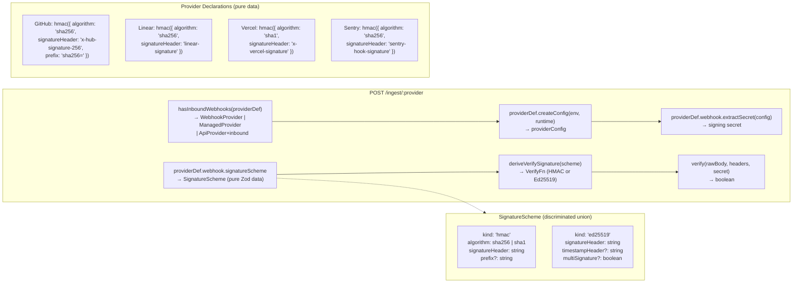

---

<!-- SECTION: ingest-pipeline | last_updated: 2026-03-18T02 -->
## Ingest-Delivery Pipeline

**No classification.** All webhooks follow the same path: resolve connection → forward or DLQ. Lifecycle webhooks (e.g., GitHub `installation.deleted`) have `resourceId = installation.id` which doesn't match any `gatewayResources.providerResourceId` → DLQ with `no_connection`. Health check cron detects the revocation within 5 minutes.

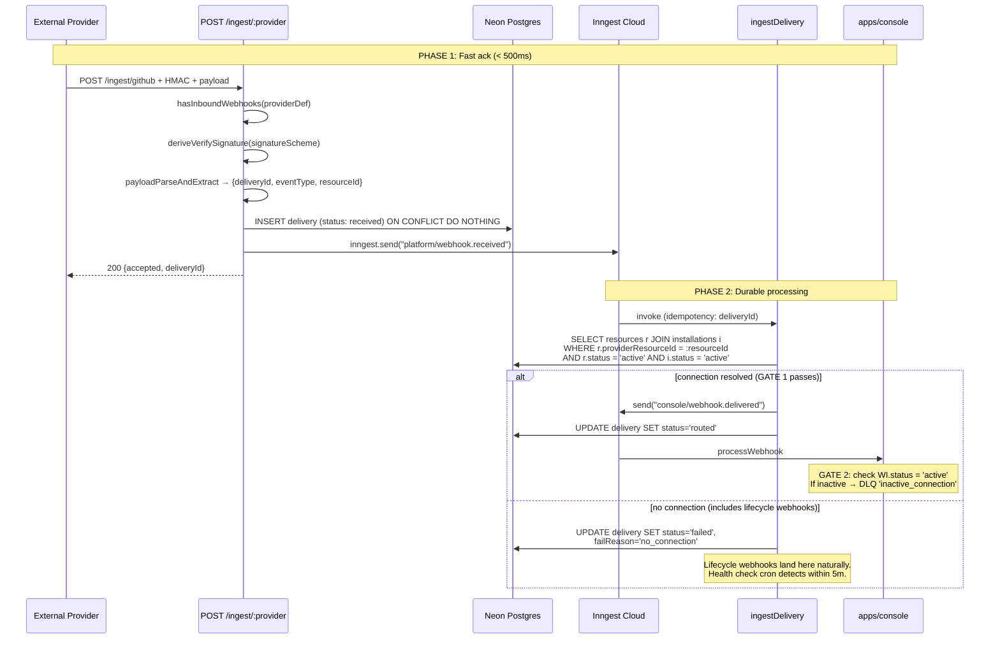

---

<!-- SECTION: health-check-lifecycle | last_updated: 2026-03-18T02 -->
## Health Check → Lifecycle Trigger (Primary Detection)

The health check cron is the **primary lifecycle trigger** — not webhooks. It probes each active connection's provider API every 5 minutes. On failure, it fires `platform/connection.lifecycle` which runs the gate-first teardown.

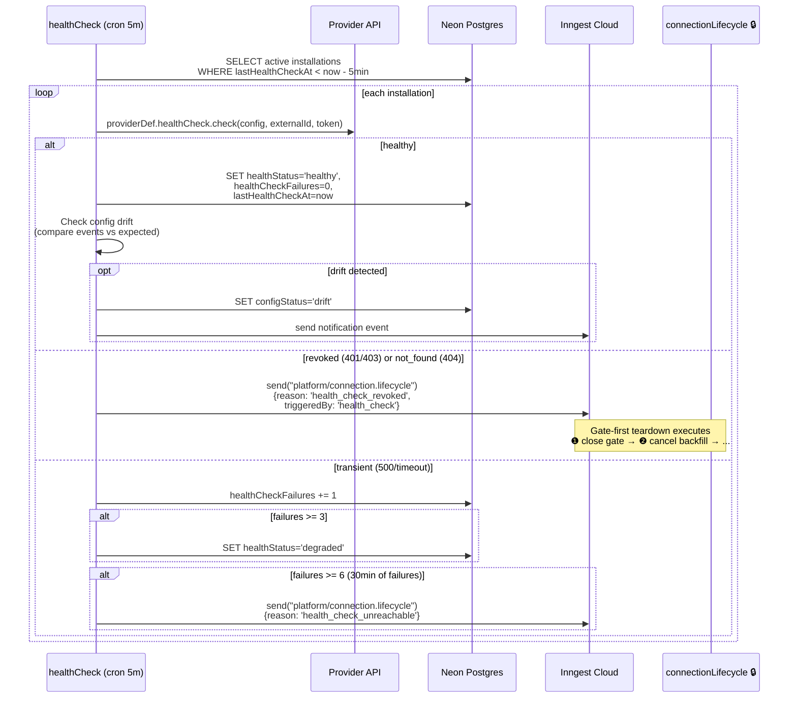

### Provider Health Check Implementations

Each provider's `HealthCheckDef.check()` returns `ConnectionStatus` (`"healthy" | "revoked" | "suspended"`). Provider-specific error handling is encapsulated inside `check()`:

| Provider | Probe endpoint | Error mapping |
|----------|---------------|---------------|
| GitHub | `GET /app/installations/{id}` | 200 → `healthy`, 404 → `revoked` (installation deleted) |
| Linear | `POST /graphql { viewer { id } }` | 200 with data → `healthy`, 200 with `AUTHENTICATION_ERROR` → `revoked` (GraphQL wraps errors in 200) |
| Sentry | `GET /api/0/sentry-app-installations/{id}/` | 200 → `healthy`, 404 → `revoked` |
| Vercel | `GET /v2/user` | 200 → `healthy`, 403 → `revoked` (Vercel uses 403 not 401) |

```ts
// Aligns with provider redesign Phase 2
interface HealthCheckDef<TConfig> {
  readonly check: (
    config: TConfig,
    externalId: string,
    accessToken: string | null
  ) => Promise<ConnectionStatus>;
}

const connectionStatusSchema = z.enum(["healthy", "revoked", "suspended"]);
type ConnectionStatus = z.infer<typeof connectionStatusSchema>;
```

### Config Drift Detection (Platform-Level)

Drift detection runs at the **platform level** (not in provider definitions) after a successful `check()`:

```ts
// In healthCheck cron, after check() returns "healthy":
const expected = PROVIDERS[provider].defaultSyncEvents;
const actual = installation.providerAccountInfo?.events ?? [];
const missing = expected.filter(e => !actual.includes(e));
if (missing.length > 0) {
  await db.update(gatewayInstallations)
    .set({ configStatus: "drift" })
    .where(eq(gatewayInstallations.id, installation.id));
  // Fire notification for console UI banner
}
```

---

<!-- SECTION: lifecycle-workflow | last_updated: 2026-03-18T02 -->
## Connection Lifecycle (Gate-First)

**Triggers**: health check cron (revoked/unreachable) and user action (DELETE /connect/:id). NOT triggered by webhooks.

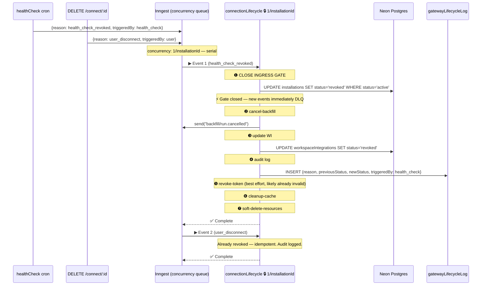

### Lifecycle Reason → Target Status Map

| Reason | Source | `installations.status` | `WI.status` | Revoke token? | Cancel backfill? |
|--------|--------|----------------------|-------------|---------------|-----------------|
| `user_disconnect` | tRPC DELETE | `disconnected` | `disconnected` | yes | yes |
| `health_check_revoked` | cron (401/403/404) | `revoked` | `revoked` | no (already invalid) | yes |
| `health_check_unreachable` | cron (500/timeout ≥6) | `revoked` | `error` | no | yes |

**Note:** `provider_suspended` and `provider_unsuspended` (GitHub-specific) are future extensions. GitHub suspension is rare and can be detected by the health check cron returning `"suspended"` from `check()`.

---

<!-- SECTION: provider-ingest-routing | last_updated: 2026-03-18T02 -->
## Provider Tier Ingest Routing

The ingest route uses `hasInboundWebhooks()` from the provider redesign to accept webhooks from all three provider tiers:

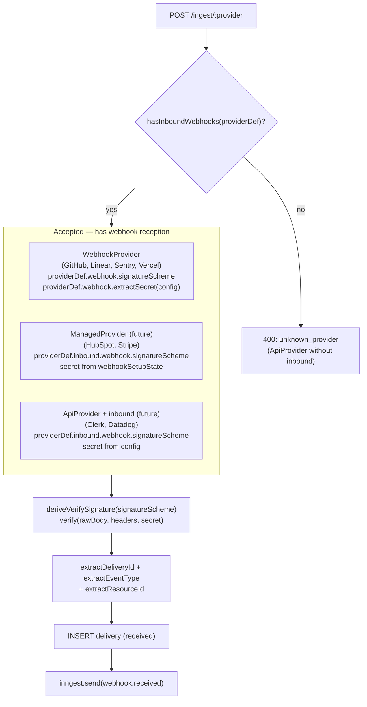

---

<!-- SECTION: state-machine | last_updated: 2026-03-18T02 -->
## Connection State Machine

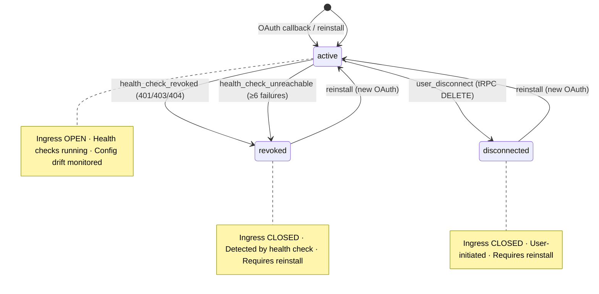

**Future extensions** (when provider plan Phase 9+ lands):
- `active → suspended` (GitHub `installation.suspend` detected by health check returning `"suspended"`)
- `suspended → active` (health check returns `"healthy"` → `connectionRestore`)

---

<!-- SECTION: race-conditions | last_updated: 2026-03-18T02 -->
## Race Condition Resolution Matrix

| # | Race Condition | Resolution |
|---|---------------|------------|
| 1 | **Connection revoked after event enters pipeline** | **Double-gate**: Gate 1 (ingestDelivery JOIN) + Gate 2 (console WI.status). Leaked events DLQ'd with `inactive_connection`. Health check closes gate within 5m. |
| 2 | **Backfill running, then connection revoked** | **cancelOn** on orchestrator + entity worker. Health check fires lifecycle → step ❷ sends `backfill/run.cancelled`. **401 → NonRetriableError** in entity worker. |
| 3 | **Resource added during lifecycle teardown** | Gate-first: step ❶ closes gate. Step ❼ `WHERE installationId` catches newly-added resource. |
| 4 | **Duplicate health check detections** | **concurrency: 1/installationId** — serial. Second lifecycle runs idempotently. Both audit-logged. |
| 5 | **Token refresh during teardown** | Harmless: refresh cron checks `status='active'`. After step ❶, cron skips. |
| 6 | **inngest.send() fails in route handler** | **WAL + deliveryRecovery cron**: re-fires after 2min. Provider gets 200 (delivery persisted). |
| 7 | **Stale data event after health check revocation** | Gate 1 catches (installation now revoked). Gate 2 catches leaked events (WI now revoked). |
| 8 | **Linear token revoked — no webhook** | **healthCheck cron**: probes every 5m. 401 → lifecycle event. Detected within 5m. This IS the detection mechanism. |
| 9 | **Health check cron fails** | Inngest retries the cron function. If Inngest itself is down, next cron invocation (5m later) catches it. Self-healing. |
| 10 | **Proxy 401 during backfill** | Entity worker: 401/403 → `NonRetriableError`. No retry burn. Health check independently detects and fires lifecycle. |
| 11 | **Concurrent entity-graph writes** | `entityGraph`: add `concurrency: { limit: 1, key: entityExternalId }`. |
| 12 | **Config drift after app update** | healthCheck drift detection (platform-level). Console banner for re-consent. |
| 13 | **GitHub org re-installed on different Lightfast org** | New `installation_id` → new DB row. Old installation revoked by health check (404). No conflict — different `(provider, externalId)` rows. |

---

<!-- SECTION: event-schema | last_updated: 2026-03-18T02 -->
## Inngest Event Schema (`@repo/inngest`)

```ts
const platformEvents = {
  "platform/webhook.received": z.object({
    provider: z.string(),
    deliveryId: z.string(),
    eventType: z.string(),
    resourceId: z.string().nullable(),
    payload: z.unknown(),
    receivedAt: z.number(),
    // Service-auth fields (backfill path):
    serviceAuth: z.boolean().optional(),
    preResolved: z.object({
      connectionId: z.string(),
      orgId: z.string(),
    }).optional(),
    correlationId: z.string().optional(),
  }),
  "platform/connection.lifecycle": z.object({
    reason: z.string(),  // user_disconnect | health_check_revoked | health_check_unreachable
    installationId: z.string(),
    orgId: z.string(),
    provider: z.string(),
    triggeredBy: z.enum(["health_check", "user", "system"]),
    correlationId: z.string().optional(),
  }),
};

const consoleEvents = {
  "console/webhook.delivered": z.object({
    deliveryId: z.string(),
    connectionId: z.string(),
    orgId: z.string(),
    provider: z.string(),
    eventType: z.string(),
    payload: z.unknown(),
    receivedAt: z.number(),
    correlationId: z.string().optional(),
  }),
  // + existing: event.capture, event.stored, entity.upserted, entity.graphed
};

const backfillEvents = {
  "backfill/run.requested": backfillTriggerPayload,
  "backfill/run.cancelled": z.object({
    installationId: z.string(),
    correlationId: z.string().optional(),
  }),
};

export const inngest = new Inngest({
  id: "lightfast",
  schemas: new EventSchemas()
    .fromZod(platformEvents)
    .fromZod(consoleEvents)
    .fromZod(backfillEvents),
});
```

**Note:** `platform/connection.restore` removed from v1. Restore is a future extension when `suspended` state is implemented. Health check returning `"healthy"` for a `suspended` installation would trigger restore.

---

<!-- SECTION: debugging | last_updated: 2026-03-18T02 -->
## Debugging & Replay

### Admin Endpoints

| Endpoint | Purpose |
|----------|---------|
| `GET /admin/health` | DB probe + uptime |
| `GET /admin/dlq` | Paginated failed deliveries (includes lifecycle webhooks that DLQ'd) |
| `POST /admin/dlq/replay` | Replay specific DLQ entries |
| `POST /admin/replay/catchup` | Replay all undelivered for an installationId |
| `GET /admin/delivery/:deliveryId/trace` | Full trace: status, routing, console processing |
| `POST /admin/lifecycle/replay` | Re-trigger lifecycle for an installation |
| `GET /admin/lifecycle-log/:installationId` | Lifecycle audit trail |

### correlationId Flow

Every event carries `correlationId?: string`. Flows through:
HTTP header → WAL entry → Inngest event → downstream events → console pipeline → structured logs.

Search BetterStack for `correlationId=xxx` for end-to-end trace.

---

<!-- SECTION: provider-scoping | last_updated: 2026-03-18T02 -->
## Provider Scoping Model

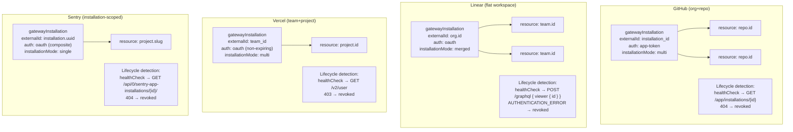

---

<!-- SECTION: service-auth | last_updated: 2026-03-18T02 -->
## Service-Auth Path (Backfill → Platform → Console)

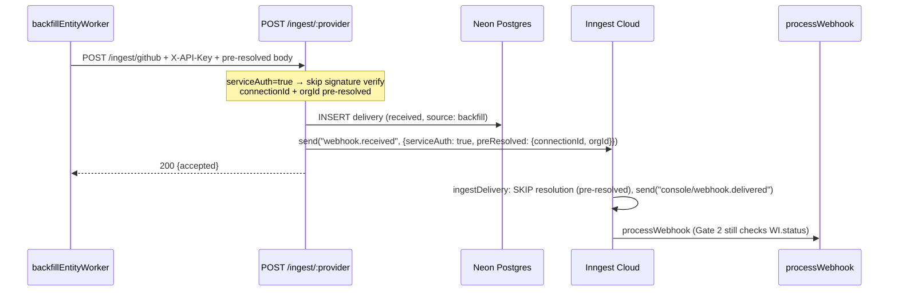

---

<!-- SECTION: oauth-flow | last_updated: 2026-03-18T00 -->
## OAuth Flow

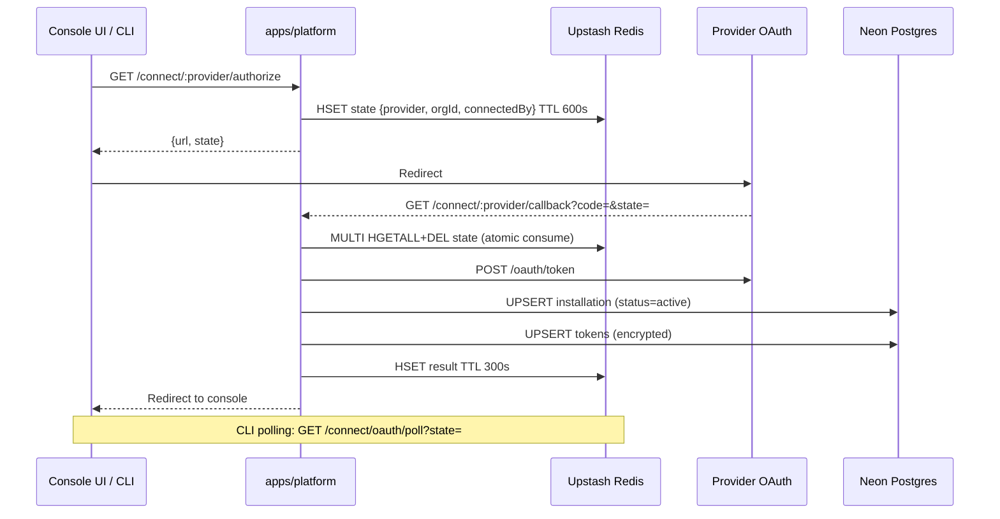

---

<!-- SECTION: rate-limiting | last_updated: 2026-03-18T00 -->
## Provider-Aware Rate Limiting (Backfill)

4-layer defense:

| Layer | Mechanism | Config |
|-------|-----------|--------|
| 1. Inngest Throttle | Pre-flight gate | GitHub 4000/hr, Linear 2000/hr, Vercel 3000/hr, Sentry 1500/hr per installationId |
| 2. Inngest Concurrency | Parallelism cap | 5/orgId, 10 global |
| 3. Response-Header Sleep | Reactive | `step.sleep` when `remaining < 10% of limit` until `resetAt` |
| 4. cancelOn | Safety valve | `backfill/run.cancelled` match installationId — health check lifecycle fires this |

---

<!-- SECTION: what-changes | last_updated: 2026-03-18T02 -->
## What This Removes / Adds

### Removes (~1,091 LOC, 2 vendor deps)

| Component | LOC |
|-----------|-----|
| `@vendor/upstash-workflow` | ~200 |
| `@vendor/qstash` | ~150 |
| QStash callbacks + dedup | ~150 |
| Redis resource cache writes | ~80 |
| Webhook delivery workflow | ~225 |
| Connection teardown workflow | ~150 |
| Console ingress workflow | ~136 |

### Adds

| Component | Purpose |
|-----------|---------|
| `@repo/inngest` | Shared typed client + event schemas |
| `ingestDelivery` | Resolve → forward or DLQ (no classification) |
| `connectionLifecycle` | Gate-first teardown (triggered by health check + user); step ❺b deregisters ManagedProvider webhooks |
| `healthCheck` | PRIMARY lifecycle trigger + config drift detection |
| `tokenRefresh` | Proactive refresh |
| `deliveryRecovery` | Self-healing for stuck deliveries |
| `providerPolling` | Continuous cursor-driven polling for ApiProvider with PollingDef |
| `gatewayLifecycleLog` | Immutable audit trail |
| `gatewayProviderCatalogVersion` | Tracks indexed endpoints per provider for diff-based re-embedding |
| `embedProviderEndpoints` | Idempotent Inngest fn: embed new/changed endpoints into Pinecone global catalog |
| Console double-gate | WI.status check in processWebhook |
| `POST /proxy/:provider/:endpointId` | Service-auth proxy (internal consumers: backfill, console tRPC) |
| `POST /proxy/search` | Semantic endpoint discovery — org-scoped, Pinecone similarity search |
| `POST /proxy/execute` | Authenticated proxy forwarding — org-scoped, Gate 1 + token resolution |
| Edge Config health cache | 30s TTL connection health cache for sub-1ms Gate 1 checks |
| Admin trace/replay | Per-delivery debugging |
| SDK proxy client | `proxy.search()` + `proxy.execute()` for org workspace consumers |
| MCP proxy tools | `proxy_search` + `proxy_execute` for AI agent consumption via Claude Code / Cursor |

---

<!-- SECTION: phases | last_updated: 2026-03-18T02 -->
## Implementation Phases

### Phase 0: DB Schema Migration
- [ ] Add `healthStatus`, `lastHealthCheckAt`, `healthCheckFailures`, `configStatus` to `gatewayInstallations`
- [ ] Migrate `workspaceIntegrations.isActive` → `status` + `statusReason`
- [ ] Add `failReason` to `gatewayWebhookDeliveries` + recovery index
- [ ] Create `gatewayLifecycleLog` table
- [ ] `pnpm db:generate && pnpm db:migrate`

### Phase 1: `@repo/inngest` Shared Package
- [ ] Create `packages/inngest/` with typed client + all event schemas
- [ ] Migrate `apps/backfill` + `api/console` clients to shared package

### Phase 2: `apps/platform` Service Shell
- [ ] Create `apps/platform/` (Hono + srvx)
- [ ] Port middleware from relay (use `hasInboundWebhooks()` guard, `deriveVerifySignature()`)
- [ ] Port routes from relay + gateway
- [ ] Inngest serve endpoint + dev server wiring

### Phase 3: Core Inngest Functions
- [ ] `ingestDelivery` — resolve → forward or DLQ (no classification)
- [ ] `connectionLifecycle` — gate-first, audit log
- [ ] `deliveryRecovery` cron
- [ ] `tokenRefresh` cron
- [ ] `targetStatus()` state machine in `@repo/connection-core`

### Phase 4: Health Check & Config Drift
- [ ] `healthCheck` cron (PRIMARY lifecycle trigger)
- [ ] Per-provider `check()` implementations (GitHub, Linear, Sentry, Vercel)
- [ ] Platform-level config drift detection
- [ ] Console UI drift banner

### Phase 5: Console Double-Gate
- [ ] `processWebhook` checks `WI.status = 'active'`
- [ ] DLQ with `failReason: 'inactive_connection'`

### Phase 6: Entity Worker Hardening
- [ ] 401/403 → `NonRetriableError`
- [ ] Connection status check per page

### Phase 7: Admin & Debugging
- [ ] `GET /admin/delivery/:id/trace`
- [ ] `POST /admin/lifecycle/replay`
- [ ] `GET /admin/lifecycle-log/:id`

### Phase 4.5: PollingDef Cron (ApiProvider)
- [ ] `providerPolling` Inngest function per polling provider
- [ ] Cursor persistence in `gatewayInstallations.providerAccountInfo`
- [ ] Route polling results through `console/webhook.delivered`

### Phase 8: Decommission
- [ ] Remove `apps/relay/` + `apps/gateway/`
- [ ] Remove `@vendor/upstash-workflow` + `@vendor/qstash`
- [ ] Update `CLAUDE.md`

### Phase 9: Proxy API (Internal)
- [ ] `ProxyEndpointDef` type in `packages/console-providers/src/define.ts`
- [ ] Migrate `ProviderApi.endpoints` from `ApiEndpoint` → `ProxyEndpointDef` (add `description`, `requiresActiveConnection`)
- [ ] `POST /proxy/:provider/:endpointId` (service-auth) in `apps/platform`
- [ ] Gate 1 with Edge Config health cache (30s TTL)
- [ ] Token resolution + `buildAuthHeader` forwarding
- [ ] Structured error responses (all 5 error classes)
- [ ] 401 → trigger `platform/health.check.requested` Inngest event
- [ ] `tokenRefresh` retry on 401 when `auth.refreshToken` defined
- [ ] `connectionLifecycle ❶` deletes Edge Config cache key
- [ ] `connectionLifecycle ❺b` webhook deregistration for ManagedProvider
- [ ] ManagedProvider webhook registration in OAuth callback
- [ ] Migrate `backfill` entity workers to use proxy route

### Phase 10: Vector Endpoint Catalog + MCP/SDK Exposure
- [ ] `gatewayProviderCatalogVersion` table + migration
- [ ] `embedProviderEndpoints` Inngest function (triggered on startup/deploy)
- [ ] Pinecone index setup (`proxy-endpoints` namespace)
- [ ] `POST /proxy/search` (org-scoped) — active providers fetch + similarity search + health enrich
- [ ] `POST /proxy/execute` (org-scoped) — identical to service-auth path + org JWT auth
- [ ] SDK client (`proxy.search()`, `proxy.execute()`)
- [ ] MCP tool definitions (`proxy_search`, `proxy_execute`)
- [ ] End-to-end test: Claude Code → MCP → proxy_search → proxy_execute → GitHub API

---

<!-- SECTION: not-doing | last_updated: 2026-03-18T03 -->
## What We're NOT Doing

- **Classify-first ingest** — dropped. Lifecycle webhooks DLQ naturally. Health check cron is the lifecycle trigger. Simpler architecture, 5-minute detection latency is acceptable.
- **`EventClassifier` / `LifecycleDef`** — deleted from provider definitions (provider plan Phase 2). Not re-introduced at platform level.
- **`connectionRestore`** — deferred until `suspended` state is needed (GitHub `installation.suspend` is rare). Health check returning `"healthy"` for a suspended installation could trigger restore in the future.
- **Real-time status push** — DB storage, UI polls. No WebSocket/SSE.
- **Automatic re-authorization** — drift shows banner. User manually re-consents.
- **Per-event ordering guarantees** — idempotent pipeline. Strict ordering too expensive.
- **Multi-region** — single Neon + single Inngest app.
- **Event sourcing** — mutable status + audit log. Not derived from event history.
- **Per-org vector records** — global endpoint catalog only. Org access resolved at query time via active connection filter. No per-org Pinecone records.
- **Proxy response caching** — proxy is a transparent forwarder. Provider responses are not cached (providers own their freshness semantics).
- **Automatic re-consent on drift** — drift detected by health check, banner shown in UI. User manually reconnects.

---

<!-- SECTION: resolved-questions | last_updated: 2026-03-18T02 -->
## Resolved Questions

| Question | Resolution |
|----------|-----------|
| Classify-first or health-check-driven? | Health-check-driven. No classification. Lifecycle webhooks DLQ naturally. |
| `HealthCheckDef` interface? | Provider plan's simple `check() → ConnectionStatus`. Drift detection at platform level. |
| `POST /connect/:id/resources` through Inngest? | No — synchronous. Gate-first + `WHERE installationId` catches races. |
| Keep `gatewayWebhookDeliveries`? | Yes — WAL for replay + recovery cron. Enhanced with `failReason`. |
| Single vs dual Inngest app? | Single. Serve endpoints separate. |
| Redis retention? | Keep for OAuth state only. Resource routing cache dropped. |
| Console ingress gate behavior? | DLQ with reason code (`inactive_connection`). |
| WI schema migration scope? | Folded into Phase 0. |
| Lifecycle audit log? | Yes — `gatewayLifecycleLog` table. Append-only. |
| Config drift scope? | Included — detected at platform level in healthCheck cron. |
| ManagedProvider in this plan? | Now addressed: webhook registration in OAuth callback, deregistration in lifecycle step ❺b. |
| GitHub org re-install on different Lightfast org? | New installation_id → new row. Old revoked by health check (404). Clean separation. |
| Proxy global vs per-org endpoint catalog? | Global (one record per endpoint per provider). Org access filtered at query time via active connections. Zero per-org work when new endpoints are added. |
| Gate 1 latency (DB vs cache)? | Edge Config cache (30s TTL, sub-1ms). DB fallback on miss (~10ms). `connectionLifecycle ❶` deletes cache immediately on gate close. |
| Provider 401 during proxy execute — what fires? | `platform/health.check.requested` Inngest event. Health check re-probes and closes gate if revoked. Structured error returned to caller. |
| Re-indexing when new endpoint added to provider? | `platform/provider.catalog.updated` on startup → `embedProviderEndpoints` diffs via `gatewayProviderCatalogVersion` → single upsert. No per-org work. |
| PollingDef cron covered? | Yes — Phase 4.5. Cursor persisted in `providerAccountInfo`. Results routed through `console/webhook.delivered`. |

---

<!-- SECTION: provider-arch-coverage | last_updated: 2026-03-18T03 -->
## Provider Architecture Coverage Analysis

### Already Covered ✅

| Provider Research Element | Covered In This Plan |
|--------------------------|----------------------|
| `SignatureScheme` + `deriveVerifySignature()` | § Signature Verification, § Ingest route |
| `hasInboundWebhooks()` guard | § Provider Tier Ingest Routing |
| `HealthCheckDef.check() → ConnectionStatus` | § Health Check → Lifecycle Trigger |
| 3-tier ingest (WebhookProvider | ManagedProvider | ApiProvider+inbound) | § Provider Tier Ingest Routing |
| Config drift detection | § Health Check → Lifecycle Trigger |
| `EventClassifier` / `LifecycleDef` dropped | § What We're Dropping |
| `WebhookProvider.auth` widened to `AuthDef` | Implicit in `createConfig(env)` usage |

### Gaps Now Addressed (This Update)

#### Gap 1 — ManagedProvider Webhook Teardown

`connectionLifecycle` step ❺ (revoke-token) runs for all providers but doesn't call `providerDef.inbound.webhook.registration.deregister()` for `ManagedProvider` (e.g., Vercel's `DELETE /v1/webhooks/{id}`). New step ❺b inserted:

```ts
// connectionLifecycle — after step ❺a revoke-token:
if (providerDef.kind === "managed" && providerDef.inbound?.webhook?.registration) {
  const webhookId = installation.webhookSetupState?.webhookId;
  if (webhookId) {
    await step.run("deregister-webhook", async () => {
      await providerDef.inbound.webhook.registration.deregister(config, webhookId);
    }).catch(() => { /* best effort — provider may already be down */ });
  }
}
```

Updated lifecycle steps: ❶ CLOSE GATE → ❷ cancel-backfill → ❸ update WI → ❹ audit log → ❺a revoke-token → **❺b deregister-webhook (ManagedProvider)** → ❻ cleanup-cache → ❼ soft-delete-resources.

#### Gap 2 — ManagedProvider Webhook Registration in OAuth Callback

The OAuth callback handler must call `registration.register()` for `ManagedProvider` and persist the returned `webhookId` + `signingSecret`:

```ts
// After UPSERT gatewayInstallations (status=active):
if (providerDef.kind === "managed" && providerDef.inbound?.webhook?.registration) {
  const { webhookId, signingSecret } = await providerDef.inbound.webhook.registration.register(
    config,
    `${env.PLATFORM_BASE_URL}/ingest/${provider}`,
    installation.id,
    providerDef.defaultSyncEvents,
  );
  await db.update(gatewayInstallations)
    .set({ webhookSetupState: { webhookId, signingSecret } })
    .where(eq(gatewayInstallations.id, installation.id));
}
```

The `signingSecret` is stored in `webhookSetupState` (JSONB) and used by `providerDef.inbound.webhook.extractSecret(config, installation.webhookSetupState)` instead of the global app config secret.

#### Gap 3 — `PollingDef` Cron (ApiProvider with `polling`)

For `ApiProvider` with `polling?: PollingDef`, a per-provider polling Inngest cron is needed alongside the health check cron. Each run:
1. Fetches all active connections for the provider
2. Calls `pollingDef.pollEntity(config, entityType, cursor, since)` per entity type
3. Sends results through `console/webhook.delivered` (same path as live webhooks)
4. Persists cursor in `gatewayInstallations.providerAccountInfo` for next poll

This is a **Phase 4.5** addition — between health check (Phase 4) and console double-gate (Phase 5).

---

<!-- SECTION: proxy-api-architecture | last_updated: 2026-03-18T03 -->
## Proxy API Architecture

### Core Concept

The proxy is a **universal authenticated forwarding layer** for all post-connection provider API calls. Every internal service (backfill entity workers, console tRPC, health check probes) routes provider API calls through the proxy instead of implementing their own token resolution and rate limit tracking.

**Pre-connection exception**: OAuth endpoints (`exchange_code`, `get_installation_info` during GitHub App setup) cannot be proxied — no connection exists yet. These are `requiresActiveConnection: false` in `ProxyEndpointDef`.

**The accretion insight**: The same proxy routes exposed to internal services (via service-auth) are exposed to the SDK + MCP (via org-scoped auth) without duplication. Every API we add for internal use is automatically available to external consumers.

### `ProxyEndpointDef` — Extension of `ProviderApi.endpoints`

```ts
export interface ProxyEndpointDef {
  /** Stable kebab-case ID. Becomes vector record key: "github:list-org-members" */
  readonly id: string;
  readonly method: "GET" | "POST" | "PUT" | "PATCH" | "DELETE";
  /** Path template with {param} placeholders. E.g. "/orgs/{org}/members" */
  readonly pathTemplate: string;
  readonly pathParams?: Record<string, { description: string; required: boolean }>;
  readonly queryParams?: Record<string, { description: string; required: boolean }>;
  readonly bodySchema?: z.ZodSchema;
  /** Embedded into Pinecone. Must clearly describe what the endpoint does + returns. */
  readonly description: string;
  /** false = callable during OAuth setup before connection exists. Default: true. */
  readonly requiresActiveConnection: boolean;
  /** OAuth scopes required. Compared against providerAccountInfo.grantedScopes at search time
   *  to determine scopeStatus: "sufficient" | "insufficient". */
  readonly requiredScope?: readonly string[];
  /** gatewayResources.resourceType values this endpoint operates on.
   *  Used at search time to populate availableResources in the result.
   *  Empty = connection-level endpoint (no specific resource target).
   *  E.g. ["repo"] for github:list-repo-commits — agent sees which repos are accessible. */
  readonly resourceTypes?: readonly string[];
}
```

### Route Layout in `apps/platform`

| Route | Auth | Purpose |
|-------|------|---------|
| `POST /proxy/search` | org-scoped JWT / SDK key | Semantic endpoint discovery |
| `POST /proxy/execute` | org-scoped JWT / SDK key | Authenticated forwarding for SDK/MCP |
| `POST /proxy/:provider/:endpointId` | `X-API-Key` (service-auth) | Internal service shortcut (backfill, console) |

Service-auth path skips Gate 1's Edge Config lookup and goes directly to DB (already trusted caller). Org-scoped path always hits Gate 1.

### Proxy Execution — Gate-First with Token Resolution

```
proxy_execute(provider, endpointId, params, orgId):
  ① Gate 1 — connection health (Edge Config cache, 30s TTL):
       status = 'active' AND healthStatus ≠ 'revoked' AND ≠ 'unreachable'
       → else: 409 { error: "connection_inactive", reason, reconnect_url }

  ② Resolve token — connectionId → decrypted accessToken (DB)

  ③ Build request:
       baseUrl = providerDef.api.baseUrl
       path    = renderPathTemplate(endpointDef.pathTemplate, params.path)
       headers = providerDef.api.buildAuthHeader(token) + defaultHeaders
       body    = params.body (validated against endpointDef.bodySchema)

  ④ Forward to provider API

  ⑤ Handle response:
       200       → return { data }
       401       → trigger health check → return { error: "connection_auth_failure" }
       401 + refreshToken exists → attempt token refresh → retry once → then same as 401
       403       → return { error: "insufficient_scope", missingScopes? }  ← NOT a health trigger
       404       → return { error: "resource_not_found" }                  ← resource removed
       429       → return { error: "rate_limited", retry_after, provider }
       5xx/timeout → return { error: "provider_unavailable" }
```

### Proxy Architecture Overview

```mermaid
flowchart TD
    subgraph internal["Internal Services (service-auth X-API-Key)"]
        BACKFILL["backfill entity worker"]
        CONSOLE_API["console tRPC mutations"]
        HEALTH_PROBE["healthCheck cron\n(probe calls go through proxy)"]
    end

    subgraph external["External Consumers (org-scoped auth)"]
        MCP_CLIENT["MCP Client\n(Claude Code, Cursor)"]
        SDK_CLIENT["Lightfast SDK\nproxy.search() / proxy.execute()"]
    end

    subgraph platform["apps/platform — Proxy Layer"]
        direction TB
        SEARCH_ROUTE["POST /proxy/search\n① active installations (provider, health, grantedScopes)\n② Pinecone filter by active providers (Layer 1)\n③ scope check vs grantedScopes (Layer 2)\n④ resource context from gatewayResources (Layer 3)\n⑤ re-rank + return enriched results"]

        EXEC_ROUTE["POST /proxy/execute\nPOST /proxy/:provider/:endpointId\n① Gate 1 (Edge Config, 30s TTL)\n② resolve token (DB)\n③ build + forward request\n④ structured error handling"]
    end

    EDGE["Upstash Edge Config\nconnection health cache\n(30s TTL, invalidated by lifecycle)"]
    VAULT["gatewayTokens\n(AES-GCM encrypted)"]
    PROV["Provider API\n(GitHub · Linear · Vercel · Sentry)"]
    INN["Inngest Cloud\n(health check trigger on 401)"]

    internal -->|"service-auth"| EXEC_ROUTE
    external --> SEARCH_ROUTE & EXEC_ROUTE
    EXEC_ROUTE --> EDGE
    EDGE -->|"miss"| VAULT
    VAULT --> PROV
    PROV -->|"401/403"| INN
    INN -.->|"connectionLifecycle\n→ invalidate Edge Config cache"| EDGE

    style SEARCH_ROUTE fill:#1a1a2e,stroke:#533483,stroke-width:2px
    style EXEC_ROUTE fill:#1a1a2e,stroke:#16213e,stroke-width:2px
```

---

<!-- SECTION: vector-endpoint-catalog | last_updated: 2026-03-18T04 -->
## Vector Endpoint Catalog (Global + Org-Filtered)

### Key Design Decision: Global Catalog, Per-Org Access Filter

The Pinecone index is **global per provider** — not per org. An endpoint like `github:list-org-members` has one vector record. Every org that has an active GitHub connection can use it. All per-org intelligence (which providers are connected, which scopes were granted, which resources exist) lives in Postgres and is joined at query time.

**This solves the re-indexing problem entirely**: adding a new endpoint to `github` requires upserting exactly one Pinecone record. No per-org work on provider update, connection change, or resource change.

### Three-Layer Per-Org Filtering (at `proxy_search` time)

Each layer is a DB join against the org's live state. Pinecone never holds org-specific data.

| Layer | Source | What it gates |
|-------|--------|---------------|
| **1 — Provider filter** | `gatewayInstallations WHERE orgId AND status='active'` | Which providers are connected |
| **2 — Scope filter** | `installation.providerAccountInfo.grantedScopes` vs `endpointDef.requiredScope` | Which endpoints the granted OAuth scopes permit |
| **3 — Resource context** | `gatewayResources WHERE installationId AND resourceType IN endpointDef.resourceTypes` | Which specific resources (repos, teams, projects) are valid path params |

Layer 1 is a Pinecone filter (fast, server-side). Layers 2 and 3 are applied in-process after the vector results return.

### `proxy_search` Algorithm

```
proxy_search(query, orgId):
  ① Fetch active installations for orgId (single DB query):
     → [{ provider, installationId, healthStatus,
          providerAccountInfo: { grantedScopes } }]

  ② Pinecone similarity_search (Layer 1):
     vector: embed(query)
     filter: { provider: { $in: activeProviders } }
     topK: 20  ← over-fetch; layers 2+3 may reduce count

  ③ For each result, enrich in parallel (Layers 2 + 3):
     a. scopeStatus:
          required = endpointDef.requiredScope ?? []
          granted  = installation.grantedScopes ?? []
          → "sufficient" | "insufficient"

     b. availableResources (only if endpointDef.resourceTypes is non-empty):
          SELECT resourceType, providerResourceId, label
          FROM gatewayResources
          WHERE installationId = $installationId
            AND resourceType IN (endpointDef.resourceTypes)
            AND status = 'active'

  ④ Re-rank:
     healthy + sufficient scope  → top of results
     degraded + sufficient scope → middle
     any + insufficient scope   → bottom (but still returned — agent can surface reconnect)

  ⑤ Return top 10 after enrichment
```

### Enriched Search Result Type

```ts
interface ProxySearchResult {
  endpointId: string;          // "list-org-members"
  provider: string;            // "github"
  description: string;
  method: string;              // "GET"
  pathTemplate: string;        // "/orgs/{org}/members"
  score: number;               // Pinecone similarity score

  // Per-org enrichment (from DB, not Pinecone)
  connectionHealth: "healthy" | "degraded" | "unknown" | "revoked";
  scopeStatus: "sufficient" | "insufficient";
  /** Only present when endpointDef.resourceTypes is non-empty.
   *  Tells the agent exactly which values are valid for resource path params. */
  availableResources?: Array<{
    type: string;               // "repo"
    id: string;                 // "lightfast/lightfast"
    label: string;              // "lightfast/lightfast"
  }>;
  /** Only present when scopeStatus === "insufficient" — what's missing */
  missingScopes?: string[];
}
```

**Why `availableResources` matters**: without it, an agent calling `github:list-repo-commits` must guess `{owner}/{repo}`. With it, the agent sees `[{ type: "repo", id: "lightfast/lightfast" }]` and can pass the right value directly. Zero extra round-trips, zero hallucinated repo names.

### Index Structure (unchanged — global only)

```
namespace: proxy-endpoints

Record:
  id:        "github:list-org-members"
  vector:    embedding of (provider + id + description + pathTemplate + paramNames)
  metadata:
    provider:           "github"
    endpointId:         "list-org-members"
    method:             "GET"
    pathTemplate:       "/orgs/{org}/members"
    requiresConnection: true
    resourceTypes:      []           ← connection-level; no specific resource
```

```
Record:
  id:        "github:list-repo-commits"
  metadata:
    resourceTypes: ["repo"]          ← agent gets availableResources from gatewayResources
```

No orgId, no grantedScopes, no resourceId in Pinecone. Only structural metadata.

### Catalog Bootstrap & Update Flow

```mermaid
flowchart TD
    subgraph trigger["Trigger: new endpoint added to ProviderApi"]
        DEF["provider definition updated:\nendpoints: { 'list-org-members': ProxyEndpointDef }"]
        DEPLOY["Platform deploy\nstartup hook fires:\nplatform/provider.catalog.updated\n{ provider, addedEndpoints, removedEndpoints }"]
    end

    subgraph inngest_fn["embedProviderEndpoints (Inngest — idempotent)"]
        FETCH["Read providerDef.api.endpoints"]
        DIFF["Diff vs last-indexed version\n(stored in gatewayProviderCatalogVersion table)"]
        EMBED["For each added endpoint:\ngenerateEmbedding(description + pathTemplate)"]
        UPSERT["Pinecone.upsert:\nid: provider:endpointId\nmetadata: { resourceTypes }\n(global — no orgId)"]
        DELETE["For each removed endpoint:\nPinecone.delete(id)"]
        VERSION["Update catalogVersion"]
    end

    subgraph access["At proxy_search time — 3-layer org filtering"]
        L1["Layer 1 (Pinecone filter):\nprovider IN org_active_providers"]
        L2["Layer 2 (in-process):\nrequiredScope vs grantedScopes\n→ scopeStatus"]
        L3["Layer 3 (DB join):\ngatewayResources WHERE resourceType\nIN endpointDef.resourceTypes\n→ availableResources"]
        RANK["Re-rank: healthy+sufficient first\nReturn top 10"]
    end

    NOTE["Adding new endpoint to any provider:\n1 Pinecone upsert\n0 per-org work\nAll orgs reflect it at next search"]

    DEF --> DEPLOY --> inngest_fn
    FETCH --> DIFF --> EMBED --> UPSERT --> VERSION
    DIFF --> DELETE --> VERSION
    inngest_fn -.->|"catalog updated"| access
    L1 --> L2 --> L3 --> RANK
    inngest_fn -.-> NOTE

    style UPSERT fill:#1a1a2e,stroke:#533483,stroke-width:2px
    style NOTE fill:#1a2e1a,stroke:#16e080,stroke-width:1px
```

### Catalog Version Table (new)

```ts
export const gatewayProviderCatalogVersion = pgTable(
  "lightfast_gateway_provider_catalog_version",
  {
    provider: varchar("provider", { length: 50 }).notNull().primaryKey(),
    indexedEndpoints: jsonb("indexed_endpoints").notNull(), // string[] of endpointIds
    lastIndexedAt: timestamp("last_indexed_at", { mode: "string", withTimezone: true })
      .notNull().defaultNow(),
    embeddingModel: varchar("embedding_model", { length: 100 }).notNull(),
  },
);
```

Used to diff on re-deploy — only embed/delete changed endpoints, not the entire catalog.

### MCP + SDK Proxy Search → Execute Flow (with 3-layer enrichment)

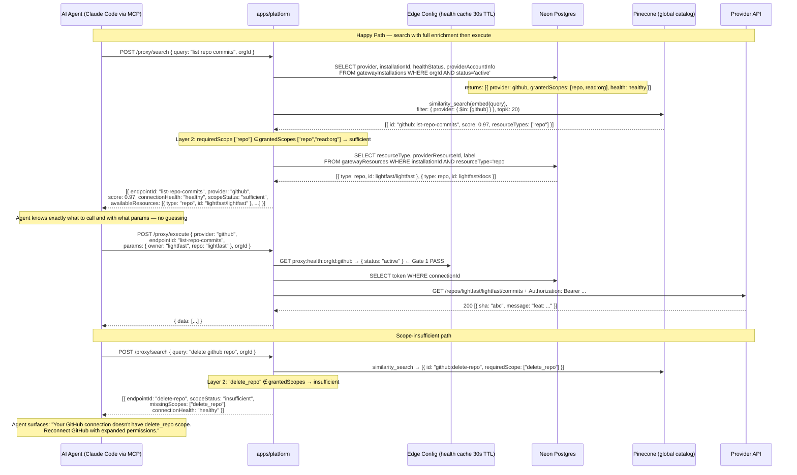

---

<!-- SECTION: proxy-race-conditions | last_updated: 2026-03-18T03 -->
## Proxy Race Condition Resolution Matrix

### Full Race Matrix (execute path)

| # | Scenario | Detection | Resolution |
|---|----------|-----------|------------|
| 1 | **connection active → proxy executes normally** | Gate 1 PASS | Happy path. Data returned. |
| 2 | **connection revoked BEFORE proxy_execute** | Gate 1 FAIL (Edge Config invalidated by lifecycle ❶) | 409 `connection_inactive` + `reconnect_url`. Client prompts user. |
| 3 | **connection revoked BETWEEN Gate 1 and provider response** (narrow window) | Provider returns 401/403 | Trigger health check. Return `connection_auth_failure`. Future requests caught at Gate 2. |
| 4 | **token expired (not revoked)** — OAuth refreshable | Provider returns 401, `auth.refreshToken` defined | Attempt token refresh → retry once. On retry 401 → treat as race 3. |
| 5 | **provider rate limited** | Provider returns 429 + Retry-After | Return `rate_limited { retry_after, provider }`. No gate change. |
| 6 | **provider transient outage (5xx/timeout)** | Provider returns 5xx or times out | Return `provider_unavailable`. No gate change. Health check monitors separately. |
| 7 | **proxy_search returns endpoint → provider outage starts → execute runs** | Provider 5xx caught in execute | Return `provider_unavailable`. `connectionHealth: degraded` visible in next search. |
| 8 | **proxy_search returns endpoint → org disconnects → execute runs** | Gate 1 FAIL (Edge Config invalidated) | 409 `connection_inactive`. |
| 9 | **concurrent execute calls exhaust provider rate limit** | First 429 from provider | Rate limit headers forwarded. All concurrent callers get `rate_limited`. Inngest backpressure via `throttle` on backfill workers. |
| 10 | **proxy execute during connectionLifecycle teardown** (step ❶ in-flight) | Race between `SET status=revoked` write and execute DB read | Gate 1 eventually catches. If execute reads 'active' before write: provider may 401 → treated as race 3. |
| 11 | **new endpoint added to provider (catalog update) while search in-flight** | Pinecone upsert eventually consistent | Acceptable: new endpoint appears in next search. No data loss, no incorrect result. |
| 12 | **embed fails during catalog update** | Inngest step failure | Inngest retries. `catalogVersion` not updated until upsert succeeds. No stale state. |
| 13 | **Edge Config key missing (cold start / cache miss)** | Edge Config returns null | Fall through to DB for connection status. Sub-10ms degraded mode. |
| 14 | **scope-insufficient endpoint returned in search → agent tries execute → provider 403** | Provider 403 (not 401) | 403 treated separately from 401: return `insufficient_scope { missingScopes }`, no health check triggered. Token is valid; scope is the constraint. |
| 15 | **org revokes a resource (repo removed from GitHub App installation) → search returns stale `availableResources`** | Search enrichment reads `gatewayResources` at query time | `gatewayResources` reflects current state (updated by health check / resource sync). At worst a `sync_lag` window. Execute with removed resource → provider 404 → return `resource_not_found`. |
| 16 | **org upgrades OAuth scopes (reconnects) → search still shows `scopeStatus: insufficient`** | `providerAccountInfo.grantedScopes` stale in DB until OAuth callback completes | After reconnect, OAuth callback updates `grantedScopes`. Next `proxy_search` reflects updated scopes. No cache for scope state — always live from DB. |

### Race Condition Sequence (the critical case: revoke during execute)

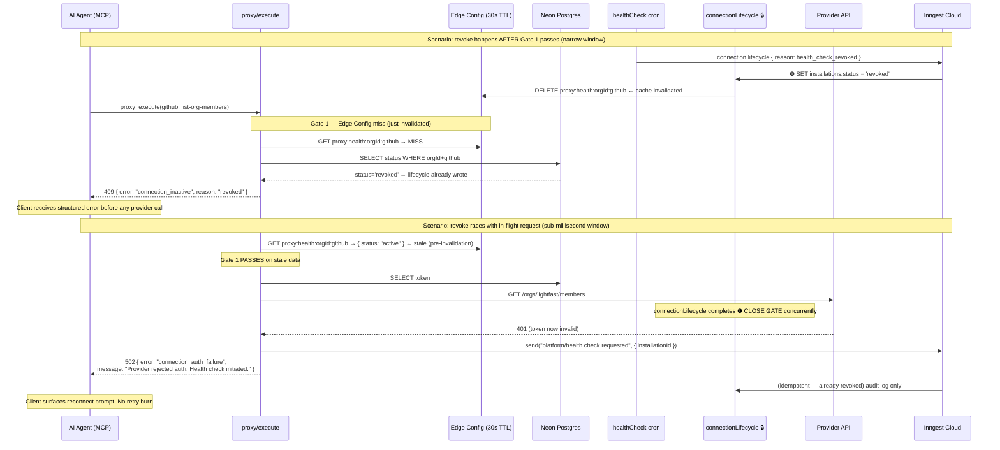

### Edge Config Health Cache Strategy

The 30s TTL cache is the key performance optimization. Cache key: `proxy:health:{orgId}:{provider}`.

Cache writes:
- **On healthCheck success**: SET `{ status, healthStatus: "healthy" }` TTL 30s
- **On connectionLifecycle ❶ (close gate)**: DELETE key immediately (not expiry)

Cache reads:
- `proxy/execute` reads before every execution
- On miss → DB fallback (adds ~10ms)
- On stale hit → provider 401 fallback (adds provider round-trip latency, ~200ms)

The correctness guarantee: **Gate 1 catches revocations within max(30s cache TTL, provider request latency)**. For the 30s window, the provider 401 fallback triggers health check and returns a structured error. No silent data corruption or infinite retry loops.

---

<!-- SECTION: update-log | last_updated: 2026-03-18T03 -->
## Update Log

### 2026-03-18T04 — Three-Layer Per-Org Endpoint Filtering

- **Trigger**: Observation that the global catalog doesn't account for per-org OAuth scope grants or per-org resource sets (repos, teams, projects). Two orgs connecting GitHub can have different scopes and different resources — the search results must reflect this.
- **Three-layer filtering model**:
  - **Layer 1** (Pinecone server-side): provider filter — endpoints for unconnected providers never returned
  - **Layer 2** (in-process): scope check — `endpointDef.requiredScope` vs `installation.grantedScopes` from `providerAccountInfo` → `scopeStatus: "sufficient" | "insufficient"`
  - **Layer 3** (DB join): resource context — `gatewayResources WHERE resourceType IN endpointDef.resourceTypes` → `availableResources[]`
- **`ProxyEndpointDef` updated**: added `resourceTypes?: readonly string[]` — tells the search layer which resource types to pull from `gatewayResources` for path param guidance.
- **`ProxySearchResult` type added**: `scopeStatus`, `availableResources`, `missingScopes` — agent has everything needed to call `proxy_execute` correctly with zero extra round-trips.
- **`proxy_execute` error handling updated**: `403` → `insufficient_scope` (NOT a health check trigger — token is valid, scope is the constraint). `404` → `resource_not_found` (resource removed from installation). `401` remains the health check trigger.
- **Race conditions 14–16 added**: scope-insufficient execute, stale resource after removal, scope upgrade after reconnect.
- **Diagrams updated**: catalog flow shows `resourceTypes` in metadata; MCP sequence shows scope-insufficient path end-to-end.

### 2026-03-18T03 — Proxy API + Provider Architecture Coverage

- **Trigger**: Coverage analysis against provider architecture research (`2026-03-17-provider-architecture-redesign.md`). Three provider gaps identified (ManagedProvider teardown, ManagedProvider webhook registration, PollingDef cron). Added Proxy API as a major new architectural layer.
- **Provider architecture gaps addressed**:
  - **ManagedProvider webhook teardown** — `connectionLifecycle` step ❺b deregisters webhook for `ManagedProvider` via `registration.deregister()`. Best-effort, won't block teardown.
  - **ManagedProvider webhook registration** — OAuth callback now calls `registration.register()` and persists `webhookId` + `signingSecret` to `webhookSetupState` JSONB column.
  - **PollingDef cron** — New Phase 4.5 Inngest function for ApiProvider polling. Cursor-persisted incremental pull → `console/webhook.delivered` same as live webhooks.
- **Proxy API (new major section)**:
  - **Universal authenticated proxy** — all post-connection provider API calls route through proxy. Single token resolution point, unified rate limit tracking, universal observability.
  - **`ProxyEndpointDef`** — extends `ProviderApi.endpoints` with semantic metadata (`description`, `requiresActiveConnection`, `requiredScope`).
  - **Service-auth + org-scoped paths** — internal services use `X-API-Key` shortcut; SDK/MCP uses org-scoped JWT with Gate 1 check.
  - **Edge Config health cache** — 30s TTL sub-1ms Gate 1 check. `connectionLifecycle ❶` deletes cache entry immediately on gate close.
- **Vector Endpoint Catalog (new)**:
  - **Global catalog, org-filtered at query time** — one Pinecone record per endpoint per provider. Zero per-org re-indexing when new endpoints are added.
  - **`gatewayProviderCatalogVersion` table** — diffs on deploy, only embeds changed endpoints.
  - **`embedProviderEndpoints` Inngest function** — idempotent upsert/delete triggered by `platform/provider.catalog.updated` on startup.
- **Proxy race conditions** — 13 races enumerated with resolution for each. Key insight: provider 401 fallback IS the self-healing trigger (fires health check, returns structured error, future requests caught at Gate 1).
- **New diagrams**: Proxy architecture overview, MCP proxy flow (happy path + race), global catalog flow, lifecycle-race sequence.
- **Phase 9 + 10 added** to Implementation Phases.
- **Updated "What Changes"** table with proxy additions.

### 2026-03-18T02 — Align with provider architecture redesign

- **Trigger**: Cross-reference with `thoughts/shared/plans/2026-03-18-provider-architecture-redesign.md` and `thoughts/shared/research/2026-03-17-provider-architecture-redesign.md`. Provider plan deleted `EventClassifier` + `LifecycleDef` (Phase 2). Platform plan needed alignment.
- **Major changes**:
  - **Dropped classify-first entirely** — all webhooks follow same path (resolve → forward/DLQ). Lifecycle webhooks DLQ naturally. Health check cron is the PRIMARY lifecycle trigger.
  - **Simplified HealthCheckDef** — uses provider plan's `check() → ConnectionStatus`. Config drift detection moved to platform level.
  - **Removed `lifecycleRecovery` cron** — health check cron IS the recovery mechanism (re-probes every 5m).
  - **Removed `classifiedAs` column** — no classification to track.
  - **Removed `connectionRestore` function** — deferred until `suspended` state needed.
  - **Simplified lifecycle reasons** — `user_disconnect`, `health_check_revoked`, `health_check_unreachable` only.
- **New diagrams**:
  - **Signature verification flow** — `SignatureScheme` + `deriveVerifySignature()` from provider redesign
  - **Health check → lifecycle trigger** — shows health check as primary detection mechanism
  - **Provider tier ingest routing** — `hasInboundWebhooks()` guard for 3-tier model
  - **Provider health check implementations** — per-provider error mapping table
- **Race condition #13 added**: GitHub org re-install on different Lightfast org.
- **Impact**: Simpler architecture. 6 Inngest functions (was 8). No classification logic. 5-minute lifecycle detection latency accepted.

### 2026-03-18T01 — Comprehensive rework from stress analysis

- **Trigger**: Deep codebase analysis revealed 12 race conditions, 4 critical architectural gaps.
- **Critical fixes**: Gate-first lifecycle, console double-gate, health check cron, config drift, lifecycle audit log, DB rework.

### 2026-03-18T00 — Initial design

- Core architecture: Inngest-only, classify-first, write-ahead + cron recovery.
