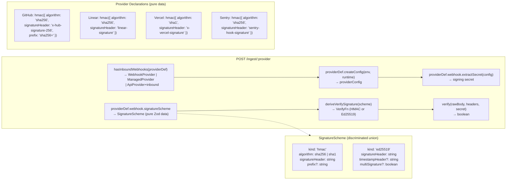
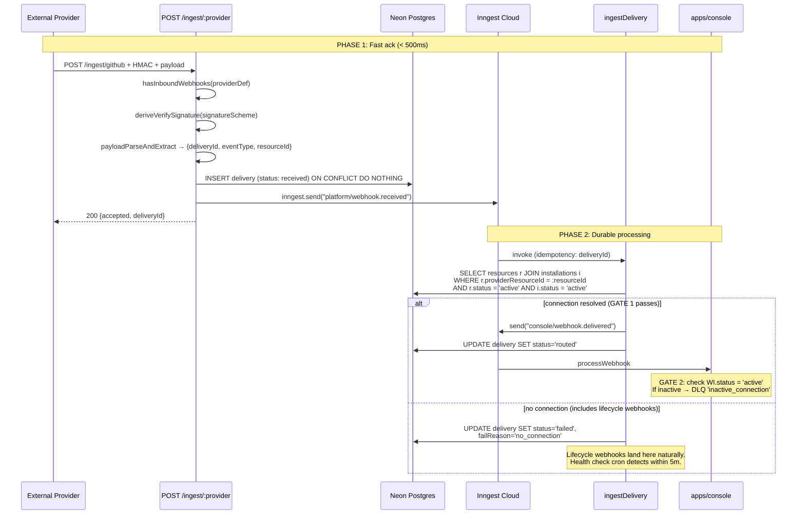
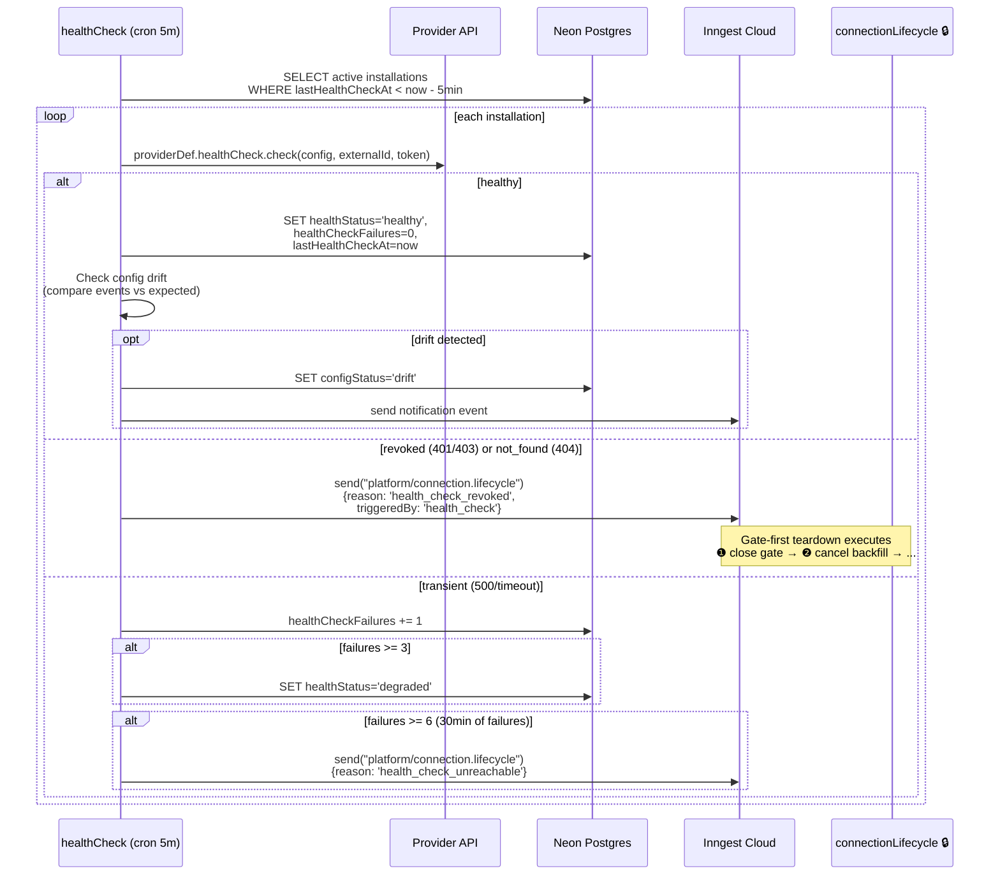
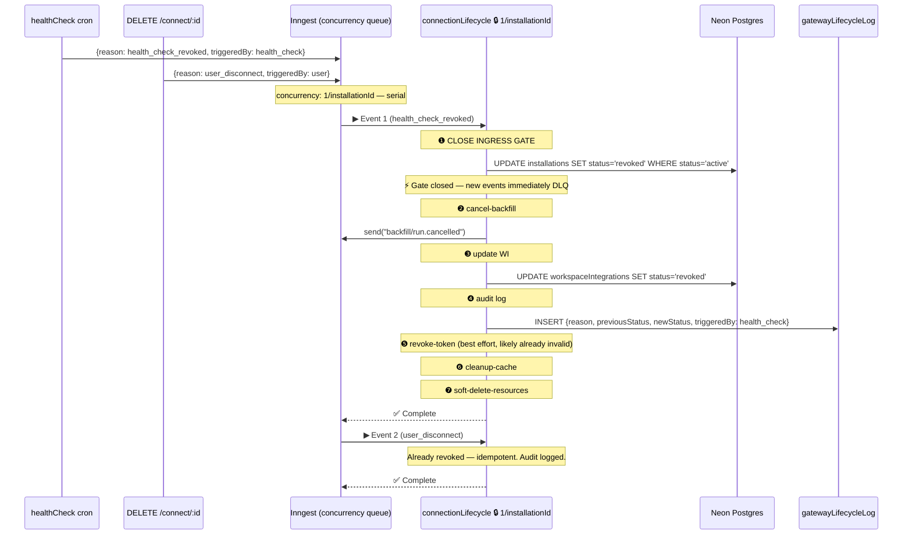
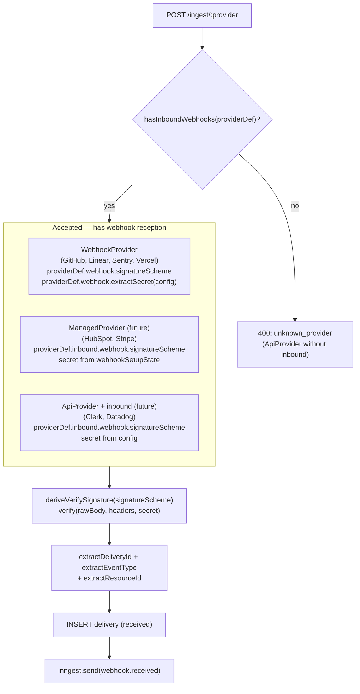
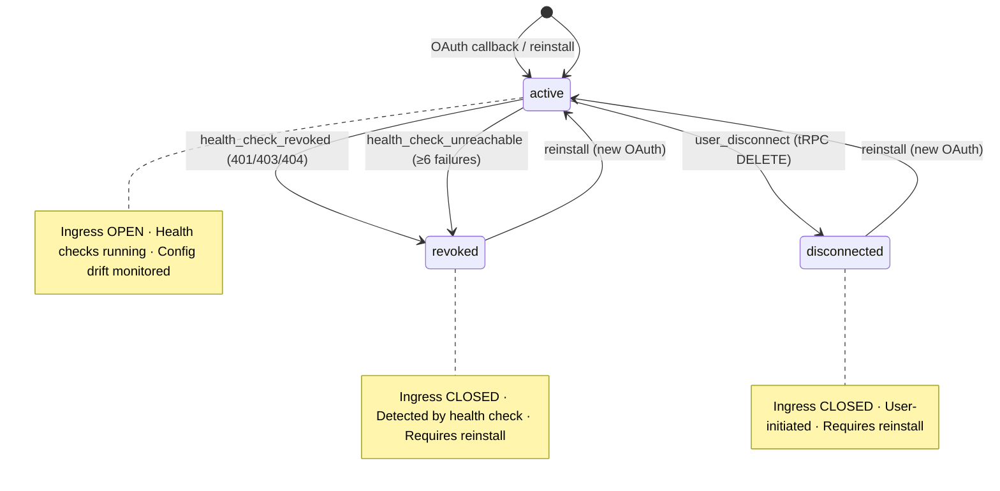
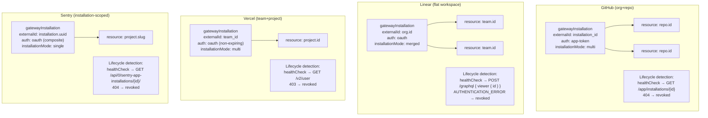
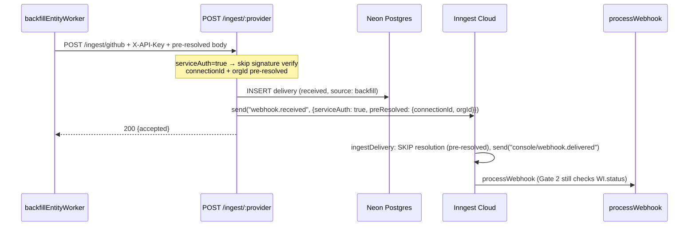
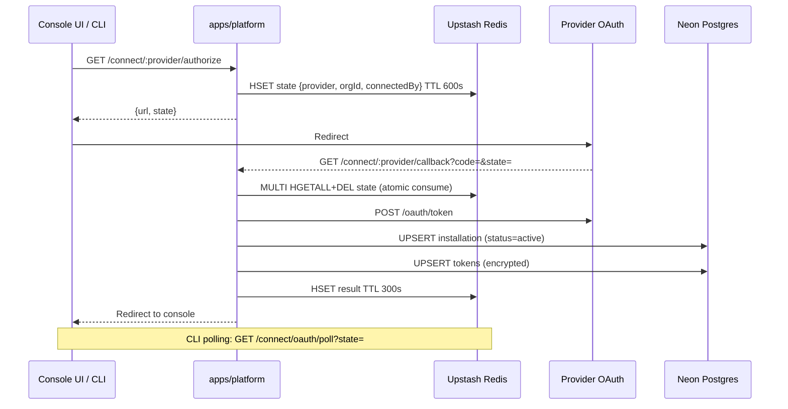

# apps/platform Architecture Redesign

<!-- SECTION: executive-summary | last_updated: 2026-03-18T02 -->
## Executive Summary

Radical redesign of the platform service that:
- **Drops Upstash Workflow + QStash entirely** — Inngest as the sole durable execution engine
- **Gate-first lifecycle** — `gatewayInstallations.status` changes FIRST, closing the ingress gate within one Inngest step (~100ms) of lifecycle detection
- **Health-check-driven lifecycle** — all lifecycle transitions triggered by health check cron (5m) or user action. No webhook-based classification. Lifecycle webhooks (`installation.deleted`, etc.) naturally DLQ via failed connection resolution.
- **Console double-gate** — DLQ with reason code for events that leak through during lifecycle transitions
- **Configuration drift detection** — detects when Lightfast updates app config and existing installations need re-consent
- **Lifecycle audit log** — immutable append-only table for every status transition
- **Self-healing** — write-ahead log + recovery cron for stuck deliveries
- **Full DB rework** — `workspaceIntegrations.isActive → status`, new tables, new columns
- **Provider-architecture-aligned** — uses `SignatureScheme` + `deriveVerifySignature()`, `HealthCheckDef`, `hasInboundWebhooks()` from the provider redesign
- **Single event bus** — platform and console share one Inngest app via `@repo/inngest`

Designed for a 1-2 person team: one durable execution system, one dashboard, one mental model.

---

<!-- SECTION: dropping | last_updated: 2026-03-18T02 -->
## What We're Dropping

| Dropped | Replacement | Why |
|---------|-------------|-----|
| Upstash Workflow (3 workflows) | Inngest functions | Zero advanced features used; two systems = 2x operational cost |
| QStash (internal routing) | Inngest events | Typed events > HTTP publishes; no service discovery needed |
| QStash delivery callbacks | Inngest observability | Native step-level visibility replaces callback tracking |
| QStash deduplication | Inngest idempotency | `idempotency: "event.data.deliveryId"` |
| Redis resource routing cache | DB-only routing | `gw:resource:*` was never read for routing (relay JOINs DB directly) |
| `EventClassifier` + `LifecycleDef` | `HealthCheckDef` | Classifier/lifecycle were dead code (never consumed at runtime). Health check cron replaces webhook-based lifecycle detection. |
| `webhookSecretEnvKey` manual map | `deriveVerifySignature(signatureScheme)` | Secrets resolved from provider config via `SignatureScheme`. No manual mapping. |
| 4 delivery statuses | 3 statuses + failReason | `received → routed → failed` + `failReason` column for DLQ granularity |

**Kept:** Redis for OAuth state (atomic MULTI HGETALL+DEL consume pattern — hard to replicate atomically in Postgres).

---

<!-- SECTION: design-principles | last_updated: 2026-03-18T02 -->
## Design Principles

### 1. Gate-First

Every lifecycle operation changes `gatewayInstallations.status` as its **first step**. This immediately closes the ingress gate (the `ingestDelivery` function JOINs on `i.status = 'active'`). All subsequent cleanup steps are downstream.

### 2. Double-Gate

Two independent gates prevent stale events from reaching the console pipeline:
- **Gate 1 (Platform)**: `ingestDelivery` resolves connection via `gatewayResources JOIN gatewayInstallations WHERE i.status = 'active' AND r.status = 'active'`
- **Gate 2 (Console)**: `processWebhook` checks `workspaceIntegrations.status = 'active'` before processing. Leaked events DLQ'd with `failReason: 'inactive_connection'`.

### 3. Health-Check-Driven Lifecycle

**No webhook classification.** All lifecycle detection is driven by the health check cron (every 5m) and explicit user actions (DELETE /connect/:id). Lifecycle webhooks from providers (e.g., GitHub `installation.deleted`) arrive, fail connection resolution (no matching resource), and go to DLQ — harmless. The health check cron detects the revocation within 5 minutes by probing the provider's API.

This eliminates the need for `EventClassifier`, `LifecycleDef`, and classify-first routing — aligning with the provider architecture redesign which deleted these as dead code.

### 4. Idempotent Everything

Every Inngest function, every DB write, every state transition is safe to re-execute. Inngest's `idempotency` key prevents duplicate processing. DB upserts use `onConflictDoNothing` or `onConflictDoUpdate`. Lifecycle operations check current status before transitioning.

### 5. Provider-Architecture-Aligned

The platform consumes the provider redesign's type system:
- **`hasInboundWebhooks(p)`** — guards the ingest route. Accepts `WebhookProvider`, `ManagedProvider`, and `ApiProvider` with `inbound`.
- **`deriveVerifySignature(signatureScheme)`** — generic HMAC/Ed25519 verification derived from `SignatureScheme` on `WebhookDef`. No per-provider `verifySignature` functions.
- **`HealthCheckDef.check()`** — provider-specific probe returning `ConnectionStatus`. Platform interprets the result.

---

<!-- SECTION: db-schema | last_updated: 2026-03-18T02 -->
## DB Schema Rework

### Modified: `gatewayInstallations` — add 4 columns

```sql
ALTER TABLE lightfast_gateway_installations
  ADD COLUMN health_status varchar(50) NOT NULL DEFAULT 'unknown',
  ADD COLUMN last_health_check_at timestamptz,
  ADD COLUMN health_check_failures integer NOT NULL DEFAULT 0,
  ADD COLUMN config_status varchar(50) NOT NULL DEFAULT 'unknown';
```

| Column | Type | Default | Purpose |
|--------|------|---------|---------|
| `healthStatus` | `varchar(50)` | `'unknown'` | `healthy \| degraded \| unreachable \| unknown` |
| `lastHealthCheckAt` | `timestamp` | null | When the last health check probe ran |
| `healthCheckFailures` | `integer` | `0` | Consecutive probe failures (reset on success) |
| `configStatus` | `varchar(50)` | `'unknown'` | `current \| drift \| unknown` |

Status values expanded: `active | pending | error | revoked | suspended | disconnected`

### Modified: `workspaceIntegrations` — migrate `isActive` to `status`

```sql
ALTER TABLE lightfast_workspace_integrations
  ADD COLUMN status varchar(50) NOT NULL DEFAULT 'active',
  ADD COLUMN status_reason varchar(100);
UPDATE lightfast_workspace_integrations
  SET status = CASE WHEN is_active THEN 'active' ELSE 'disconnected' END;
ALTER TABLE lightfast_workspace_integrations DROP COLUMN is_active;
```

| Column | Type | Default | Purpose |
|--------|------|---------|---------|
| `status` | `varchar(50)` | `'active'` | `active \| disconnected \| revoked \| suspended \| removed \| deleted \| error` |
| `statusReason` | `varchar(100)` | null | Reason for current status (e.g., `health_check_auth_failure`) |

### Modified: `gatewayWebhookDeliveries` — add `failReason`, index

```sql
ALTER TABLE lightfast_gateway_webhook_deliveries
  ADD COLUMN fail_reason varchar(100);
CREATE INDEX gateway_wd_recovery_idx
  ON lightfast_gateway_webhook_deliveries (status, received_at)
  WHERE status = 'received';
```

| Column | Type | Purpose |
|--------|------|---------|
| `failReason` | `varchar(100)` | `no_connection \| inactive_connection` |

Status values: `received → routed → failed` (Inngest dashboard for execution detail).

### New: `gatewayLifecycleLog` — immutable audit trail

```ts
export const gatewayLifecycleLog = pgTable(
  "lightfast_gateway_lifecycle_log",
  {
    id: varchar("id", { length: 191 }).notNull().primaryKey().$defaultFn(() => nanoid()),
    installationId: varchar("installation_id", { length: 191 }).notNull(),
    provider: varchar("provider", { length: 50 }).notNull(),
    reason: varchar("reason", { length: 100 }).notNull(),
    previousStatus: varchar("previous_status", { length: 50 }).notNull(),
    newStatus: varchar("new_status", { length: 50 }).notNull(),
    triggeredBy: varchar("triggered_by", { length: 50 }).notNull(),
    // "health_check" | "user" | "system"
    resourceIds: jsonb("resource_ids"),
    metadata: jsonb("metadata"),
    createdAt: timestamp("created_at", { mode: "string", withTimezone: true })
      .notNull().defaultNow(),
  },
  (table) => ({
    installationIdx: index("gateway_ll_installation_idx").on(table.installationId),
    createdAtIdx: index("gateway_ll_created_at_idx").on(table.createdAt),
  })
);
```

Append-only. Every status transition gets a row. Primary debugging tool: "why did this connection go inactive?"

---

<!-- SECTION: architecture-diagram | last_updated: 2026-03-18T02 -->
## Master Architecture

```mermaid
flowchart TD
    EXT["External Providers\nGitHub · Vercel · Linear · Sentry\n(webhooks + OAuth callbacks)"]
    CLI["Browser / CLI\n(OAuth flows, API calls)"]

    subgraph platform["apps/platform  (Hono + srvx + Inngest)"]
        direction TB

        subgraph mw["Global Middleware"]
            direction LR
            MW1["requestId"] --> MW2["sentry"] --> MW3["lifecycle"] --> MW4["errorSanitizer"]
        end

        subgraph routes["HTTP Routes — fast path (< 500ms)"]
            R_INGEST["POST /ingest/:provider\nhasInboundWebhooks guard\nderiveVerifySignature(scheme)\n① persist → ② fire event → ③ 200"]

            R_OAUTH["OAuth routes"]
            R_CONNECT["Connection routes\nDELETE → fires lifecycle"]
            R_RES["Resource routes"]
            R_ADMIN["Admin routes\n+ delivery trace\n+ lifecycle replay\n+ lifecycle log"]
        end

        R_SERVE["GET|POST /inngest"]

        subgraph fns["Inngest Functions"]
            F_INGEST["⚡ ingestDelivery\nresolve connection → forward or DLQ\nidempotency: deliveryId\nconcurrency: 50 global · 20/provider"]

            F_LIFECYCLE["🔒 connectionLifecycle\n❶ CLOSE GATE\n❷ cancel-backfill\n❸ update WI.status\n❹ audit log\n❺ revoke-token\n❻ cleanup-cache\n❼ soft-delete-resources\nconcurrency: 1/installationId"]

            F_RESTORE["🔓 connectionRestore\nconcurrency: 1/installationId"]

            F_HEALTH["🏥 healthCheck (cron 5m)\nPRIMARY lifecycle trigger\ncheck() → ConnectionStatus\ndetect config drift"]

            F_TOKEN["🔄 tokenRefresh (cron 5m)"]
            F_RECOVERY["🩹 deliveryRecovery (cron 1m)"]
        end
    end

    DB[("Neon Postgres")]
    REDIS[("Upstash Redis\nOAuth state only")]
    INNGEST_CLOUD["Inngest Cloud"]
    CONSOLE["apps/console\nGate 2: WI.status check"]

    EXT -->|"POST /ingest/:provider"| R_INGEST
    CLI --> R_OAUTH & R_CONNECT

    R_INGEST --> DB & INNGEST_CLOUD
    R_OAUTH --> REDIS & DB
    R_CONNECT --> DB & INNGEST_CLOUD
    R_RES --> DB
    R_ADMIN --> DB

    INNGEST_CLOUD <--> R_SERVE

    fns --> DB
    F_INGEST -.->|"console/webhook.delivered"| INNGEST_CLOUD
    F_HEALTH -.->|"platform/connection.lifecycle"| INNGEST_CLOUD
    F_LIFECYCLE -.->|"backfill/run.cancelled"| INNGEST_CLOUD
    INNGEST_CLOUD -.-> CONSOLE

    style F_LIFECYCLE fill:#1a1a2e,stroke:#e94560,stroke-width:2px
    style F_HEALTH fill:#1a1a2e,stroke:#533483,stroke-width:2px
    style F_INGEST fill:#1a1a2e,stroke:#16213e,stroke-width:2px
```



---

<!-- SECTION: signature-verification | last_updated: 2026-03-18T02 -->
## Signature Verification (from Provider Redesign)

The ingest route uses `SignatureScheme` + `deriveVerifySignature()` from the provider architecture — no per-provider `verifySignature` functions, no manual `webhookSecretEnvKey` map.



---

<!-- SECTION: ingest-pipeline | last_updated: 2026-03-18T02 -->
## Ingest-Delivery Pipeline

**No classification.** All webhooks follow the same path: resolve connection → forward or DLQ. Lifecycle webhooks (e.g., GitHub `installation.deleted`) have `resourceId = installation.id` which doesn't match any `gatewayResources.providerResourceId` → DLQ with `no_connection`. Health check cron detects the revocation within 5 minutes.



---

<!-- SECTION: health-check-lifecycle | last_updated: 2026-03-18T02 -->
## Health Check → Lifecycle Trigger (Primary Detection)

The health check cron is the **primary lifecycle trigger** — not webhooks. It probes each active connection's provider API every 5 minutes. On failure, it fires `platform/connection.lifecycle` which runs the gate-first teardown.



### Provider Health Check Implementations

Each provider's `HealthCheckDef.check()` returns `ConnectionStatus` (`"healthy" | "revoked" | "suspended"`). Provider-specific error handling is encapsulated inside `check()`:

| Provider | Probe endpoint | Error mapping |
|----------|---------------|---------------|
| GitHub | `GET /app/installations/{id}` | 200 → `healthy`, 404 → `revoked` (installation deleted) |
| Linear | `POST /graphql { viewer { id } }` | 200 with data → `healthy`, 200 with `AUTHENTICATION_ERROR` → `revoked` (GraphQL wraps errors in 200) |
| Sentry | `GET /api/0/sentry-app-installations/{id}/` | 200 → `healthy`, 404 → `revoked` |
| Vercel | `GET /v2/user` | 200 → `healthy`, 403 → `revoked` (Vercel uses 403 not 401) |

```ts
// Aligns with provider redesign Phase 2
interface HealthCheckDef<TConfig> {
  readonly check: (
    config: TConfig,
    externalId: string,
    accessToken: string | null
  ) => Promise<ConnectionStatus>;
}

const connectionStatusSchema = z.enum(["healthy", "revoked", "suspended"]);
type ConnectionStatus = z.infer<typeof connectionStatusSchema>;
```

### Config Drift Detection (Platform-Level)

Drift detection runs at the **platform level** (not in provider definitions) after a successful `check()`:

```ts
// In healthCheck cron, after check() returns "healthy":
const expected = PROVIDERS[provider].defaultSyncEvents;
const actual = installation.providerAccountInfo?.events ?? [];
const missing = expected.filter(e => !actual.includes(e));
if (missing.length > 0) {
  await db.update(gatewayInstallations)
    .set({ configStatus: "drift" })
    .where(eq(gatewayInstallations.id, installation.id));
  // Fire notification for console UI banner
}
```

---

<!-- SECTION: lifecycle-workflow | last_updated: 2026-03-18T02 -->
## Connection Lifecycle (Gate-First)

**Triggers**: health check cron (revoked/unreachable) and user action (DELETE /connect/:id). NOT triggered by webhooks.



### Lifecycle Reason → Target Status Map

| Reason | Source | `installations.status` | `WI.status` | Revoke token? | Cancel backfill? |
|--------|--------|----------------------|-------------|---------------|-----------------|
| `user_disconnect` | tRPC DELETE | `disconnected` | `disconnected` | yes | yes |
| `health_check_revoked` | cron (401/403/404) | `revoked` | `revoked` | no (already invalid) | yes |
| `health_check_unreachable` | cron (500/timeout ≥6) | `revoked` | `error` | no | yes |

**Note:** `provider_suspended` and `provider_unsuspended` (GitHub-specific) are future extensions. GitHub suspension is rare and can be detected by the health check cron returning `"suspended"` from `check()`.

---

<!-- SECTION: provider-ingest-routing | last_updated: 2026-03-18T02 -->
## Provider Tier Ingest Routing

The ingest route uses `hasInboundWebhooks()` from the provider redesign to accept webhooks from all three provider tiers:



---

<!-- SECTION: state-machine | last_updated: 2026-03-18T02 -->
## Connection State Machine



**Future extensions** (when provider plan Phase 9+ lands):
- `active → suspended` (GitHub `installation.suspend` detected by health check returning `"suspended"`)
- `suspended → active` (health check returns `"healthy"` → `connectionRestore`)

---

<!-- SECTION: race-conditions | last_updated: 2026-03-18T02 -->
## Race Condition Resolution Matrix

| # | Race Condition | Resolution |
|---|---------------|------------|
| 1 | **Connection revoked after event enters pipeline** | **Double-gate**: Gate 1 (ingestDelivery JOIN) + Gate 2 (console WI.status). Leaked events DLQ'd with `inactive_connection`. Health check closes gate within 5m. |
| 2 | **Backfill running, then connection revoked** | **cancelOn** on orchestrator + entity worker. Health check fires lifecycle → step ❷ sends `backfill/run.cancelled`. **401 → NonRetriableError** in entity worker. |
| 3 | **Resource added during lifecycle teardown** | Gate-first: step ❶ closes gate. Step ❼ `WHERE installationId` catches newly-added resource. |
| 4 | **Duplicate health check detections** | **concurrency: 1/installationId** — serial. Second lifecycle runs idempotently. Both audit-logged. |
| 5 | **Token refresh during teardown** | Harmless: refresh cron checks `status='active'`. After step ❶, cron skips. |
| 6 | **inngest.send() fails in route handler** | **WAL + deliveryRecovery cron**: re-fires after 2min. Provider gets 200 (delivery persisted). |
| 7 | **Stale data event after health check revocation** | Gate 1 catches (installation now revoked). Gate 2 catches leaked events (WI now revoked). |
| 8 | **Linear token revoked — no webhook** | **healthCheck cron**: probes every 5m. 401 → lifecycle event. Detected within 5m. This IS the detection mechanism. |
| 9 | **Health check cron fails** | Inngest retries the cron function. If Inngest itself is down, next cron invocation (5m later) catches it. Self-healing. |
| 10 | **Proxy 401 during backfill** | Entity worker: 401/403 → `NonRetriableError`. No retry burn. Health check independently detects and fires lifecycle. |
| 11 | **Concurrent entity-graph writes** | `entityGraph`: add `concurrency: { limit: 1, key: entityExternalId }`. |
| 12 | **Config drift after app update** | healthCheck drift detection (platform-level). Console banner for re-consent. |
| 13 | **GitHub org re-installed on different Lightfast org** | New `installation_id` → new DB row. Old installation revoked by health check (404). No conflict — different `(provider, externalId)` rows. |

---

<!-- SECTION: event-schema | last_updated: 2026-03-18T02 -->
## Inngest Event Schema (`@repo/inngest`)

```ts
const platformEvents = {
  "platform/webhook.received": z.object({
    provider: z.string(),
    deliveryId: z.string(),
    eventType: z.string(),
    resourceId: z.string().nullable(),
    payload: z.unknown(),
    receivedAt: z.number(),
    // Service-auth fields (backfill path):
    serviceAuth: z.boolean().optional(),
    preResolved: z.object({
      connectionId: z.string(),
      orgId: z.string(),
    }).optional(),
    correlationId: z.string().optional(),
  }),
  "platform/connection.lifecycle": z.object({
    reason: z.string(),  // user_disconnect | health_check_revoked | health_check_unreachable
    installationId: z.string(),
    orgId: z.string(),
    provider: z.string(),
    triggeredBy: z.enum(["health_check", "user", "system"]),
    correlationId: z.string().optional(),
  }),
};

const consoleEvents = {
  "console/webhook.delivered": z.object({
    deliveryId: z.string(),
    connectionId: z.string(),
    orgId: z.string(),
    provider: z.string(),
    eventType: z.string(),
    payload: z.unknown(),
    receivedAt: z.number(),
    correlationId: z.string().optional(),
  }),
  // + existing: event.capture, event.stored, entity.upserted, entity.graphed
};

const backfillEvents = {
  "backfill/run.requested": backfillTriggerPayload,
  "backfill/run.cancelled": z.object({
    installationId: z.string(),
    correlationId: z.string().optional(),
  }),
};

export const inngest = new Inngest({
  id: "lightfast",
  schemas: new EventSchemas()
    .fromZod(platformEvents)
    .fromZod(consoleEvents)
    .fromZod(backfillEvents),
});
```

**Note:** `platform/connection.restore` removed from v1. Restore is a future extension when `suspended` state is implemented. Health check returning `"healthy"` for a `suspended` installation would trigger restore.

---

<!-- SECTION: debugging | last_updated: 2026-03-18T02 -->
## Debugging & Replay

### Admin Endpoints

| Endpoint | Purpose |
|----------|---------|
| `GET /admin/health` | DB probe + uptime |
| `GET /admin/dlq` | Paginated failed deliveries (includes lifecycle webhooks that DLQ'd) |
| `POST /admin/dlq/replay` | Replay specific DLQ entries |
| `POST /admin/replay/catchup` | Replay all undelivered for an installationId |
| `GET /admin/delivery/:deliveryId/trace` | Full trace: status, routing, console processing |
| `POST /admin/lifecycle/replay` | Re-trigger lifecycle for an installation |
| `GET /admin/lifecycle-log/:installationId` | Lifecycle audit trail |

### correlationId Flow

Every event carries `correlationId?: string`. Flows through:
HTTP header → WAL entry → Inngest event → downstream events → console pipeline → structured logs.

Search BetterStack for `correlationId=xxx` for end-to-end trace.

---

<!-- SECTION: provider-scoping | last_updated: 2026-03-18T02 -->
## Provider Scoping Model



---

<!-- SECTION: service-auth | last_updated: 2026-03-18T02 -->
## Service-Auth Path (Backfill → Platform → Console)



---

<!-- SECTION: oauth-flow | last_updated: 2026-03-18T00 -->
## OAuth Flow



---

<!-- SECTION: rate-limiting | last_updated: 2026-03-18T00 -->
## Provider-Aware Rate Limiting (Backfill)

4-layer defense:

| Layer | Mechanism | Config |
|-------|-----------|--------|
| 1. Inngest Throttle | Pre-flight gate | GitHub 4000/hr, Linear 2000/hr, Vercel 3000/hr, Sentry 1500/hr per installationId |
| 2. Inngest Concurrency | Parallelism cap | 5/orgId, 10 global |
| 3. Response-Header Sleep | Reactive | `step.sleep` when `remaining < 10% of limit` until `resetAt` |
| 4. cancelOn | Safety valve | `backfill/run.cancelled` match installationId — health check lifecycle fires this |

---

<!-- SECTION: what-changes | last_updated: 2026-03-18T02 -->
## What This Removes / Adds

### Removes (~1,091 LOC, 2 vendor deps)

| Component | LOC |
|-----------|-----|
| `@vendor/upstash-workflow` | ~200 |
| `@vendor/qstash` | ~150 |
| QStash callbacks + dedup | ~150 |
| Redis resource cache writes | ~80 |
| Webhook delivery workflow | ~225 |
| Connection teardown workflow | ~150 |
| Console ingress workflow | ~136 |

### Adds

| Component | Purpose |
|-----------|---------|
| `@repo/inngest` | Shared typed client + event schemas |
| `ingestDelivery` | Resolve → forward or DLQ (no classification) |
| `connectionLifecycle` | Gate-first teardown (triggered by health check + user) |
| `healthCheck` | PRIMARY lifecycle trigger + config drift detection |
| `tokenRefresh` | Proactive refresh |
| `deliveryRecovery` | Self-healing for stuck deliveries |
| `gatewayLifecycleLog` | Immutable audit trail |
| Console double-gate | WI.status check in processWebhook |
| Admin trace/replay | Per-delivery debugging |

---

<!-- SECTION: phases | last_updated: 2026-03-18T02 -->
## Implementation Phases

### Phase 0: DB Schema Migration
- [ ] Add `healthStatus`, `lastHealthCheckAt`, `healthCheckFailures`, `configStatus` to `gatewayInstallations`
- [ ] Migrate `workspaceIntegrations.isActive` → `status` + `statusReason`
- [ ] Add `failReason` to `gatewayWebhookDeliveries` + recovery index
- [ ] Create `gatewayLifecycleLog` table
- [ ] `pnpm db:generate && pnpm db:migrate`

### Phase 1: `@repo/inngest` Shared Package
- [ ] Create `packages/inngest/` with typed client + all event schemas
- [ ] Migrate `apps/backfill` + `api/console` clients to shared package

### Phase 2: `apps/platform` Service Shell
- [ ] Create `apps/platform/` (Hono + srvx)
- [ ] Port middleware from relay (use `hasInboundWebhooks()` guard, `deriveVerifySignature()`)
- [ ] Port routes from relay + gateway
- [ ] Inngest serve endpoint + dev server wiring

### Phase 3: Core Inngest Functions
- [ ] `ingestDelivery` — resolve → forward or DLQ (no classification)
- [ ] `connectionLifecycle` — gate-first, audit log
- [ ] `deliveryRecovery` cron
- [ ] `tokenRefresh` cron
- [ ] `targetStatus()` state machine in `@repo/connection-core`

### Phase 4: Health Check & Config Drift
- [ ] `healthCheck` cron (PRIMARY lifecycle trigger)
- [ ] Per-provider `check()` implementations (GitHub, Linear, Sentry, Vercel)
- [ ] Platform-level config drift detection
- [ ] Console UI drift banner

### Phase 5: Console Double-Gate
- [ ] `processWebhook` checks `WI.status = 'active'`
- [ ] DLQ with `failReason: 'inactive_connection'`

### Phase 6: Entity Worker Hardening
- [ ] 401/403 → `NonRetriableError`
- [ ] Connection status check per page

### Phase 7: Admin & Debugging
- [ ] `GET /admin/delivery/:id/trace`
- [ ] `POST /admin/lifecycle/replay`
- [ ] `GET /admin/lifecycle-log/:id`

### Phase 8: Decommission
- [ ] Remove `apps/relay/` + `apps/gateway/`
- [ ] Remove `@vendor/upstash-workflow` + `@vendor/qstash`
- [ ] Update `CLAUDE.md`

---

<!-- SECTION: not-doing | last_updated: 2026-03-18T02 -->
## What We're NOT Doing

- **Classify-first ingest** — dropped. Lifecycle webhooks DLQ naturally. Health check cron is the lifecycle trigger. Simpler architecture, 5-minute detection latency is acceptable.
- **`EventClassifier` / `LifecycleDef`** — deleted from provider definitions (provider plan Phase 2). Not re-introduced at platform level.
- **`connectionRestore`** — deferred until `suspended` state is needed (GitHub `installation.suspend` is rare). Health check returning `"healthy"` for a suspended installation could trigger restore in the future.
- **Real-time status push** — DB storage, UI polls. No WebSocket/SSE.
- **Automatic re-authorization** — drift shows banner. User manually re-consents.
- **Per-event ordering guarantees** — idempotent pipeline. Strict ordering too expensive.
- **Multi-region** — single Neon + single Inngest app.
- **Event sourcing** — mutable status + audit log. Not derived from event history.
- **ManagedProvider diagrams** — deferred to when provider plan Phase 9 lands.

---

<!-- SECTION: resolved-questions | last_updated: 2026-03-18T02 -->
## Resolved Questions

| Question | Resolution |
|----------|-----------|
| Classify-first or health-check-driven? | Health-check-driven. No classification. Lifecycle webhooks DLQ naturally. |
| `HealthCheckDef` interface? | Provider plan's simple `check() → ConnectionStatus`. Drift detection at platform level. |
| `POST /connect/:id/resources` through Inngest? | No — synchronous. Gate-first + `WHERE installationId` catches races. |
| Keep `gatewayWebhookDeliveries`? | Yes — WAL for replay + recovery cron. Enhanced with `failReason`. |
| Single vs dual Inngest app? | Single. Serve endpoints separate. |
| Redis retention? | Keep for OAuth state only. Resource routing cache dropped. |
| Console ingress gate behavior? | DLQ with reason code (`inactive_connection`). |
| WI schema migration scope? | Folded into Phase 0. |
| Lifecycle audit log? | Yes — `gatewayLifecycleLog` table. Append-only. |
| Config drift scope? | Included — detected at platform level in healthCheck cron. |
| ManagedProvider in this plan? | Deferred to provider plan Phase 9. |
| GitHub org re-install on different Lightfast org? | New installation_id → new row. Old revoked by health check (404). Clean separation. |

---

<!-- SECTION: update-log | last_updated: 2026-03-18T02 -->
## Update Log

### 2026-03-18T02 — Align with provider architecture redesign

- **Trigger**: Cross-reference with `thoughts/shared/plans/2026-03-18-provider-architecture-redesign.md` and `thoughts/shared/research/2026-03-17-provider-architecture-redesign.md`. Provider plan deleted `EventClassifier` + `LifecycleDef` (Phase 2). Platform plan needed alignment.
- **Major changes**:
  - **Dropped classify-first entirely** — all webhooks follow same path (resolve → forward/DLQ). Lifecycle webhooks DLQ naturally. Health check cron is the PRIMARY lifecycle trigger.
  - **Simplified HealthCheckDef** — uses provider plan's `check() → ConnectionStatus`. Config drift detection moved to platform level.
  - **Removed `lifecycleRecovery` cron** — health check cron IS the recovery mechanism (re-probes every 5m).
  - **Removed `classifiedAs` column** — no classification to track.
  - **Removed `connectionRestore` function** — deferred until `suspended` state needed.
  - **Simplified lifecycle reasons** — `user_disconnect`, `health_check_revoked`, `health_check_unreachable` only.
- **New diagrams**:
  - **Signature verification flow** — `SignatureScheme` + `deriveVerifySignature()` from provider redesign
  - **Health check → lifecycle trigger** — shows health check as primary detection mechanism
  - **Provider tier ingest routing** — `hasInboundWebhooks()` guard for 3-tier model
  - **Provider health check implementations** — per-provider error mapping table
- **Race condition #13 added**: GitHub org re-install on different Lightfast org.
- **Impact**: Simpler architecture. 6 Inngest functions (was 8). No classification logic. 5-minute lifecycle detection latency accepted.

### 2026-03-18T01 — Comprehensive rework from stress analysis

- **Trigger**: Deep codebase analysis revealed 12 race conditions, 4 critical architectural gaps.
- **Critical fixes**: Gate-first lifecycle, console double-gate, health check cron, config drift, lifecycle audit log, DB rework.

### 2026-03-18T00 — Initial design

- Core architecture: Inngest-only, classify-first, write-ahead + cron recovery.
