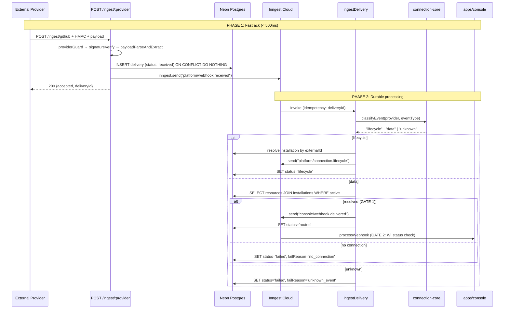
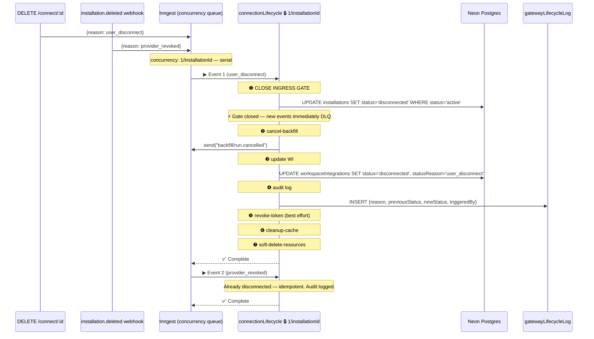
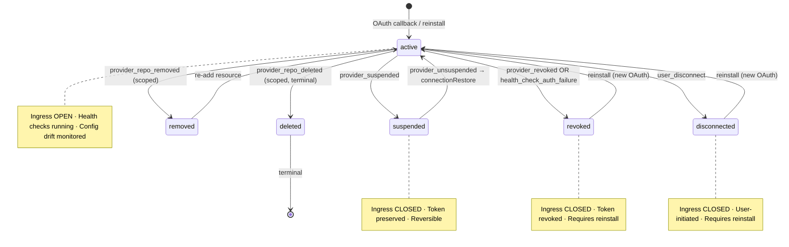
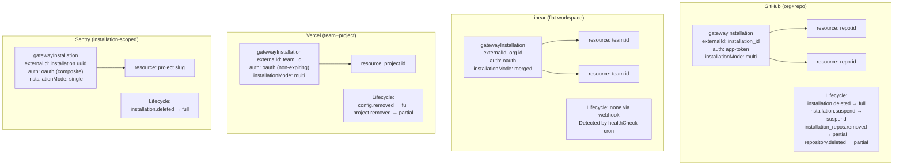
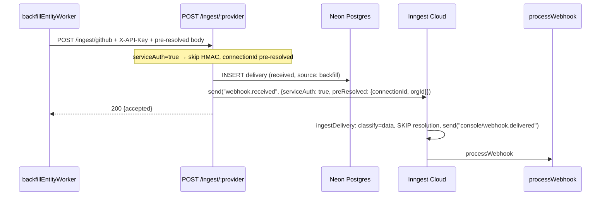
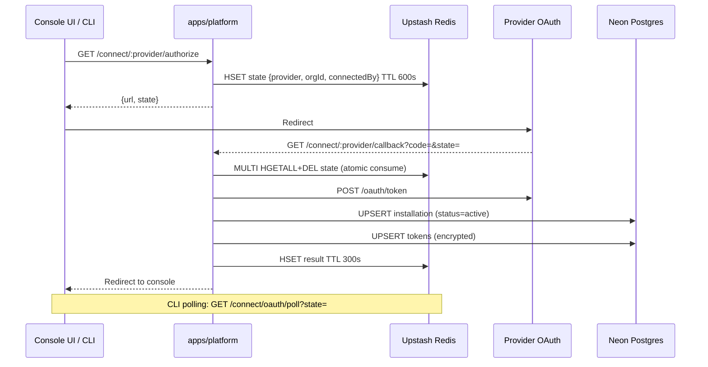

# apps/platform Architecture Redesign

<!-- SECTION: executive-summary | last_updated: 2026-03-18T01 -->
## Executive Summary

Radical redesign of the platform service that:
- **Drops Upstash Workflow + QStash entirely** — Inngest as the sole durable execution engine
- **Gate-first lifecycle** — `gatewayInstallations.status` changes FIRST, closing the ingress gate within one Inngest step (~100ms) of lifecycle detection
- **Classify-first ingest** — webhook type determines routing BEFORE connection resolution
- **Health-aware connections** — periodic cron probes detect revoked tokens (Linear), stale installations, and configuration drift
- **Configuration drift detection** — detects when Lightfast updates app config and existing installations need re-consent
- **Lifecycle audit log** — immutable append-only table for every status transition
- **Console double-gate** — DLQ with reason code for events that leak through during lifecycle transitions
- **Self-healing** — write-ahead log + recovery crons for deliveries and lifecycle events
- **Full DB rework** — `workspaceIntegrations.isActive → status`, new tables, new columns
- **Single event bus** — platform and console share one Inngest app via `@repo/inngest`

Designed for a 1-2 person team: one durable execution system, one dashboard, one mental model.

---

<!-- SECTION: dropping | last_updated: 2026-03-18T01 -->
## What We're Dropping

| Dropped | Replacement | Why |
|---------|-------------|-----|
| Upstash Workflow (3 workflows) | Inngest functions | Zero advanced features used; two systems = 2x operational cost |
| QStash (internal routing) | Inngest events | Typed events > HTTP publishes; no service discovery needed |
| QStash delivery callbacks | Inngest observability | Native step-level visibility replaces callback tracking |
| QStash deduplication | Inngest idempotency | `idempotency: "event.data.deliveryId"` |
| Redis resource routing cache | DB-only routing | `gw:resource:*` was never read for routing (confirmed: relay JOINs DB directly) |
| 4 delivery statuses | 3 statuses + failReason | `received → routed → failed` + `failReason` column for DLQ granularity |

**Kept:** Redis for OAuth state (atomic MULTI HGETALL+DEL consume pattern — hard to replicate atomically in Postgres).

---

<!-- SECTION: design-principles | last_updated: 2026-03-18T01 -->
## Design Principles

### 1. Gate-First

Every lifecycle operation changes `gatewayInstallations.status` as its **first step**. This immediately closes the ingress gate (the `ingestDelivery` function JOINs on `i.status = 'active'`). All subsequent cleanup steps (cancel backfill, revoke token, update WI, soft-delete resources) are downstream of the gate close.

### 2. Double-Gate

Two independent gates prevent stale events from reaching the console pipeline:
- **Gate 1 (Platform)**: `ingestDelivery` resolves connection via `gatewayResources JOIN gatewayInstallations WHERE i.status = 'active' AND r.status = 'active'`
- **Gate 2 (Console)**: `processWebhook` checks `workspaceIntegrations.status = 'active'` before processing. Events that leaked through Gate 1 (already in Inngest queue when gate closed) are caught here and DLQ'd with `failReason: 'inactive_connection'`.

### 3. Health-Aware

Connections are not assumed healthy just because no lifecycle webhook arrived. A periodic health check cron probes each active connection, detects auth failures (especially for Linear which has no lifecycle webhooks), and triggers lifecycle transitions when connectivity is permanently lost.

### 4. Idempotent Everything

Every Inngest function, every DB write, every state transition is safe to re-execute. Inngest's `idempotency` key prevents duplicate processing. DB upserts use `onConflictDoNothing` or `onConflictDoUpdate`. Lifecycle operations check current status before transitioning.

---

<!-- SECTION: db-schema | last_updated: 2026-03-18T01 -->
## DB Schema Rework

### Modified: `gatewayInstallations` — add 4 columns

```sql
ALTER TABLE lightfast_gateway_installations
  ADD COLUMN health_status varchar(50) NOT NULL DEFAULT 'unknown',
  ADD COLUMN last_health_check_at timestamptz,
  ADD COLUMN health_check_failures integer NOT NULL DEFAULT 0,
  ADD COLUMN config_status varchar(50) NOT NULL DEFAULT 'unknown';
```

| Column | Type | Default | Purpose |
|--------|------|---------|---------|
| `healthStatus` | `varchar(50)` | `'unknown'` | `healthy \| degraded \| unreachable \| unknown` |
| `lastHealthCheckAt` | `timestamp` | null | When the last health check probe ran |
| `healthCheckFailures` | `integer` | `0` | Consecutive probe failures (reset on success) |
| `configStatus` | `varchar(50)` | `'unknown'` | `current \| drift \| unknown` |

Status values expanded: `active | pending | error | revoked | suspended | disconnected`

### Modified: `workspaceIntegrations` — migrate `isActive` to `status`

```sql
ALTER TABLE lightfast_workspace_integrations
  ADD COLUMN status varchar(50) NOT NULL DEFAULT 'active',
  ADD COLUMN status_reason varchar(100);
UPDATE lightfast_workspace_integrations
  SET status = CASE WHEN is_active THEN 'active' ELSE 'disconnected' END;
ALTER TABLE lightfast_workspace_integrations DROP COLUMN is_active;
```

| Column | Type | Default | Purpose |
|--------|------|---------|---------|
| `status` | `varchar(50)` | `'active'` | `active \| disconnected \| revoked \| suspended \| removed \| deleted \| error` |
| `statusReason` | `varchar(100)` | null | Reason for current status (e.g., `provider_revoked`, `health_check_auth_failure`) |

### Modified: `gatewayWebhookDeliveries` — add `failReason`, `classifiedAs`, index

```sql
ALTER TABLE lightfast_gateway_webhook_deliveries
  ADD COLUMN fail_reason varchar(100),
  ADD COLUMN classified_as varchar(20);
CREATE INDEX gateway_wd_recovery_idx
  ON lightfast_gateway_webhook_deliveries (status, received_at)
  WHERE status = 'received';
```

| Column | Type | Purpose |
|--------|------|---------|
| `failReason` | `varchar(100)` | `no_connection \| unknown_event \| inactive_connection \| classification_error` |
| `classifiedAs` | `varchar(20)` | `lifecycle \| data \| unknown` — for debugging |

### New: `gatewayLifecycleLog` — immutable audit trail

```ts
export const gatewayLifecycleLog = pgTable(
  "lightfast_gateway_lifecycle_log",
  {
    id: varchar("id", { length: 191 }).notNull().primaryKey().$defaultFn(() => nanoid()),
    installationId: varchar("installation_id", { length: 191 }).notNull(),
    provider: varchar("provider", { length: 50 }).notNull(),
    reason: varchar("reason", { length: 100 }).notNull(),
    previousStatus: varchar("previous_status", { length: 50 }).notNull(),
    newStatus: varchar("new_status", { length: 50 }).notNull(),
    triggeredBy: varchar("triggered_by", { length: 50 }).notNull(),
    // "webhook" | "health_check" | "user" | "system" | "config_drift"
    resourceIds: jsonb("resource_ids"),  // string[] for scoped transitions
    metadata: jsonb("metadata"),         // deliveryId, correlationId, error details
    createdAt: timestamp("created_at", { mode: "string", withTimezone: true })
      .notNull().defaultNow(),
  },
  (table) => ({
    installationIdx: index("gateway_ll_installation_idx").on(table.installationId),
    createdAtIdx: index("gateway_ll_created_at_idx").on(table.createdAt),
  })
);
```

Append-only. Every status transition gets a row. Primary debugging tool: "why did this connection go inactive?"

---

<!-- SECTION: architecture-diagram | last_updated: 2026-03-18T01 -->
## Master Architecture

```mermaid
flowchart TD
    EXT["External Providers\nGitHub · Vercel · Linear · Sentry\n(webhooks + OAuth callbacks)"]
    CLI["Browser / CLI\n(OAuth flows, API calls)"]

    subgraph platform["apps/platform  (Hono + srvx + Inngest)"]
        direction TB

        subgraph mw["Global Middleware  (every request)"]
            direction LR
            MW1["requestId\n(nanoid)"] --> MW2["sentry\n(captureException)"] --> MW3["lifecycle\n(structured logs)"] --> MW4["errorSanitizer\n(5xx → generic)"]
        end

        subgraph routes["HTTP Routes — fast path (all < 500ms)"]
            R_INGEST["POST /ingest/:provider\n─────────────────────\n① INSERT delivery (received)\n② inngest.send(webhook.received)\n③ return 200 {accepted}"]

            R_OAUTH["OAuth routes\nGET /connect/:p/authorize\nGET /connect/:p/callback\nGET /connect/oauth/poll"]

            R_CONNECT["Connection routes\nGET /connect/:id\nDELETE /connect/:id\nGET /token/:id\nPOST /proxy/:id"]

            R_RES["Resource routes\nPOST /connect/:id/resources\nDELETE /connect/:id/resources/:r"]

            R_ADMIN["Admin routes\nGET /admin/health\nGET /admin/dlq\nPOST /admin/dlq/replay\nGET /admin/delivery/:id/trace\nPOST /admin/lifecycle/replay\nGET /admin/lifecycle-log/:id"]
        end

        R_SERVE["GET|POST /inngest"]

        subgraph fns["Inngest Functions"]
            F_INGEST["⚡ ingestDelivery\nclassify → route → update status\nidempotency: deliveryId\nconcurrency: 50 global · 20/provider"]

            F_LIFECYCLE["🔒 connectionLifecycle\n❶ CLOSE GATE (installations.status)\n❷ cancel-backfill\n❸ update WI.status\n❹ log-lifecycle (audit)\n❺ revoke-token\n❻ cleanup-cache\n❼ soft-delete-resources\nconcurrency: 1/installationId"]

            F_RESTORE["🔓 connectionRestore\nrestore installation + WI + audit log\nconcurrency: 1/installationId"]

            F_HEALTH["🏥 healthCheck (cron 5m)\nprobe provider endpoints\ndetect config drift\n401 → lifecycle event"]

            F_TOKEN["🔄 tokenRefresh (cron 5m)\nproactive refresh before expiry"]

            F_RECOVERY["🩹 deliveryRecovery (cron 1m)\nre-fire stuck received events"]

            F_LIFECYCLE_RECOVERY["🩹 lifecycleRecovery (cron 5m)\nre-fire stuck lifecycle events"]
        end
    end

    DB[("Neon Postgres")]
    REDIS[("Upstash Redis\nOAuth state only")]
    INNGEST_CLOUD["Inngest Cloud"]
    CORE["@repo/connection-core"]
    CONSOLE["apps/console\nDouble-gate: WI.status check"]

    EXT -->|"POST /ingest/:provider"| R_INGEST
    CLI --> R_OAUTH & R_CONNECT

    R_INGEST -->|"persist"| DB
    R_INGEST -->|"fire event"| INNGEST_CLOUD
    R_OAUTH --> REDIS & DB
    R_CONNECT --> DB & INNGEST_CLOUD
    R_RES --> DB
    R_ADMIN --> DB

    INNGEST_CLOUD <--> R_SERVE

    F_INGEST --> CORE
    F_LIFECYCLE --> CORE
    F_HEALTH --> CORE
    fns --> DB

    F_INGEST -.-> INNGEST_CLOUD
    F_HEALTH -.-> INNGEST_CLOUD
    F_LIFECYCLE -.-> INNGEST_CLOUD
    INNGEST_CLOUD -.-> CONSOLE

    style F_LIFECYCLE fill:#1a1a2e,stroke:#e94560,stroke-width:2px
    style F_RESTORE fill:#1a1a2e,stroke:#0f3460,stroke-width:2px
    style F_INGEST fill:#1a1a2e,stroke:#16213e,stroke-width:2px
    style F_HEALTH fill:#1a1a2e,stroke:#533483,stroke-width:2px
```



---

<!-- SECTION: ingest-pipeline | last_updated: 2026-03-18T01 -->
## Ingest-Delivery Pipeline



---

<!-- SECTION: lifecycle-workflow | last_updated: 2026-03-18T01 -->
## Connection Lifecycle (Gate-First)

**Critical ordering**: `gatewayInstallations.status` changes FIRST (step ❶). This is the actual ingress gate — the `ingestDelivery` JOIN checks it. All cleanup is downstream.



### Lifecycle Reason → Target Status Map

| Reason | Source | `installations.status` | `WI.status` | Scope | Revoke? | Cancel backfill? |
|--------|--------|----------------------|-------------|-------|---------|-----------------|
| `user_disconnect` | tRPC | `disconnected` | `disconnected` | full | yes | yes |
| `provider_revoked` | webhook | `revoked` | `revoked` | full | yes | yes |
| `provider_suspended` | webhook | `suspended` | `suspended` | full | no | yes |
| `provider_unsuspended` | webhook | `active` (restore) | `active` | full | — | — |
| `provider_repo_removed` | webhook | unchanged | `removed` | scoped | no | no |
| `provider_repo_deleted` | webhook | unchanged | `deleted` | scoped | no | no |
| `health_check_auth_failure` | cron | `revoked` | `revoked` | full | no | yes |
| `health_check_unreachable` | cron | `revoked` | `error` | full | no | yes |

---

<!-- SECTION: health-check | last_updated: 2026-03-18T01 -->
## Health Check & Configuration Drift

```mermaid
flowchart TD
    subgraph cron["healthCheck (Inngest cron, every 5m)"]
        SCAN["Scan: active installations\nWHERE lastHealthCheckAt < now - 5min"]

        subgraph probe["Per-installation probe"]
            CALL["Call provider.healthCheck.probe()"]
            RESULT{Response?}

            subgraph ok["✅ Success"]
                RESET["Reset failures, set healthy"]
                DRIFT{Config drift?}
                DRIFT_YES["configStatus = 'drift'\nNotify admins"]
                DRIFT_NO["configStatus = 'current'"]
            end

            subgraph auth["❌ 401/403"]
                FIRE["fire lifecycle\nreason: health_check_auth_failure"]
            end

            subgraph transient["⚠️ 500/timeout"]
                INC["failures += 1"]
                C3{≥ 3?}
                DEG["healthStatus = 'degraded'"]
                C6{≥ 6?}
                UNREACH["fire lifecycle\nreason: health_check_unreachable"]
            end

            CALL --> RESULT
            RESULT -->|"200"| RESET --> DRIFT
            DRIFT -->|"mismatch"| DRIFT_YES
            DRIFT -->|"match"| DRIFT_NO
            RESULT -->|"401/403"| FIRE
            RESULT -->|"500/timeout"| INC --> C3 --> DEG --> C6
            C6 -->|"yes"| UNREACH
        end
        SCAN --> probe
    end

    style auth fill:#1a1a2e,stroke:#e94560
    style ok fill:#1a1a2e,stroke:#0f3460
    style transient fill:#1a1a2e,stroke:#533483
```



### Provider Health Check Endpoints

| Provider | Probe | Drift detection |
|----------|-------|-----------------|
| GitHub | `GET /app/installations/{id}` | Compare `providerAccountInfo.events` vs `defaultSyncEvents` |
| Linear | `POST /graphql { viewer { id } }` | N/A (events set on app, not per-installation) |
| Sentry | `GET /api/0/sentry-app-installations/{id}/` | Compare `providerAccountInfo.raw.scopes` vs expected |
| Vercel | `GET /v2/user` | Compare events list vs expected |

### `HealthCheckDef` on Provider Definitions

```ts
interface HealthCheckDef<TConfig> {
  readonly probe: (
    config: TConfig,
    externalId: string,
    token: string | null
  ) => Promise<HealthCheckResult>

  readonly detectDrift?: (
    expected: readonly string[],
    actual: readonly string[]
  ) => ConfigDriftResult | null
}

type HealthCheckResult =
  | { healthy: true }
  | { healthy: false; code: 'auth_failure' | 'not_found' | 'transient'; message: string }

type ConfigDriftResult = {
  drifted: true
  missingEvents: readonly string[]
  extraEvents: readonly string[]
}
```

### Config Drift Resolution Flow

1. Health check detects `configStatus = 'drift'`
2. Console UI shows banner: "Your GitHub App needs to be updated — [Reconfigure]"
3. User re-authorizes (visits app settings, accepts new permissions)
4. OAuth callback updates `providerAccountInfo.events` → drift clears

---

<!-- SECTION: state-machine | last_updated: 2026-03-18T01 -->
## Connection State Machine



---

<!-- SECTION: race-conditions | last_updated: 2026-03-18T01 -->
## Race Condition Resolution Matrix

| # | Race Condition | Resolution |
|---|---------------|------------|
| 1 | **Connection revoked after event enters pipeline** | **Double-gate**: Gate 1 (ingestDelivery JOIN) + Gate 2 (console WI.status). DLQ'd with `inactive_connection`. |
| 2 | **Backfill running, then connection revoked** | **cancelOn** on both orchestrator + entity worker. **401 → NonRetriableError** (no retry burn). |
| 3 | **Resource added during lifecycle teardown** | Gate-first: step ❶ closes gate. Step ❼ `WHERE installationId` catches newly-added resource. |
| 4 | **Duplicate lifecycle webhooks** | **concurrency: 1/installationId** — serial. Second runs idempotently. Both audit-logged. |
| 5 | **Token refresh during teardown** | Harmless: refresh cron checks `status='active'`. After step ❶, cron skips. |
| 6 | **inngest.send() fails in route handler** | **WAL + deliveryRecovery cron**: re-fires after 2min. Provider gets 200 (delivery persisted). |
| 7 | **Stale data event after partial resource teardown** | Gate 1 fails if resource soft-deleted. Gate 2 catches if WI updated. Few leaked events acceptable. |
| 8 | **Linear token revoked — no webhook** | **healthCheck cron**: probes every 5m. 401 → lifecycle event. Detected within 5m. |
| 9 | **Lifecycle function fails all retries** | **lifecycleRecovery cron**: scans stuck lifecycle deliveries > 10min. Re-fires if installation still active. |
| 10 | **Proxy 401 during backfill** | Entity worker: 401/403 → `NonRetriableError`. Optionally fires passive lifecycle event. |
| 11 | **Concurrent entity-graph writes** | `entityGraph`: add `concurrency: { limit: 1, key: entityExternalId }`. |
| 12 | **Config drift after app update** | healthCheck drift detection. Console banner for re-consent. |

---

<!-- SECTION: event-schema | last_updated: 2026-03-18T01 -->
## Inngest Event Schema (`@repo/inngest`)

```ts
const platformEvents = {
  "platform/webhook.received": z.object({
    provider: z.string(),
    deliveryId: z.string(),
    eventType: z.string(),
    action: z.string().optional(),
    resourceId: z.string().nullable(),
    payload: z.unknown(),
    receivedAt: z.number(),
    correlationId: z.string().optional(),
  }),
  "platform/connection.lifecycle": z.object({
    reason: z.string(),
    installationId: z.string(),
    orgId: z.string(),
    provider: z.string(),
    resourceIds: z.array(z.string()).optional(),
    triggeredBy: z.enum(["webhook", "health_check", "user", "system"]),
    correlationId: z.string().optional(),
  }),
  "platform/connection.restore": z.object({
    installationId: z.string(),
    provider: z.string(),
    reason: z.string(),
    triggeredBy: z.enum(["webhook", "health_check"]),
    correlationId: z.string().optional(),
  }),
};

const consoleEvents = {
  "console/webhook.delivered": z.object({
    deliveryId: z.string(),
    connectionId: z.string(),
    orgId: z.string(),
    provider: z.string(),
    eventType: z.string(),
    payload: z.unknown(),
    receivedAt: z.number(),
    correlationId: z.string().optional(),
  }),
  // + existing: event.capture, event.stored, entity.upserted, entity.graphed
};

const backfillEvents = {
  "backfill/run.requested": backfillTriggerPayload,
  "backfill/run.cancelled": z.object({
    installationId: z.string(),
    correlationId: z.string().optional(),
  }),
};

export const inngest = new Inngest({
  id: "lightfast",
  schemas: new EventSchemas()
    .fromZod(platformEvents)
    .fromZod(consoleEvents)
    .fromZod(backfillEvents),
});
```

---

<!-- SECTION: debugging | last_updated: 2026-03-18T01 -->
## Debugging & Replay

### Admin Endpoints

| Endpoint | Purpose |
|----------|---------|
| `GET /admin/health` | DB probe + uptime |
| `GET /admin/dlq` | Paginated failed/DLQ deliveries |
| `POST /admin/dlq/replay` | Replay specific DLQ entries |
| `POST /admin/replay/catchup` | Replay all undelivered for an installationId |
| `GET /admin/delivery/:deliveryId/trace` | Full trace: status, classification, routing, console processing |
| `POST /admin/lifecycle/replay` | Re-trigger lifecycle for stuck installations |
| `GET /admin/lifecycle-log/:installationId` | Lifecycle audit trail |

### correlationId Flow

Every event carries `correlationId?: string`. Flows through:
1. HTTP header (`X-Correlation-Id`) → WAL entry → Inngest event → downstream events → console pipeline → structured logs

Search BetterStack for `correlationId=xxx` for end-to-end trace.

---

<!-- SECTION: provider-scoping | last_updated: 2026-03-18T00 -->
## Provider Scoping Model



---

<!-- SECTION: service-auth | last_updated: 2026-03-18T00 -->
## Service-Auth Path (Backfill → Platform → Console)



---

<!-- SECTION: oauth-flow | last_updated: 2026-03-18T00 -->
## OAuth Flow



---

<!-- SECTION: rate-limiting | last_updated: 2026-03-18T00 -->
## Provider-Aware Rate Limiting (Backfill)

4-layer defense:

| Layer | Mechanism | Config |
|-------|-----------|--------|
| 1. Inngest Throttle | Pre-flight gate | GitHub 4000/hr, Linear 2000/hr, Vercel 3000/hr, Sentry 1500/hr per installationId |
| 2. Inngest Concurrency | Parallelism cap | 5/orgId, 10 global |
| 3. Response-Header Sleep | Reactive | `step.sleep` when `remaining < 10% of limit` until `resetAt` |
| 4. cancelOn | Safety valve | `backfill/run.cancelled` match installationId — lifecycle fires this |

---

<!-- SECTION: what-changes | last_updated: 2026-03-18T01 -->
## What This Removes / Adds

### Removes (~1,091 LOC, 2 vendor deps)

| Component | LOC |
|-----------|-----|
| `@vendor/upstash-workflow` | ~200 |
| `@vendor/qstash` | ~150 |
| QStash callbacks + dedup | ~150 |
| Redis resource cache writes | ~80 |
| Webhook delivery workflow | ~225 |
| Connection teardown workflow | ~150 |
| Console ingress workflow | ~136 |

### Adds

| Component | Purpose |
|-----------|---------|
| `@repo/inngest` | Shared typed client + event schemas |
| `ingestDelivery` | Classify-first webhook routing |
| `connectionLifecycle` | Gate-first teardown |
| `connectionRestore` | Unsuspend/restore |
| `healthCheck` | Provider probes + config drift |
| `tokenRefresh` | Proactive refresh |
| `deliveryRecovery` | Self-healing for stuck deliveries |
| `lifecycleRecovery` | Self-healing for stuck lifecycles |
| `gatewayLifecycleLog` | Immutable audit trail |
| `HealthCheckDef` | Per-provider health probe |
| Console double-gate | WI.status check in processWebhook |
| Admin trace/replay | Per-delivery debugging |

---

<!-- SECTION: phases | last_updated: 2026-03-18T01 -->
## Implementation Phases

### Phase 0: DB Schema Migration
- [ ] Add `healthStatus`, `lastHealthCheckAt`, `healthCheckFailures`, `configStatus` to `gatewayInstallations`
- [ ] Migrate `workspaceIntegrations.isActive` → `status` + `statusReason`
- [ ] Add `failReason`, `classifiedAs` to `gatewayWebhookDeliveries` + recovery index
- [ ] Create `gatewayLifecycleLog` table
- [ ] `pnpm db:generate && pnpm db:migrate`

### Phase 1: `@repo/inngest` Shared Package
- [ ] Create `packages/inngest/` with typed client + all event schemas
- [ ] Migrate `apps/backfill` + `api/console` clients to shared package

### Phase 2: `apps/platform` Service Shell
- [ ] Create `apps/platform/` (Hono + srvx)
- [ ] Port middleware + routes from relay + gateway
- [ ] Inngest serve endpoint + dev server wiring

### Phase 3: Core Inngest Functions
- [ ] `ingestDelivery` — classify-first, gate-check
- [ ] `connectionLifecycle` — gate-first, audit log
- [ ] `connectionRestore` — unsuspend
- [ ] `deliveryRecovery` + `lifecycleRecovery` crons
- [ ] `tokenRefresh` cron
- [ ] `targetStatus()` state machine in `@repo/connection-core`

### Phase 4: Health Check & Config Drift
- [ ] `healthCheck` cron
- [ ] Per-provider `probe()` (GitHub, Linear, Sentry, Vercel)
- [ ] Config drift detection
- [ ] Console UI drift banner

### Phase 5: Console Double-Gate
- [ ] `processWebhook` checks `WI.status = 'active'`
- [ ] DLQ with `failReason: 'inactive_connection'`

### Phase 6: Entity Worker Hardening
- [ ] 401/403 → `NonRetriableError`
- [ ] Optional passive lifecycle event on 401
- [ ] Connection status check per page

### Phase 7: Admin & Debugging
- [ ] `GET /admin/delivery/:id/trace`
- [ ] `POST /admin/lifecycle/replay`
- [ ] `GET /admin/lifecycle-log/:id`

### Phase 8: Decommission
- [ ] Remove `apps/relay/` + `apps/gateway/`
- [ ] Remove `@vendor/upstash-workflow` + `@vendor/qstash`
- [ ] Update `CLAUDE.md`

---

<!-- SECTION: not-doing | last_updated: 2026-03-18T01 -->
## What We're NOT Doing

- **Real-time status push** — DB storage, UI polls. No WebSocket/SSE.
- **Automatic re-authorization** — drift shows banner. User manually re-consents.
- **Per-event ordering guarantees** — idempotent pipeline. Strict ordering too expensive.
- **Multi-region** — single Neon + single Inngest app.
- **Event sourcing** — mutable status + audit log. Not derived from event history.

---

<!-- SECTION: resolved-questions | last_updated: 2026-03-18T01 -->
## Resolved Questions

| Question | Resolution |
|----------|-----------|
| `POST /connect/:id/resources` through Inngest? | No — synchronous. Gate-first + `WHERE installationId` catches races. |
| Keep `gatewayWebhookDeliveries`? | Yes — WAL for replay + recovery crons. Enhanced with `failReason` + `classifiedAs`. |
| Sentry composite token refresh? | Health check cron detects. Token refresh cron refreshes. Composite tokens decoded per existing pattern. |
| Single vs dual Inngest app? | Single. Serve endpoints separate. Deployment isolation not needed for 1-2 person team. |
| Redis retention? | Keep for OAuth state only. Resource routing cache dropped. |
| Passive vs active lifecycle detection? | Active: health check cron (5m). Probes provider endpoints. |
| Console ingress gate behavior? | DLQ with reason code (`inactive_connection`). Replayable if restored. |
| WI schema migration scope? | Folded into Phase 0 of this plan. |
| Lifecycle audit log? | Yes — `gatewayLifecycleLog` table. Append-only. |
| Config drift scope? | Included — detected by healthCheck cron, resolved by user re-consent. |

---

<!-- SECTION: update-log | last_updated: 2026-03-18T01 -->
## Update Log

### 2026-03-18T01 — Comprehensive rework from stress analysis

- **Trigger**: Deep codebase analysis (6 parallel research agents across relay, gateway, backfill, Inngest, DB schema, QStash) revealed 12 race conditions, 4 critical architectural gaps.
- **Critical fixes**:
  - **Gate-first lifecycle ordering** — `gatewayInstallations.status` changes FIRST (was step 5)
  - **Console double-gate** — WI.status check with DLQ + reason code
  - **Health check cron** — periodic probes for all providers (especially Linear: no lifecycle webhooks)
  - **Configuration drift detection** — detects app config changes requiring user re-consent
- **New infrastructure**:
  - `gatewayLifecycleLog` audit table
  - `lifecycleRecovery` cron for stuck lifecycle events
  - Entity worker: 401 → NonRetriableError
  - Admin trace + lifecycle replay endpoints
- **DB rework**: `workspaceIntegrations.isActive → status`, new columns on installations + deliveries
- **All v1 open questions resolved**

### 2026-03-18T00 — Initial design

- Core architecture: Inngest-only, classify-first, write-ahead + cron recovery
- Diagrams: master architecture, ingest pipeline, lifecycle serialization, rate limiting, event schema, OAuth, provider scoping
