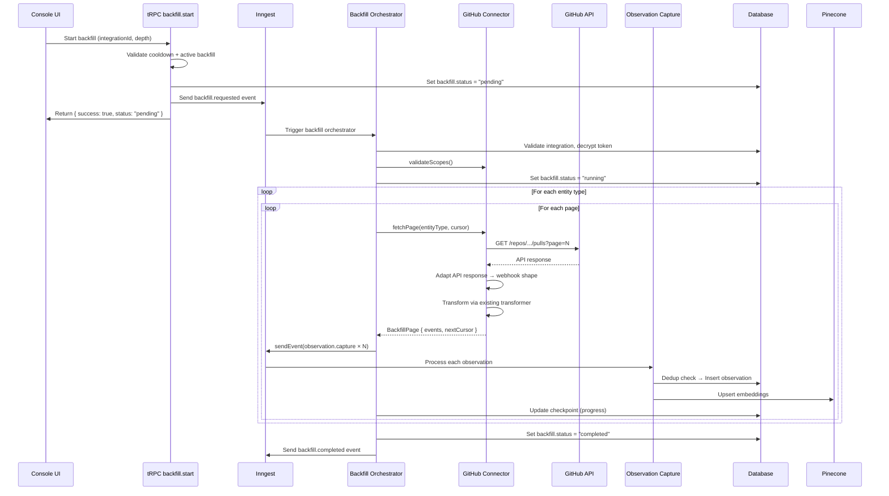

# Backfill Framework Architecture Design

**Date**: 2026-02-06
**Role**: Architect
**Synthesizes**: Codebase deep-dive + Provider API research + Initial architecture sketch

---

## Table of Contents

1. [Design Principles](#1-design-principles)
2. [Connector Contract / Interface](#2-connector-contract--interface)
3. [Transformer Adapter Strategy](#3-transformer-adapter-strategy)
4. [Error Handling Strategy](#4-error-handling-strategy)
5. [Security Considerations](#5-security-considerations)
6. [Performance & Scaling](#6-performance--scaling)
7. [Deduplication & Idempotency](#7-deduplication--idempotency)
8. [Database Schema Changes](#8-database-schema-changes)
9. [Inngest Event & Workflow Design](#9-inngest-event--workflow-design)
10. [tRPC Route Design](#10-trpc-route-design)
11. [Linear/Sentry OAuth Prerequisites](#11-linearsentry-oauth-prerequisites)
12. [Long-term Extensibility](#12-long-term-extensibility)
13. [Implementation Phasing](#13-implementation-phasing)
14. [File Manifest](#14-file-manifest)

---

## 1. Design Principles

1. **Reuse the observation pipeline** — All backfill events exit through `apps-console/neural/observation.capture`. This reuses dedup, scoring, classification, embedding, clustering, and entity extraction. Zero new write-path code.
2. **Adapter over rewrite** — Wrap API responses into webhook-compatible envelopes so existing transformers produce identical `SourceEvent` output. No new transformer functions needed.
3. **Inngest-native orchestration** — Use `step.run()` for paginated fetches, `step.sendEvent()` for batched observation dispatch, and `step.waitForEvent()` for completion signaling. No custom job runners.
4. **Checkpoint-based resumability** — Each page fetch is an Inngest step. If the workflow fails mid-backfill, Inngest retries from the last completed step.
5. **Workspace-scoped concurrency** — One active backfill per integration, matching existing `syncOrchestrator` patterns.
6. **Progressive rollout** — GitHub first (most complex, most used), then Vercel, then Linear/Sentry after OAuth is built.

---

## 2. Connector Contract / Interface

### 2.1 Core Interface

```typescript
// packages/console-backfill/src/types.ts

import type { SourceEvent, TransformContext } from "@repo/console-types";
import type { SourceType } from "@repo/console-validation";

/**
 * Configuration for a backfill run
 */
export interface BackfillConfig {
  /** Integration record ID */
  integrationId: string;
  /** Workspace owning this integration */
  workspaceId: string;
  /** Clerk org for auth context */
  clerkOrgId: string;
  /** How far back to fetch (days) */
  depth: 7 | 30 | 90;
  /** Computed: ISO timestamp = now - depth days */
  since: string;
  /** Which entity types to backfill (provider-specific) */
  entityTypes: string[];
  /** Provider-specific source config from workspaceIntegrations.sourceConfig */
  sourceConfig: Record<string, unknown>;
  /** Decrypted access token (never persisted in Inngest event data) */
  accessToken: string;
}

/**
 * Result of fetching a single page of data from a provider
 */
export interface BackfillPage<TCursor = unknown> {
  /** Transformed SourceEvents ready for the observation pipeline */
  events: SourceEvent[];
  /** Cursor for next page (null = no more pages) */
  nextCursor: TCursor | null;
  /** Number of raw items fetched (before filtering) */
  rawCount: number;
  /** Rate limit info from response headers */
  rateLimit?: {
    remaining: number;
    resetAt: Date;
    limit: number;
  };
}

/**
 * Progress checkpoint persisted after each page
 */
export interface BackfillCheckpoint<TCursor = unknown> {
  /** Entity type currently being processed */
  currentEntityType: string;
  /** Cursor for the next page of the current entity */
  cursor: TCursor | null;
  /** Total events produced so far */
  eventsProduced: number;
  /** Total events sent to observation pipeline */
  eventsDispatched: number;
  /** Errors encountered (non-fatal) */
  errors: Array<{ entityType: string; message: string; timestamp: string }>;
  /** When this checkpoint was created */
  updatedAt: string;
}

/**
 * Generic connector that all providers implement.
 *
 * The lifecycle is:
 *   validateScopes() → fetchPage() [loop] → (events fed to existing transformers via adapters)
 *
 * Connectors do NOT call the observation pipeline directly.
 * The Inngest workflow handles dispatch.
 */
export interface BackfillConnector<TCursor = unknown> {
  /** Provider identifier */
  readonly provider: SourceType;

  /** Entity types this connector can backfill */
  readonly supportedEntityTypes: string[];

  /** Default entity types if user doesn't specify */
  readonly defaultEntityTypes: string[];

  /**
   * Validate that the stored OAuth token has sufficient scopes.
   * Throws if scopes are insufficient.
   */
  validateScopes(config: BackfillConfig): Promise<void>;

  /**
   * Fetch a single page of historical data for a given entity type.
   * Returns transformed SourceEvents (via adapters that wrap API responses
   * into webhook-compatible shapes, then pass through existing transformers).
   *
   * Each call to fetchPage is wrapped in step.run() by the Inngest workflow,
   * making it a checkpoint.
   */
  fetchPage(
    config: BackfillConfig,
    entityType: string,
    cursor: TCursor | null,
  ): Promise<BackfillPage<TCursor>>;

  /**
   * Estimate total items for progress reporting (optional, best-effort).
   * Returns null if provider doesn't support counting.
   */
  estimateTotal?(
    config: BackfillConfig,
    entityType: string,
  ): Promise<number | null>;
}
```

### 2.2 Registration Pattern

```typescript
// packages/console-backfill/src/registry.ts

import type { BackfillConnector } from "./types";
import type { SourceType } from "@repo/console-validation";

const connectors = new Map<SourceType, BackfillConnector>();

export function registerConnector(connector: BackfillConnector): void {
  connectors.set(connector.provider, connector);
}

export function getConnector(provider: SourceType): BackfillConnector {
  const connector = connectors.get(provider);
  if (!connector) {
    throw new Error(`No backfill connector registered for provider: ${provider}`);
  }
  return connector;
}

export function hasConnector(provider: SourceType): boolean {
  return connectors.has(provider);
}
```

```typescript
// packages/console-backfill/src/index.ts

export * from "./types";
export * from "./registry";

// Auto-register connectors on import
import { githubBackfillConnector } from "./connectors/github";
import { vercelBackfillConnector } from "./connectors/vercel";
import { registerConnector } from "./registry";

registerConnector(githubBackfillConnector);
registerConnector(vercelBackfillConnector);
// Future: registerConnector(linearBackfillConnector);
// Future: registerConnector(sentryBackfillConnector);
```

### 2.3 GitHub Connector Implementation (Sketch)

```typescript
// packages/console-backfill/src/connectors/github.ts

import type { BackfillConnector, BackfillConfig, BackfillPage } from "../types";
import { createThrottledOctokit } from "@repo/console-octokit-github";
import { adaptGitHubPRForTransformer, adaptGitHubIssueForTransformer, /* ... */ } from "../adapters/github";
import { transformGitHubPullRequest, transformGitHubIssue, transformGitHubRelease } from "@repo/console-webhooks";

type GitHubCursor = { page: number };

export const githubBackfillConnector: BackfillConnector<GitHubCursor> = {
  provider: "github",

  supportedEntityTypes: ["pull_request", "issue", "release"],
  // pushes/commits excluded: they lack meaningful action context for observations
  // and discussions require separate GraphQL queries

  defaultEntityTypes: ["pull_request", "issue", "release"],

  async validateScopes(config) {
    // GitHub App installation tokens have permissions, not scopes
    // The installation already grants access to the repos it's installed on
    // No additional validation needed for backfill
  },

  async fetchPage(config, entityType, cursor) {
    const page = cursor?.page ?? 1;
    const { sourceConfig } = config;
    const sc = sourceConfig as GitHubSourceConfig;

    const octokit = createThrottledOctokit(sc.installationId);
    const [owner, repo] = sc.repoFullName.split("/");
    const since = config.since;

    const context: TransformContext = {
      deliveryId: `backfill-${config.integrationId}-${entityType}-p${page}`,
      receivedAt: new Date(),
    };

    switch (entityType) {
      case "pull_request": {
        const { data, headers } = await octokit.rest.pulls.list({
          owner, repo,
          state: "all",
          sort: "updated",
          direction: "desc",
          per_page: 100,
          page,
        });

        // Stop when we've gone past our time window
        const filtered = data.filter(pr =>
          new Date(pr.updated_at) >= new Date(since)
        );

        const events = filtered.map(pr => {
          const adapted = adaptGitHubPRForTransformer(pr, { owner, repo, fullName: sc.repoFullName });
          return transformGitHubPullRequest(adapted, context);
        });

        const hasMore = data.length === 100 && filtered.length === data.length;
        return {
          events,
          nextCursor: hasMore ? { page: page + 1 } : null,
          rawCount: data.length,
          rateLimit: parseGitHubRateLimit(headers),
        };
      }

      case "issue": {
        const { data, headers } = await octokit.rest.issues.listForRepo({
          owner, repo,
          state: "all",
          sort: "updated",
          direction: "desc",
          since,  // GitHub Issues API natively supports since
          per_page: 100,
          page,
        });

        // Filter out PRs (GitHub returns PRs in issues endpoint)
        const issuesOnly = data.filter(item => !item.pull_request);

        const events = issuesOnly.map(issue => {
          const adapted = adaptGitHubIssueForTransformer(issue, { owner, repo, fullName: sc.repoFullName });
          return transformGitHubIssue(adapted, context);
        });

        return {
          events,
          nextCursor: data.length === 100 ? { page: page + 1 } : null,
          rawCount: data.length,
          rateLimit: parseGitHubRateLimit(headers),
        };
      }

      case "release": {
        const { data, headers } = await octokit.rest.repos.listReleases({
          owner, repo,
          per_page: 100,
          page,
        });

        const filtered = data.filter(rel =>
          new Date(rel.published_at ?? rel.created_at) >= new Date(since)
        );

        const events = filtered.map(rel => {
          const adapted = adaptGitHubReleaseForTransformer(rel, { owner, repo, fullName: sc.repoFullName });
          return transformGitHubRelease(adapted, context);
        });

        const hasMore = data.length === 100 && filtered.length === data.length;
        return {
          events,
          nextCursor: hasMore ? { page: page + 1 } : null,
          rawCount: data.length,
          rateLimit: parseGitHubRateLimit(headers),
        };
      }

      default:
        return { events: [], nextCursor: null, rawCount: 0 };
    }
  },
};
```

---

## 3. Transformer Adapter Strategy

### 3.1 Decision: **Option (A) — Adapter functions that wrap API responses into webhook-like envelopes**

**Rationale**:
- Existing transformers produce battle-tested `SourceEvent` output with correct `sourceId` formats, `sourceType` mappings, reference extraction, actor resolution, and validation.
- Rewriting as new transformer functions (Option B) would duplicate 2,000+ lines of logic and create two code paths to maintain.
- Option C (normalized shape) would require refactoring all 14 existing transformers — high risk of regression for webhook-driven events.
- **Adapters are small, testable, and isolated.** They only need to produce the fields each transformer actually reads — not the full webhook payload type.

### 3.2 Adapter Design

The critical insight is that transformers read specific fields from webhook payloads. Adapters only need to populate those fields.

```typescript
// packages/console-backfill/src/adapters/github.ts

import type { PullRequestEvent, IssuesEvent, ReleaseEvent } from "@octokit/webhooks-types";

/**
 * Minimal repo context needed by all GitHub adapters.
 */
interface GitHubRepoContext {
  owner: string;
  repo: string;
  fullName: string; // "owner/repo"
}

/**
 * Adapt a GitHub PR from the REST list API into the webhook PullRequestEvent shape.
 *
 * Key mapping: The API response lacks `action`. We infer it from state:
 *   - state=open → "opened"
 *   - state=closed + merged=true → "closed" (transformer detects merge via pr.merged)
 *   - state=closed + merged=false → "closed"
 *
 * The transformer then computes effectiveAction:
 *   payload.action === "closed" && pr.merged ? "merged" : payload.action
 *
 * This produces IDENTICAL sourceIds to webhook-driven events:
 *   `pr:owner/repo#123:merged` (for merged PRs)
 *   `pr:owner/repo#123:opened` (for open PRs)
 *   `pr:owner/repo#123:closed` (for closed non-merged PRs)
 */
export function adaptGitHubPRForTransformer(
  pr: GitHubRestPullRequest,
  repo: GitHubRepoContext,
): PullRequestEvent {
  const action = pr.state === "open" ? "opened" : "closed";

  return {
    action,
    pull_request: {
      ...pr,
      // Ensure fields the transformer reads are present
      merged: pr.merged ?? false,
      draft: pr.draft ?? false,
      html_url: pr.html_url,
      number: pr.number,
      title: pr.title,
      body: pr.body ?? "",
      user: pr.user,
      head: { ref: pr.head.ref, sha: pr.head.sha },
      base: { ref: pr.base.ref },
      merge_commit_sha: pr.merge_commit_sha,
      updated_at: pr.updated_at,
      created_at: pr.created_at,
      additions: pr.additions ?? 0,
      deletions: pr.deletions ?? 0,
      changed_files: pr.changed_files ?? 0,
      requested_reviewers: pr.requested_reviewers ?? [],
      assignees: pr.assignees ?? [],
      labels: pr.labels ?? [],
    },
    repository: {
      full_name: repo.fullName,
      html_url: `https://github.com/${repo.fullName}`,
      id: 0, // Not used by transformer
    },
    sender: pr.user,
  } as PullRequestEvent;
}

/**
 * Adapt a GitHub Issue from REST list API into webhook IssuesEvent shape.
 *
 * Action inference:
 *   - state=open → "opened"
 *   - state=closed → "closed"
 */
export function adaptGitHubIssueForTransformer(
  issue: GitHubRestIssue,
  repo: GitHubRepoContext,
): IssuesEvent {
  return {
    action: issue.state === "open" ? "opened" : "closed",
    issue: {
      ...issue,
      html_url: issue.html_url,
      number: issue.number,
      title: issue.title,
      body: issue.body ?? "",
      user: issue.user,
      state: issue.state,
      labels: issue.labels ?? [],
      assignees: issue.assignees ?? [],
      updated_at: issue.updated_at,
      created_at: issue.created_at,
    },
    repository: {
      full_name: repo.fullName,
      html_url: `https://github.com/${repo.fullName}`,
      id: 0,
    },
    sender: issue.user,
  } as IssuesEvent;
}

/**
 * Adapt a GitHub Release from REST list API into webhook ReleaseEvent shape.
 *
 * All listed releases have action "published".
 */
export function adaptGitHubReleaseForTransformer(
  release: GitHubRestRelease,
  repo: GitHubRepoContext,
): ReleaseEvent {
  return {
    action: "published",
    release: {
      ...release,
      html_url: release.html_url,
      tag_name: release.tag_name,
      name: release.name ?? release.tag_name,
      body: release.body ?? "",
      author: release.author,
      published_at: release.published_at,
      created_at: release.created_at,
      draft: release.draft ?? false,
      prerelease: release.prerelease ?? false,
    },
    repository: {
      full_name: repo.fullName,
      html_url: `https://github.com/${repo.fullName}`,
      id: 0,
    },
    sender: release.author,
  } as ReleaseEvent;
}
```

### 3.3 Vercel Adapter

```typescript
// packages/console-backfill/src/adapters/vercel.ts

import type { VercelWebhookPayload, VercelDeploymentEvent } from "@repo/console-webhooks";

/**
 * Adapt Vercel deployment from REST API response to webhook shape.
 *
 * Webhook shape: { id, type, createdAt, payload: { deployment, project, ... } }
 * API shape: flat deployment object with uid, name, state, created, meta, etc.
 *
 * State mapping for type field:
 *   READY → "deployment.succeeded"
 *   ERROR → "deployment.error"
 *   CANCELED → "deployment.canceled"
 *   BUILDING → "deployment.created" (in-progress)
 */
export function adaptVercelDeploymentForTransformer(
  deployment: VercelRestDeployment,
  projectName: string,
): { webhookPayload: VercelWebhookPayload; deploymentEvent: VercelDeploymentEvent } {
  const typeMap: Record<string, string> = {
    READY: "deployment.succeeded",
    ERROR: "deployment.error",
    CANCELED: "deployment.canceled",
    BUILDING: "deployment.created",
  };

  const webhookPayload: VercelWebhookPayload = {
    id: `backfill-${deployment.uid}`,
    type: typeMap[deployment.state] ?? "deployment.created",
    createdAt: deployment.created,
    region: deployment.regions?.[0] ?? "unknown",
    payload: {
      deployment: {
        id: deployment.uid,
        name: deployment.name,
        url: deployment.url,
        meta: deployment.meta ?? {},
      },
      project: {
        id: deployment.projectId,
        name: projectName,
      },
    },
  };

  const deploymentEvent: VercelDeploymentEvent = {
    uid: deployment.uid,
    name: deployment.name,
    url: deployment.url,
    state: deployment.state,
    target: deployment.target,
    created: deployment.created,
    creator: deployment.creator,
    meta: deployment.meta ?? {},
    projectId: deployment.projectId,
  };

  return { webhookPayload, deploymentEvent };
}
```

### 3.4 SourceId Equivalence Guarantee

This is **the most critical correctness requirement**. Backfill-produced `sourceId` values MUST match webhook-produced ones exactly, or dedup will fail.

| Entity | Webhook sourceId pattern | Backfill adapter produces | Match? |
|--------|--------------------------|---------------------------|--------|
| GitHub PR (merged) | `pr:owner/repo#123:merged` | action="closed", pr.merged=true → effectiveAction="merged" → `pr:owner/repo#123:merged` | **Yes** |
| GitHub PR (open) | `pr:owner/repo#123:opened` | action="opened" → `pr:owner/repo#123:opened` | **Yes** |
| GitHub Issue (closed) | `issue:owner/repo#456:closed` | action="closed" → `issue:owner/repo#456:closed` | **Yes** |
| GitHub Release | `release:owner/repo:v1.0.0:published` | action="published" → `release:owner/repo:v1.0.0:published` | **Yes** |
| Vercel Deployment | `deployment:dpl_xyz:succeeded` | type="deployment.succeeded" → `deployment:dpl_xyz:succeeded` | **Yes** |

The adapter approach guarantees sourceId equivalence because the same transformer code generates the sourceId.

---

## 4. Error Handling Strategy

### 4.1 Partial Failure Recovery (Checkpoint Pattern)

Each page fetch is an Inngest `step.run()`. Inngest persists step outputs, so if the workflow fails on page 5 of pull_requests, it resumes from page 5 on retry — pages 1–4 are not re-fetched.

```
step.run("fetch-pull_request-p1") → saved ✓
step.run("fetch-pull_request-p2") → saved ✓
step.run("fetch-pull_request-p3") → saved ✓
step.run("fetch-pull_request-p4") → saved ✓
step.run("fetch-pull_request-p5") → FAILS ✗ → Inngest retries from here
```

The `BackfillCheckpoint` is also persisted in the database (see Section 8) so the UI can show progress even if Inngest internal state isn't queryable.

### 4.2 Rate Limit Handling

Each connector's `fetchPage()` returns `rateLimit` info. The Inngest workflow uses `step.sleep()` to back off when approaching limits:

```typescript
// In the Inngest workflow pagination loop
const result = await step.run(`fetch-${entityType}-p${page}`, async () => {
  return connector.fetchPage(config, entityType, cursor);
});

// Rate limit protection
if (result.rateLimit && result.rateLimit.remaining < RATE_LIMIT_BUFFER) {
  const waitMs = result.rateLimit.resetAt.getTime() - Date.now();
  if (waitMs > 0) {
    await step.sleep(`rate-limit-wait-${entityType}-p${page}`, waitMs);
  }
}
```

Provider-specific buffer thresholds:

| Provider | Buffer (min remaining) | Typical reset window |
|----------|----------------------|---------------------|
| GitHub | 100 requests | 1 hour |
| Vercel | 50 requests | Rate limit header `X-RateLimit-Reset` |
| Linear | 200 complexity points | 1 minute |
| Sentry | 10 requests | `Retry-After` header |

Additionally, **GitHub secondary rate limits** (abuse detection) are handled by the existing `@repo/console-octokit-github/throttled.ts` plugin, which retries on 403/429 with exponential backoff.

### 4.3 Token Expiry Mid-Backfill

| Provider | Token Lifetime | Strategy |
|----------|---------------|----------|
| **GitHub App** | 1 hour (installation token) | `createThrottledOctokit()` already generates installation tokens on-demand via JWT. Each `step.run()` creates a fresh Octokit instance, so tokens are always fresh. |
| **GitHub OAuth** | Long-lived with refresh token | Use refresh flow if 401 received. Decrypt `refreshToken` from `userSources`, call GitHub token endpoint, re-encrypt and store new token. |
| **Vercel** | Long-lived | No refresh needed. |
| **Linear** | ~10 years | No refresh needed. |
| **Sentry** | Short-lived (hours) | Before each page fetch, check `tokenExpiresAt` on `userSources`. If within 5 minutes of expiry, refresh via JWT-signed request to Sentry. Re-encrypt and store new token. Wrap in `step.run("refresh-sentry-token")` for checkpointing. |

Token refresh implementation pattern:

```typescript
// packages/console-backfill/src/auth/token-refresh.ts

export async function ensureFreshToken(
  userSourceId: string,
  provider: SourceType,
): Promise<string> {
  const userSource = await db.query.userSources.findFirst({
    where: eq(userSources.id, userSourceId),
  });

  if (!userSource) throw new Error("User source not found");

  const accessToken = decrypt(userSource.accessToken, env.ENCRYPTION_KEY);

  // Check if token needs refresh
  if (userSource.tokenExpiresAt) {
    const expiresAt = new Date(userSource.tokenExpiresAt);
    const bufferMs = 5 * 60 * 1000; // 5 minutes

    if (Date.now() > expiresAt.getTime() - bufferMs) {
      return await refreshToken(userSource, provider);
    }
  }

  return accessToken;
}
```

### 4.4 Individual Item Failures

**Strategy: Skip and log.** A single malformed API response should not abort the entire backfill.

```typescript
// Inside fetchPage, per-item try/catch
const events: SourceEvent[] = [];
const errors: Array<{ id: string; error: string }> = [];

for (const item of apiResponse) {
  try {
    const adapted = adaptItem(item, repoContext);
    const event = transformItem(adapted, context);
    events.push(event);
  } catch (err) {
    errors.push({ id: item.id ?? "unknown", error: String(err) });
    // Continue processing remaining items
  }
}

// Errors are included in the page result for checkpoint tracking
```

Errors are aggregated in `BackfillCheckpoint.errors` and surfaced in the UI.

### 4.5 Inngest Step Failure & Retry

| Failure Type | Inngest Behavior | Our Strategy |
|-------------|-----------------|-------------|
| Transient (network, 500) | Auto-retry with backoff (3 retries) | Default Inngest behavior, no custom handling |
| Rate limit (429) | Auto-retry with backoff | Connector also has `step.sleep()` based on rate limit headers |
| Auth failure (401/403) | Non-retriable | Throw `NonRetriableError`, mark backfill as `failed` |
| Timeout (step > 5min) | Inngest retries the step | Keep steps small (single page fetch), won't timeout |
| Workflow timeout (30min) | Workflow fails | Large backfills may need longer timeout. Set to 60min. |

```typescript
// Inngest function config
{
  retries: 3,
  timeouts: {
    start: "2m",
    finish: "60m", // Long-running backfills for large repos
  },
}
```

---

## 5. Security Considerations

### 5.1 Token Access

Tokens are stored encrypted (AES-256-GCM) in `userSources.accessToken`. The backfill workflow:

1. Runs inside Inngest (server-side only).
2. Decrypts the token within a `step.run()` using `decrypt(accessToken, env.ENCRYPTION_KEY)`.
3. **Never passes decrypted tokens in Inngest event data.** The `BackfillConfig.accessToken` is populated inside the workflow, not in the triggering event.

```typescript
// GOOD: Decrypt inside the workflow
const token = await step.run("decrypt-token", async () => {
  const userSource = await db.query.userSources.findFirst({...});
  return decrypt(userSource.accessToken, env.ENCRYPTION_KEY);
});

// BAD: Never put tokens in event payloads
// inngest.send({ data: { accessToken: "ghp_..." } })  // NEVER DO THIS
```

### 5.2 Scope Validation

Before starting a backfill, validate that the OAuth connection has the required permissions:

| Provider | Check | How |
|----------|-------|-----|
| GitHub | Installation has `issues:read`, `pull_requests:read` permissions | Read `userSources.providerMetadata.installations[].permissions` |
| Vercel | Token has access to the project's team | Test API call to `/v6/deployments?projectId=X&limit=1` |
| Linear | Token has `read` scope | Check `userSources.scopes` array |
| Sentry | Token has `event:read`, `issue:read` scopes | Check `userSources.scopes` array |

Implemented in each connector's `validateScopes()` method.

### 5.3 Workspace Isolation

The backfill workflow receives `workspaceId` and `integrationId`. All data writes go through `apps-console/neural/observation.capture` which already enforces `workspaceId` scoping:

1. Observations are written with `workspaceId` FK constraint.
2. Pinecone vectors are namespaced by workspace.
3. Entity extraction is workspace-scoped.

No additional isolation logic needed — the existing pipeline handles it.

### 5.4 Audit Logging

Every backfill trigger emits an activity record via the existing activity tracking system:

```typescript
await inngest.send({
  name: "apps-console/activity.record",
  data: {
    workspaceId,
    actorType: "user",
    actorUserId: userId,
    category: "integration",
    action: "backfill.started",
    entityType: "integration",
    entityId: integrationId,
    metadata: { depth, entityTypes, provider },
    timestamp: new Date().toISOString(),
  },
});
```

### 5.5 Rate Limit Protection (Anti-Abuse)

Prevent excessive backfill triggers:

1. **Concurrency limit**: Only 1 backfill per integration at a time (Inngest concurrency key on `integrationId`).
2. **Cooldown**: After a backfill completes, enforce a 1-hour cooldown before allowing another for the same integration. Check `backfillState.completedAt` in the tRPC mutation.
3. **Depth limit**: Max 90 days. No "unlimited" option.
4. **Per-workspace cap**: Max 5 concurrent backfills across all integrations in a workspace (Inngest concurrency on `workspaceId` with limit 5).

---

## 6. Performance & Scaling

### 6.1 Inngest Step Patterns

The backfill workflow is structured as a sequential entity-type loop with paginated fetches:

```
for each entityType in [pull_request, issue, release]:
  page = 1
  while hasMore:
    step.run("fetch-{entityType}-p{page}")      ← checkpoint
    step.run("dispatch-{entityType}-p{page}")    ← send events
    step.run("update-progress-{entityType}-p{page}")  ← DB checkpoint
    if rateLimited: step.sleep(...)
    page++
```

Each `step.run()` is durable — if the function restarts, it picks up from the last completed step.

### 6.2 Memory Efficiency

**No bulk loading.** Each page (100 items max) is fetched, transformed, dispatched, then garbage collected before the next page. The workflow never holds more than 100 raw items + 100 SourceEvents in memory simultaneously.

Inngest serializes step outputs between steps, so intermediate data doesn't accumulate in memory.

### 6.3 Progress Tracking

**Approach: Database checkpoint after each entity type page (approach (a)).**

Rationale:
- Inngest step metadata isn't queryable from tRPC without Inngest API calls.
- SSE/WebSocket adds significant infrastructure complexity for a feature used infrequently.
- The tRPC query `backfill.status` polls the `backfillState` stored on the integration record. Since backfills process ~1 page/second, a 5-second polling interval gives smooth progress updates.

```typescript
// After each page dispatch
await step.run(`update-progress-${entityType}-p${page}`, async () => {
  const checkpoint: BackfillCheckpoint = {
    currentEntityType: entityType,
    cursor: nextCursor,
    eventsProduced: totalEventsProduced,
    eventsDispatched: totalEventsDispatched,
    errors: accumulatedErrors,
    updatedAt: new Date().toISOString(),
  };

  await db.update(workspaceIntegrations)
    .set({
      sourceConfig: sql`jsonb_set(
        ${workspaceIntegrations.sourceConfig},
        '{backfill,checkpoint}',
        ${JSON.stringify(checkpoint)}::jsonb
      )`,
    })
    .where(eq(workspaceIntegrations.id, integrationId));
});
```

### 6.4 Observation Pipeline Batch Sizes

The observation pipeline uses `batchEvents` with `maxSize: 25` already. The backfill workflow dispatches events in batches of **25** to match:

```typescript
// Chunk transformed events into batches of 25
const batches = chunkArray(pageEvents, 25);

await step.run(`dispatch-${entityType}-p${page}`, async () => {
  const inngestEvents = batches.flatMap(batch =>
    batch.map(sourceEvent => ({
      name: "apps-console/neural/observation.capture" as const,
      data: {
        workspaceId: config.workspaceId,
        clerkOrgId: config.clerkOrgId,
        sourceEvent,
      },
    }))
  );
  await step.sendEvent(`send-${entityType}-p${page}`, inngestEvents);
});
```

### 6.5 Concurrency Controls

```typescript
// Backfill orchestrator concurrency config
{
  concurrency: [
    // Only 1 backfill per integration
    { limit: 1, key: "event.data.integrationId" },
    // Max 5 backfills per workspace (across all integrations)
    { limit: 5, key: "event.data.workspaceId" },
  ],
}
```

This ensures a workspace can't overwhelm the observation pipeline. The observation pipeline itself already has `limit: 10` per workspace, so backfill events compete fairly with webhook events.

### 6.6 Estimated Timing

| Scenario | Items | Pages | Time (with 1s delay) |
|----------|-------|-------|---------------------|
| Small repo, 7 days | ~50 events | 3 pages | ~10s |
| Medium repo, 30 days | ~500 events | 15 pages | ~30s |
| Large repo, 90 days | ~3,000 events | 90 pages | ~3min |
| Very large repo, 90 days | ~10,000 events | 300 pages | ~10min |

---

## 7. Deduplication & Idempotency

### 7.1 Three-Level Dedup (Existing Pipeline)

The observation pipeline already provides three levels of dedup:

1. **Inngest idempotency**: `idempotency: "event.data.sourceEvent.sourceId"` — Inngest deduplicates events with the same sourceId within a time window.
2. **Database check**: `WHERE workspaceId = X AND sourceId = Y LIMIT 1` — Skip if observation already exists.
3. **Entity upsert**: `onConflictDoUpdate` increments `occurrenceCount` — Handles concurrent writes.

### 7.2 Re-Backfill Safety

When a user triggers backfill twice:

1. **Inngest concurrency**: Only 1 backfill per integration. The second trigger queues behind the first (or is rejected if the first is still running — see tRPC route design).
2. **After first completes**: If user triggers again, the adapter produces the same sourceIds. Level 2 dedup (database check) skips all already-imported events. Only new events (that occurred between the two backfill runs) are actually processed.

**Cost**: The API calls are still made (pages are fetched), but processing cost is minimal because the observation pipeline short-circuits at the dedup check step.

### 7.3 Webhook + Backfill Overlap

Common scenario: User connected a source 2 days ago (webhooks captured 2 days of events), then triggers a 30-day backfill.

- Backfill fetches 30 days of history, including the 2 days already captured via webhooks.
- The adapter produces identical sourceIds (e.g., `pr:owner/repo#123:merged`).
- Level 1 dedup (Inngest idempotency) or Level 2 dedup (database check) skips duplicates.
- Only the 28 days of pre-webhook events are actually new.

**No data corruption, no duplicates, no special handling needed.**

### 7.4 SourceId Format Reference

From the existing transformers:

| Provider | Entity | SourceId Format | Example |
|----------|--------|-----------------|---------|
| GitHub | PR | `pr:{fullName}#{number}:{effectiveAction}` | `pr:lightfastai/lightfast#123:merged` |
| GitHub | Issue | `issue:{fullName}#{number}:{action}` | `issue:lightfastai/lightfast#456:closed` |
| GitHub | Release | `release:{fullName}:{tagName}:{action}` | `release:lightfastai/lightfast:v1.0.0:published` |
| GitHub | Push | `push:{fullName}:{afterSha}` | `push:lightfastai/lightfast:abc1234` |
| Vercel | Deployment | `deployment:{deploymentId}:{state}` | `deployment:dpl_xyz:succeeded` |
| Linear | Issue | `linear-issue:{issueId}:{action}` | `linear-issue:LIN-123:update` |
| Sentry | Issue | `sentry-issue:{issueId}:{action}` | `sentry-issue:12345:created` |

The adapter functions MUST produce these exact formats. Since they pass through the same transformer functions, this is guaranteed by construction.

---

## 8. Database Schema Changes

### 8.1 Add `ingestionSource` to Observations (Migration Required)

```typescript
// db/console/src/schema/tables/workspace-neural-observations.ts
// ADD column:

ingestionSource: varchar("ingestion_source", { length: 20 })
  .default("webhook")
  .notNull(),
```

This allows querying "how many observations came from backfill?" and provides audit trail. Default `"webhook"` is backwards-compatible with all existing data.

**Migration**:
```sql
ALTER TABLE lightfast_workspace_neural_observations
  ADD COLUMN ingestion_source VARCHAR(20) NOT NULL DEFAULT 'webhook';
```

**How it's set**: The Inngest event `apps-console/neural/observation.capture` gains an optional `ingestionSource` field. The observation capture workflow reads it (defaulting to `"webhook"`) and stores it:

```typescript
// In observation-capture.ts, Step 7 (DB insert)
ingestionSource: event.data.ingestionSource ?? "webhook",
```

### 8.2 Backfill State in `sourceConfig` (No Migration Required)

Backfill state is stored as a nested JSON field in the existing `sourceConfig` JSONB column on `workspaceIntegrations`. This avoids a new table and uses the existing extensible JSON pattern.

```typescript
// Extended sourceConfig shape (all providers)
interface SourceConfigBackfill {
  backfill?: {
    /** Current backfill status */
    status: "idle" | "pending" | "running" | "completed" | "failed" | "cancelled";
    /** Backfill depth in days */
    depth: 7 | 30 | 90;
    /** Which entity types are being backfilled */
    entityTypes: string[];
    /** Inngest event ID for cancellation */
    inngestEventId?: string;
    /** When backfill was requested */
    requestedAt?: string;
    /** When backfill started processing */
    startedAt?: string;
    /** When backfill completed or failed */
    completedAt?: string;
    /** Who initiated the backfill (clerk user ID) */
    requestedBy?: string;
    /** Progress checkpoint */
    checkpoint?: BackfillCheckpoint;
    /** Final summary */
    result?: {
      eventsProduced: number;
      eventsDispatched: number;
      eventsSkippedDuplicate: number;
      errorCount: number;
      durationMs: number;
    };
    /** Last error message if failed */
    error?: string;
    /** Cooldown: earliest time next backfill can be triggered */
    nextAllowedAt?: string;
  };
}
```

### 8.3 Updated Event Schema

The `apps-console/neural/observation.capture` event schema needs an optional `ingestionSource` field:

```typescript
// api/console/src/inngest/client/client.ts
// Update the existing event schema:

"apps-console/neural/observation.capture": {
  data: z.object({
    workspaceId: z.string(),
    clerkOrgId: z.string().optional(),
    sourceEvent: z.object({ /* ... existing ... */ }),
    // NEW: Track how this event was ingested
    ingestionSource: ingestionSourceSchema.optional().default("webhook"),
  }),
},
```

### 8.4 Validation Schema Updates

```typescript
// packages/console-validation/src/schemas/sources.ts

// Add backfill depth schema
export const backfillDepthSchema = z.enum(["7", "30", "90"]).transform(Number);

// Add backfill status schema
export const backfillStatusSchema = z.enum([
  "idle",
  "pending",
  "running",
  "completed",
  "failed",
  "cancelled",
]);

// Add backfill entity types per provider
export const githubBackfillEntityTypesSchema = z.array(
  z.enum(["pull_request", "issue", "release"])
).default(["pull_request", "issue", "release"]);

export const vercelBackfillEntityTypesSchema = z.array(
  z.enum(["deployment"])
).default(["deployment"]);

export const linearBackfillEntityTypesSchema = z.array(
  z.enum(["issue", "comment", "project", "cycle", "project_update"])
).default(["issue", "comment", "project"]);

export const sentryBackfillEntityTypesSchema = z.array(
  z.enum(["issue", "error"])
).default(["issue"]);
```

---

## 9. Inngest Event & Workflow Design

### 9.1 New Inngest Events

```typescript
// api/console/src/inngest/client/client.ts — ADD to eventsMap:

// ============================================================================
// BACKFILL EVENTS
// ============================================================================

/**
 * Request a backfill for a connected integration.
 * Triggered by tRPC mutation backfill.start.
 */
"apps-console/backfill.requested": {
  data: z.object({
    /** Integration record ID */
    integrationId: z.string(),
    /** Workspace DB UUID */
    workspaceId: z.string(),
    /** Clerk org ID */
    clerkOrgId: z.string(),
    /** Provider type */
    provider: sourceTypeSchema,
    /** User source ID (for token access) */
    userSourceId: z.string(),
    /** Backfill depth in days */
    depth: z.number(),
    /** Entity types to backfill */
    entityTypes: z.array(z.string()),
    /** Who requested the backfill */
    requestedBy: z.string(),
  }),
},

/**
 * Backfill completed (success or failure).
 * Emitted by backfill orchestrator when done.
 */
"apps-console/backfill.completed": {
  data: z.object({
    integrationId: z.string(),
    workspaceId: z.string(),
    provider: sourceTypeSchema,
    success: z.boolean(),
    eventsProduced: z.number(),
    eventsDispatched: z.number(),
    errorCount: z.number(),
    durationMs: z.number(),
    error: z.string().optional(),
  }),
},
```

### 9.2 Backfill Orchestrator Workflow

```
┌──────────────────────────────────────────────────────────────────┐
│ apps-console/backfill.requested                                   │
│                                                                    │
│  Step 1: Validate integration + source existence                  │
│  Step 2: Decrypt token                                            │
│  Step 3: Validate scopes (connector.validateScopes)               │
│  Step 4: Update backfill state → "running"                        │
│  Step 5: Create job tracking record                               │
│                                                                    │
│  ┌─ For each entityType ──────────────────────────────────────┐   │
│  │  Step 6: Estimate total (optional)                          │   │
│  │                                                              │   │
│  │  ┌─ Paginate ──────────────────────────────────────────┐    │   │
│  │  │  Step 7: connector.fetchPage(entityType, cursor)     │    │   │
│  │  │  Step 8: Dispatch events to observation.capture      │    │   │
│  │  │  Step 9: Update checkpoint in DB                     │    │   │
│  │  │  Step 10: Rate limit sleep (if needed)               │    │   │
│  │  │  → Loop until nextCursor === null                    │    │   │
│  │  └─────────────────────────────────────────────────────┘    │   │
│  └─────────────────────────────────────────────────────────────┘   │
│                                                                    │
│  Step 11: Update backfill state → "completed"                     │
│  Step 12: Complete job tracking record                             │
│  Step 13: Emit backfill.completed event                           │
│  Step 14: Record activity (audit log)                             │
└──────────────────────────────────────────────────────────────────┘
```

### 9.3 Workflow Implementation

```typescript
// api/console/src/inngest/workflow/backfill/backfill-orchestrator.ts

import { inngest } from "../../client/client";
import { db } from "@db/console/client";
import { workspaceIntegrations, userSources } from "@db/console/schema";
import { eq, sql } from "drizzle-orm";
import { NonRetriableError } from "inngest";
import { decrypt } from "@repo/console-oauth";
import { getConnector } from "@repo/console-backfill";
import { log } from "@vendor/observability/log";
import { createJob, completeJob, updateJobStatus } from "../../../lib/jobs";
import { env } from "@vendor/inngest/env";
import type { BackfillConfig, BackfillCheckpoint } from "@repo/console-backfill";

const BATCH_SIZE = 25; // Match observation pipeline batchEvents.maxSize
const RATE_LIMIT_BUFFER_PERCENT = 0.1; // Sleep when < 10% remaining

export const backfillOrchestrator = inngest.createFunction(
  {
    id: "apps-console/backfill.orchestrator",
    name: "Backfill Orchestrator",
    retries: 3,

    concurrency: [
      { limit: 1, key: "event.data.integrationId" },
      { limit: 5, key: "event.data.workspaceId" },
    ],

    cancelOn: [
      {
        event: "apps-console/backfill.cancelled",
        match: "data.integrationId",
      },
    ],

    onFailure: async ({ event, error }) => {
      const data = (event.data.event as any).data;
      log.error("Backfill orchestrator failed", {
        integrationId: data.integrationId,
        error: error.message,
      });

      // Mark backfill as failed in DB
      await db.update(workspaceIntegrations)
        .set({
          sourceConfig: sql`jsonb_set(
            ${workspaceIntegrations.sourceConfig},
            '{backfill}',
            ${JSON.stringify({
              status: "failed",
              error: error.message,
              completedAt: new Date().toISOString(),
            })}::jsonb
          )`,
        })
        .where(eq(workspaceIntegrations.id, data.integrationId));
    },

    timeouts: {
      start: "2m",
      finish: "60m",
    },
  },
  { event: "apps-console/backfill.requested" },
  async ({ event, step, logger }) => {
    const {
      integrationId, workspaceId, clerkOrgId,
      provider, userSourceId, depth, entityTypes, requestedBy,
    } = event.data;

    const since = new Date(Date.now() - depth * 24 * 60 * 60 * 1000).toISOString();
    const startTime = Date.now();

    // Step 1: Validate integration exists and is active
    const integration = await step.run("validate-integration", async () => {
      const record = await db.query.workspaceIntegrations.findFirst({
        where: eq(workspaceIntegrations.id, integrationId),
      });
      if (!record || !record.isActive) {
        throw new NonRetriableError(`Integration ${integrationId} not found or inactive`);
      }
      return record;
    });

    // Step 2: Decrypt access token (NEVER put in event data)
    const accessToken = await step.run("decrypt-token", async () => {
      const source = await db.query.userSources.findFirst({
        where: eq(userSources.id, userSourceId),
      });
      if (!source) {
        throw new NonRetriableError(`User source ${userSourceId} not found`);
      }
      return decrypt(source.accessToken, env.ENCRYPTION_KEY);
    });

    // Step 3: Get connector and validate scopes
    const connector = getConnector(provider);
    const config: BackfillConfig = {
      integrationId, workspaceId, clerkOrgId,
      depth, since, entityTypes,
      sourceConfig: integration.sourceConfig,
      accessToken,
    };

    await step.run("validate-scopes", async () => {
      await connector.validateScopes(config);
    });

    // Step 4: Update backfill state to running
    await step.run("set-backfill-running", async () => {
      await updateBackfillState(integrationId, {
        status: "running",
        depth,
        entityTypes,
        startedAt: new Date().toISOString(),
        requestedBy,
        checkpoint: null,
      });
    });

    // Step 5: Create job tracking record
    const jobId = await step.run("create-job", async () => {
      return createJob({
        clerkOrgId,
        workspaceId,
        inngestRunId: event.id ?? `backfill-${integrationId}-${Date.now()}`,
        inngestFunctionId: "backfill.orchestrator",
        name: `Backfill ${provider} (${depth} days)`,
        trigger: "manual",
        triggeredBy: requestedBy,
        input: {
          inngestFunctionId: "backfill.orchestrator",
          integrationId, provider, depth, entityTypes,
        },
      });
    });

    await step.run("set-job-running", async () => {
      await updateJobStatus(jobId, "running");
    });

    // Step 6-10: Paginate each entity type
    let totalEventsProduced = 0;
    let totalEventsDispatched = 0;
    const allErrors: BackfillCheckpoint["errors"] = [];

    for (const entityType of entityTypes) {
      let cursor: unknown = null;
      let page = 0;
      let entityEventsProduced = 0;

      // Optional: estimate total for progress
      const estimatedTotal = await step.run(
        `estimate-${entityType}`,
        async () => {
          if (connector.estimateTotal) {
            return connector.estimateTotal(config, entityType);
          }
          return null;
        },
      );

      // Paginate
      while (true) {
        page++;

        const result = await step.run(
          `fetch-${entityType}-p${page}`,
          async () => connector.fetchPage(config, entityType, cursor),
        );

        entityEventsProduced += result.events.length;
        totalEventsProduced += result.events.length;

        // Dispatch events to observation pipeline
        if (result.events.length > 0) {
          await step.run(`dispatch-${entityType}-p${page}`, async () => {
            const inngestEvents = result.events.map(sourceEvent => ({
              name: "apps-console/neural/observation.capture" as const,
              data: {
                workspaceId,
                clerkOrgId,
                sourceEvent,
                ingestionSource: "backfill" as const,
              },
            }));
            await step.sendEvent(`send-${entityType}-p${page}`, inngestEvents);
          });
          totalEventsDispatched += result.events.length;
        }

        // Update progress checkpoint
        await step.run(`checkpoint-${entityType}-p${page}`, async () => {
          await updateBackfillCheckpoint(integrationId, {
            currentEntityType: entityType,
            cursor: result.nextCursor,
            eventsProduced: totalEventsProduced,
            eventsDispatched: totalEventsDispatched,
            errors: allErrors,
            updatedAt: new Date().toISOString(),
          });
        });

        // Rate limit protection
        if (result.rateLimit) {
          const threshold = result.rateLimit.limit * RATE_LIMIT_BUFFER_PERCENT;
          if (result.rateLimit.remaining < threshold) {
            const waitMs = Math.max(
              0,
              result.rateLimit.resetAt.getTime() - Date.now(),
            );
            if (waitMs > 0) {
              await step.sleep(
                `rate-limit-${entityType}-p${page}`,
                waitMs,
              );
            }
          }
        }

        cursor = result.nextCursor;
        if (cursor === null) break;
      }

      logger.info(`Completed backfill entity type: ${entityType}`, {
        entityType,
        eventsProduced: entityEventsProduced,
        pages: page,
      });
    }

    // Step 11: Update backfill state to completed
    const durationMs = Date.now() - startTime;
    await step.run("set-backfill-completed", async () => {
      await updateBackfillState(integrationId, {
        status: "completed",
        depth,
        entityTypes,
        completedAt: new Date().toISOString(),
        requestedBy,
        result: {
          eventsProduced: totalEventsProduced,
          eventsDispatched: totalEventsDispatched,
          eventsSkippedDuplicate: 0, // Can't know this; dedup happens in observation pipeline
          errorCount: allErrors.length,
          durationMs,
        },
        // Set cooldown: 1 hour from now
        nextAllowedAt: new Date(Date.now() + 60 * 60 * 1000).toISOString(),
      });
    });

    // Step 12: Complete job
    await step.run("complete-job", async () => {
      await completeJob({
        jobId,
        status: "completed",
        output: {
          inngestFunctionId: "backfill.orchestrator",
          status: "success",
          eventsProduced: totalEventsProduced,
          eventsDispatched: totalEventsDispatched,
          durationMs,
        },
      });
    });

    // Step 13: Emit completion event
    await step.sendEvent("backfill-completed", {
      name: "apps-console/backfill.completed",
      data: {
        integrationId, workspaceId, provider,
        success: true,
        eventsProduced: totalEventsProduced,
        eventsDispatched: totalEventsDispatched,
        errorCount: allErrors.length,
        durationMs,
      },
    });

    // Step 14: Audit log
    await step.sendEvent("record-activity", {
      name: "apps-console/activity.record",
      data: {
        workspaceId,
        actorType: "user",
        actorUserId: requestedBy,
        category: "integration",
        action: "backfill.completed",
        entityType: "integration",
        entityId: integrationId,
        metadata: {
          provider, depth, entityTypes,
          eventsProduced: totalEventsProduced,
          durationMs,
        },
        timestamp: new Date().toISOString(),
      },
    });

    return {
      success: true,
      eventsProduced: totalEventsProduced,
      eventsDispatched: totalEventsDispatched,
      errorCount: allErrors.length,
      durationMs,
    };
  },
);
```

### 9.4 Event Flow Diagram



### 9.5 Cancellation Event

```typescript
// New event for backfill cancellation
"apps-console/backfill.cancelled": {
  data: z.object({
    integrationId: z.string(),
    cancelledBy: z.string(),
  }),
},
```

The backfill orchestrator has `cancelOn` configured for this event. When received, Inngest halts the workflow. The `onFailure` handler updates the backfill state to `"cancelled"`.

---

## 10. tRPC Route Design

### 10.1 New Backfill Router

```typescript
// api/console/src/router/org/backfill.ts

import { z } from "zod";
import { orgProcedure, createTRPCRouter } from "../../trpc";
import { db } from "@db/console/client";
import { workspaceIntegrations, userSources } from "@db/console/schema";
import { eq, and } from "drizzle-orm";
import { inngest } from "../../inngest/client/client";
import { hasConnector } from "@repo/console-backfill";
import { TRPCError } from "@trpc/server";
import {
  backfillDepthSchema,
  githubBackfillEntityTypesSchema,
  vercelBackfillEntityTypesSchema,
} from "@repo/console-validation";

export const backfillRouter = createTRPCRouter({
  /**
   * Start a backfill for a connected integration.
   * Requires org membership (orgRouter).
   */
  start: orgProcedure
    .input(z.object({
      integrationId: z.string(),
      depth: z.number().refine(d => [7, 30, 90].includes(d), {
        message: "Depth must be 7, 30, or 90 days",
      }),
      entityTypes: z.array(z.string()).optional(),
    }))
    .mutation(async ({ ctx, input }) => {
      const { integrationId, depth, entityTypes } = input;
      const { workspaceId, clerkOrgId, userId } = ctx;

      // 1. Fetch integration with user source
      const integration = await db.query.workspaceIntegrations.findFirst({
        where: and(
          eq(workspaceIntegrations.id, integrationId),
          eq(workspaceIntegrations.workspaceId, workspaceId),
        ),
        with: { userSource: true },
      });

      if (!integration || !integration.isActive) {
        throw new TRPCError({
          code: "NOT_FOUND",
          message: "Integration not found or inactive",
        });
      }

      const provider = integration.sourceConfig.sourceType;

      // 2. Check connector exists
      if (!hasConnector(provider)) {
        throw new TRPCError({
          code: "BAD_REQUEST",
          message: `Backfill not supported for ${provider}`,
        });
      }

      // 3. Check no active backfill
      const currentBackfill = integration.sourceConfig.backfill;
      if (currentBackfill?.status === "running" || currentBackfill?.status === "pending") {
        throw new TRPCError({
          code: "CONFLICT",
          message: "A backfill is already in progress for this integration",
        });
      }

      // 4. Check cooldown
      if (currentBackfill?.nextAllowedAt) {
        const nextAllowed = new Date(currentBackfill.nextAllowedAt);
        if (new Date() < nextAllowed) {
          throw new TRPCError({
            code: "TOO_MANY_REQUESTS",
            message: `Backfill cooldown active. Try again after ${nextAllowed.toISOString()}`,
          });
        }
      }

      // 5. Resolve entity types (use provider defaults if not specified)
      const resolvedEntityTypes = entityTypes ?? getDefaultEntityTypes(provider);

      // 6. Set backfill state to pending
      await updateBackfillState(integrationId, {
        status: "pending",
        depth,
        entityTypes: resolvedEntityTypes,
        requestedAt: new Date().toISOString(),
        requestedBy: userId,
      });

      // 7. Send Inngest event
      await inngest.send({
        name: "apps-console/backfill.requested",
        data: {
          integrationId,
          workspaceId,
          clerkOrgId,
          provider,
          userSourceId: integration.userSourceId,
          depth,
          entityTypes: resolvedEntityTypes,
          requestedBy: userId,
        },
      });

      return { success: true, status: "pending" };
    }),

  /**
   * Get backfill status for an integration.
   */
  status: orgProcedure
    .input(z.object({
      integrationId: z.string(),
    }))
    .query(async ({ ctx, input }) => {
      const integration = await db.query.workspaceIntegrations.findFirst({
        where: and(
          eq(workspaceIntegrations.id, input.integrationId),
          eq(workspaceIntegrations.workspaceId, ctx.workspaceId),
        ),
      });

      if (!integration) {
        throw new TRPCError({ code: "NOT_FOUND" });
      }

      const backfill = integration.sourceConfig.backfill;
      if (!backfill) {
        return { status: "idle" as const, hasNeverRun: true };
      }

      return {
        status: backfill.status,
        depth: backfill.depth,
        entityTypes: backfill.entityTypes,
        startedAt: backfill.startedAt,
        completedAt: backfill.completedAt,
        requestedBy: backfill.requestedBy,
        checkpoint: backfill.checkpoint
          ? {
              currentEntityType: backfill.checkpoint.currentEntityType,
              eventsProduced: backfill.checkpoint.eventsProduced,
              eventsDispatched: backfill.checkpoint.eventsDispatched,
              errorCount: backfill.checkpoint.errors?.length ?? 0,
            }
          : undefined,
        result: backfill.result,
        error: backfill.error,
        hasNeverRun: false,
      };
    }),

  /**
   * Cancel an in-progress backfill.
   */
  cancel: orgProcedure
    .input(z.object({
      integrationId: z.string(),
    }))
    .mutation(async ({ ctx, input }) => {
      const integration = await db.query.workspaceIntegrations.findFirst({
        where: and(
          eq(workspaceIntegrations.id, input.integrationId),
          eq(workspaceIntegrations.workspaceId, ctx.workspaceId),
        ),
      });

      if (!integration) {
        throw new TRPCError({ code: "NOT_FOUND" });
      }

      const backfill = integration.sourceConfig.backfill;
      if (backfill?.status !== "running" && backfill?.status !== "pending") {
        throw new TRPCError({
          code: "BAD_REQUEST",
          message: "No active backfill to cancel",
        });
      }

      // Send cancellation event (triggers cancelOn in the workflow)
      await inngest.send({
        name: "apps-console/backfill.cancelled",
        data: {
          integrationId: input.integrationId,
          cancelledBy: ctx.userId,
        },
      });

      // Update state immediately
      await updateBackfillState(input.integrationId, {
        status: "cancelled",
        completedAt: new Date().toISOString(),
      });

      return { success: true };
    }),
});
```

### 10.2 Router Registration

```typescript
// api/console/src/router/org/index.ts (or wherever orgRouter is composed)

import { backfillRouter } from "./backfill";

export const orgRouter = createTRPCRouter({
  // ... existing routes ...
  backfill: backfillRouter,
});
```

### 10.3 Route Summary

| Route | Type | Router | Input | Purpose |
|-------|------|--------|-------|---------|
| `backfill.start` | mutation | org | `{ integrationId, depth, entityTypes? }` | Initiate backfill |
| `backfill.status` | query | org | `{ integrationId }` | Check progress |
| `backfill.cancel` | mutation | org | `{ integrationId }` | Cancel in-progress |

---

## 11. Linear/Sentry OAuth Prerequisites

### 11.1 Linear OAuth Flow

**Route structure** (following GitHub/Vercel patterns):

```
apps/console/src/app/(linear)/
  api/linear/
    authorize/route.ts       ← Redirect to linear.app/oauth/authorize
    callback/route.ts        ← Exchange code for token, store in userSources
```

**Token storage in `userSources`**:

| Field | Value |
|-------|-------|
| `sourceType` | `"linear"` |
| `accessToken` | AES-256-GCM encrypted `lin_oauth_...` token |
| `refreshToken` | `null` (Linear tokens are ~10 years, no refresh) |
| `tokenExpiresAt` | `null` (practically permanent) |
| `scopes` | `["read"]` (minimum for backfill) |
| `providerMetadata` | See below |

**`providerMetadata` shape for Linear**:

```typescript
interface LinearProviderMetadata {
  type: "linear";
  organizationId: string;
  organizationName: string;
  userId: string;        // Linear user ID
  userName: string;
  teams: Array<{
    id: string;
    name: string;
    key: string;  // e.g., "ENG"
  }>;
}
```

**OAuth scopes needed**: `read` (minimum for backfill queries).

### 11.2 Sentry OAuth Flow

**Route structure**:

```
apps/console/src/app/(sentry)/
  api/sentry/
    authorize/route.ts       ← Redirect to sentry.io installation flow
    callback/route.ts        ← Exchange code for token via sentry-app-installations API
```

**Token storage in `userSources`**:

| Field | Value |
|-------|-------|
| `sourceType` | `"sentry"` |
| `accessToken` | AES-256-GCM encrypted bearer token |
| `refreshToken` | AES-256-GCM encrypted refresh token (JWT-based) |
| `tokenExpiresAt` | Token expiration timestamp (short-lived, hours) |
| `scopes` | `["event:read", "project:read", "issue:read", "org:read"]` |
| `providerMetadata` | See below |

**`providerMetadata` shape for Sentry**:

```typescript
interface SentryProviderMetadata {
  type: "sentry";
  installationId: string;     // Sentry app installation ID
  organizationSlug: string;
  organizationId: string;
  clientId: string;           // For JWT-based token refresh
  projects: Array<{
    slug: string;
    name: string;
    id: string;
    platform: string;
  }>;
}
```

**Token refresh flow**: Sentry tokens are short-lived. Refresh requires:
1. Create JWT signed with `clientSecret` (stored in env, not in DB).
2. POST to `https://sentry.io/api/0/sentry-app-installations/{installationId}/authorizations/` with `grant_type: "refresh_token"`.
3. Store new token + new expiry.

### 11.3 Implementation Priority

OAuth implementation is a **prerequisite** for Linear/Sentry backfill but is a separate workstream. The backfill framework architecture is designed to accept new connectors without any framework changes:

1. Implement Linear OAuth → Register `linearBackfillConnector` → Linear backfill works.
2. Implement Sentry OAuth → Register `sentryBackfillConnector` → Sentry backfill works.

---

## 12. Long-term Extensibility

### 12.1 Adding a New Provider

To add a new provider (e.g., Slack, Notion, Jira):

1. **Create connector**: Implement `BackfillConnector` interface in `packages/console-backfill/src/connectors/{provider}.ts`.
2. **Create adapters**: Implement adapter functions in `packages/console-backfill/src/adapters/{provider}.ts` (only if webhook transformers exist).
3. **Register**: Add `registerConnector(newConnector)` in `packages/console-backfill/src/index.ts`.
4. **Add entity types**: Create validation schema in `packages/console-validation/src/schemas/sources.ts`.
5. **No framework changes needed.** The orchestrator, tRPC routes, progress tracking, and dedup all work generically.

### 12.2 Adding New Entity Types to Existing Providers

To add e.g. GitHub Discussions to the GitHub connector:

1. Add `"discussion"` to `supportedEntityTypes` in the GitHub connector.
2. Add a new `case "discussion":` block in `fetchPage()`.
3. Create `adaptGitHubDiscussionForTransformer()` in `packages/console-backfill/src/adapters/github.ts`.
4. Add `"discussion"` to `githubBackfillEntityTypesSchema`.

No orchestrator or tRPC changes needed.

### 12.3 Configuration-Driven Backfill

The `entityTypes` field in the tRPC `backfill.start` input allows users to select which entity types to backfill. The UI can present checkboxes per provider:

- **GitHub**: Pull Requests, Issues, Releases
- **Vercel**: Deployments
- **Linear**: Issues, Comments, Projects, Cycles
- **Sentry**: Issues, Errors

Default selections match `defaultEntityTypes` on each connector.

### 12.4 Plugin/Registry Discovery

The registry pattern (`registerConnector`) is explicit — connectors are registered at module initialization. This is simpler and more debuggable than reflection-based discovery. The import-time registration in `packages/console-backfill/src/index.ts` ensures all available connectors are discoverable.

For dynamic discovery (e.g., user-installed plugins), a future enhancement could scan `packages/console-backfill/src/connectors/` at startup, but this is not needed for the 4 built-in providers.

---

## 13. Implementation Phasing

### Phase 1: Core Framework + GitHub (Week 1-2)

**Deliverables**:
1. `packages/console-backfill/` — Types, registry, GitHub connector, GitHub adapters
2. `api/console/src/inngest/workflow/backfill/backfill-orchestrator.ts` — Orchestrator workflow
3. `api/console/src/router/org/backfill.ts` — tRPC routes (start, status, cancel)
4. Event schema additions in `api/console/src/inngest/client/client.ts`
5. Validation schema additions in `packages/console-validation/`
6. DB migration: Add `ingestion_source` column to observations table
7. Update observation capture workflow to read `ingestionSource` from event data

**Success criteria**:
- Connect a GitHub repo, trigger 7-day backfill, see historical PRs/issues/releases appear as observations.
- Trigger backfill again — no duplicates created.
- Cancel mid-backfill — workflow stops, state shows "cancelled".
- Rate limit headers respected (no 429 errors from GitHub).

### Phase 2: Vercel + UI (Week 2-3)

**Deliverables**:
1. Vercel connector + adapters in `packages/console-backfill/`
2. Backfill UI components:
   - Depth selector (7/30/90 days) in source connection flow
   - Progress indicator on source detail page
   - Cancel button
3. Auto-trigger backfill on source connection (optional, behind feature flag)

### Phase 3: Linear (After OAuth) (Week 4+)

**Prerequisite**: Linear OAuth routes implemented.

**Deliverables**:
1. Linear connector (GraphQL-based) + adapters
2. Linear webhook handler (for ongoing real-time events)

### Phase 4: Sentry (After OAuth) (Week 5+)

**Prerequisite**: Sentry OAuth routes implemented.

**Deliverables**:
1. Sentry connector + adapters
2. Sentry webhook handler (for ongoing real-time events)

---

## 14. File Manifest

### New Files

| File | Purpose |
|------|---------|
| `packages/console-backfill/package.json` | New package for backfill framework |
| `packages/console-backfill/src/index.ts` | Exports + auto-registration |
| `packages/console-backfill/src/types.ts` | `BackfillConnector`, `BackfillConfig`, `BackfillPage`, `BackfillCheckpoint` |
| `packages/console-backfill/src/registry.ts` | Connector registration/lookup |
| `packages/console-backfill/src/connectors/github.ts` | GitHub backfill connector |
| `packages/console-backfill/src/connectors/vercel.ts` | Vercel backfill connector |
| `packages/console-backfill/src/adapters/github.ts` | GitHub API → webhook shape adapters |
| `packages/console-backfill/src/adapters/vercel.ts` | Vercel API → webhook shape adapters |
| `packages/console-backfill/src/auth/token-refresh.ts` | Token freshness check + refresh |
| `api/console/src/inngest/workflow/backfill/backfill-orchestrator.ts` | Main backfill Inngest workflow |
| `api/console/src/router/org/backfill.ts` | tRPC routes for backfill |

### Modified Files

| File | Change |
|------|--------|
| `api/console/src/inngest/client/client.ts` | Add `backfill.requested`, `backfill.completed`, `backfill.cancelled` events; add `ingestionSource` to `observation.capture` |
| `api/console/src/inngest/workflow/neural/observation-capture.ts` | Read `ingestionSource` from event data, store in DB |
| `api/console/src/router/org/index.ts` | Register `backfillRouter` |
| `db/console/src/schema/tables/workspace-neural-observations.ts` | Add `ingestionSource` column |
| `packages/console-validation/src/schemas/sources.ts` | Add backfill depth, status, entity type schemas |
| `packages/console-validation/src/schemas/ingestion.ts` | No changes needed (already has `"backfill"`) |

### Database Migrations

| Migration | Description |
|-----------|-------------|
| `add-ingestion-source-to-observations` | `ALTER TABLE ... ADD COLUMN ingestion_source VARCHAR(20) NOT NULL DEFAULT 'webhook'` |

---

## Appendix: Decision Log

| Decision | Options Considered | Choice | Rationale |
|----------|-------------------|--------|-----------|
| Transformer reuse | (A) Adapters, (B) New transformers, (C) Refactor both | **(A) Adapters** | Reuses 2,000+ lines of battle-tested code. Adapters are <100 lines each. Zero risk to webhook path. |
| Backfill state storage | (a) New table, (b) `sourceConfig.backfill` JSONB, (c) Job tracking only | **(b) sourceConfig.backfill** | No migration for the state itself. Colocated with integration. Queryable via existing `workspace.sources.list`. |
| Progress tracking | (a) DB polling, (b) Inngest metadata, (c) SSE/WebSocket | **(a) DB polling** | Simplest. 5s polling interval is sufficient for a feature used occasionally. No new infrastructure. |
| Observation ingestionSource | (a) New column, (b) Metadata field, (c) Don't track | **(a) New column** | Enables efficient WHERE-clause filtering. Important for analytics ("how much data came from backfill?"). |
| Concurrency model | (a) Per-integration only, (b) Per-workspace + per-integration | **(b) Both** | Per-integration prevents duplicate runs. Per-workspace (limit 5) prevents pipeline saturation. |
| Token handling | (a) Pass in event, (b) Decrypt in workflow | **(b) Decrypt in workflow** | Tokens never appear in Inngest event logs or UI. Defense in depth. |
| Backfill cooldown | (a) None, (b) 1-hour, (c) Configurable | **(b) 1-hour fixed** | Prevents accidental rapid re-triggers. Simple. Can be made configurable later. |
| Workflow timeout | (a) 30min (match sync), (b) 60min, (c) Unlimited | **(b) 60min** | Large repos with 90-day depth may take 10+ minutes. 60min provides generous buffer. |
| Push/commit backfill | (a) Include, (b) Exclude | **(b) Exclude** | Push events lack meaningful "action" for observation context. Commits are captured implicitly via PR references. Document sync (the other push pipeline) is a separate concern. |
