# Low-Level Architecture Redesign: 2-App + connection-core

**Date**: 2026-03-18
**Git Commit**: 1581d9e1aed547ec49dd02499c9978a7ea8206b4
**Branch**: refactor/define-ts-provider-redesign

## Research Question

Map every piece of current codebase functionality (relay, gateway, backfill, console) to the new 2-app model (apps/platform + apps/console + @repo/connection-core) described in `thoughts/shared/research/2026-03-17-infrastructure-redesign.md`, producing detailed Mermaid diagrams showing the full low-level design.

---

## Summary

The current system has 4 deployment units (relay, gateway, backfill, console). The redesign collapses this to 2 (platform, console) plus a new shared package. Every route, workflow step, DB write, Redis key, and Inngest function from the current system has a 1-to-1 mapping in the new design — nothing is deleted, only reorganised. The single structural innovation is that lifecycle event handling moves in-process with webhook routing, closing the race window between routing and teardown.

---

## Current Architecture Overview

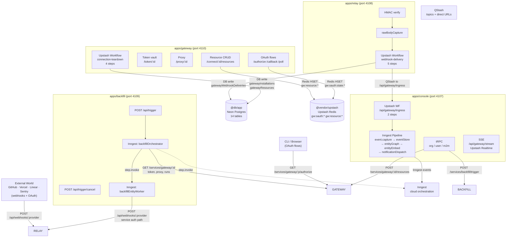

---

## New Architecture Overview

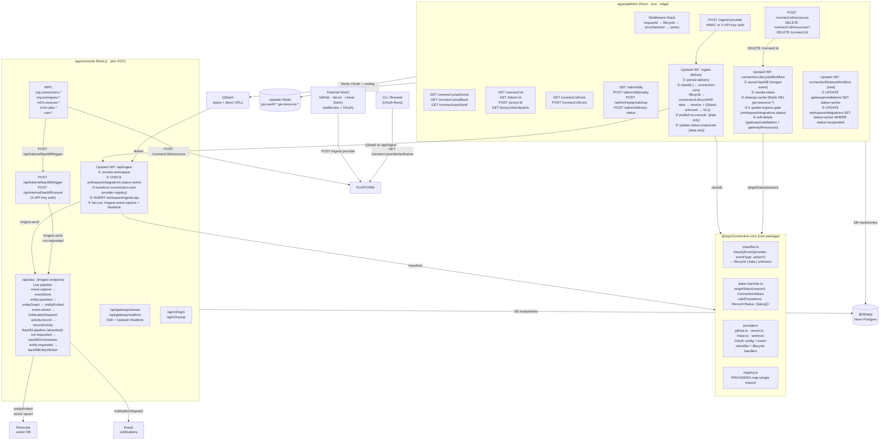

---

## apps/platform — Full Route and Middleware Design

### Middleware Stack (Global)

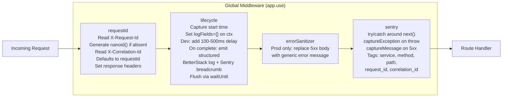

### Route Table

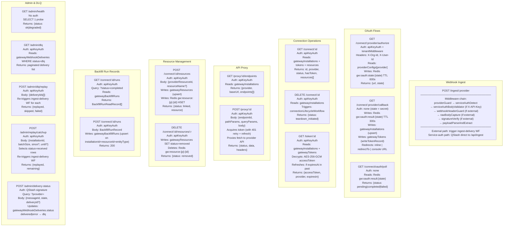

---

## Ingest-Delivery Workflow (Platform) — Step-by-Step

Replaces relay's current `webhookDeliveryWorkflow`. Key change: step 2 now classifies events and handles lifecycle in-process.

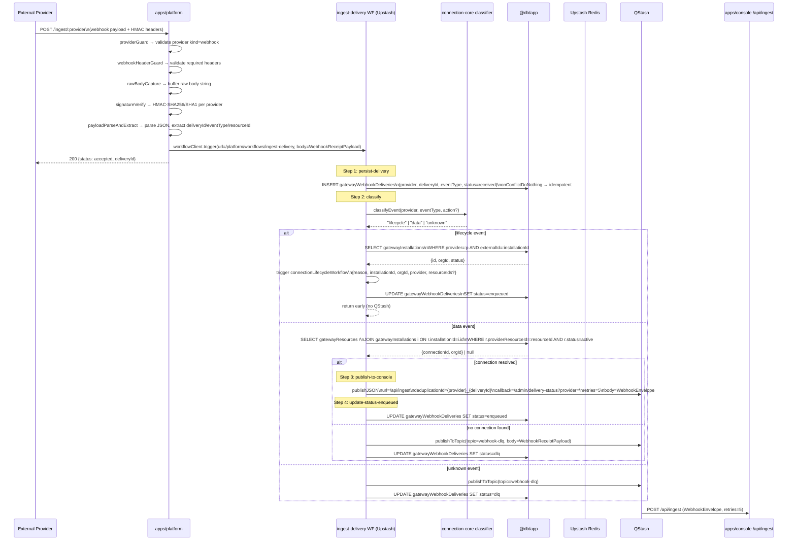

---

## connectionLifecycleWorkflow (Platform) — Step-by-Step

Replaces gateway's `connection-teardown` workflow. Key additions: step 2 classify reason uses `connection-core.state-machine`, step 3.5 updates `workspaceIntegrations.status` (the **ingress gate**), step 1 now fires an Inngest event instead of HTTP to backfill service.

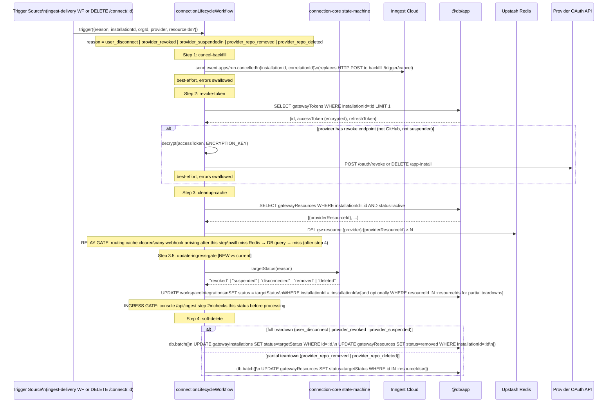

---

## connectionRestoreWorkflow (Platform) — New Workflow for Unsuspend

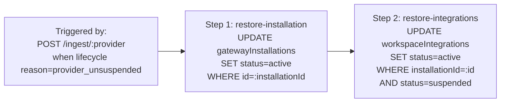

---

## OAuth Flow (Platform) — Full Sequence

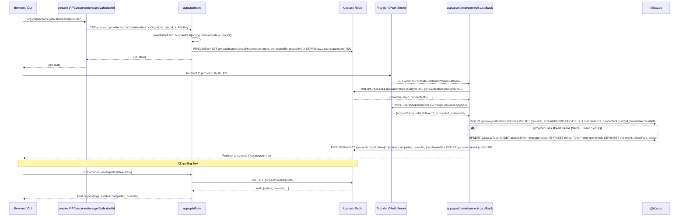

---

## Service-Auth Webhook Path (Backfill → Platform → Console)

This is the path used when `backfillEntityWorker` dispatches synthetic webhooks. The `ingest-delivery` workflow is **bypassed** — the platform publishes directly to QStash.

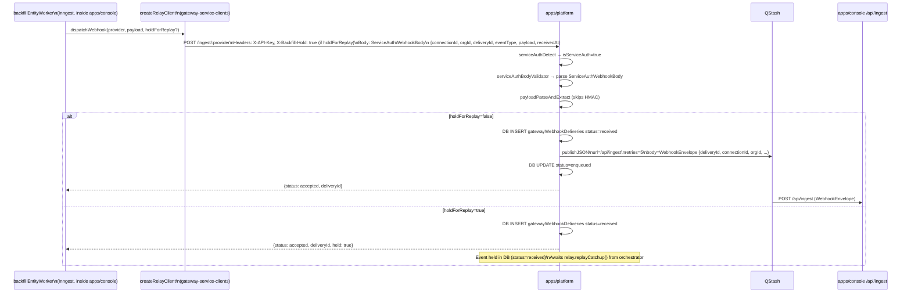

---

## Console Ingress + Fan-out Pipeline (/api/ingest)

Replaces current `/api/gateway/ingress`. Key change: step 2 adds **ingress gate** check on `workspaceIntegrations.status`.

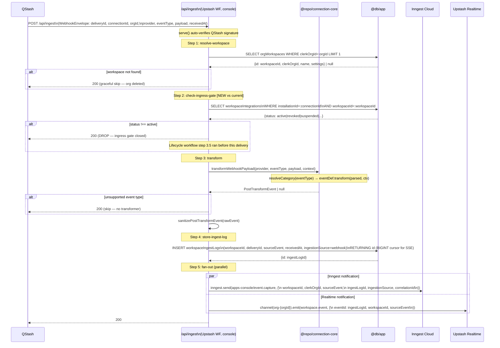

---

## Inngest Event Pipeline (Console) — Complete Chain

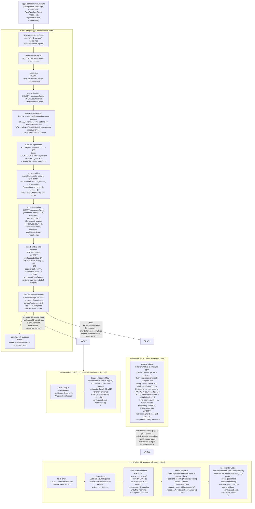

---

## Backfill Pipeline (Absorbed into Console)

The `backfillOrchestrator` and `backfillEntityWorker` Inngest functions move from `apps/backfill/src/workflows/` to `api/console/src/inngest/workflow/backfill/`.

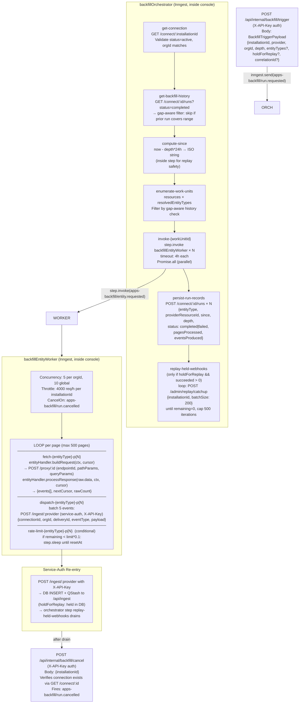

---

## @repo/connection-core — Internal Design

New package extracted from `@repo/app-providers`. Currently `classifier.classify()` is on each `WebhookProvider` in `packages/console-providers/src/providers/*/index.ts`. The state machine is implicit in gateway teardown workflow step 4. This formalises both into a shared package that both `apps/platform` and `apps/console` import.

```mermaid
flowchart TD
    subgraph core["packages/connection-core/src/"]
        subgraph registry["registry.ts"]
            R1["PROVIDERS map\n{github, vercel, linear, sentry}\n(same as current @repo/app-providers PROVIDERS\nbut without backfill/API definitions)"]
            R2["getProvider(name): ProviderDefinition"]
        end

        subgraph classifier["classifier.ts"]
            C1["classifyEvent(\n  provider: SourceType,\n  eventType: string,\n  action?: string\n): EventClass"]

            C2["GitHub:\n  installation.* → lifecycle\n  installation_repositories.* → lifecycle\n  repository.deleted → lifecycle\n  pull_request, issues, push, create, delete → data\n  else → unknown"]

            C3["Vercel:\n  integration-configuration.removed → lifecycle\n  project.removed → lifecycle\n  deployment.* → data\n  else → unknown"]

            C4["Linear:\n  Issue, Comment, Project, Cycle, ProjectUpdate → data\n  (no lifecycle events via webhook)\n  else → unknown"]

            C5["Sentry:\n  installation.deleted → lifecycle\n  issue, error, comment, event_alert, metric_alert → data\n  else → unknown"]

            C1 --> C2
            C1 --> C3
            C1 --> C4
            C1 --> C5
        end

        subgraph state["state-machine.ts"]
            SM1["ConnectionStatus enum\n  active | disconnected | revoked\n  suspended | removed | deleted | error"]

            SM2["TeardownReason enum\n  user_disconnect | provider_revoked\n  provider_suspended | provider_repo_removed\n  provider_repo_deleted | provider_unsuspended"]

            SM3["targetStatus(reason): ConnectionStatus\n  user_disconnect        → disconnected\n  provider_revoked       → revoked\n  provider_suspended     → suspended\n  provider_repo_removed  → removed\n  provider_repo_deleted  → deleted\n  provider_unsuspended   → active  (restore)"]

            SM4["validTransitions: Record&lt;ConnectionStatus, ConnectionStatus[]&gt;\n  active       → [disconnected, revoked, suspended, removed, deleted, error]\n  suspended    → [active, revoked]\n  error        → [active, revoked]\n  disconnected → [active]\n  revoked      → [active]  (reinstall)\n  removed      → [active]  (re-add)\n  deleted      → []        (terminal)"]

            SM1 --> SM3
            SM2 --> SM3
            SM3 --> SM4
        end

        subgraph providers["providers/"]
            P1["github.ts\nEventClassifier (classify method)\nLifecycleEventHandlers\n  installation.deleted → provider_revoked\n  installation.suspend → provider_suspended\n  installation.unsuspend → provider_unsuspended\n  installation_repositories.removed → provider_repo_removed\n  repository.deleted → provider_repo_deleted\nOAuth config (buildAuthUrl, processCallback, getActiveToken)\nHMAC config (SHA-256, x-hub-signature-256)"]

            P2["vercel.ts\nEventClassifier\nLifecycleEventHandlers\n  integration-configuration.removed → provider_revoked\n  project.removed → provider_repo_deleted\nOAuth config\nHMAC config (SHA-1, x-vercel-signature)"]

            P3["linear.ts\nEventClassifier (data-only, no lifecycle)\nOAuth config\nHMAC config (SHA-256, linear-signature)"]

            P4["sentry.ts\nEventClassifier\nLifecycleEventHandlers\n  installation.deleted → provider_revoked\nOAuth config (composite token encoding)\nHMAC config (SHA-256, sentry-hook-signature)"]
        end

        subgraph index["index.ts"]
            I1["export:\n  classifyEvent\n  targetStatus, validTransitions, ConnectionStatus, TeardownReason\n  PROVIDERS, getProvider\n  ProviderDefinition types"]
        end
    end

    RELAY_USERS["apps/platform\n(imports for:\n  webhook classification\n  lifecycle reason extraction\n  HMAC verification\n  OAuth flows)"]

    CONSOLE_USERS["apps/console\n(imports for:\n  event transformation (dispatch.ts)\n  targetStatus (workspaceIntegrations update)\n  connection state checks)"]

    core --> RELAY_USERS
    core --> CONSOLE_USERS
```

---

## Database Schema — Table Ownership by Service

```mermaid
erDiagram
    gatewayInstallations {
        varchar id PK
        varchar provider
        varchar external_id
        varchar connected_by
        varchar org_id
        varchar status "active|pending|error|revoked|suspended"
        jsonb provider_account_info
        jsonb backfill_config
        timestamp created_at
        timestamp updated_at
    }

    gatewayTokens {
        varchar id PK
        varchar installation_id FK
        text access_token "AES-256-GCM encrypted"
        text refresh_token "AES-256-GCM encrypted"
        timestamp expires_at
        varchar token_type
        text scope
    }

    gatewayResources {
        varchar id PK
        varchar installation_id FK
        varchar provider_resource_id
        varchar resource_name
        varchar status "active|removed"
    }

    gatewayWebhookDeliveries {
        varchar id PK
        varchar provider
        varchar delivery_id
        varchar event_type
        varchar installation_id "no FK, populated post-resolution"
        varchar status "received|enqueued|delivered|dlq"
        text payload "stored for replay"
        timestamp received_at
    }

    gatewayBackfillRuns {
        varchar id PK
        varchar installation_id FK
        varchar provider_resource_id
        varchar entity_type
        timestamp since
        int depth
        varchar status "idle|pending|running|completed|failed|cancelled"
        int pages_processed
        int events_produced
        int events_dispatched
        text error
    }

    workspaceIntegrations {
        varchar id PK
        varchar workspace_id FK
        varchar installation_id FK
        varchar provider
        jsonb provider_config "sync.events, providerType"
        varchar provider_resource_id
        boolean is_active "→ migrate to status column (Phase 4)"
        varchar last_sync_status "success|failed|pending"
    }

    orgWorkspaces {
        varchar id PK
        varchar clerk_org_id
        varchar name
        varchar slug
        jsonb settings "embedding config, workspace settings v1"
    }

    workspaceIngestLogs {
        bigint id PK "monotonic SSE cursor"
        varchar workspace_id FK
        varchar delivery_id
        jsonb source_event "PostTransformEvent"
        varchar ingestion_source "webhook|backfill"
        timestamp received_at
    }

    workspaceEvents {
        bigint id PK
        varchar external_id UK
        varchar workspace_id FK
        timestamp occurred_at
        varchar observation_type
        varchar title
        text content
        varchar source
        varchar source_id
        jsonb source_references "EntityRelation[]"
        jsonb metadata
        int significance_score
        bigint ingest_log_id FK
    }

    workspaceEntities {
        bigint id PK
        varchar external_id UK
        varchar workspace_id FK
        varchar category "commit|branch|pr|issue|deployment|engineer|project|..."
        varchar key
        int occurrence_count
        real confidence
        varchar state
        timestamp last_seen_at
    }

    workspaceEntityEdges {
        bigint id PK
        varchar workspace_id FK
        bigint source_entity_id FK
        bigint target_entity_id FK
        varchar relationship_type
        real confidence
        bigint source_event_id FK
    }

    workspaceEventEntities {
        bigint id PK
        bigint entity_id FK
        bigint event_id FK
        varchar workspace_id FK
        varchar ref_label
        varchar category "denormalized"
    }

    workspaceWorkflowRuns {
        bigint id PK
        varchar clerk_org_id
        varchar workspace_id FK
        varchar inngest_run_id
        varchar inngest_function_id
        varchar status "queued|running|completed|failed|cancelled"
        varchar trigger "manual|scheduled|webhook|automatic"
        jsonb input
        jsonb output
    }

    orgApiKeys {
        bigint id PK
        varchar clerk_org_id
        varchar key_hash "SHA-256"
        varchar key_prefix
        varchar key_suffix
        boolean is_active
        timestamp expires_at
    }

    gatewayInstallations ||--o{ gatewayTokens : "has one token"
    gatewayInstallations ||--o{ gatewayResources : "has many resources"
    gatewayInstallations ||--o{ gatewayBackfillRuns : "has many runs"
    gatewayInstallations ||--o{ workspaceIntegrations : "has many integrations"
    workspaceIntegrations }o--|| orgWorkspaces : "belongs to workspace"
    workspaceEvents }o--|| orgWorkspaces : "belongs to workspace"
    workspaceEvents ||--o{ workspaceEventEntities : "has many entity junctions"
    workspaceEntities }o--|| orgWorkspaces : "belongs to workspace"
    workspaceEntities ||--o{ workspaceEventEntities : "has many event junctions"
    workspaceEntities ||--o{ workspaceEntityEdges : "has many edges"
    workspaceEvents |o--o| workspaceIngestLogs : "linked via ingestLogId"
```

---

## Redis Key Ownership

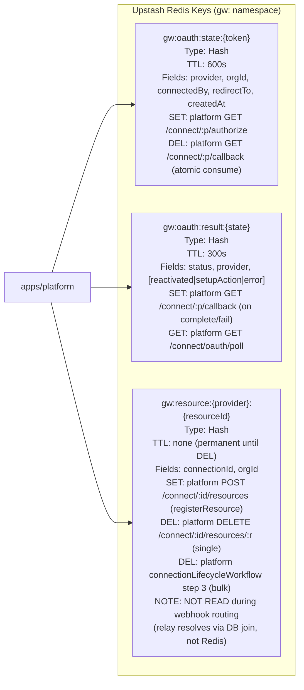

---

## tRPC → Platform HTTP Call Map

Which tRPC procedures in apps/console call apps/platform (formerly relay + gateway):

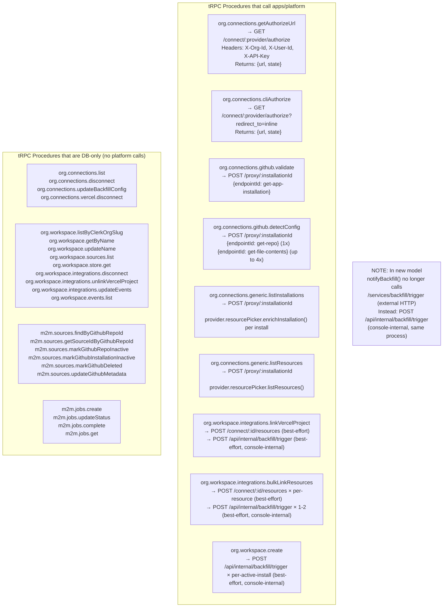

---

## Phase Migration Map

```mermaid
flowchart TD
    subgraph phase1["Phase 1: Absorb backfill into console  (LOW RISK)"]
        P1A["Move apps/backfill/src/workflows/backfill-orchestrator.ts\n→ api/console/src/inngest/workflow/backfill/backfill-orchestrator.ts"]
        P1B["Move apps/backfill/src/workflows/entity-worker.ts\n→ api/console/src/inngest/workflow/backfill/entity-worker.ts"]
        P1C["Add POST /api/internal/backfill/trigger (X-API-Key auth)\nAdd POST /api/internal/backfill/cancel (X-API-Key auth)\n(or tRPC mutations)"]
        P1D["Update notifyBackfill() to call /api/internal/backfill/trigger\n(instead of createBackfillClient().trigger())"]
        P1E["Update connectionLifecycleWorkflow step 1\nto fire Inngest event instead of QStash to /trigger/cancel"]
        P1F["Delete apps/backfill"]
    end

    subgraph phase2["Phase 2: Merge relay + gateway into platform  (MEDIUM RISK)"]
        P2A["Create apps/platform with unified Hono app"]
        P2B["Move relay routes:\n  POST /api/webhooks/:p → POST /ingest/:p\n  POST /api/workflows/webhook-delivery → POST /platform/workflows/ingest-delivery\n  GET|POST /api/admin/* → GET|POST /admin/*"]
        P2C["Move gateway routes:\n  /services/gateway/:p/authorize → /connect/:p/authorize\n  /services/gateway/:p/callback → /connect/:p/callback\n  /services/gateway/oauth/status → /connect/oauth/poll\n  /services/gateway/:id → /connect/:id\n  /services/gateway/:id/token → /token/:id\n  /services/gateway/:id/proxy/* → /proxy/:id\n  DELETE /services/gateway/:p/:id → DELETE /connect/:id\n  /services/gateway/:id/resources → /connect/:id/resources\n  /services/gateway/:id/backfill-runs → /connect/:id/runs"]
        P2D["Add lifecycle classify step to ingest-delivery WF\n(inline lifecycle handling = race condition fix)"]
        P2E["Add connectionRestoreWorkflow for unsuspend events"]
        P2F["Update gateway-service-clients URLs:\n  gatewayUrl: /services/gateway → /connect\n  relayUrl: /services/relay → /ingest\n  backfillUrl: removed (now console-internal)"]
        P2G["Delete apps/relay + apps/gateway"]
    end

    subgraph phase3["Phase 3: Extract @repo/connection-core  (LOW RISK)"]
        P3A["Create packages/connection-core\nExtract from @repo/app-providers:\n  classifier per-provider (is lifecycle/data/unknown)\n  state-machine (targetStatus, validTransitions)\n  provider OAuth configs\n  HMAC configs per provider"]
        P3B["Update apps/platform + apps/console imports\nto use @repo/connection-core instead of\nper-provider files in @repo/app-providers"]
    end

    subgraph phase4["Phase 4: workspaceIntegrations.status migration  (MEDIUM RISK)"]
        P4A["DB migration:\nADD COLUMN status varchar(50)\nBACKFILL: status = isActive ? 'active' : 'disconnected'\nADD INDEX on status"]
        P4B["Update connectionLifecycleWorkflow step 3.5\nto write status (not just isActive=false)"]
        P4C["Update /api/ingest step 2\nto CHECK status=active (not isActive=true)"]
        P4D["Update all m2m.sources.* procedures\nto write status (not isActive)\nmarkGithubInstallationInactive → status=revoked\nmarkGithubRepoInactive → status=removed"]
        P4E["DROP COLUMN is_active after cutover verification"]
    end

    phase1 --> phase2 --> phase3 --> phase4
```

---

## Code References

### Current Codebase (maps to new design)

| Current Location | Maps to New Design |
|---|---|
| `apps/relay/src/routes/webhooks.ts:44` | `apps/platform/src/routes/ingest.ts` |
| `apps/relay/src/routes/workflows.ts:38` | `apps/platform/src/workflows/ingest-delivery.ts` |
| `apps/relay/src/middleware/webhook.ts` | `apps/platform/src/middleware/webhook.ts` (unchanged) |
| `apps/relay/src/routes/admin.ts` | `apps/platform/src/routes/admin.ts` |
| `apps/gateway/src/routes/connections.ts` | `apps/platform/src/routes/connect.ts` |
| `apps/gateway/src/workflows/connection-teardown.ts` | `apps/platform/src/workflows/connection-lifecycle.ts` |
| `apps/gateway/src/lib/token-store.ts` | `apps/platform/src/lib/token-store.ts` |
| `apps/gateway/src/lib/cache.ts` | `apps/platform/src/lib/cache.ts` |
| `apps/backfill/src/workflows/backfill-orchestrator.ts` | `api/console/src/inngest/workflow/backfill/backfill-orchestrator.ts` |
| `apps/backfill/src/workflows/entity-worker.ts` | `api/console/src/inngest/workflow/backfill/entity-worker.ts` |
| `apps/backfill/src/routes/trigger.ts` | `apps/console/src/app/api/internal/backfill/trigger/route.ts` |
| `apps/console/src/app/api/gateway/ingress/route.ts` | `apps/console/src/app/api/ingest/route.ts` |
| `packages/console-providers/src/providers/*/index.ts` (classifier) | `packages/connection-core/src/providers/*.ts` |
| `packages/console-providers/src/registry.ts` (PROVIDERS) | `packages/connection-core/src/registry.ts` (subset) |
| Implicit state transitions in gateway teardown workflow | `packages/connection-core/src/state-machine.ts` |

### Key File Paths (Current)

- `apps/relay/src/app.ts` — Hono app + middleware registration
- `apps/relay/src/routes/workflows.ts:38-225` — 5-step webhook delivery workflow
- `apps/gateway/src/routes/connections.ts:47-1210` — all OAuth + connection routes
- `apps/gateway/src/workflows/connection-teardown.ts:39-152` — 4-step teardown workflow
- `apps/backfill/src/workflows/backfill-orchestrator.ts:12-333`
- `apps/backfill/src/workflows/entity-worker.ts:13-265`
- `apps/console/src/app/api/gateway/ingress/route.ts:29-136` — current 2-step ingress
- `api/console/src/inngest/workflow/neural/event-store.ts:109-584` — main Inngest pipeline
- `packages/console-providers/src/gateway.ts` — all cross-service wire types
- `packages/console-providers/src/providers/github/index.ts:258-276` — GitHub classifier
- `packages/console-providers/src/providers/vercel/index.ts:283-296` — Vercel classifier
- `packages/gateway-service-clients/src/headers.ts:22-34` — service auth headers
- `db/console/src/schema/tables/` — all 14 table definitions

---

## Historical Context

- `thoughts/shared/research/2026-03-17-infrastructure-redesign.md` — the original redesign plan with race condition analysis and 4-phase migration path
- `thoughts/shared/plans/2026-03-17-lifecycle-v1-polling-passive.md` — lifecycle handling V1 plan
- `thoughts/shared/plans/2026-03-17-provider-architecture-extensibility.md` — provider extensibility plan

---

## Open Questions

1. **workspaceIntegrations.status Phase 4**: The current DB column is `isActive: boolean`. The new design needs a `status` column with 7 values. The migration backfill strategy (active/disconnected mapping) needs validation against existing data.

2. **Inngest cancelOn for backfill**: When `backfillOrchestrator` moves into console, it will fire `apps-backfill/run.cancelled` as an Inngest event (step 1 of connectionLifecycleWorkflow). But that event currently is the backfill Inngest client's event schema — needs to unify into the console Inngest client.

3. **Redis routing cache read path**: `gw:resource:*` is written by `POST /connect/:id/resources` but never read by the current relay (which uses DB joins). If the design intends to use it for routing, step 2 of ingest-delivery should be updated to Redis-first with DB fallback. If not, the resource key writes can be removed.

4. **console URL for QStash**: Currently `consoleUrl/api/gateway/ingress`. In new design: `consoleUrl/api/ingest`. All QStash `publishJSON` calls in platform need to be updated.

5. **gateway-service-clients base URLs**: Currently `{consoleBase}/services/gateway` and `{consoleBase}/services/relay`. In new design: `{consoleBase}/connect` and `{consoleBase}/ingest`. The `backfillUrl` entry is removed (calls become console-internal).
