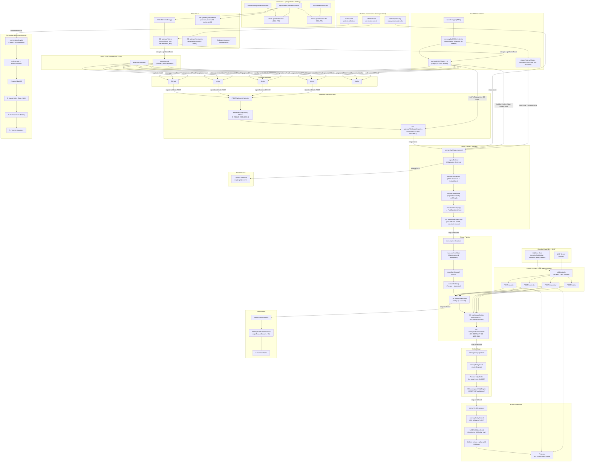

# Memory Service Architecture Audit

**Date**: 2026-03-19
**Branch**: `feat/memory-service-consolidation`

---

## God Mermaid Diagram — Complete Data Flow

---

## Research Summary Per Feature

### 1. OAuth/Connection Lifecycle
- **Status**: Complete for OAuth + app-token providers
- **Gap**: No API key setup route (`ApiKeyDef.processSetup()` exists, no runtime wiring)
- **Gap**: ManagedProvider `register()`/`unregister()` typed but not wired at runtime
- **Gap**: No `webhookSetupState` DB column for ManagedProvider

### 2. Webhook Ingestion Pipeline
- **Status**: Complete 5-step async pipeline with signature verification
- **Gap**: No Inngest event dedup (duplicate `deliveryId` → duplicate processing)
- **Gap**: Delivery status never updated to terminal state
- **Gap**: No replay attack protection (no timestamp window check)
- **Gap**: ZodError from `parsePayload` unhandled → 500

### 3. Backfill Orchestration
- **Status**: Complete fan-out with gap-aware filtering and rate limiting
- **Gap**: Held deliveries stuck on cancel with no recovery
- **Gap**: Replay overflow at 100k silent data loss
- **Gap**: 8h timeout insufficient for large installations
- **Gap**: No PollingDef — no scheduled pull mechanism

### 4. Neural Pipeline
- **Status**: Complete event→entity→graph→embed chain with 30s debounce
- **Gap**: Out-of-order webhooks overwrite entity `state` with stale values
- **Gap**: No `onFailure` handlers on entity-graph and entity-embed
- **Gap**: `narrativeHash` computed but never used to skip re-embedding
- **Gap**: Entity `aliases` column unused — no cross-provider normalization

### 5. Token Management
- **Status**: AES-256-GCM encryption, proactive 5min refresh, health monitoring
- **Gap**: No encryption key rotation path
- **Gap**: Concurrent refresh race (cron + on-demand, no distributed lock)
- **Gap**: No key versioning in ciphertext format
- **Gap**: Token operations unaudited

### 6. Provider Architecture
- **Status**: 6/7 innovations implemented (5 complete, 1 type-only)
- **Gap**: PollingDef (Innovation 5) completely absent
- **Gap**: ManagedProvider (Innovation 2) types exist, no concrete provider yet

### 7. Search & SDK
- **Status**: 5 endpoints with Pinecone vector + DB hybrid search
- **Gap**: SDK sends no `X-Workspace-ID` header → all calls fail at auth
- **Gap**: No `/v1/graph` route exists (SDK method broken)
- **Gap**: No `proxy_search` for multi-connection API discovery
- **Gap**: `SearchFilters` missing `significanceScore` filter
- **Gap**: `findSimilar` has no text-anchor mode
- **Gap**: `ContentsResponse` omits `sourceReferences`, `significanceScore`

---

## Edge Case Stress Matrix

### Methodology
50+ edge cases generated across all feature areas. Each evaluated against the architecture diagrams for handling status: ✅ Handled, ⚠️ Partially handled, ❌ Unhandled.

### Category 1: Race Conditions

| # | Edge Case | Severity | Status | Analysis |
|---|-----------|----------|--------|----------|
| 1 | Concurrent token refresh (cron + on-demand) | High | ⚠️ | Last writer wins at DB level. Single-use refresh tokens may be invalidated by first consumer. No distributed lock. |
| 2 | Webhook arrives during connection setup | Medium | ⚠️ | `resolve-connection` returns null → `NonRetriableError`. Recovery cron retries after 5min. `holdForReplay` mechanism exists for backfill path only. |
| 3 | Concurrent backfill + live webhook for same entity | Medium | ✅ | Entity upsert uses `ON CONFLICT DO UPDATE`, `occurrenceCount` increment is atomic SQL. Junction uses `ON CONFLICT DO NOTHING`. |
| 4 | Two OAuth callbacks for same provider/org | Low | ✅ | Atomic Redis state consumption. Installation upsert is idempotent on `(provider, externalId)`. Last callback wins. |
| 5 | Entity-embed debounce collapses events with stale data | Medium | ⚠️ | 30s debounce means final embed reflects last event's narrative, but entity `state` may be from an out-of-order event. |
| 6 | Two orgs connecting same external account | Low | ✅ | Unique index on `(provider, externalId)` — second upsert overwrites `orgId`. By design. |
| 7 | Parallel edge resolution for overlapping entities | Low | ✅ | `ON CONFLICT DO UPDATE` with `GREATEST(confidence)` — idempotent at DB level. |

### Category 2: Failure & Recovery

| # | Edge Case | Severity | Status | Analysis |
|---|-----------|----------|--------|----------|
| 8 | Inngest queue failure after webhook persisted | Medium | ✅ | DB delivery persisted with `status="received"`. Recovery cron replays after 5min. |
| 9 | Cohere embedding API down | Medium | ⚠️ | 3 retries then Inngest marks failed. No `onFailure` handler. Entity remains unembedded until next event triggers re-embed. |
| 10 | Pinecone upsert fails (dimension mismatch) | Medium | ❌ | 3 retries exhaust. No `onFailure` handler. No validation of workspace embedding config vs index. |
| 11 | Knock notification API failure | Low | ⚠️ | 2 retries. No dead letter queue. Notification permanently lost. |
| 12 | Provider API 500 during backfill | Medium | ✅ | Retriable error → Inngest retries step. After 3 retries, worker fails. Orchestrator records partial failure. |
| 13 | Token refresh returns invalid token | Medium | ⚠️ | On-demand path accepts the token and passes to provider. 401 triggers `forceRefreshToken`. If force-refresh also fails → health check signal → teardown. |
| 14 | Database connection failure during event-store | High | ✅ | `onFailure` handler marks `workspaceWorkflowRuns` as failed. Inngest retries. |
| 15 | Redis unavailable during OAuth | High | ❌ | `storeOAuthState` pipeline fails. Error propagates to tRPC → user gets error. No fallback storage. |
| 16 | Encryption key missing at startup | High | ✅ | `getEncryptionKey()` throws explicitly. All token operations fail fast. |

### Category 3: Data Integrity

| # | Edge Case | Severity | Status | Analysis |
|---|-----------|----------|--------|----------|
| 17 | Duplicate webhook delivery (same deliveryId) | High | ⚠️ | DB dedup via `ON CONFLICT DO NOTHING`. But `inngest.send` fires regardless → duplicate Inngest events → duplicate `workspaceIngestLogs` rows. |
| 18 | Out-of-order webhooks for same entity | Medium | ❌ | Entity `state` and `lastSeenAt` updated by most recently *processed* event, not by `occurredAt`. Stale overwrite possible. |
| 19 | Backfill + live webhook produce same event | Medium | ⚠️ | Event-store dedup by `(workspaceId, sourceId)` prevents duplicate `workspaceEvents` row. But Inngest-level idempotency key is `workspaceId + sourceId`, so concurrent processing is serialized. |
| 20 | Cursor corruption between backfill pages | Low | ⚠️ | GitHub: may loop on page 1 until MAX_PAGES. Linear: stale cursor → API error → retriable. Sentry/Vercel: null cursor terminates. |
| 21 | Very large payload (>1MB) | Low | ⚠️ | No explicit size check. Next.js body limit applies implicitly. Payload stored in DB as JSON string. |
| 22 | Entity extraction extracts garbage from HTML/markdown | Low | ⚠️ | Regex patterns have bounded quantifiers preventing catastrophic backtracking. Blacklist filters common tokens. But false positives possible. |
| 23 | Cross-provider entity merge collision | Low | ✅ | Dedup by `(workspaceId, category, key)`. Same `commit:abc1234` from GitHub and Vercel correctly merges. Different categories remain separate. |

### Category 4: Security

| # | Edge Case | Severity | Status | Analysis |
|---|-----------|----------|--------|----------|
| 24 | Replay attack (old valid signature) | High | ❌ | No timestamp window check in HMAC or Ed25519 verify. Ed25519 includes timestamp in signed message for integrity but not for freshness. |
| 25 | Encryption key compromise | High | ❌ | No key rotation mechanism. No key versioning. All tokens decryptable with compromised key. Re-encryption requires manual migration. |
| 26 | Service JWT compromise | Medium | ⚠️ | 60s TTL limits window. `algorithms: ["HS256"]` prevents confusion attack. But no revocation mechanism. |
| 27 | OAuth state fixation | Low | ✅ | State is server-generated `nanoid()`. Cannot be fixed by attacker. |
| 28 | CORS bypass on ingest route | Low | ✅ | Middleware sets CORS only when Origin matches allowlist. External webhooks don't send Origin header. |
| 29 | Token decryption timing side channel | Low | ✅ | AES-GCM via Web Crypto API. `timingSafeEqual` used for HMAC comparison. |

### Category 5: Scalability & Limits

| # | Edge Case | Severity | Status | Analysis |
|---|-----------|----------|--------|----------|
| 30 | 100k+ entity backfill | High | ⚠️ | MAX_PAGES=500 × ~100/page = ~50k/worker. Replay cap 100k. Overflow logged, not recovered. |
| 31 | 60+ work units exceed 8h orchestrator timeout | Medium | ❌ | 60 work units at 5 concurrent × 2h = 24h >> 8h timeout. |
| 32 | Health check cron takes >5min with many installations | Low | ⚠️ | Global concurrency 1. If 1000+ active installations each need a probe, cron runs overlap. |
| 33 | Webhook flood (1000+ webhooks/sec) | Medium | ⚠️ | No rate limiting at ingest route. Inngest concurrency (20/provider) provides back-pressure. DB inserts may bottleneck. |
| 34 | Entity with 10k+ events | Low | ⚠️ | Edge resolution limited to 100 co-events. Narrative uses 3 recent + 1 genesis. Scalable but loses resolution. |
| 35 | Fan-out event storm from backfill | Medium | ⚠️ | Each worker dispatches events in batches of 5. 500 pages × 100 events = 50k Inngest events per worker. 10 concurrent workers = 500k events. Inngest handles but downstream pipeline may lag. |

### Category 6: SDK & Search

| # | Edge Case | Severity | Status | Analysis |
|---|-----------|----------|--------|----------|
| 36 | SDK search call without workspace header | High | ❌ | `withDualAuth` returns 400. SDK sends no `X-Workspace-ID`. All external SDK calls broken. |
| 37 | SDK `graph()` call to non-existent route | High | ❌ | No `/v1/graph` route. SDK method returns 404. |
| 38 | Agent needs to discover all available provider APIs | Medium | ❌ | No `proxy_search` endpoint. Must call `connections.list` + `listEndpoints` per connection. |
| 39 | Search for high-significance events only | Medium | ❌ | `significanceScore` stored in DB and Pinecone but not exposed as filter. |
| 40 | FindSimilar by description text | Medium | ❌ | Requires `id` or `url`. No `text` anchor for ad-hoc semantic search. |
| 41 | Contents response missing entity links | Low | ❌ | `sourceReferences`, `significanceScore`, `sourceId` in DB but not in response. |

### Category 7: Connection Lifecycle

| # | Edge Case | Severity | Status | Analysis |
|---|-----------|----------|--------|----------|
| 42 | Connection revoked while backfill running | Medium | ✅ | Worker checks `installation.status === 'active'` per page. Revoked → `NonRetriableError`. |
| 43 | Teardown step 3 (revoke-token) fails | Low | ✅ | Best-effort, errors swallowed. Teardown continues through steps 4-5. |
| 44 | Health check false positive from DNS blip | Low | ✅ | 3 failures → degraded, 6 → teardown (~30min). Single blip increments counter but no state change. |
| 45 | Backfill cancelled mid-replay | High | ❌ | Some held deliveries marked "enqueued", rest stuck "held" forever. No drain mechanism. |
| 46 | CLI poll hangs after user cancels OAuth | Low | ⚠️ | No result written → poll returns pending forever. Client must implement timeout. |

### Category 8: Provider-Specific

| # | Edge Case | Severity | Status | Analysis |
|---|-----------|----------|--------|----------|
| 47 | Vercel token has no refresh | Low | ✅ | Refresh cron skips (filter: `refreshToken IS NOT NULL AND expiresAt IS NOT NULL`). Token is long-lived. |
| 48 | GitHub App JWT clock skew | Low | ✅ | JWT `iat = now - 60` provides 60s backdating for clock skew. |
| 49 | Sentry composite token encoding | Low | ✅ | `encodeSentryToken`/`decodeSentryToken` properly handles installationId:token format. |
| 50 | Linear GraphQL returns errors array | Medium | ⚠️ | Zod parse of response throws. Retriable error. No explicit GraphQL error handling. |
| 51 | Apollo has no health check | Low | ✅ | `healthCheck` is optional on `BaseProviderFields`. Health cron skips providers without it. |

---

## Priority Matrix — What to Fix

### P0 — Critical (Fix Immediately)

1. **SDK `X-Workspace-ID` header missing** — All external SDK/MCP calls are broken
2. **SDK `/v1/graph` route missing** — `graph()` method returns 404
3. **Webhook delivery dedup at Inngest level** — Add `id` field to `inngest.send()` calls using `deliveryId`
4. **Delivery status terminal update** — Update `gatewayWebhookDeliveries.status` to `"processed"` after successful delivery workflow
5. **ZodError handling in ingest route** — Catch `parsePayload` ZodError, return 400

### P1 — High (Fix This Sprint)

6. **Held delivery drain on cancel** — Add recovery mechanism for `status="held"` deliveries
7. **Out-of-order entity state** — Compare `occurredAt` before overwriting `state`/`lastSeenAt`
8. **Replay attack protection** — Add timestamp window check to signature verification
9. **Encryption key rotation** — Add key versioning to ciphertext format + re-encryption migration
10. **Token refresh distributed lock** — Add Redis SETNX lock around refresh operations
11. **`onFailure` handlers for entity-graph and entity-embed** — Log failures to `workspaceWorkflowRuns`
12. **API key connection setup route** — Wire `ApiKeyDef.processSetup()` runtime path
13. **Orchestrator timeout scaling** — Compute dynamic timeout based on work unit count

### P2 — Medium (Plan for Next Sprint)

14. **`proxy_search` endpoint** — Multi-connection API discovery for agents
15. **`SearchFilters` enhancements** — Add `significanceScore`, `entityKey`, `ingestionSource` filters
16. **`findSimilar` text-anchor** — Add `text: string` input option
17. **`ContentsResponse` enrichment** — Add `sourceReferences`, `significanceScore`, `sourceId`
18. **`narrativeHash` skip optimization** — Check hash before re-embedding
19. **PollingDef** — Scheduled pull mechanism for API-only providers
20. **ManagedProvider runtime wiring** — `register()`/`unregister()` in callback + teardown

### P3 — Low (Backlog)

21. **Entity `aliases` population** — Cross-provider normalization
22. **Rate limit 429 handling** — Parse retry-after header in entity worker
23. **Webhook payload size limit** — Explicit check before processing
24. **Token operation audit logging** — Log reads/decrypts to lifecycle log
25. **Notification idempotency** — Add dedup key to Knock trigger

---

## References

This audit evaluated the implementation against the original provider architecture redesign research:

| Document | Relationship |
|----------|-------------|
| `2026-03-17-provider-architecture-redesign.md` | **Primary reference** — 7 innovations, 30-provider matrix, layered type system. This audit's Innovation Scorecard evaluates implementation status of all 7 innovations against this design. |
